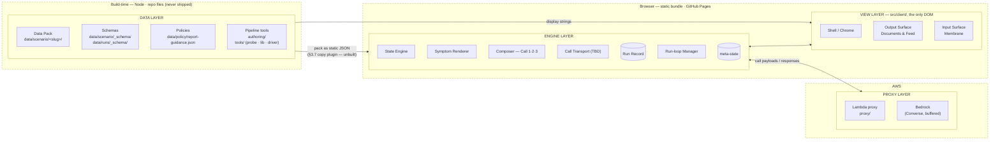
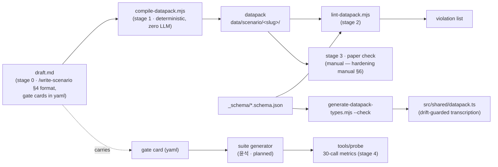
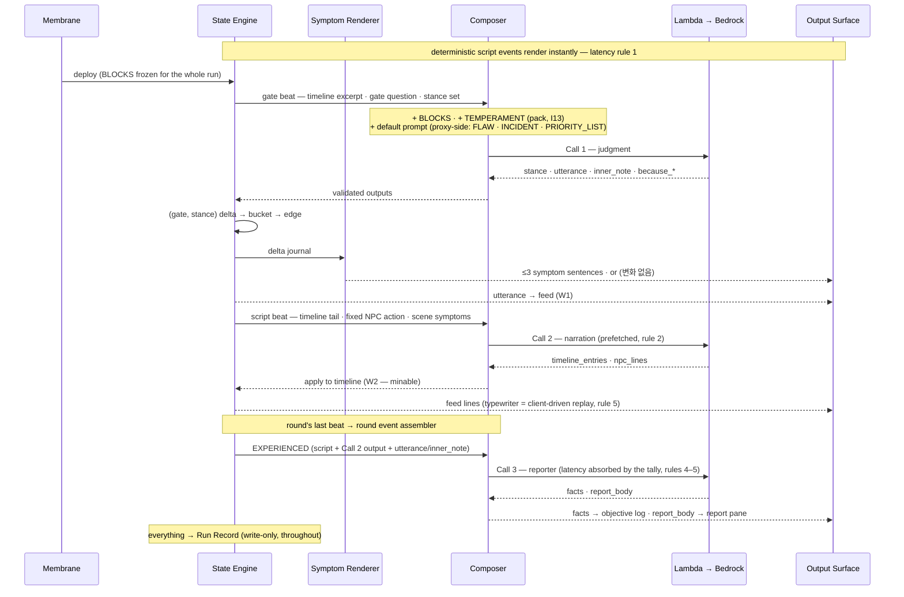
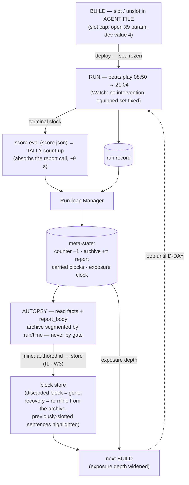

# Architecture Map

> **Tier: none — this is a map, not law.** It is a derived, single-view
> rendering of claims whose authority lives in the linked specs and contracts.
> **When this map and a spec disagree, the spec wins and the map has a bug.**
> Every table row and diagram edge cites its source; check claims in one hop.
> Owner: 민서 (maintainer of the view, not of the underlying claims).
>
> Structure and flow are deliberately separated: §1 shows **what exists and
> where it lives** (arrows between layers only), §2 catalogs **every box's
> ins and outs**, §3 shows **what happens** as three flow diagrams. One
> diagram trying to do both is how arrows end up wrong.

## 1. Structure — layers, boxes, physical homes

Color/grouping = **logical layer** (Data · Engine · View · Proxy).
Dashed containers = **physical tier** (spec-physical §1: exactly two runtime
tiers — static bundle and Lambda proxy — plus build-time Node tools that
never ship).

Within-layer arrows are intentionally absent here; the §2 catalog carries
each box's exact ins/outs, and §3 shows them in motion.

## 2. Box catalog — ins, outs, physical homes, sources

### 2.1 Data layer

| Box | Physical home | Consumed by | Source |
|---|---|---|---|
| **Data Pack** — 11 files per scenario (only pack today: `우는다리`) | `data/scenario/<slug>/` | file-by-file table below | [contract-datapack §1](./contract-datapack.md) |
| **Schemas** | `data/scenario/_schema/` · `data/runs/_schema/` | build-time only: lint + type generation (drift guard `--check`). No runtime consumer | [README §3](./README.md) |
| **Policies** — `report-guidance.json` | `data/policy/` | Call 3 `REPORT_GUIDANCE` slot. Absorption into the composer agreed 08-03; contract revision pending | [contract-calls §4·§6](./contract-calls.md) |
| **Pipeline tools** — compile · lint · generate-types · probe harness | `authoring/` · `tools/` (probe · lib · driver) | build-time only; executors of pipeline stages 1–4 (§3.1 below) | [plan-pipeline §2](./plan-pipeline.md) · [README §6](./README.md) code-path redirects |

Data Pack, file by file (runtime consumers — the pack reaches the browser as
static JSON via the physical §3.7 build-time copy, **unbuilt**):

| File | Runtime consumer | Source |
|---|---|---|
| `meta.json` | view shell (title, slug) | [contract-datapack §1](./contract-datapack.md) |
| `timeline.json` | engine — script beats, effects, per-beat present NPCs | [spec-engine §3](./spec-engine.md) |
| `gates.json` | engine (buckets, `edge_predicates`, score retroactivity) · composer (`GATE_QUESTION` · `STANCE_SET`) | [contract-calls §6](./contract-calls.md) |
| `characters.json` | engine (meter bindings) · view (roster display names) | [spec-engine §1](./spec-engine.md) |
| `places.json` | view (display names); further engine use unbound | [contract-datapack §1](./contract-datapack.md) |
| `symptoms.json` | engine symptom renderer — exclusively | [spec-engine §2.3](./spec-engine.md) |
| `temperament.json` | Calls 1·3 `TEMPERAMENT` slot only — never the engine, never the view (I13) | [contract-calls §6](./contract-calls.md) |
| `truths.json` | depth-gated exposure via run-loop manager; never any call (I8) | [spec-architecture §9](./spec-architecture.md) |
| `score.json` | engine, terminal-clock evaluation | [plan-pipeline §3](./plan-pipeline.md) |
| `hardening.json` | **none** — authoring-side overlay, already merged by the compiler | [contract-datapack §1](./contract-datapack.md) |
| `draft.md` | none at runtime — stage-0/1 source, ships with the pack as record | [plan-pipeline §2](./plan-pipeline.md) |

### 2.2 Engine layer

| Box | In | Out | Physical home | Source |
|---|---|---|---|---|
| **State Engine** — state variables · delta journal · beat/round driver · score eval at 21:04 | pack (timeline, gates, characters, score) · validated call outputs ← Composer · exposure depth ← Run-loop Manager · deploy ← Membrane | beat context → Composer · delta journal → Symptom Renderer · deterministic feed lines + score → Output Surface · everything → Run Record | `src/engine/` (planned, physical §3.8) — isomorphic, no DOM | [spec-engine §1–§4](./spec-engine.md) · [plan-pipeline §3](./plan-pipeline.md) |
| **Symptom Renderer** | delta journal ← State Engine · `symptoms.json` ← pack | ≤3 sentences/beat, `(변화 없음)` when empty → Output Surface. **The only channel for NPC state; no digit ever leaves it (I12 — hard error)** | inside `src/engine/` | [spec-engine §2.3](./spec-engine.md) |
| **Composer** — Call 1·2·3 slot assembly | beat context ← State Engine · `BLOCKS` ids ← Membrane (a set, canonically sorted here) · gates + temperament **← engine view, not the pack** ([contract-engine-composer §7](./contract-engine-composer.md)) · `REPORT_GUIDANCE` ← Policies | payloads → Call Transport · validated responses → State Engine | `src/composer/` (planned) — isomorphic; same payloads in browser and Node driver | [contract-calls §6](./contract-calls.md) · [spec-physical §2-1](./spec-physical-architecture.md) |
| **Call Transport** — the fixture seam | payloads ← Composer | live: → Lambda · fixture: canned responses back (offline, no key). Swap this one box and everything left of it is testable offline | `src/transport/` ([plan-engine-build](./plan-engine-build.md) e6) | [spec-client §5.2·§5.4](./spec-client.md) |
| **Run Record** (artifact) | ← State Engine, write-only; nothing reads it mid-run | → Run-loop Manager at run end · → stage-6 metric aggregation | schema `data/runs/_schema/run-record.schema.json`; emitted per run | [contract-run-artifacts §1](./contract-run-artifacts.md) |
| **Run-loop Manager** — the multi-run shell | run record · mined + slotted block ids at run end | **meta-state** (its artifact: run counter · report archive · carried blocks · exposure clock) · exposure depth → State Engine · archive + counter → View | `src/runloop/`, isomorphic ([plan-engine-build](./plan-engine-build.md) e8); meta-state in `sessionStorage` (physical §1.1, 08-03 — headless disk mirror is the manager's own call) | [plan-pipeline §3](./plan-pipeline.md) · [contract-run-artifacts](./contract-run-artifacts.md) · [physical §1.1](./spec-physical-architecture.md) |

`metric-report`, the third run artifact, is produced by the stage-6
aggregator (not yet named or owned — [plan-pipeline §2](./plan-pipeline.md)
stage 6) and never touches the runtime; it stays off this map's diagrams.

### 2.3 View layer

| Box | In | Out | Physical home | Source |
|---|---|---|---|---|
| **Shell / Chrome** — top bar · game clock · D-DAY counter · taskbar (phase 2) | `meta.json` title ← pack · counter/pips ← Run-loop Manager · clock ← State Engine | display only | `src/client/` (not yet scaffolded) | [spec-client §4](./spec-client.md) |
| **Output Surface** — LIVE FEED · REPORTS · TALLY · report archive | feed lines + symptoms + score ← engine side · archive ← Run-loop Manager · display names ← pack | clicked sentence's **authored id** → Input Surface (mining, I1 — never screen text) | `src/client/` | [spec-client §4·§6](./spec-client.md) |
| **Input Surface** — the **Membrane**: AGENT FILE slots · deploy | mined ids ← Output Surface (REPORTS; there is no store window — spec-client §4) | `BLOCKS` (slotted set) → Composer · deploy → State Engine. **slot / unslot / mine / deploy — nothing else ever crosses** | `src/client/` | [spec-client §5.2](./spec-client.md) · CLAUDE.md membrane rule |

What never reaches the view: `inner_note` (Call 3 only) · `because_*` /
`rejected_*` (diagnostics) · temperament (I13) · truths beyond depth-gated
exposure ([contract-calls §6](./contract-calls.md) consumer map · I8 · I13).

### 2.4 Proxy layer

| Box | In | Out | Physical home | Source |
|---|---|---|---|---|
| **Lambda proxy** | call payloads ← Call Transport | Bedrock Converse invocation → buffered response back. Holds the **only secret**; also supplies Call 1's default prompt (`FLAW` · `INCIDENT` · `PRIORITY_LIST`; `proxy/prompts/` inlined into the Lambda bundle at build) | `proxy/` — API Gateway → Lambda | [spec-physical §1·§3.6](./spec-physical-architecture.md) · [contract-calls §6](./contract-calls.md) · [handoffs/llm-lambda-runtime](./handoffs/llm-lambda-runtime.md) |
| **Bedrock** | Converse request ← Lambda | complete response — **buffered, no streaming**; time-to-first-token is irrelevant, which is why the tally must absorb the whole report call (latency rules 4–5) | AWS managed | [spec-architecture §4](./spec-architecture.md) |

## 3. Flows — three diagrams, one story each

### 3.1 Scenario preprocessing (pipeline stages 0–4 — build-time, no runtime box involved)

Source: [plan-pipeline §2](./plan-pipeline.md) (stage table, incl. why no
LLM may touch stage 1) · [README §3](./README.md) (drift guards).

### 3.2 One-beat loop (runtime — transcribes [contract-calls §6](./contract-calls.md))

`inner_note` reaches Call 3 and nothing else; `because_*`/`rejected_*` stop
at diagnostics. W1–W4 must never be cut
([contract-calls §6](./contract-calls.md) "where this map must not be cut").

### 3.3 Multi-run mining loop (runtime — the game across runs)

Source: [spec-architecture §2.1](./spec-architecture.md) (discard + archive
re-mining, 08-03 decision) · [plan-pipeline §3](./plan-pipeline.md)
(run-loop manager scope) · [spec-client §5](./spec-client.md).

## 4. Update rule

1. **Specs lead, the map follows.** A change to any cited spec makes the
   corresponding map row/edge stale; fixing the map rides the same PR when
   practical, a follow-up otherwise.
2. **No claim without a source.** A row that can't cite a spec section is
   either a discovery (take it to the owning spec first) or a mistake.
3. **Mermaid is canonical.** Exported/hand-drawn images are decoration and
   may lag; the text diagrams here are the reviewable form.
4. A wrong arrow here is a **bug**, not a note — file it like one.
