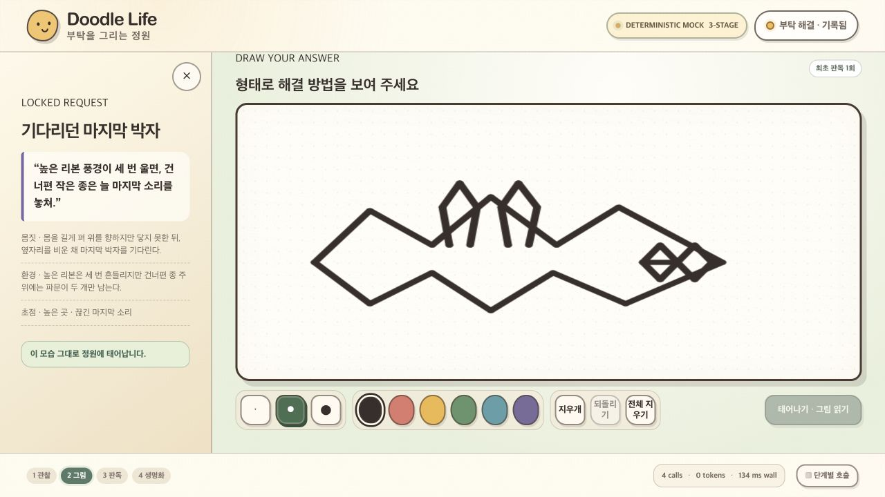
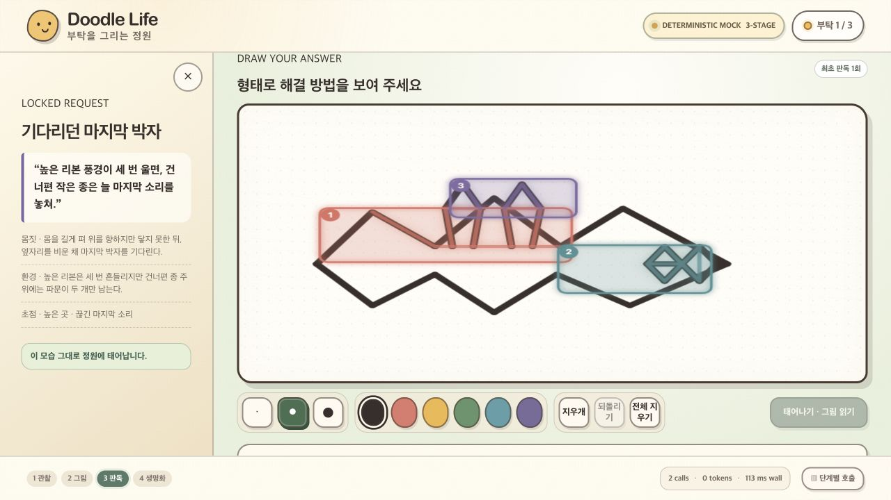
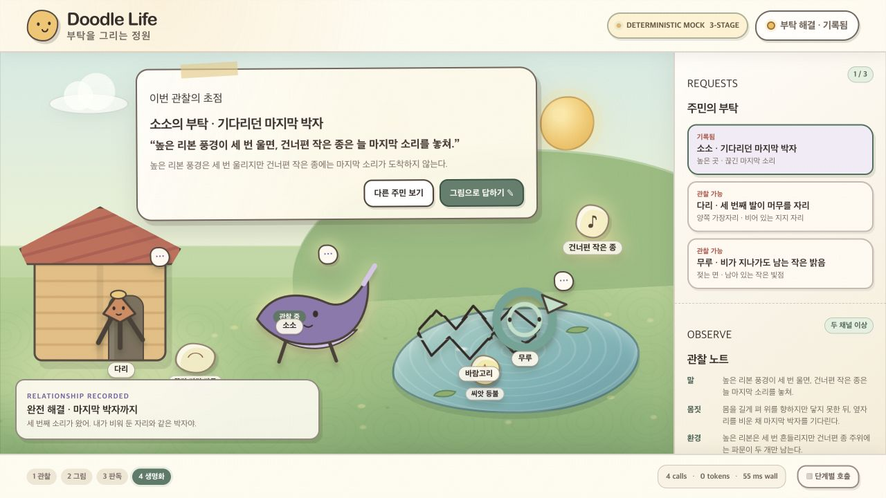
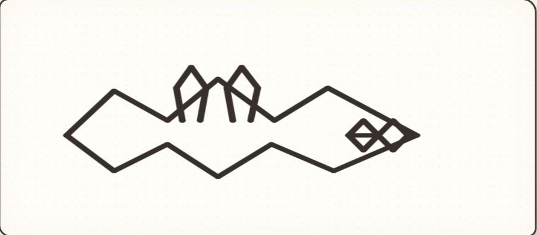
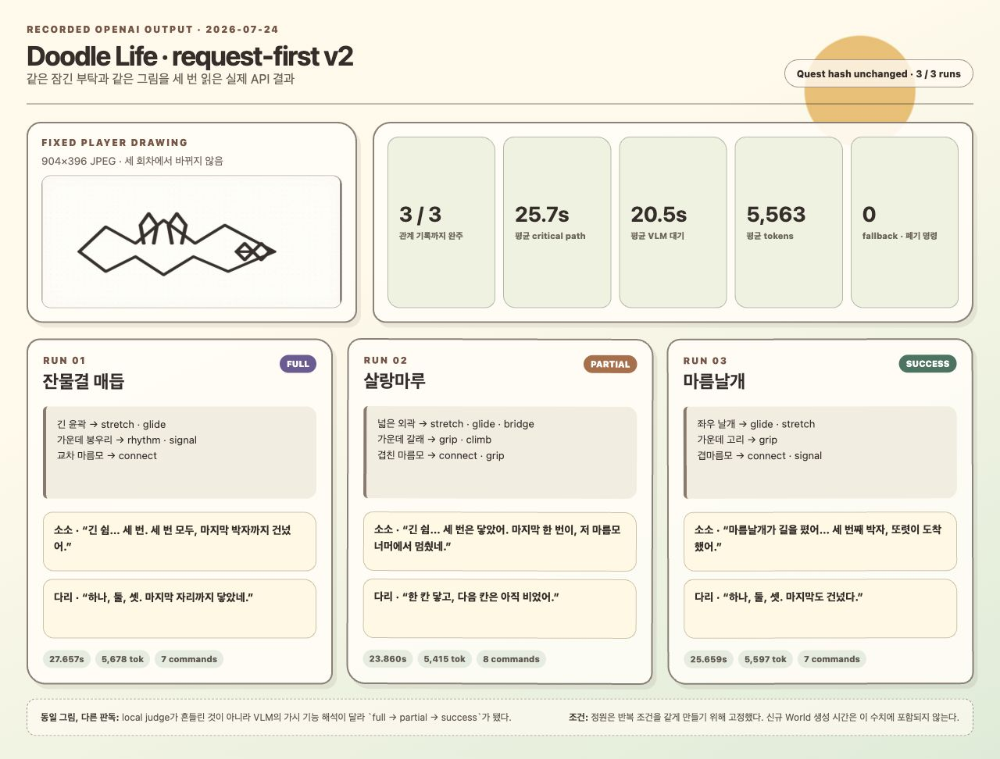

# Doodle Life request-first v2 평가 기록

이 문서는 최신 `game-concept-doodle-life.md`에 맞춰 바꾼 수직 슬라이스를 직접 플레이하지
않아도 확인할 수 있도록, 화면·실제 OpenAI 응답·로컬 판정·NPC 반응·시간·토큰을 함께
남긴 기록이다. 별도의 품질 점수는 매기지 않는다.

## 이번 빌드에서 검증한 흐름

```text
잠긴 정원과 부탁 3개
  → 주민 1명 선택과 단서 관찰
  → 그림 제출
  → 부탁을 모르는 VLM 판독
  → 잠긴 계약으로 로컬 판정
  → 원본 그림 생명화
  → 부탁 주인 + 관찰자 반응 병렬 생성
  → Resolver 실행과 관계 기록
```

- 주민 선택, 단서 확인, 화면 이동에는 모델 호출이 없다.
- VLM 입력에는 이미지와 그림 메타데이터만 들어간다. 선택한 부탁 ID, 정답 기능,
  `QuestContract`는 들어가지 않는다.
- `full / success / partial / unexpected` 판정과 영속 정원 변화는 로컬 엔진이 맡는다.
- NPC 반응은 이미 확정된 결과를 연기할 뿐 판정과 영속 상태를 바꿀 수 없다.
- 제출 그림은 공통 원형·블롭 몸체로 다시 그리지 않고 원본 외곽선과 빈 공간을 유지한다.

## 브라우저 완주 화면

아래 화면은 실제 v2 클라이언트를 deterministic mock 서버로 완주하며 캡처했다. 라이브
API 결과와 혼동하지 않도록 화면 파일은 `mock-browser`로 분리했다.

### 1. 부탁을 보며 그림으로 답하기



### 2. 원본 그림 위 VLM 근거 표시



### 3. 원본 실루엣 생명화와 관계 기록



브라우저에서 주민 3명은 각각 긴 잎형, 여러 다리형, 가운데가 빈 고리형으로 렌더링됐다.
제출 그림은 원형 프레임 없이 선과 내부 빈 공간을 그대로 가진 생명체로 정원에 들어왔고,
관계 기록까지 새로고침 없이 완료됐다. 브라우저 콘솔 오류는 없었다.

## 라이브 API 고정 조건

| 항목 | 조건 |
|---|---|
| 실행 일시 | 2026-07-24, Asia/Seoul |
| 공급자 | OpenAI Responses API |
| 반복 횟수 | 정확히 3회 |
| 정원 | 검증된 tutorial garden을 매 회 새 세션에 동일하게 주입 |
| 부탁 | `quest_soso_last_note` |
| 계약 SHA-256 | `23debe4d145117c5973394523656228625a8706bd7b1a2ff8d24b630eaba5904` |
| 그림 | [`soso-last-note-full.jpg`](../demos/doodle-lab/fixtures/soso-last-note-full.jpg), 904×396 JPEG |
| 그림 SHA-256 | `89d06ff323eb80303fed543ccdac3cdbbab13f8d4e35ff82fb3c5a690af69680` |
| VLM | `gpt-5.6-sol`, low, 출력 상한 2,400 |
| 각 NPC 반응 | `gpt-5.6-terra`, low, 출력 상한 900 |
| 정상 회차 호출 | VLM 1회 + 주인/관찰자 반응 병렬 2회 = 3회 |

세 회차의 부탁과 그림을 완전히 같게 유지하기 위해 World & Locked Quests 단계는 라이브로
다시 생성하지 않았다. 따라서 아래 수치에는 신규 정원의 최초 생성 시간이 포함되지 않는다.
고정된 공개 월드와 private 계약 스냅샷은 각 회차 산출물에 남겼다.

평가 입력 그림:



## 세 번의 실제 결과

아래 화면은 추가 모델 호출 없이 세 회차의 저장된 실제 API 출력만 모아 렌더링한
결과 요약이다.



| 회차 | VLM 이름 | 로컬 판정 | VLM 대기 | 병렬 반응 | 전체 critical path | 토큰 | fallback / 폐기 명령 |
|---|---|---:|---:|---:|---:|---:|---:|
| 1 | 잔물결 매듭 | `full` | 22.569초 | 5.073초 | 27.657초 | 5,678 | 없음 / 0 |
| 2 | 살랑마루 | `partial` | 18.812초 | 5.042초 | 23.860초 | 5,415 | 없음 / 0 |
| 3 | 마름날개 | `success` | 20.242초 | 5.410초 | 25.659초 | 5,597 | 없음 / 0 |
| 평균 | — | — | 20.541초 | 5.175초 | 25.725초 | 5,563 | — |

세 회차 합계는 모델 호출 9회, 16,690토큰이다. 로컬 판정 자체는 각각 5ms, 3ms,
3ms였으며 모델을 호출하지 않았다. 반응 두 개는 병렬 실행되므로 반응 단계의 실제 대기
시간은 약 5.0–5.4초였다.

### 회차 1 — `full`

VLM은 긴 외곽을 `stretch/glide`, 가운데 봉우리를 `rhythm/signal`, 오른쪽 교차
마름모를 `connect`로 읽었다. 주요 필요와 보너스가 모두 맞아 로컬 엔진이 `full`을
선택했다.

- 소소: “긴 쉼… 세 번. 세 번 모두, 마지막 박자까지 건넜어.”
- 다리: “하나, 둘, 셋. 마지막 자리까지 닿았네.”
- Resolver: 승인 명령 7개, 폐기 0개, fallback 주민 0명

원문: [VLM 판독](../artifacts/doodle-life-evals/request-first-v2/api-baseline/run-01/doodle-reading.json) ·
[로컬 판정](../artifacts/doodle-life-evals/request-first-v2/api-baseline/run-01/quest-resolution.json) ·
[해결 장면](../artifacts/doodle-life-evals/request-first-v2/api-baseline/run-01/resolved-encounter.json)

### 회차 2 — `partial`

같은 그림에서 VLM은 넓은 외곽을 `stretch/glide/bridge`, 가운데 갈래를
`grip/climb`, 오른쪽 마름모를 `connect/grip`으로 읽었다. 높은 곳에 접근하는 조건은
잡았지만, 소리를 건너편으로 전하는 `signal/echo/carry_signal`은 잡지 않아 로컬 엔진이
`partial`을 선택했다.

- 소소: “긴 쉼… 세 번은 닿았어. 마지막 한 번이, 저 마름모 너머에서 멈췄네.”
- 다리: “한 칸 닿고, 다음 칸은 아직 비었어.”
- Resolver: 승인 명령 8개, 폐기 0개, fallback 주민 0명

원문: [VLM 판독](../artifacts/doodle-life-evals/request-first-v2/api-baseline/run-02/doodle-reading.json) ·
[로컬 판정](../artifacts/doodle-life-evals/request-first-v2/api-baseline/run-02/quest-resolution.json) ·
[해결 장면](../artifacts/doodle-life-evals/request-first-v2/api-baseline/run-02/resolved-encounter.json)

### 회차 3 — `success`

VLM은 좌우 날개를 `glide/stretch`, 가운데 고리를 `grip`, 오른쪽 마름모를
`connect/signal`로 읽었다. 주요 필요는 충족했지만 보너스 박자 조건은 잡지 않아
로컬 엔진이 `success`를 선택했다.

- 소소: “마름날개가 길을 폈어… 세 번째 박자, 또렷이 도착했어.”
- 다리: “하나, 둘, 셋. 마지막도 건넜다.”
- Resolver: 승인 명령 7개, 폐기 0개, fallback 주민 0명

원문: [VLM 판독](../artifacts/doodle-life-evals/request-first-v2/api-baseline/run-03/doodle-reading.json) ·
[로컬 판정](../artifacts/doodle-life-evals/request-first-v2/api-baseline/run-03/quest-resolution.json) ·
[해결 장면](../artifacts/doodle-life-evals/request-first-v2/api-baseline/run-03/resolved-encounter.json)

## 결과에서 바로 보이는 점

- 세 회차 모두 관계 기록까지 완료했고 model fallback, Resolver 폐기, 잘못된 참조가 없었다.
- 계약 hash는 모든 회차의 그림 전후에 동일했다. 모델 출력 때문에 부탁이나 허용 해법이
  바뀌지 않았다.
- VLM 기록의 forbidden quest key는 세 회차 모두 0개였고 이미지 base64와 API 키는
  산출물에 남지 않았다.
- 같은 그림이어도 판독 태그가 달라 `full → partial → success`로 갈렸다. 판정기가
  흔들린 것이 아니라 quest-blind VLM의 기능 해석 차이가 결과에 그대로 반영된 사례다.
- 판정과 기본 생명화는 VLM 직후 즉시 시작할 수 있다. 남은 약 5초의 NPC 반응은 이미
  확정된 결과 뒤에 비동기로 이어 붙일 수 있다.
- 현재 상호작용에서 가장 긴 단일 대기는 VLM의 약 18.8–22.6초다. 매 클릭마다 전체
  세계를 재생성하던 이전 구조의 60–120초급 대기보다 작지만, 즉각 반응으로 느끼기에는
  여전히 눈에 띄는 구간이다.

## legacy full-control 기준선과 함께 읽기

| 기록 | 완주 | 완주 회차 wall time | 완주 회차 토큰 |
|---|---:|---:|---:|
| 2026-07-23 full-max API | 1 / 3 | 173.029초 | 61,647 |
| 2026-07-24 request-first v2 | 3 / 3 | 평균 25.725초 | 평균 5,563 |

두 기록은 같은 성능 벤치마크가 아니다. legacy full-max에는 World Author, Doodle VLM,
NPC Minds, Director, Critic과 월드 생성 시간이 포함됐고, v2 반복 실험은 같은 계약을
유지하기 위해 정원을 고정했다. 이 표는 모델·입력의 우열 비교가 아니라 active flow에서
제거되거나 로컬화된 단계가 무엇인지 확인하기 위한 구조 비교다.

legacy 원문은
[`doodle-life-llm-evaluation-2026-07-23.md`](./doodle-life-llm-evaluation-2026-07-23.md)와
[`full-max-api-baseline`](../artifacts/doodle-life-evals/full-max-api-baseline/)에 그대로
보존돼 있다.

## 자동·수동 검증

- `npm run check`: 브라우저·서버 TypeScript 검사 통과
- `npm test`: 13개 파일, 49개 테스트 통과
- `npm run build`: production bundle 생성 통과
- mock 브라우저: 한 라운드 완주, 콘솔 오류 0개
- API 오류 경계: 잘못된 payload, 없는 세션, 판독 전 판정, 판정 전 반응, stale revision을
  각각 정해진 4xx 오류로 확인
- 실패 경로: World/VLM/주인 반응/관찰자 반응 실패에도 검증된 fallback과 관계 기록까지
  끝나는지 확인
- 부분 모션: 움직이는 근거 영역을 원본 레이어에서 마스킹한 뒤 같은 원본 픽셀 조각으로
  움직여, 원본과 복제 조각이 겹치는 잔상을 제거

## 산출물 구조

```text
artifacts/doodle-life-evals/request-first-v2/
├── mock-browser/
│   ├── 01-drawing.jpg
│   ├── 02-vlm-evidence.jpg
│   └── 03-relationship-recorded.jpg
└── api-baseline/
    ├── report.html
    ├── api-result-overview.jpg
    ├── manifest.json
    ├── summary.json
    └── run-01..03/
        ├── world-public.json
        ├── quest-public-view.json
        ├── quest-contract-before.json
        ├── vlm-input-metadata.json
        ├── doodle-reading.json
        ├── quest-resolution.json
        ├── world-diff.json
        ├── owner-reaction.json
        ├── observer-reaction.json
        ├── resolved-encounter.json
        ├── quest-contract-after.json
        ├── trace.json
        └── run.json
```

전체 조건과 모델 설정은
[`manifest.json`](../artifacts/doodle-life-evals/request-first-v2/api-baseline/manifest.json),
세 회차 집계는
[`summary.json`](../artifacts/doodle-life-evals/request-first-v2/api-baseline/summary.json)에
있다.

## 재실행

기존 결과를 실수로 덮어쓰지 않도록 실행기는 비어 있지 않은 label 경로를 거부한다.
새 label을 정한 뒤 아래처럼 실행한다.

```bash
cd demos/doodle-lab
npm run eval:request-first -- \
  --provider=openai \
  --runs=3 \
  --label=<new-label>
```

`--runs`는 3이 아니면 API 호출 전에 실패한다. 정원 생성 단계까지 라이브로 다시
측정하려면 이번 고정 조건 기록에 섞지 말고 별도 label과 별도 실험 계약으로 남겨야 한다.
