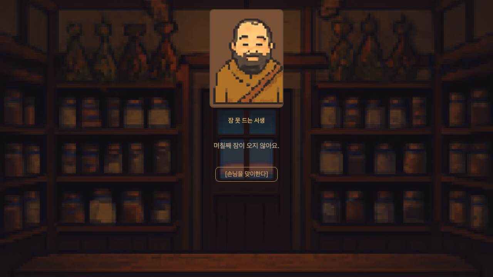
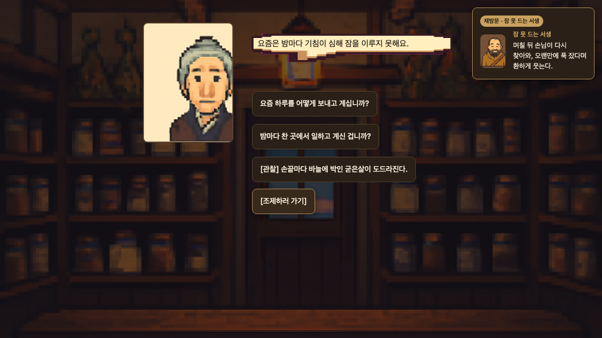
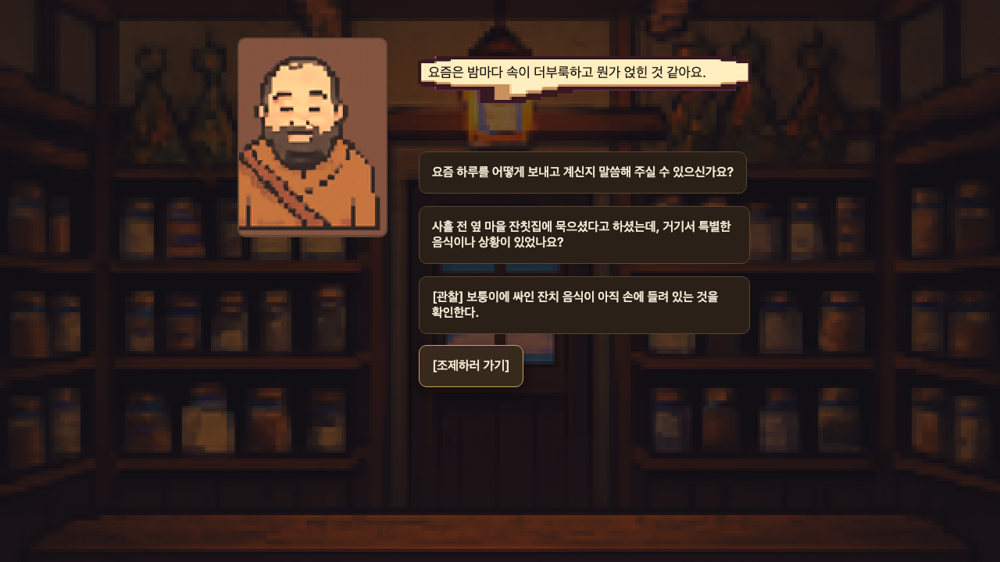
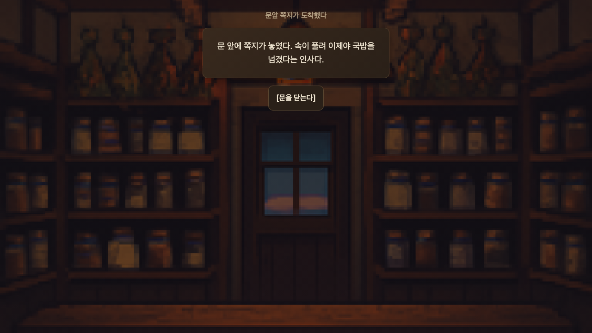
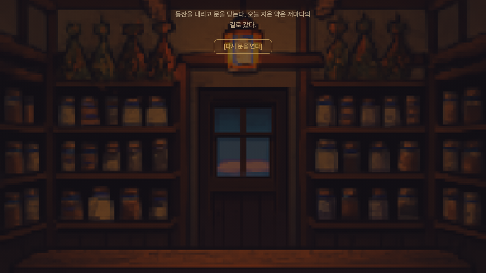

# Apothecary Lambda/Bedrock game test — 2026-07-26

## Result

The automated playthrough completed C1 → C2 → C3 → closing with the live
dialogue adapter.

| Check | Result |
|---|---|
| `GET /ai/health` | HTTP 200, `ok=true`, `dialogue=true` |
| C2 `/ai/dialogue` | HTTP 200, `x-llm-fallback=false`, response matched the UI |
| C3 `/ai/dialogue` | HTTP 200, `x-llm-fallback=false`, response matched the UI |
| Dialogue requests | 2 |
| Runtime portrait requests | 0 |
| Browser console errors | 0 |
| Page errors | 0 |
| Closing screen | Reached |

The responses used `global.amazon.nova-2-lite-v1:0`. C2 and C3 use live AI
only for their opening dialogue; later dialogue remains authored, and portraits
remain bundled assets.

## Network evidence

The captured request and response bodies, status codes, response headers, UI
match flags, request counts, and browser error arrays are in
[network-evidence.json](../../demos/apothecary/e2e/artifacts/live-lambda-2026-07-26/network-evidence.json).

The browser ran the game through the local loopback proxy with the production
Pages origin. A direct playthrough from the deployed GitHub Pages URL is outside
this report's scope.

## Automated screenshots

### 1. C1 entrance

### 2. C2 live dialogue

### 3. Overlap revisit

### 4. C3 live dialogue

### 5. Final note

### 6. Closing

