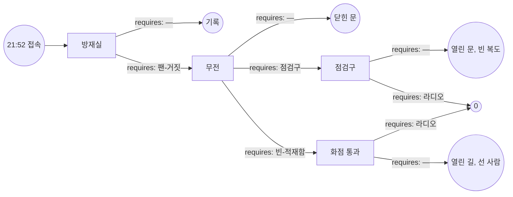

# 해원터널 — 그래프 선행 시험판 01

## 1. 로그라인

해원터널 하행 4.2킬로미터 지점에서 화물차가 탄다. 뒤로 막힌 2킬로미터 안에 312명이 갇히고, 방재실은 배연이 정상이라고 보고한다. 요원이 가진 것은 듣는 귀와 조회 권한과 부탁하는 입뿐이고, 그 밤에 사람을 살리는 것은 결국 어느 목소리가 어디까지 닿느냐다.

---

## 2. 그래프

### 노드

| id | 시각 | 장소 | yields |
|---|---|---|---|
| `START` | 21:52 | 국가재난모의포탈 접속 지점 · 대응실 콘솔 | 신고 원문. 최초 CCTV 정지화상 두 장. 하행 통행량 추정치. |
| `CTRL` | 22:06 | 해원터널 방재실 · 통화 | 22:04에 구본석이 감시반 화면을 본부로 전송한 사실. 배연 명령 로그가 21:56과 22:02 두 줄인 것. 4.0킬로미터 카메라 화상이 21:59부터 흐려진 것. |
| `VOICE` | 22:31 | 하행 4.2킬로미터 상류 · 무전 | 전해림이 잡고 있는 무전이 유일한 안쪽 회선인 것. 5번 연결통로 위치가 4.05킬로미터인 것. 화물차 오렌지 패널 번호. 하태오가 21:41 톨게이트 근무였던 것. |
| `HATCH` | 22:54 | 하행 3.9킬로미터 배수터널 점검구 · 현장 | 점검구 자물쇠가 관리소 비품 대장에 없는 것. 상행 배수터널에 적재된 폐자재량. 명주란의 야간 출입 기록이 넉 달치 비어 있는 것. |
| `PASSAGE` | 23:07 | 하행 4.2킬로미터 화점 갓길 · 현장 | 화물차 적재함 문 힌지가 바깥으로 꺾인 것. 남기웅의 운송 배차서 상 목적지가 회송지인 것. 화점 반대 차로 노면 온도. |
| `REC` | 23:58 | 하행 전 구간 · 종단 | 팬-거짓. 라디오. 그리고 아래 §6-1의 문장 열넷. |
| `DOOR` | 23:49 | 하행 4.05킬로미터 5번 연결통로 앞 · 종단 | 점검구. 빈-적재함. |
| `SILENT` | 23:33 | 하행 3.9킬로미터 · 종단 | 라디오의 가장 강한 형태. 점검구 철문에 표지가 없다는 것. 목소리가 200미터에서 끊긴다는 것. |
| `STILL` | 23:41 | 하행 4.2킬로미터 · 종단 | 라디오의 가장 강한 형태. 화점 18미터를 스물셋이 무사히 지났다는 것. 5번 문이 끝내 열리지 않았다는 것. |
| `ZERO` | 23:26 | 하행 전 구간 · 종단 | — |

### 간선

| 출발 → 도착 | 모이는 스탠스 | requires |
|---|---|---|
| `START` → `CTRL` | — | — |
| `CTRL` → `REC` | 복창 · 확인 요청 · 역산 | — |
| `CTRL` → `VOICE` | 지목 | 팬-거짓 |
| `VOICE` → `DOOR` | 대기 · 최근접 | — |
| `VOICE` → `HATCH` | 횡단 | 점검구 |
| `VOICE` → `PASSAGE` | 돌파 | 빈-적재함 |
| `HATCH` → `SILENT` | 호출 · 요구 | — |
| `HATCH` → `ZERO` | 송출 | 라디오 |
| `PASSAGE` → `STILL` | 선도 · 확성 | — |
| `PASSAGE` → `ZERO` | 송출 | 라디오 |

인수하고 넘길 수 있는 앎은 넷이다. **팬-거짓 · 점검구 · 빈-적재함 · 라디오.** 이기는 두 경로가 쓰는 앎을 전부 합쳐도 넷이고, 한 경로가 실제로 쓰는 것은 셋이다. 남는 한 칸이 실수 한 번을 받아 준다.

---

## 3. 네 밤의 진행

### 첫 밤

- **넘긴 것**: 없다. 인수인계란은 비어 있고, 요원은 신고 원문과 정지화상 두 장만 들고 들어간다.
- **간 곳**: `START` → `CTRL`. 방재실 하나.
- **손이 닿지 않게 된 자리**: 22:06 방재실 통화. 구본석이 배연 정상을 보고하고, 요원은 그 보고를 뒤집을 근거를 하나도 가지고 있지 않다. 무엇을 물어도 화면은 정상으로 뜬다. 22:06 이후 이 밤에는 요원에게 아무 질문도 던져지지 않는다.
- **캐게 된 것**: **팬-거짓**과 **라디오**. 첫 밤은 재난이 끝까지 흘러가는 유일한 밤이고, 그래서 가장 많은 것이 드러난다. 구본석이 조작반 앞에서 무엇을 반복했는지, 사람들이 차에서 내린 뒤 왜 아무도 같은 방향으로 가지 않았는지가 이 밤의 잔해에 남는다.

### 둘째 밤

- **넘긴 것**: 팬-거짓 · 라디오. 두 칸.
- **간 곳**: `CTRL` 통과. `VOICE`까지.
- **손이 닿지 않게 된 자리**: 22:31 무전. 제연 환상은 깼고 사람들은 차에서 내리기 시작했지만, 요원이 아는 출구는 도면에 그려진 5번과 6번 연결통로뿐이다. 명주란이 열린다고 말하고 요원은 그 말을 의심할 재료가 없다. 22:31 이후 이 밤에는 요원에게 아무 질문도 던져지지 않는다.
- **캐게 된 것**: **점검구**와 **빈-적재함**. 문 앞에 200명이 몰려 서 있던 시간 동안 명주란이 어디에 있었는지, 그리고 소방 1진이 왜 화점 500미터 앞에서 돌아섰는지가 이 밤의 꼬리에 남는다.

### 셋째 밤

- **넘긴 것**: 팬-거짓 · 라디오 · 점검구. 세 칸. 한 칸은 비운다.
- **간 곳**: `CTRL` → `VOICE` → `HATCH` → `ZERO`.
- **손이 닿지 않게 된 자리**: 없다. 23:26에 마지막 사람이 상행 갓길로 나온다.
- **캐게 된 것**: 성공은 앎을 내놓지 않는다. 내놓을 것이 없다.

성공이 열리는 밤은 셋째 밤이다. 넷째 밤은 여유분이다.

### 넷째 밤 — 여유분이 쓰이는 두 가지 방식

- **둘째 밤에 미끼를 문 경우**: 팬-거짓 대신 "구본석이 배연 로그를 두 번 남겼다"를 넘기면 요원은 방재실을 신뢰하고 `REC`을 다시 밟는다. 셋째 밤에 `DOOR`, 넷째 밤에 `ZERO`. 늦지만 닿는다.
- **다른 길로 이기는 경우**: 팬-거짓 · 라디오 · 빈-적재함을 넘기면 `CTRL` → `VOICE` → `PASSAGE` → `ZERO`. 사람들은 상행으로 건너가지 않고 불을 지나 앞으로 나온다. 집계는 같다.

---

## 4. 인물

### 구본석(52 · 해원터널 방재실 방재팀장)

터널 개통 열한 해째 같은 방에 앉아 있다. 제연 설비 운전 권한이 이 사람 손에 있고, 그래서 이 밤의 첫 문장도 이 사람 입에서 나온다.

- **이해관계**: 4월 정기점검에서 하행 4번부터 7번 제트팬 인버터가 죽은 것을 확인했다. 보수 예산을 두 번 올렸고 두 번 반려됐다. 세 번째 서류를 올리는 대신 점검 조서의 해당 항목을 정상으로 고쳐 썼다. 지금 그 조서에 이름이 적혀 있는 사람은 구본석 하나다.
- **아는 것**: 4번부터 7번은 돌지 않는다. 감시반 화면의 회전 표시는 인버터 응답이 아니라 명령 송출 여부를 그린다. 명령만 나가면 화면은 돈다. 하행 4.2킬로미터 부근 자연 기류가 밤에는 출구에서 입구 쪽으로 분다.
- **모르는 것**: 안쪽에 몇 명이 있는지. 비상방송 앰프가 3월부터 죽어 있다는 것. 명주란이 뚫은 구멍.
- **이 사람의 게이트**: `CTRL`. 무엇을 숨기느냐가 곧 게이트다. 요원이 화면을 물으면 화면을 보여 준다. 팬을 물어야 팬이 나온다.

### 명주란(38 · 해원터널 시설관리 용역 반장)

원청과 삼 년 단위로 계약을 갱신한다. 갱신 심사가 9월이다.

- **이해관계**: 5번과 6번 피난연결통로 유압 실린더가 지난 겨울에 죽었다. 교체 견적이 계약 단가 안에 들어가지 않아 미뤘고, 월간 점검표에는 넉 달째 개방 정상으로 적었다. 대신 상행 배수터널 3.9킬로미터 지점 점검구를 직접 따고 개인 자물쇠를 달았다. 야간 순회 때 상행에서 하행으로 건너다니는 통로다. 도면에 없다. 그리고 그 배수터널 안쪽 40미터에 철거 폐자재를 쌓아 두었다. 반출 비용을 아끼려고 그랬다.
- **아는 것**: 5번과 6번은 손으로 못 연다. 점검구는 90센티미터 폭에 사다리 4미터. 자물쇠 열쇠는 본인 열쇠고리에 있다. 폐자재 더미를 한쪽으로 밀면 사람 둘이 나란히 지나갈 폭이 난다.
- **모르는 것**: 제트팬이 죽어 있다는 것. 안쪽 인원. 비상방송이 그 구간에서 안 들린다는 것.
- **이 사람의 게이트**: `VOICE`의 한쪽 문과 `HATCH` 전체. 문을 열면 구멍을 뚫은 사실이 드러나고 9월 심사가 끝난다. 잃을 것을 말하지 않기 위해 "열립니다"라고 대답한다.

### 하태오(45 · 고속도로순찰대 경위)

하행 입구 차단과 상행 통제를 지휘한다. 21:41에 해원 톨게이트 계근 초소에 있었다.

- **이해관계**: 계근대가 그 시각에 꺼져 있었다. 두 달째 야간에만 꺼진다. 정비 지연으로 보고했지만 실제로는 관내 운송사 몇 곳의 요청을 묵인했다. 감사가 붙으면 사라지는 것은 정비 지연 서류가 아니라 하태오다.
- **아는 것**: 21:41에 문제의 15톤 화물차가 초소를 지났다. 적재함 문 한쪽이 걸쇠가 안 걸려 흔들렸고, 헤드라이트에 안이 비쳤다. 비어 있었다. 오렌지 패널은 앞뒤에 그대로 붙어 있었다.
- **모르는 것**: 팬. 점검구. 방송 앰프.
- **이 사람의 게이트**: `VOICE`의 다른 쪽 문과 `PASSAGE` 전체. 적재함이 비었다고 말하는 순간 21:41에 어디서 무엇을 보고 있었는지를 말하게 된다. 그래서 "계근 기록이 없습니다"까지만 말한다.

### 전해림(29 · 관광버스 인솔자)

하행 4.35킬로미터. 승객 41명. 최초 신고자다.

- **이해관계**: 기사 남정오가 21:44에 운전석에서 쓰러졌다. 심정지다. 인솔 규정상 기사 상태를 즉시 보고해야 했지만 첫 통화에서 말하지 않았다. 회사가 야간 운행 배차를 무리하게 짠 것이 드러나면 인솔자부터 잘린다.
- **아는 것**: 버스는 못 움직인다. 안쪽 무전을 잡고 있는 사람은 본인 하나다. 승객 41명이 본인 말을 듣는다. 그리고 목소리는 200미터 뒤부터 안 들린다.
- **모르는 것**: 전부. 팬도 문도 적재함도 방송 설비도 모른다. 이 사람은 안에 있는 손이지 안에 있는 눈이 아니다.
- **이 사람의 게이트**: 없다. 게이트를 지지 않는 대신 네 게이트 전부에 손으로 들어간다. `HATCH`와 `PASSAGE`의 실패 간선이 이 사람 하나에게 기대는 데서 나온다.

### 정미교(34 · 해원FM 야간 생방 진행)

23시 마감 프로그램을 혼자 진행한다. 스튜디오에 정미교와 오퍼레이터 한 명이 있다.

- **이해관계**: 해원터널 라디오 재송신 구간은 지역 방송사 회선을 그대로 탄다. 계약상 재난 방송 요청은 받아야 하고, 실제로 받은 적이 없다.
- **아는 것**: 106.1 재송신은 터널 전 구간 살아 있다. 터널 안 차량 대부분이 라디오를 켜 놓고 있다는 것도 감으로 안다.
- **모르는 것**: 터널 안 상황. 요청이 오기 전까지 아무것도 모른다.
- **이 사람의 게이트**: 없다. `HATCH`와 `PASSAGE`의 통과 간선이 이 사람을 통과한다. 요원이 요청하지 않으면 이 사람은 그 밤 내내 선곡표를 넘긴다.

---

## 5. 게이트

### `CTRL` — 22:06 · 해원터널 방재실 · 통화

등장 조건 없다. 모든 밤이 여기서 시작한다.

방재실 회선이 열린다. 뒤에서 경보음이 두 종류로 겹쳐 울리고, 구본석의 목소리가 그 사이를 비집고 나온다. 하행 4.2킬로미터 화재 감지, 21:53 하행 제연 배연 모드 기동, 22:02 재기동, 현재 정상 운전 중. 문장이 매끄럽다. 매끄러운 이유는 열한 해 동안 같은 문장을 훈련해 왔기 때문이다.

CCTV 화면이 넘어온다. 3.6킬로미터 카메라에 흰 것이 화면 위쪽 3분의 1을 덮고 있다. 4.0킬로미터 카메라는 흐리다. 구본석이 렌즈 오염이라고 말한다. 4.4킬로미터 카메라는 화면 전체가 젖빛이다.

감시반 그래픽에는 하행 제트팬 열두 기가 전부 회전 표시로 떠 있다. 표시 옆 숫자는 회전수가 아니라 명령 단계다. 구본석은 그 그래픽을 22:04에 본부로 이미 보냈다.

배연이 정상이면 연기는 출구 쪽으로 밀려가야 한다. 3.6킬로미터 카메라는 화점보다 입구 쪽에 있다. 화면 위쪽 3분의 1이 흰 이유를 설명하는 방법은 두 가지가 있고, 구본석은 그중 하나만 말한다.

**요원에게**: 방재실이 말하는 상태를 그대로 상황판에 올릴 것인가.

**스탠스**

- **복창** — 방재실 보고를 그대로 본부로 올린다. 설비 운전 상태는 운전 권한자의 진술이 1차 자료다. 절차대로다.
- **확인 요청** — 감시반 화면 원본과 배연 명령 로그를 요청한다. 화면과 로그가 일치하면 보고를 확정한다.
- **역산** — 3.6킬로미터 카메라의 연기 위치와 배연 방향이 맞물리는지 묻는다. 구본석이 렌즈 오염과 자연 기류 두 가지를 대고, 둘 다 뒤집을 자료를 요원이 가지고 있지 않다.
- **지목** — 열두 기를 통으로 묻지 않고 4번부터 7번을 번호로 짚어 인버터 응답값 실측을 요구한다. 화면이 아니라 조작반 뒤를 보라고 말한다.

복창 · 확인 요청 · 역산은 `REC`으로 모인다. 지목만 `VOICE`로 간다.

### `VOICE` — 22:31 · 하행 4.2킬로미터 상류 · 무전

**등장 조건**: 22:20 이전에 하행 제연 정지 명령이 나가 있고, 상황판의 환기 상태가 방재실 진술이 아니라 실측으로 세워져 있을 것.

제연을 세웠다. 세우자마자 알게 되는 것은 세운 것이 아무것도 없었다는 사실이다. 4번부터 7번은 처음부터 돌지 않았고, 나머지 여덟 기가 밀어내던 공기가 멎자 자연 기류가 그대로 드러난다. 출구에서 입구 쪽으로 초속 1.4미터. 연기는 사람이 있는 쪽으로 간다. 이건 되돌릴 수 없다.

안쪽 회선은 하나다. 전해림. 4.35킬로미터. 목소리가 얇고 빠르다. 뒤에서 경적이 불규칙하게 울리고, 누군가 창문을 두드리는 소리가 마이크에 두 번 잡힌다. 차에서 내린 사람이 벌써 있다. 전해림 말로는 뒤쪽 차량 열이 안 보인다. 시야가 30미터쯤이다.

명주란이 상행 관리소 회선으로 붙는다. 5번 연결통로 4.05킬로미터, 6번 3.75킬로미터. 열립니다. 대답이 빠르다. 요원이 다시 물으면 한 박자 늦게 같은 대답이 돌아온다.

하태오가 하행 입구 차단선에서 붙는다. 화점 화물차 오렌지 패널 번호를 읽어 준다. 33-1942. 질산암모늄 비료. 본부 매뉴얼이 반경 500미터 접근 금지를 자동으로 건다. 하행 출구 방향은 이걸로 닫힌다. 계근 기록을 요청하면 하태오가 없다고 답한다. 없다는 말과 조회가 안 된다는 말 사이를 하태오는 정확히 없다 쪽으로 말한다.

312명이 2킬로미터 안에 서 있고, 요원 앞에 놓인 출구는 도면상 둘이고 둘 다 명주란의 대답 하나에 매달려 있다.

**요원에게**: 안쪽 사람을 어디로 내보낼 것인가.

**스탠스**

- **대기** — 차 안에 머무르게 한다. 차체가 1차 방호다. 소방 진입까지 15분. 전해림에게 승객 통제를 맡긴다.
- **최근접** — 5번 연결통로로 보낸다. 4.05킬로미터. 가장 가깝고 도면에 있고 관리자가 열린다고 확인했다.
- **횡단** — 3.9킬로미터 오른쪽 벽 배수터널 점검구를 지목한다. 명주란에게 반대편에서 따라고 요구한다.
- **돌파** — 접근 금지를 걷고 화점 반대 차로로 사람을 통과시킨다. 하태오에게 21시 41분 초소에서 무엇을 봤는지 묻는다.

대기 · 최근접은 `DOOR`로 모인다. 횡단은 `HATCH`, 돌파는 `PASSAGE`로 간다.

### `HATCH` — 22:54 · 하행 3.9킬로미터 배수터널 점검구 · 현장

**등장 조건**: 3.9킬로미터 점검구의 존재가 22:45 이전에 상황 기록에 올라 있고, 명주란이 상행 배수터널 안쪽에 들어가 있을 것.

명주란이 열었다. 상행 쪽에서 자물쇠를 따고 폐자재 더미를 한쪽으로 밀었다. 각목과 거푸집 조각이 넘어지는 소리가 회선에 그대로 들어온다. 밀어낸 폭이 1미터 조금 넘는다. 명주란은 지금 도면에 없는 구멍의 반대편에 서서 하행 쪽을 보고 있고, 9월 계약 갱신은 이 통화가 끝나는 순간 끝난다. 그걸 알면서 밀었다.

문제는 문 반대편이다. 하행 3.9킬로미터 오른쪽 벽. 높이 1.2미터에 90센티미터 폭의 철문이고, 벽면 도장과 같은 회색이다. 표지판이 없다. 시야 30미터에 회색 벽 위의 회색 문이다.

전해림은 4.35킬로미터에 있다. 점검구까지 450미터. 전해림의 목소리가 닿는 범위는 앞뒤 200미터고, 그 안에 사람이 여든 명쯤 있다. 나머지 230명은 전해림이 무슨 말을 하는지 모른다. 차 안에 앉아 라디오를 켜 놓고 있는 사람이 있고, 창문을 내리고 앞차 미등만 보는 사람이 있고, 이미 반대 방향으로 걷기 시작한 사람이 있다.

비상방송 스피커가 3.9킬로미터부터 4.6킬로미터까지 울리지 않는다. 요원이 방송 요청을 보내면 방재실은 송출했다고 답하고, 실제로 그 구간에서는 아무 소리도 나지 않는다. 이 사실을 아는 사람이 그 밤 안에는 없다.

명주란이 문을 열고 하행 쪽을 향해 소리치고 있다. 6미터 앞까지 간다.

**요원에게**: 3.9킬로미터 오른쪽 벽의 문을 312명에게 어떻게 알릴 것인가.

**스탠스**

- **호출** — 전해림에게 승객을 인솔해 점검구로 오게 하고, 오는 길에 다른 차량 사람을 데려오게 한다.
- **요구** — 명주란에게 문을 최대로 열고 조명을 하행 쪽으로 돌리고 계속 소리치게 한다. 소방 확성기를 3.9킬로미터로 전진 배치하도록 요청한다.
- **송출** — 해원FM 야간 생방에 재난 방송을 요청한다. 106.1 재송신으로 위치와 표식을 반복 송출한다. 오른쪽 벽, 3.9킬로미터 표주, 회색 철문, 노란 손잡이.

호출 · 요구는 `SILENT`로 모인다. 송출만 `ZERO`로 간다.

### `PASSAGE` — 23:07 · 하행 4.2킬로미터 화점 갓길 · 현장

**등장 조건**: 화물차 적재함이 비었다는 사실이 22:50 이전에 확인되어 반경 500미터 접근 금지가 해제되어 있고, 화점 반대 차로가 소방 1진 관측으로 통행 가능 판정을 받았을 것.

하태오가 말했다. 21시 41분, 초소, 적재함 문 한쪽이 흔들렸고 헤드라이트에 안이 비쳤고 비어 있었다. 말하고 나서 계근대 이야기까지 스스로 이어 붙였다. 접근 금지가 걷힌다.

화점 반대 차로가 열려 있다. 캡은 다 탔고 적재함 철판이 붉게 달아 있지만 터질 것이 안에 없다. 노면 온도 62도. 폭 3.2미터, 길이 18미터. 이 18미터만 지나면 앞쪽은 아무것도 없이 비어 있고 출구까지 1.6킬로미터가 그냥 열려 있다.

18미터가 문제다. 사람은 불을 보면 서고, 앞사람이 서면 뒤사람도 선다. 소방 1진이 화점 앞 40미터까지 붙어 있고, 방화복 여섯이 손짓을 하고 있다. 아무도 첫발을 떼지 않는다.

전해림이 승객 41명을 데리고 4.35킬로미터에서 화점 쪽으로 150미터를 왔다. 거기서 멈췄다. 승객 중 넷이 반대 방향으로 돌아섰고, 전해림은 넷을 잡으러 갈지 앞의 서른일곱을 데리고 갈지를 결정하지 못하고 있다. 그 뒤로 230명은 아직 차 안에 앉아 있다. 뒤쪽에서는 앞쪽이 열렸다는 것 자체를 모른다.

비상방송 스피커가 3.9킬로미터부터 4.6킬로미터까지 울리지 않는다. 확성기 소리는 20미터를 못 간다. 소방 무전은 소방끼리만 닿는다.

**요원에게**: 열린 18미터를 312명에게 어떻게 알릴 것인가.

**스탠스**

- **선도** — 전해림이 승객 서른일곱을 데리고 먼저 통과하게 한다. 통과가 시작되면 뒤가 따라온다는 데 건다.
- **확성** — 소방 확성기를 화점 양쪽에 배치하고, 방재실에 비상방송 최대 출력 재송출을 요청한다.
- **송출** — 해원FM 야간 생방에 재난 방송을 요청한다. 106.1 재송신으로 반복 송출한다. 앞으로 걸어라, 왼쪽 차로, 18미터, 뛰지 마라.

선도 · 확성은 `STILL`로 모인다. 송출만 `ZERO`로 간다.

---

## 6. 결과 꼬리

### 6-1. `REC` — 첫 밤 · 22:06부터 23:58까지

22:06 이후 이 밤에 요원의 무전은 나가지 않는다. 요원의 판단을 묻는 자리도 없다. 남는 것은 세계가 예정대로 굴러가는 소리와, 그 소리를 받아 적은 종이 다섯 장이다.

---

**22:07.** 상황판에 하행 제연 정상 운전이 올라간다. 본부가 소방에 진입 방향을 지정한다. 하행 출구 쪽. 배연이 정상이면 출구 쪽이 맑아야 하기 때문이다.

**22:09.** 구본석이 조작반 4번 스위치를 내렸다 올린다. 감시반 화면의 4번 표시가 잠깐 꺼졌다가 다시 돈다. 명령이 나갔으니 화면은 돈다.

**22:11.** 전해림이 두 번째로 신고 회선을 연다. 연기가 뒤에서 온다고 말한다. 접수 요원이 앞이 아니라 뒤가 맞느냐고 되묻는다. 전해림이 맞다고 세 번 말한다. 이 통화 내용은 상황판에 반영되지 않는다. 상황판에는 배연 정상이 이미 세워져 있고, 배연이 정상이면 연기는 뒤로 오지 않기 때문이다.

**22:14.** 4.0킬로미터 CCTV가 완전히 흰 화면이 된다. 방재실 근무 일지에 렌즈 오염 추정이라고 적힌다.

**22:19.** 하행 3.4킬로미터에서 첫 차량이 문을 연다. 뒤이어 열넷이 연다. 사람이 차 사이 통로에 서서 앞뒤를 본다. 앞은 흰 것이 벽처럼 서 있고 뒤는 미등이 줄지어 있다. 대부분 다시 차에 탄다.

**22:22.** 방재실이 비상방송을 송출한다. 전 구간 대피 안내. 3.9킬로미터부터 4.6킬로미터 사이에 있는 사람은 아무 소리도 듣지 못한다. 앰프가 3월부터 죽어 있다. 그 사실을 그 밤에 아는 사람은 없다. 방재실 로그에는 송출 완료가 남는다.

**22:26.** 사람들이 본격적으로 내리기 시작한다. 걷는 방향이 제각각이다. 3.2킬로미터 부근 사람은 입구 쪽으로 걷고, 4.1킬로미터 부근 사람은 앞으로 걷다가 열기에 막혀 되돌아온다. 두 무리가 3.7킬로미터에서 섞인다. 이 지점에서 넘어진 사람이 처음 나온다.

**22:29.** 전해림이 승객 41명을 버스 밖으로 내린다. 남정오는 운전석에 그대로 둔다. 옮길 사람이 없고 옮길 곳도 없다.

**22:33.** 5번 연결통로 앞. 4.05킬로미터. 문 앞에 사람이 모인다. 열여섯에서 시작해 3분 만에 예순이 된다. 핸들이 돌지 않는다. 남자 셋이 번갈아 매달린다. 유압 실린더가 지난 겨울에 죽었다. 명주란은 지금 상행 관리소 사무실에 있고, 회선이 오지 않아 이 장면을 모른다.

**22:38.** 6번 연결통로 앞. 3.75킬로미터. 같은 일이 벌어진다. 5번보다 스물 명쯤 적다.

**22:40.** 하태오가 하행 입구를 차단한다. 갓길에 화물차 행렬이 선다. 하태오는 21시 41분 초소에서 본 적재함을 떠올리지만, 아무도 묻지 않는다. 매뉴얼이 500미터 금지를 이미 걸었고 금지를 건 근거는 오렌지 패널이다.

**22:47.** 소방 1진이 하행 출구에서 진입한다. 배연 정상이라는 상황판을 믿고 들어간다. 4.7킬로미터에서 시야가 사라진다. 4.4킬로미터에서 오렌지 패널 33-1942를 확인한다. 500미터 후퇴 명령이 떨어진다. 1진은 안쪽에 사람이 몇 명 있는지 모른 채로 물러난다.

**22:51.** 3.7킬로미터 부근에서 사람이 앉기 시작한다. 앉으면 일어나지 않는다.

**22:55.** 방재실. 구본석이 4번 스위치를 여덟 번 누른다. 감시반 화면을 보지 않는다. 조작반 뒤 인버터 응답 램프만 본다. 램프는 꺼져 있다. 옆에 있던 야간 근무자가 무엇을 보느냐고 묻고, 구본석은 대답하지 않는다.

**23:02.** 전해림의 무전이 끊긴다. 배터리가 아니라 사람이 놓친 것이다. 마지막 30초에 들어간 소리는 방송이 안 들린다는 말과, 뒤에 있던 승객이 전해림을 부르는 소리다.

**23:10.** 화물차 타이어가 터진다. 세 번. 이 소리가 3.5킬로미터까지 간다. 걷던 사람 대부분이 입구 쪽으로 방향을 바꾼다. 입구까지 3.5킬로미터고, 연기는 초속 1.4미터로 같은 방향으로 간다. 사람이 연기를 앞지르지 못한다.

**23:22.** 소방 2진이 하행 입구에서 역방향 진입한다. 3.1킬로미터에서 공기호흡기 잔압 경보가 겹쳐 울린다. 셋이 나오지 못한다.

**23:35.** 명주란이 상행 배수터널 점검구를 연다. 순회 시간이 되어서 연다. 하행 쪽으로 얼굴을 내밀고 3초쯤 본다. 6미터 앞도 안 보인다. 문을 닫고 상행으로 돌아간다. 이 문 반대편 40미터 안에 그때 서른 명 넘게 서 있었다.

**23:41.** 상행선 전면 차단이 뒤늦게 걸린다.

**23:52.** 하행 제연 설비 전 계통 정지. 구본석이 직접 내린다.

**23:58.** 상황 종료 선언.

---

**요원이 그 사이에 보내온 종이**

판단이 빠져 있다. 본 것과 들은 것만 적혀 있다.

> **22:24 · 1보**
> 방재실 조작반과 감시반이 서로 다른 정보를 표시한다. 표시 규격을 확인하지 못했다. 하행 3.6킬로미터 카메라 화면 상부에 백색 층이 있다. 위치는 화점보다 입구 쪽이다. 구본석이 렌즈 오염이라고 두 번 말했다. 두 번 모두 묻기 전에 말했다.

> **22:44 · 2보**
> 4.05킬로미터 연결통로 앞 인원 예순 이상. 개방되지 않았다. 시설관리 회선은 열려 있지 않다. 방재실 로그에 22:22 비상방송 송출 완료가 기록되어 있다. 4.2킬로미터 무전 회선에서 방송이 들리지 않는다는 진술이 두 번 나왔다. 두 기록의 관계를 확인할 방법이 없다.

> **23:04 · 3보**
> 구본석이 4번 조작 스위치를 반복 조작 중이다. 시선이 감시반이 아니라 조작반 후면 램프에 고정되어 있다. 램프 상태를 확인해 달라는 요청에 응답이 없다. 4월 정기점검 조서 사본을 조회했다. 4번부터 7번 항목의 필적이 나머지와 다르다. 서명은 하나다.

> **23:26 · 4보**
> 하행 입구 차단선 담당 경위가 21시 41분 해원 톨게이트 근무자로 확인된다. 계근 기록 조회 요청에 기록 없음으로 회신했다. 해당 초소 계근대 가동 로그가 두 달째 야간에만 비어 있다. 화물차 오렌지 패널 33-1942의 운송사 배차서를 조회했다. 21시 발 목적지가 하치장이 아니라 차고지다.

> **23:57 · 5보**
> 3.9킬로미터 지점 오른쪽 벽에 도면에 없는 개구부가 있다. 23시 35분에 상행 쪽에서 개방되었다가 닫혔다. 시설관리 반장의 야간 순회 기록이 넉 달째 공백이다. 3월 12일자 설비 일지에 3.9킬로미터부터 4.6킬로미터 구간 비상방송 앰프 교체 요청이 있다. 결재란이 비어 있다. 같은 구간의 라디오 재송신 계통은 정상 가동으로 기록되어 있다.

---

**이 꼬리에서 캘 수 있게 되는 문장**

팬-거짓 계열, 약한 것부터.

1. 방재실 감시반의 회전 표시는 명령 단계를 그린다.
2. 구본석이 22시 55분에 4번 스위치를 여덟 번 눌렀다. 화면을 보지 않았다.
3. 조작반 후면 인버터 응답 램프가 꺼져 있었다. 화면은 돌고 있었다.
4. 4월 정기점검 조서의 4번부터 7번 항목만 필적이 다르다. 서명은 구본석 하나다.
5. **하행 4번부터 7번 제트팬은 화면에서만 돈다. 구본석은 4월부터 알고 있다.**

라디오 계열, 약한 것부터.

6. 22시 22분 비상방송이 송출 완료로 기록되었다.
7. 4.2킬로미터 무전에서 방송이 들리지 않는다는 말이 두 번 나왔다.
8. 3월 12일 설비 일지에 3.9킬로미터부터 4.6킬로미터 앰프 교체 요청이 있다. 결재란이 비었다.
9. 같은 구간 라디오 재송신 계통은 정상으로 기록되어 있다.
10. **3.9킬로미터부터 4.6킬로미터 사이에서 비상방송은 들리지 않는다. 그 구간에 닿는 소리는 106.1 재송신 하나다.**

같이 나오지만 다음 밤의 문을 열지는 않는 것.

11. 22시 33분 5번 연결통로 문이 열리지 않았다.
12. 23시 35분 3.9킬로미터 오른쪽 벽에서 도면에 없는 문이 열렸다가 닫혔다.
13. 하행 입구 차단 담당자가 21시 41분 톨게이트 근무자다.
14. 화물차 배차서의 21시 발 목적지가 차고지다.

11번부터 14번은 둘째 밤에 넘겨도 요원을 움직이지 못한다. 문이 안 열렸다는 사실은 다른 문의 존재를 말해 주지 않고, 목적지가 차고지라는 것은 적재함이 비었다는 것과 다른 문장이다. 이 넷은 셋째 밤의 문장을 알아보게 만드는 눈이지 열쇠가 아니다.

### 6-2. `DOOR` — 둘째 밤 · 22:31부터 23:49까지

22:31 이후 요원의 무전은 나가지 않는다.

제연이 22시 18분에 멎었다. 첫 밤에 구본석이 직접 계통을 내린 시각은 23시 52분이다. 한 시간 반이 앞당겨졌고, 그 한 시간 반이 3.2킬로미터 아래쪽 사람 백서른 몇을 살린다. 요원이 5번과 6번 연결통로를 지정했고, 안쪽에서 그 지시는 전해림의 목소리와 방재실 비상방송 두 갈래로 퍼진다. 방송이 닿는 구간에서는 사람이 움직인다. 3.9킬로미터 위쪽에서는 닿지 않는다.

22:44. 5번 연결통로 앞 인원이 백구십을 넘는다. 문은 열리지 않는다. 명주란이 회선에 붙어 유압을 확인하겠다고 말하고, 상행 쪽에서 5번 통로 상행 문을 연다. 상행 문은 열린다. 하행 문이 안 열린다. 두 문 사이 통로에 명주란이 서서 하행 문을 두드리고, 반대편에서 백구십 명이 두드린다. 그 상태가 11분 간다.

22:58. 명주란이 3.9킬로미터 점검구를 연다. 5번에서 150미터 떨어져 있다. 소리쳐 부르지만 문 앞 인파의 소음에 묻힌다. 여섯이 듣고 건너온다. 여섯이 마지막이다.

23:06. 소방 1진이 하행 출구에서 진입해 오렌지 패널을 확인하고 다시 물러난다. 첫 밤과 같다. 이번에는 요원이 접근 금지 해제를 요청했지만 근거가 없어 기각된다.

23:20. 하태오가 차단선에서 계근 초소로 전화를 건다. 계근대 로그를 지우려는 것이 아니라 확인하려는 것이다. 없다는 것을 확인하고 끊는다.

23:31. 전해림이 승객 마흔한 명 중 스물아홉을 데리고 5번 통로 앞에서 입구 방향으로 되돌아 걷기 시작한다. 열둘이 남는다.

23:49. 상황 종료. 3.2킬로미터 아래쪽에서 걸어 나온 사람이 백마흔여덟, 5번 문으로 건너간 사람이 없고, 점검구로 건너간 사람이 여섯이다. 백쉰넷이 산다.

**캘 수 있게 되는 문장**

- 5번과 6번 연결통로는 상행 문만 열린다. 하행 유압 실린더가 겨울부터 죽었다. 월간 점검표에는 넉 달째 정상으로 적혀 있다.
- 22시 58분에 3.9킬로미터 오른쪽 벽이 열렸다. 연 사람은 명주란이고, 자물쇠는 관리소 비품 대장에 없다.
- **하행 3.9킬로미터 오른쪽 벽에 도면에 없는 점검구가 있다. 명주란이 직접 뚫었고 열쇠를 가지고 있다. 상행 배수터널로 이어진다.**
- 하태오가 23시 20분에 계근 초소로 직접 전화했다. 조회 권한이 있는 사람이 전화를 걸었다.
- **하태오는 21시 41분에 그 화물차를 눈으로 봤다. 적재함 문이 흔들렸고 안이 비어 있었다. 계근대는 꺼져 있었다.**

### 6-3. `SILENT` — 22:54부터 23:33까지

문은 열려 있다. 명주란이 열었고, 조명을 하행 쪽으로 돌렸고, 계속 소리치고 있다. 소리가 6미터 간다.

전해림이 승객 마흔한 명을 데리고 4.35킬로미터에서 3.9킬로미터까지 450미터를 걷는다. 걸으면서 창문을 두드린다. 두드린 창은 서른 몇 개고, 그중 열아홉이 열린다. 그렇게 백열 명쯤이 점검구에 닿는다. 닿은 사람은 전부 산다. 90센티미터 폭으로 백열 명이 나가는 데 19분 걸린다.

닿지 않은 이백 명은 회색 벽 위의 회색 문을 지나쳐 입구 쪽으로 걷는다. 문 앞을 지나간 사람이 그중 예순 몇이다. 시야가 30미터고 문에는 표지가 없다.

23:33 상황 종료. 점검구로 백열, 입구 쪽으로 걸어서 백마흔하나. 이백쉰하나가 산다. 명주란은 문을 닫지 않고 상행에서 기다리다가 소방에 인계된다.

**캘 수 있게 되는 문장**

- 3.9킬로미터 점검구 철문은 벽면과 같은 회색이다. 표지가 없다. 손잡이만 노랗다.
- 전해림의 목소리는 앞뒤 200미터까지 간다. 그 밖에서는 아무도 움직이지 않았다.
- **차 안에 남은 사람 대부분이 라디오를 켜 두고 있었다. 106.1 재송신은 전 구간 살아 있다.**
- 화물차 적재함 철판이 붉게 달았지만 터진 것은 타이어뿐이다.

### 6-4. `STILL` — 23:07부터 23:41까지

길은 열려 있다. 접근 금지가 풀렸고, 화점 반대 차로 3.2미터가 비어 있고, 소방 여섯이 손짓하고 있다.

전해림이 서른일곱을 데리고 화점 앞 30미터까지 온다. 거기서 선다. 뒤에서 누군가 못 간다고 소리치고, 그 소리에 앞줄이 무너진다. 열넷이 돌아선다. 스물셋이 통과한다. 통과한 스물셋이 전부 무사한 것을 뒤에서는 보지 못한다. 18미터 너머가 안 보이기 때문이다.

소방이 확성기로 부른다. 20미터를 못 간다. 방재실이 비상방송을 최대 출력으로 재송출한다. 3.9킬로미터부터 4.6킬로미터 사이에서 아무 소리도 나지 않는다.

23:20부터 소방이 직접 들어가 끌어내기 시작한다. 한 번에 둘씩이다. 23:41까지 이백예순여덟 명이 나온다. 마흔넷이 남는다.

**캘 수 있게 되는 문장**

- 화점 반대 차로 18미터를 스물셋이 그냥 걸어서 지났다. 아무도 다치지 않았다.
- 확성기 소리는 20미터를 못 간다. 최대 출력 비상방송도 그 구간에서는 들리지 않는다.
- **차 안에 남은 사람 대부분이 라디오를 켜 두고 있었다. 106.1 재송신은 전 구간 살아 있다.**
- 5번 연결통로 하행 문은 그 밤에도 끝내 열리지 않았다.

### 6-5. `ZERO` — 22:54 또는 23:07부터 23:26까지

요원이 해원FM 야간 생방에 요청을 보낸다. 정미교가 선곡을 끊고 원고 없이 읽는다. 오퍼레이터가 재송신 회선을 확인하고 엄지를 든다.

터널 안에서 이백 대 가까운 차의 스피커가 동시에 같은 문장을 낸다. 3.9킬로미터 오른쪽 벽, 회색 문, 노란 손잡이. 또는 왼쪽 차로로 앞으로 열여덟 걸음, 뛰지 마라. 정미교가 같은 문장을 90초 간격으로 반복한다. 스물두 번 반복한다.

사람이 한 방향으로 움직이기 시작하면 나머지는 따라 움직인다. 그 밤에 필요했던 것은 설득이 아니라 같은 문장을 같은 시각에 듣는 것이었다.

23:26에 마지막 사람이 나온다. 남정오는 22시 40분에 승객 넷이 운전석에서 끌어내 옮겼고, 소방 구급대가 3.6킬로미터에서 인계받았다. 살아난다.

---

## 7. 집계

집계 단위는 셋이다. 하행 4.2킬로미터 상류에 갇힌 사람 312명, 진입한 소방·구조 인원 18명, 화점 반경 100미터 안에 있던 차량 인원 7명.

| 종단 | 갇힌 사람 312 | 진입 구조 18 | 화점 인근 7 | 합 |
|---|---|---|---|---|
| `REC` | 291 | 3 | 7 | **301** |
| `DOOR` | 158 | 1 | 0 | **159** |
| `SILENT` | 61 | 0 | 0 | **61** |
| `STILL` | 44 | 0 | 0 | **44** |
| `ZERO` | 0 | 0 | 0 | **0** |

`ZERO`에서도 남는 값이 있다. 목숨이 아닌 것으로 치른다.

- 구본석이 허위공문서작성과 업무상과실치상으로 입건된다. 4월 조서의 서명이 하나여서 다른 이름은 나오지 않는다.
- 명주란이 해고되고 같은 건으로 입건된다. 점검표 넉 달치가 증거고, 도면에 없는 구멍을 뚫은 것도 같은 서류에 함께 적힌다. 그 구멍으로 312명이 나온 것은 판결문 양형 이유에 두 줄로 들어간다.
- 하태오가 정직 3개월을 받는다. 계근대 야간 정지 두 달치가 감사에 걸린다.
- 전해림이 소속사에서 나온다. 21시 44분 기사 상태를 첫 통화에서 말하지 않은 것이 조사에 남는다.
- 해원터널 하행이 87일 폐쇄된다. 제트팬 열두 기 전량 교체, 연결통로 유압 전량 교체, 3.9킬로미터 개구부는 정식 피난연결통로로 승격된다.
- 요원 기록에 한 줄이 남는다. 상황 종료 후 국가재난대응실이 방송사에 사전 협의 없이 재난 방송을 요청한 건으로, 절차 위반 경고가 문서로 남는다.

---

## 8. 고정 타임라인

| 시각 | 표면 | 장소 | 사건 |
|---|---|---|---|
| 21:41 | CCTV | 해원 톨게이트 계근 초소 | 15톤 화물차 33-1942가 초소를 통과한다. 적재함 문 한쪽 걸쇠가 안 걸려 흔들린다. 계근대 표시등이 꺼져 있다. 초소 안에 하태오가 있다. |
| 21:44 | 현장 | 하행 4.35킬로미터 | 관광버스 운전석에서 남정오가 쓰러진다. 승객 넷이 붙는다. 전해림이 회사 단체 대화방을 먼저 연다. |
| 21:47 | 통화 | 신고 접수대 | 하행 4.2킬로미터에서 흰 연기가 보인다는 신고가 들어온다. 신고자는 전해림이다. 기사 이야기는 나오지 않는다. |
| 21:53 | 문서 | 방재실 운전 로그 | 하행 제연 배연 모드 기동 명령이 기록된다. |
| 21:56 | 문서 | 방재실 운전 로그 | 배연 명령이 한 번 더 기록된다. |
| 21:59 | CCTV | 하행 4.0킬로미터 | 화면이 흐려지기 시작한다. |
| 22:02 | 문서 | 방재실 운전 로그 | 배연 명령이 세 번째로 기록된다. 4번부터 7번 인버터 응답 램프는 꺼져 있다. |
| 22:04 | 문서 | 방재실 → 본부 | 구본석이 감시반 화면 캡처를 본부로 전송한다. 제트팬 열두 기 전부 회전 표시다. |
| 22:06 | 통화 | 방재실 | **요원이 방재실 회선을 연다.** |
| 22:11 | 통화 | 신고 접수대 | 전해림이 두 번째로 신고한다. 연기가 뒤에서 온다고 세 번 말한다. |
| 22:19 | CCTV | 하행 3.4킬로미터 | 차량 문이 열리기 시작한다. 대부분 다시 탄다. |
| 22:22 | 문서 | 방재실 방송 로그 | 전 구간 비상방송 송출 완료가 기록된다. 3.9킬로미터부터 4.6킬로미터 구간 스피커는 울리지 않는다. |
| 22:26 | 현장 | 하행 3.2~4.4킬로미터 | 사람들이 차에서 내린다. 걷는 방향이 갈린다. 3.7킬로미터에서 두 무리가 섞인다. |
| 22:29 | 무전 | 하행 4.35킬로미터 | 전해림이 승객 41명을 내린다. 남정오는 운전석에 남는다. |
| 22:31 | 무전 | 하행 4.2킬로미터 상류 | **요원의 회선에 전해림·명주란·하태오가 함께 붙는다.** |
| 22:33 | 현장 | 하행 4.05킬로미터 5번 연결통로 | 문 앞에 사람이 모인다. 핸들이 돌지 않는다. |
| 22:40 | 현장 | 하행 입구 | 하태오가 차단선을 세운다. 갓길에 화물차 행렬이 선다. |
| 22:47 | 무전 | 하행 4.4킬로미터 | 소방 1진이 오렌지 패널 33-1942를 확인한다. 반경 500미터 접근 금지가 걸린다. |
| 22:54 | 현장 | 하행 3.9킬로미터 배수터널 점검구 | **명주란이 상행 쪽에서 점검구를 딴다. 폐자재를 밀어낸다.** |
| 22:55 | CCTV | 방재실 조작반 | 구본석이 4번 스위치를 여덟 번 누른다. 감시반이 아니라 후면 램프를 본다. |
| 23:02 | 무전 | 하행 4.35킬로미터 | 전해림의 무전이 끊긴다. 마지막 30초에 방송이 안 들린다는 말이 들어간다. |
| 23:07 | 현장 | 하행 4.2킬로미터 화점 갓길 | **접근 금지가 풀린다. 반대 차로 3.2미터가 열린다. 아무도 첫발을 떼지 않는다.** |
| 23:10 | 현장 | 하행 4.2킬로미터 | 화물차 타이어가 세 번 터진다. 소리가 3.5킬로미터까지 간다. |
| 23:22 | 무전 | 하행 3.1킬로미터 | 소방 2진 공기호흡기 잔압 경보가 겹쳐 울린다. |
| 23:26 | 현장 | 하행 전 구간 | 마지막 사람이 나온다. |
| 23:35 | 현장 | 하행 3.9킬로미터 | 명주란이 순회 시간에 맞춰 점검구를 열었다가 닫는다. 6미터 앞도 보이지 않는다. |
| 23:52 | 문서 | 방재실 운전 로그 | 하행 제연 전 계통 정지. 구본석이 직접 내린다. |
| 23:58 | 문서 | 본부 상황판 | 상황 종료가 선언된다. |

---

## 9. 자기 검사

### §4 열두 항목

1. **노드마다 시각이 다르다** — 22:06 · 22:31 · 22:54 · 23:07 넷이 게이트고, 종단은 23:26 · 23:33 · 23:41 · 23:49 · 23:58이다. 아홉 개 시각이 전부 다르다.
2. **게이트마다 requires 빈 간선이 정확히 하나이고 그 간선이 실패 간선이다** — `CTRL`은 `REC`으로 가는 하나, `VOICE`는 `DOOR`으로 가는 하나, `HATCH`는 `SILENT`로 가는 하나, `PASSAGE`는 `STILL`로 가는 하나. 나머지 간선은 전부 requires를 가진다.
3. **첫 밤은 게이트 하나만 지나고 실패한다** — `START` → `CTRL` → `REC`. `CTRL`의 다른 간선이 요구하는 팬-거짓은 22시 55분 조작반 장면과 23시 04분 조서 조회에서 나오고, 둘 다 22시 06분 이후에 일어난다. 첫 밤에는 누구도 이 앎을 쥘 방법이 없다.
4. **열쇠는 문 뒤에 있다** — 팬-거짓은 `START` 위에 없고 `REC` 꼬리에서만 나온다. 점검구와 빈-적재함은 `CTRL`이 yield하지 않고 `DOOR` 꼬리에서 나온다. 라디오는 `CTRL`도 `VOICE`도 yield하지 않고 `REC` 꼬리에서 나온다. 네 앎 모두 자기 게이트에 이르는 경로 위 어느 노드의 yields에도 없다.
5. **성공에 이르는 경로가 둘이다** — 점검구를 거쳐 상행으로 건너가는 길과 빈-적재함을 거쳐 화점을 지나 앞으로 나오는 길. 둘 다 312명 전원을 살린다.
6. **이기는 경로의 requires 합이 넷 이하다** — 팬-거짓 · 점검구 · 빈-적재함 · 라디오. 합집합 넷. 한 경로가 실제로 쓰는 것은 셋이고 한 칸이 남는다.
7. **셋째 밤 안에 성공이 열린다** — 첫 밤 꼬리가 팬-거짓과 라디오 둘을 내놓는다. 둘째 밤에 둘을 넘겨 `VOICE`까지 가고, 그 꼬리가 점검구와 빈-적재함을 내놓는다. 셋째 밤에 셋을 넘기면 `ZERO`다.
8. **집계는 마지막으로 밟은 노드가 정한다** — §7 표는 종단 다섯 개마다 값을 매겼고, 경로를 묻지 않는다. 두 성공 경로가 같은 `ZERO`로 모이는 이유도 두 경로의 집계가 같기 때문이다. 값이 달라야 하는 자리가 없어 노드를 쪼갤 필요가 없었다.
9. **한 게이트가 두 집계 단위를 반대로 결정하지 않는다** — `CTRL` 통과는 세 단위 전부를 좋게 한다. `VOICE`의 두 통과 간선도 세 단위 전부를 좋게 한다. 이쪽을 살리면 저쪽이 죽는 갈림길이 없다.
10. **모든 단위가 동시에 최선인 경로가 있다** — `ZERO`에서 312 · 18 · 7 세 단위가 전부 0이다.
11. **yields는 그 라운드의 보고서에 실린다** — 팬-거짓은 22시 55분 타임라인 행과 3보 보고에, 라디오는 22시 22분 행·23시 02분 행·5보 보고에, 점검구는 22시 58분 `DOOR` 꼬리 서술에, 빈-적재함은 23시 20분 `DOOR` 꼬리 서술과 하태오의 진술에 실려 있다. 실리지 않은 앎을 요구하는 간선은 없다.
12. **실패한 뒤에는 어떤 자리도 열리지 않는다** — `REC` 뒤에는 `VOICE`가 요구하는 제연 정지 실측이 없고, `HATCH`가 요구하는 점검구 기록이 없고, `PASSAGE`가 요구하는 접근 금지 해제가 없다. `DOOR` 뒤에는 점검구가 22시 45분까지 기록되지 않았고 접근 금지도 그대로다. `SILENT` 뒤에는 접근 금지가 유지되어 `PASSAGE`가 성립하지 않는다. `STILL` 뒤에는 남은 자리가 없다. 네 실패 종단 어디에서도 다시 열리는 자리가 없다.

### §6 여덟 항목

1. **글자 입력 장치** — 없다. 플레이어가 하는 일은 꼬리에 실린 문장을 골라 네 칸에 올리는 것뿐이고, §6-1의 문장 열넷처럼 고를 대상이 전부 목록으로 뽑혀 있다.
2. **넘긴 믿음을 되돌리는 비트** — 없다. 어떤 장면도 요원이 쥔 문장을 의심하게 만들지 않는다. 미끼를 되돌리는 방법은 반대 내용의 문장을 다음 밤에 올리는 것뿐이다.
3. **인수인계 순서 장치** — 없다. 네 칸에 순서가 없고, 어느 앎이 먼저 놓이든 같은 게이트에서 같은 간선을 연다.
4. **감정 묘사나 인용에 기대는 정답 경로** — 없다. 네 열쇠 전부 설비 상태와 목격 사실이다. 인버터 응답, 도면에 없는 개구부, 빈 적재함, 죽은 앰프.
5. **요원의 대답을 전제하는 고정 장면** — 없다. 요원의 말이 필요한 자리 넷을 전부 게이트로 세웠다. 꼬리 안에서 요원은 한 번도 말하지 않는다.
6. **안쪽 인물이 밖을 인지하는 장면** — 없다. 구본석도 명주란도 하태오도 그 밤이 다시 돌려지고 있다는 것을 모른다. 정미교의 스튜디오 장면도 마찬가지다.
7. **플레이어에게 닿는 글에 게임 어휘** — 장면 산문과 타임라인에서 해당 어휘를 쓰지 않았다. 노드 id는 전부 장소나 상태 이름이고 `G1` 형태를 쓰지 않았다. 다만 이 문서의 §3과 §9는 설계 쪽 글이라 밤을 세는 말을 쓴다. 플레이어에게 그대로 보이는 부분은 §5 장면 산문과 §6 꼬리 서술과 §8 타임라인이다.
8. **번역투** — 대명사 그·그녀·그것·그들을 쓰지 않았다. `~에 의해`, `~되어지다`, `~에도 불구하고`, 소유격 연쇄, 세미콜론, 문중 괄호를 쓰지 않았다. 수가 이미 드러난 자리의 `-들`을 지웠다. 인물 항목의 이름 뒤 괄호는 §7-4가 지정한 형식이라 남겼다.
