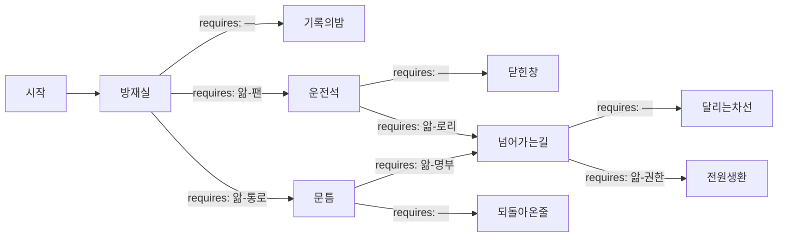

# 해원터널 — 하행 4.2km

## 1. 로그라인

밤 아홉 시, 해원터널 하행 4.2km에서 흰 연기가 오른다. 뒤로 2.7km까지 차 213대가 갇히고, 터널 안의 386명은 자기가 갇힌 줄도 모른 채 비상등만 켜 놓고 앉아 있다. 그 밤에 파견된 요원에게 허락된 것은 듣고, 조회하고, 부탁하는 일뿐이었고 — 첫 밤의 집계는 217이었다.

---

## 2. 그래프

### 노드

| id | 시각 | 장소 | yields |
|---|---|---|---|
| 시작 | 21:09 | 긴급상황대응실 파견석 | — |
| 방재실 | 21:22 | 해원터널 관리사무소 방재실 무전 | `21:15 무전에서 하성표는 제연 전량 정상이라고 말했다` / `하성표는 요청받은 것만 실행하고 요청받지 않은 것은 보고하지 않는다` |
| 운전석 | 21:47 | 하행 4.35km 탱크로리 운전석 통화 | `배한길은 무전에 응답하면서 차에서 내리지 않는다` / `배한길이 앉아 있는 동안 뒤차 사람도 내리지 않는다` |
| 문틈 | 21:55 | 하행 4.0km 3번 피난연결통로 앞 | `3번 문 안쪽에 파란 드럼통이 여덟 개 서 있다` / `3번 문은 통로 쪽으로 밀어 여는 문이다` |
| 넘어가는길 | 22:12 | 도로교통 상황센터 통화 | `채운모는 상행 차단을 검토하겠다고만 말한다` / `채운모는 지난 6월 이후 차단 판단을 혼자 내리지 않는다` |
| 기록의밤 | 21:26 | 하행 2.7~4.2km 전 구간 | `앎-팬` `앎-통로` `앎-로리` `앎-명부` + 미끼 셋 — §6 목록 참조 |
| 닫힌창 | 21:51 | 하행 4.35km | `배한길은 탱크가 열리는 것을 연기보다 무서워한다` / `배한길에게 적재물을 묻는 사람은 배한길을 움직이지 못한다` |
| 되돌아온줄 | 21:59 | 하행 4.0km · 3.75km | `드럼통은 안쪽에서 밀면 통로 바닥으로 넘어간다` / `여숙정은 자재를 치우러 오는 데 서른 분이 걸린다고 말한다` |
| 달리는차선 | 22:17 | 상행 3.9~3.5km | `앎-권한` |
| 전원생환 | 22:19 | 상행 3.75km 갓길 | — |

### 간선

| 출발 → 도착 | 모이는 스탠스 | requires |
|---|---|---|
| 방재실 → 기록의밤 | 제연을 최대로 · 진입 차단부터 · 차내 대기 방송 | — |
| 방재실 → 운전석 | 종방향 환기 정지 요청 | `앎-팬` |
| 방재실 → 문틈 | 통로 개방과 하차 방송 우선 요청 | `앎-통로` |
| 운전석 → 닫힌창 | 차 안에 있으라 · 당장 버리고 뛰라 · 미신고 적재로 입건된다 | — |
| 운전석 → 넘어가는길 | 지금은 묻지 않는다, 대신 뒤차에 외치게 한다 | `앎-로리` |
| 문틈 → 되돌아온줄 | 지금 와서 치우라 · 책임을 묻겠다 · 5번 문으로 우회 유도 | — |
| 문틈 → 넘어가는길 | 적치 배치를 불러 달라, 안쪽 사람이 민다 | `앎-명부` |
| 넘어가는길 → 달리는차선 | 상행 차단을 재촉 · 지연 책임 경고 · 통로 앞 대기 | — |
| 넘어가는길 → 전원생환 | 톨게이트 상황실에 직접 요청 | `앎-권한` |

이기는 경로는 둘이다.

- 환기를 멈춰 연기를 천장에 붙여 두고, 배한길을 먼저 내리게 해 뒤차 213대를 걷게 만든 다음, 상행을 세운다 — `앎-팬` `앎-로리` `앎-권한`.
- 환기에 손대지 않고 가까운 문을 열어 350m 안에서 빼낸 다음, 상행을 세운다 — `앎-통로` `앎-명부` `앎-권한`.

각 경로가 요구하는 앎은 셋이다. 인수인계 네 칸에 한 칸이 남고, 남는 한 칸이 미끼가 앉는 자리다.

---

## 3. 네 밤의 진행

**첫째 밤**

- 인수인계: 비어 있다. 앞선 요원이 없다.
- 도달: 방재실까지.
- 손이 닿지 않게 된 지점: 21:26. 요원의 요청대로 제연이 수동 최대로 올라간 순간. 이후 요원은 판단하지 않는다.
- 캘 수 있게 되는 것: `앎-팬` `앎-통로` `앎-로리` `앎-명부`. 미끼 셋도 같은 종이에 실려 온다.

**둘째 밤**

- 인수인계: `앎-팬` `앎-로리` — 두 칸.
- 도달: 방재실 → 운전석 → 넘어가는길.
- 손이 닿지 않게 된 지점: 22:17. 상행 차단이 필요한데 요원이 계속 채운모에게 말하고 있었고, 채운모는 검토한다고만 말한다.
- 캘 수 있게 되는 것: `앎-권한`. 상행이 23:10에 끝내 멈추기는 하는데, 멈춘 이유가 채운모가 아니었다는 사실이 기록에 남는다.

**셋째 밤**

- 인수인계: `앎-팬` `앎-로리` `앎-권한` — 세 칸.
- 도달: 방재실 → 운전석 → 넘어가는길 → 전원생환.
- 손이 닿지 않게 된 지점: 없다.
- 집계: 사망 0. 병원 이송 31, 전원 관찰 후 귀가. 남는 값은 목숨이 아닌 것으로 치러진다.

**넷째 밤**

여유분이다. 셋째 밤에 미끼를 한 칸 섞었거나 `앎-권한` 자리에 진입 차단 문장을 올렸으면 달리는차선에서 끊긴다. 넷째 밤은 그 한 번을 물릴 자리다. 다른 쓰임도 있다 — `앎-통로` `앎-명부` `앎-권한`을 올리면 배한길에게 한마디도 하지 않은 채 같은 386명이 걸어 나오는 밤을 볼 수 있다. 같은 집계, 다른 밤.

---

## 4. 인물

**하성표(53 · 해원터널 관리사무소 방재실 당직 실장)**

터널 안의 바람과 방송과 조명과 차단바를 쥔 사람. 넉 달 전 낙뢰 서지로 하행 제트팬 18대 가운데 7대가 죽었고, 죽은 7대는 하필 3.0km에서 4.5km 사이에 몰려 있다. 교체 예산은 다음 회계연도로 밀렸다. 하성표는 월간 점검표에 `부분 정상`이라고 적었고, 그 칸은 시스템에서 초록으로 뜬다.

- 아는 것: 일곱 대가 죽었다. 살아 있는 열한 대를 최대로 올리면 화점 부근에서 기류가 끊기고, 천장에 붙어 있던 연기층이 무너져 내린다.
- 모르는 것: 그날 밤 터널 안에 386명이 있다는 것. 배한길의 탱크에 무엇이 들었는지.
- 잃을 것: 넉 달치 점검표 전부.
- 이 사람에 관한 자리: 방재실.

**배한길(44 · 탱크로리 기사)**

하행 4.35km, 화점 바로 뒤 두 번째 차. 운송장에는 희석 세정제라고 적혀 있고 탱크에는 미신고 인화성 폐용제 12톤이 실려 있다. 두 달 전에도 같은 노선을 같은 방식으로 지났다.

- 아는 것: 탱크가 열리면 자기 인생이 끝난다. 상단 안전밸브가 언제부터 우는지.
- 모르는 것: 뒤차 사람들이 자기 비상등과 자기 뒤통수를 보고 아직 내릴 때가 아니라고 판단하고 있다는 것.
- 잃을 것: 면허, 차, 그리고 두 달 전 것까지.
- 이 사람에 관한 자리: 운전석.

**여숙정(58 · 해원방수 유지보수 반장)**

터널 도장과 방수 하도급. 자재를 사무소 창고까지 나르는 대신 3번과 4번 피난연결통로 안쪽에 세워 뒀다. 안전점검 사흘 전에만 치운다. 십일 년 동안 아무 일도 없었다.

- 아는 것: 어느 문 안쪽에 무엇이 몇 개 서 있는지. 파란 드럼통은 밑이 넓어 안쪽에서 밀면 통로 바닥으로 넘어간다는 것.
- 모르는 것: 3번 문이 정체 구간에서 가장 가까운 문이라는 것. 밤 아홉 시에 그 구간에 걷기 힘든 사람이 79명 서 있다는 것.
- 잃을 것: 계약. 십일 년.
- 이 사람에 관한 자리: 문틈.

**채운모(39 · 도로교통 상황센터 통제 담당)**

상행과 하행의 전광판과 진입 정보를 다루는 자리. 지난 6월, 오탐 하나로 상행을 막아 30km 정체를 만들었고 경고 처분을 받았다. 그때 알게 된 것을 그 뒤로 아무에게도 말하지 않았다 — 상행 진입차단바 조작 권한은 애초에 상황센터에 없었다. 6월의 그 차단은 월권이었다.

- 아는 것: 상행을 세우는 손은 해원 IC 톨게이트 상황실에 있다. 전화 한 통이면 된다.
- 모르는 것: 하행에서 사람이 이미 통로를 넘어 상행 갓길로 나오고 있다는 것.
- 잃을 것: 6월 건이 다시 열리면 경고로 끝나지 않는다.
- 이 사람에 관한 자리: 넘어가는길.

**요원 — 기본 성향**

권한 밖의 일을 자기 손으로 하려 들지 않는다. 손에 쥔 것 가운데 가장 확실한 사실을 가장 빨리 실행할 수 있는 사람에게 건다.

---

## 5. 게이트

### 방재실 — 21:22 · 해원터널 관리사무소 방재실 무전 · 등장 조건 없음

파견석 모니터에 하행 4.2km 카메라가 떠 있다. 냉동탑차 적재함 뒤쪽에서 흰 연기가 곧게 오른다. 곧게 오른다는 것은 아직 바람이 약하다는 뜻이다. 연기는 천장에 닿아 옆으로 퍼지고, 퍼진 층은 차 지붕 위 1.5m쯤에서 평평하게 멈춰 있다. 그 아래로 차량 지붕이 줄지어 보인다. 브레이크등, 비상등, 비상등, 비상등. 내리는 사람은 없다.

무전이 열린다. 방재실 당직 실장 하성표. 목소리가 빠르고 문장이 짧다. 제연은 자동 모드로 돌고 있고, 화재 감지 구간은 4.2, 살수는 대기, 진입 차단바는 21:19에 내렸다고 보고한다. 마지막에 한 줄을 덧붙인다. 제연 설비 전량 정상, 수동 최대 전환 대기 중.

파견석 오른쪽 창에 방재시설 대장이 떠 있다. 하행 제트팬 18대. 피난연결통로 27개소, 250m 간격. 대장 아래에 실시간 상태등이 한 줄로 늘어서 있다. 상태등은 사무소에서 올려 보내는 값을 그대로 받아 그린다.

터널 안에서는 아무 일도 일어나지 않는 것처럼 보인다. 4.2km 지점만 빼면 차들은 얌전히 서 있고, 사람들은 창을 닫고 라디오를 듣는다. 그 얌전함이 몇 분짜리인지는 화면에 적혀 있지 않다.

**요원에게: 무엇을 먼저 요청하는가.**

- **제연을 최대로** — 연기를 출구 쪽으로 밀어내는 것이 교과서다. 하성표는 요청받는 즉시 올린다. → 기록의밤
- **진입 차단부터** — 21:19 차단바가 21:24에 다시 올라간다. 안으로 더 들어오는 차를 먼저 끊는다. → 기록의밤
- **차내 대기 방송** — 시야가 살아 있을 때 함부로 내리게 하면 사람이 차 사이에서 깔린다. 창 닫고 대기. → 기록의밤
- **종방향 환기 정지 요청** — 죽은 일곱 대가 어디 있는지 알면 열한 대를 올리는 일이 무슨 짓인지 안다. 팬을 세우고 저풍속을 유지해 연기층을 천장에 붙여 둔다. → 운전석 · requires `앎-팬`

### 운전석 — 21:47 · 하행 4.35km 탱크로리 운전석 통화 · 등장 조건: 제연이 수동 최대로 올라가지 않았을 것

연기층은 아직 천장에 있다. 4.2km 화점 위로 검은 띠가 두껍게 깔리고, 그 아래 공기는 아직 보인다. 사람들은 이 광경을 견딜 만하다고 읽는다. 견딜 만하다는 판단이 지금 이 밤에서 가장 위험한 물건이다.

차량 등록 조회로 화점 뒤 두 번째 차량의 번호와 소유주 연락처가 나온다. 배한길. 신호가 잡힌다. 배한길은 두 번째 신호음에서 받는다. 목소리가 멀쩡하다. 연기 봤고, 창 닫았고, 앞이 뚫리면 바로 나가겠다고 말한다.

4.35km 카메라. 로리 운전석 문은 닫혀 있고 비상등이 규칙적으로 깜빡인다. 뒤로 스물몇 대가 붙어 있다. 그 스물몇 대의 운전자들이 사이드미러로 같은 것을 본다 — 앞에 선 큰 차의 기사가 아직 앉아 있다. 뒤차 사람이 내리지 않는 이유가 화면에 그대로 그려져 있다.

배한길은 통화를 끊지 않는다. 몇 분째 붙잡고 있다. 앞이 뚫리느냐고 두 번 묻는다. 견인이 언제 들어오느냐고 한 번 묻는다. 자기 적재물에 대해서는 묻지도 않고 말하지도 않는다.

**요원에게: 배한길에게 무엇을 말하는가.**

- **차 안에 있으라** — 지금 내리면 차선 사이에서 밟힌다. 창 닫고 엔진 끄고 대기. → 닫힌창
- **당장 버리고 뛰라** — 차는 보험으로 해결된다. 지금 나와서 입구 쪽으로 걸어라. → 닫힌창
- **미신고 적재로 입건된다** — 운송장과 실물이 다르면 지금 이 순간이 형사 사건이다. 협조하라. → 닫힌창
- **지금은 묻지 않는다, 대신 뒤차에 외치게 한다** — 탱크에 무엇이 들었는지 안다고 말하고, 오늘 밤 그 얘기는 하지 않겠다고 말하고, 대신 차에서 내려 뒤로 걸으며 소리치라고 부탁한다. 배한길이 내리는 순간 스물몇 대가 따라 내린다. → 넘어가는길 · requires `앎-로리`

### 문틈 — 21:55 · 하행 4.0km 3번 피난연결통로 앞 · 등장 조건: 제연이 수동 최대로 올라가지 않았을 것, 그리고 하차 대피 방송이 나갔을 것

방송이 나간 지 이십 분이 지났다. 사람들이 차를 버리고 갓길로 나와 벽을 따라 걷는다. 연기층은 아직 머리 위 높은 곳에 있고, 비상 조명이 벽면 발끝 높이에서 초록으로 이어진다. 대피 유도등이 250m마다 3번, 4번, 5번을 가리킨다.

3.9km 카메라. 사람의 줄이 3번 문 앞에서 멈춘다. 앞에 선 남자가 손잡이를 당긴다. 문이 15cm쯤 열리다가 무언가에 걸려 선다. 남자가 두 번 더 당긴다. 같은 자리에서 선다. 문틈으로 파란색이 보인다. 남자가 문틈에 얼굴을 붙였다가 뒤로 물러난다. 줄이 웅성거리며 뒤로 접힌다.

3.75km. 4번 문 앞에서 같은 일이 반복된다. 줄이 두 갈래로 나뉘어 한쪽은 5번 쪽으로 걷기 시작하고, 한쪽은 자기 차로 돌아간다. 5번 문은 3.5km에 있다. 3번 문 앞에서 5번 문까지 500m다. 관광버스에서 내린 노인 몇이 갓길에 앉는다. 학원버스 인솔 강사가 아이들을 세워 인원을 센다. 두 번 센다.

작업 허가서 사본이 조회창에 올라온다. 시공사 해원방수. 현장 반장 여숙정. 항목란에 자재 임시 적치. 번호가 붙어 있다. 여숙정의 번호로 신호가 간다. 받는다. 자재 얘기가 나오기 전부터 목소리가 방어적이다.

**요원에게: 여숙정에게 무엇을 말하는가.**

- **지금 와서 치우라** — 사무소에서 현장까지 진입해 자재를 빼는 데 걸리는 시간을 여숙정이 계산해서 부른다. 서른 분. → 되돌아온줄
- **책임을 묻겠다** — 허가서에 적치가 명시돼 있지 않다. 여숙정이 말수를 줄인다. → 되돌아온줄
- **5번 문으로 우회 유도** — 500m다. 걸을 수 있는 사람은 걷는다. → 되돌아온줄
- **적치 배치를 불러 달라, 안쪽 사람이 민다** — 그 구간에 스스로 500m를 걷지 못하는 사람이 79명 서 있다고 말한다. 문 안쪽에 무엇이 어떤 순서로 서 있는지 지금 불러 달라고 부탁한다. 여숙정이 부른다. 드럼통 여덟, 밑이 넓고, 문은 통로 쪽으로 밀어 여는 문이다. → 넘어가는길 · requires `앎-명부`

### 넘어가는길 — 22:12 · 도로교통 상황센터 통화 · 등장 조건: 정체 구간 인원이 피난연결통로를 넘어 상행 쪽으로 이동을 시작했을 것

22:04에 4.35km에서 폭연이 있었다. 화구가 60m를 뻗었고 하행 라이닝 일부가 떨어졌다. 그 시각 그 자리 350m 안에는 아무도 없었다. 지금 하행에 남은 것은 빈 차 213대와 불이다.

사람들은 열린 문을 통해 상행으로 넘어가고 있다. 통로는 폭 1.2m, 길이 22m. 한 번에 한 줄로 지나간다. 상행 3.9km, 3.75km, 3.5km 세 곳에서 사람이 갓길로 나온다.

상행 카메라. 상행은 아무 일도 없다. 화물차와 승용차가 시속 88로 흘러간다. 상행 운전자들은 하행에서 무슨 일이 있는지 모른다. 통로 문에서 나온 사람이 갓길에 서고, 뒤에서 밀려 나온 사람이 갓길 폭을 넘고, 갓길 폭은 2.5m다. 22:09 카메라에 이미 흰옷 하나가 1차로 선 안쪽에 서 있다.

상황센터 통제 담당 채운모와 연결된다. 채운모는 하행 상황은 인지하고 있다고 말한다. 상행 차단 얘기를 꺼내면 문장이 길어진다. 확인해 보겠다, 절차가 있다, 관계 기관 협의가 필요하다. 협의라는 단어가 두 번 나온다. 통화 대기음이 한 번 걸리고 다시 돌아온다. 검토 중이라고 말한다. 카메라에서는 사람이 계속 갓길로 나온다.

**요원에게: 상행을 어떻게 세우는가.**

- **상행 차단을 재촉** — 지금 몇 명이 갓길에 서 있는지 숫자로 밀어붙인다. 채운모가 다시 검토라고 답한다. → 달리는차선
- **지연 책임 경고** — 사람이 치이면 상황센터 기록이 남는다고 말한다. 채운모가 조용해진다. → 달리는차선
- **통로 앞 대기** — 상행이 위험하니 하행 통로 앞에서 멈춰 세운다. 뒤에서 계속 밀려온다. → 달리는차선
- **톨게이트 상황실에 직접 요청** — 상행 진입차단바와 3.9km 가변전광판을 쥔 손이 해원 IC 톨게이트 상황실에 있다는 것을 안다. 채운모를 통하지 않고 그쪽으로 건다. 야간 근무자가 받는다. → 전원생환 · requires `앎-권한`

---

## 6. 결과 꼬리

### 기록의밤 — 첫 밤 · 21:26부터

가장 긴 꼬리다. 이 밤에 요원은 딱 한 번 입을 열었고, 그 한 번이 옳은 말이었다.

**21:26.** 하성표가 수동 최대로 전환한다. 방재실 스위치가 세 번에 나눠 올라간다. 요원의 무전은 여기서 끝난다. 이후 파견석에서 나가는 신호는 없다. 화면은 그대로 켜져 있다.

**21:27.** 팬이 돈다. 소리가 화면 밖에서도 들린다. 하행 0.8km부터 2.8km까지 여섯 대, 4.8km부터 6.4km까지 다섯 대. 3.0km와 4.5km 사이 일곱 대는 소리를 내지 않는다.

**21:29.** 3.6km 카메라. 천장에 평평하게 깔려 있던 연기층 가장자리가 흔들린다. 뒤에서 밀려온 공기가 화점 부근에서 갈 곳을 잃고, 연기층 아래로 말려 들어간다. 층이 무너지는 데 걸리는 시간은 40초다.

**21:31.** 4.2km에서 2.7km까지 1.5km 구간이 회색으로 덮인다. 카메라 열한 대가 차례로 흰 화면이 된다. 마지막까지 그림이 남은 카메라는 2.7km 것이고, 거기에는 차 문이 열리는 장면이 찍혀 있다.

**21:33.** 사람들이 내린다. 시야가 팔 길이다. 벽면 유도등이 보이지 않는다. 어떤 사람은 입구 쪽으로 걷고, 어떤 사람은 출구 쪽으로 걷는다. 출구 쪽으로 걸으면 화점이다. 걷는 방향을 정해 주는 목소리는 이 밤에 없다.

**21:36.** 3번 문. 사람들이 손잡이를 당긴다. 15cm에서 걸린다. 문틈에 손을 넣어 흔든다. 뒤에서 밀린다. 문은 그대로다.

**21:39.** 4번 문. 같다.

**21:43.** 5번 문이 열린다. 폭 1.2m. 뒤에서 200명 넘게 밀려온다. 문지방에서 사람이 넘어지고 그 위로 사람이 얹힌다. 통로 입구에서 열아홉 명이 압착으로 사망한다. 통로 반대쪽으로 나간 사람은 마흔 남짓이다.

**21:47.** 관광버스. 계단 세 칸을 못 내려가는 사람이 여럿이다. 기사가 문을 열어 놓고 내려가 몇을 부축해 내린 뒤 다시 올라간다. 버스 안에 스물아홉이 남는다.

**21:52.** 학원버스. 인솔 강사가 아이들을 두 줄로 세워 차 사이로 걷게 한다. 3번 문에서 되돌아온다. 강사가 아이들을 버스로 돌려보내고 창문을 전부 닫게 한다. 버스가 가장 오래 버틴 공간이 된다.

**21:55.** 배한길. 창을 5cm 내리고 있다. 무전에 응답한다. 나는 차 지킨다고 말한다. 뒤에서 두 번 응답이 온다. 그 뒤로는 오지 않는다.

**21:58.** 로리 탱크 상단 안전밸브가 운다. 배한길이 문을 연다. 여덟 걸음을 걷고 방향을 잃는다.

**22:04.** 폭연. 4.35km. 화구가 60m를 뻗는다. 앞뒤 40여 대가 연쇄로 붙는다.

**22:11.** 4.1km 라이닝 콘크리트가 떨어진다. 3.9km까지 낙석이 이어진다.

**22:20.** 소방 선착대가 출구 6.8km에서 재진입을 시도한다. 화점까지 2.6km. 호스 연장 한계가 걸린다.

**22:48.** 상행에서 넘어 들어간 구조대가 5번 문에 도달한다. 문 안쪽에서 사람을 꺼내기 시작한다.

**23:20.** 첫 생존자 인출. 학원버스에서 열한 명.

**03:20.** 집계가 닫힌다.

#### 그 밤에 도착한 보고서

요원은 21:26 이후 판단하지 않는다. 대신 일정한 간격으로 종이가 온다. 본 것과 들은 것만 적혀 있다.

**21:34 보고**

> 방재실 화면 촬영본 첨부. 하행 제트팬 상태 표시등 열여덟 칸 가운데 초록 열한 칸, 회색 일곱 칸. 회색 칸의 번호는 9, 10, 11, 12, 13, 14, 15. 같은 시각 무전에서 방재실 당직 실장은 제연 설비 전량 정상이라고 말했다. 9번부터 15번까지는 3.0km와 4.5km 사이에 설치되어 있다.

**21:51 보고**

> 3번 문과 4번 문에서 사람의 줄이 되돌아옴. 3번 문 개방 폭 15cm에서 정지. 문틈 촬영본에 파란색 드럼통 여덟 개. 앞줄 드럼통 옆면 라벨에 해원방수, 그 아래 여숙정. 4번 문 개방 폭 20cm. 안쪽에 비계 파이프 다발. 5번 문은 정상 개방됨. 5번 문까지 3번 문 앞에서 500m.

**22:09 보고**

> 4.35km 차량 운전자 배한길과의 마지막 교신 녹취. 전문 옮김. — 앞이 뚫리면 나간다. 나는 차 지킨다. 탱크 열리면 나는 끝난다. 세정제 아니다. 열두 톤이다. 폐용제다. 그러니까 견인 오면 문 열지 말라고 전해라. — 교신 종료 21:56. 운송장 사본 조회 결과 품목란은 희석 세정제, 수량 12,000L.

**22:40 보고**

> 상행 터널 주행 상황. 22:31까지 정상 주행 유지. 평균 88km/h. 5번 문 반대쪽으로 나온 인원 가운데 넷이 상행 1차로에서 차량과 접촉. 22:31 이후 상행 감속 개시. 상행 차단 완료 시각 23:10. 차단 조작은 해원 IC 톨게이트 상황실 야간 근무자가 수행함.

**23:12 보고**

> 소방 진입 기록. 출구 6.8km 진입, 화점까지 2.6km. 호스 연장 한계 1.6km. 진입 차단바는 21:19 하강, 21:24 재상승, 21:41 재하강. 재상승 사유란에 견인차 진입 요구. 터널 내 소화전 3-14호 및 3-15호 수압 규정 미달로 표시됨.

**23:55 보고**

> 하행 진입 명부 조회 결과. 21:04 기준 2.7km와 4.2km 사이 차량 213대. 탑승 인원 386명. 학원 통학버스 2대에 중학생 41명과 인솔 2명. 관광버스 1대에 38명과 인솔 1명. 65세 이상 51명. 보행 보조기구 사용 7명. 자력으로 500m 이상 보행이 어려운 인원 합계 79명.

**03:20 보고**

> 사망 217. 그 가운데 5번 문 압착 19, 폭연 및 연소 58, 나머지는 일산화탄소와 시안화수소 중독. 관광버스 탑승 39명 중 사망 31. 학원 통학버스 탑승 43명 중 사망 12. 중상 41. 병원 이송 96. 하행 4.35km 차량 적재물 분석 결과 인화성 폐용제로 확인. 해원터널 하행 전 구간 폐쇄. 재개통 미정.

#### 이 꼬리에서 캘 수 있는 문장

앎으로 굳는 것 — 넷.

- `앎-팬` — `하행 제트팬 18대 가운데 9번부터 15번까지 일곱 대가 죽어 있다. 죽은 일곱 대는 화점 양옆에 몰려 있다.`
  - 약한 세기: `방재실 상태등에 초록이 열한 칸, 회색이 일곱 칸이었다.`
  - 강한 세기: `열한 대를 최대로 올리면 화점 부근에서 기류가 끊기고 연기층이 무너진다. 무너지는 데 40초 걸린다.`
- `앎-통로` — `3번 문과 4번 문 안쪽에 해원방수 여숙정의 자재가 서 있다. 정체 구간에서 가장 가까운 문 둘이 열리지 않는다.`
  - 약한 세기: `3번 문은 15cm에서 걸린다.`
  - 강한 세기: `3번 문 앞에서 열리는 문까지 500m다. 그 500m를 못 걷는 사람이 있다.`
- `앎-로리` — `4.35km 탱크로리 적재물은 희석 세정제가 아니라 인화성 폐용제 12톤이다. 배한길은 그 사실 때문에 차를 떠나지 않는다.`
  - 약한 세기: `배한길은 차를 지킨다고 말하고 내리지 않는다.`
  - 강한 세기: `배한길이 앉아 있는 동안 뒤차 스물몇 대는 내리지 않는다. 배한길이 내리면 따라 내린다.`
- `앎-명부` — `2.7km에서 4.2km 사이에 386명이 있고, 그 가운데 79명은 500m를 스스로 걷지 못한다.`
  - 약한 세기: `정체 구간에 버스 3대가 있다.`
  - 강한 세기: `관광버스 한 대에서만 서른한 명이 계단 세 칸을 못 내려갔다.`

미끼로 굳는 것 — 셋. 전부 그래프 위 어딘가에 닿는다.

- `하행 진입 차단바가 21:24에 다시 올라갔다. 사유는 견인차 진입 요구다.` → 방재실에서 진입 차단 스탠스로 모여 기록의밤.
- `터널 내 소화전 3-14호와 3-15호는 수압이 규정에 못 미친다.` → 방재실에서 제연 최대 스탠스로 모여 기록의밤. 넘어가는길에서는 재촉 스탠스로 모여 달리는차선.
- `소방은 출구에서 진입했고 화점까지 2.6km이며 호스 연장 한계는 1.6km다.` → 방재실에서 차내 대기 스탠스로 모여 기록의밤.

### 닫힌창 — 21:51부터

배한길이 내리지 않는다. 요원의 손은 21:51에 떨어진다.

연기층은 천장에 남아 있다. 이 밤에 사람이 죽는 이유는 연기가 아니라 시간이다. 아무도 내리지 않는다. 21:58 안전밸브가 울고, 배한길은 그때야 문을 연다. 이번에는 시야가 있다. 배한길은 300m를 뛰어 살아남는다. 뒤차 스물몇 대의 사람들은 배한길이 뛰는 것을 보고서야 문을 연다. 22:04까지 6분이 남아 있다. 6분에 200m를 걷는다.

22:04 폭연. 화구 60m. 그 안쪽에서 78명이 사망한다. 폭연 이후 연기가 대량으로 쏟아지고, 그때부터는 성층이고 뭐고 없다. 3번 문과 4번 문은 여전히 열리지 않는다. 5번 문 앞에서 다시 줄이 접힌다. 이번에는 압착 사망이 없다 — 앞선 200명이 이미 통과한 뒤였다.

**22:22 보고**

> 4.35km 운전자 하차 시각 21:58. 안전밸브 개방음 이후. 하차 이전 요청 4회 모두 응답은 있었으나 하차 없음. 운전자 진술 요지 — 탱크가 열리는 것이 무서웠다. 연기는 천장에 있었고 견딜 만해 보였다.

**23:40 보고**

> 사망 138. 중상 44. 병원 이송 154.

캘 수 있는 문장.

- `배한길은 탱크가 열리는 것을 연기보다 무서워한다.`
- `배한길에게 적재물을 묻는 사람은 배한길을 움직이지 못한다. 묻지 않겠다고 말하는 사람만 움직인다.`

### 되돌아온줄 — 21:59부터

문이 열리지 않는다. 요원의 손은 21:59에 떨어진다.

여숙정은 서른 분이 걸린다고 말했고, 실제로 43분이 걸린다. 그동안 사람들은 5번 문 쪽으로 500m를 걷거나 자기 차로 돌아간다. 79명은 갓길에 앉는다. 관광버스에서 내렸던 사람들이 다시 버스로 올라간다.

22:04 폭연. 350m 밖이라 직접 사상은 적다. 폭연 뒤에 연기가 아래로 쏟아지면서 갓길에 앉아 있던 사람들이 그 자리에서 덮인다. 22:42 여숙정의 인부 둘이 상행에서 통로를 통해 들어와 3번 문 드럼통을 밀어낸다. 안쪽에서 미니까 세 번에 넘어간다. 드럼통을 밀어내는 데 걸린 시간은 4분이다.

**22:50 보고**

> 3번 문 개방 완료 22:46. 드럼통 여덟 개 제거에 소요된 시간 4분. 제거 방식은 통로 안쪽에서 밀어 넘김. 문은 통로 쪽으로 밀어 여는 구조로, 개방을 막고 있던 것은 문짝에 가장 가까이 선 드럼통 두 개뿐이었다.

**23:35 보고**

> 사망 96. 중상 51. 병원 이송 203. 사망자 가운데 61명이 3번 문과 4번 문 사이 갓길에서 발견됨.

캘 수 있는 문장.

- `드럼통은 안쪽에서 밀면 통로 바닥으로 넘어간다. 문짝에 붙은 두 개만 치우면 문이 열린다.`
- `여숙정은 자재를 치우러 오는 데 서른 분이 걸린다고 말한다. 실제로는 43분이 걸렸다.`

### 달리는차선 — 22:17부터

상행이 서지 않는다. 요원의 손은 22:17에 떨어진다.

하행 사람들은 살아서 나온다. 그 대신 상행 갓길로 나온다. 갓길 폭 2.5m에 세 곳에서 400명 가까이가 쏟아진다. 22:19부터 22:31까지 12분 동안 1차로에 사람이 선다. 상행 차량은 시속 88로 커브를 돌아 나온다. 첫 접촉이 22:21, 마지막이 22:29.

채운모는 22:24까지 검토라고 말한다. 22:26에 협의 요청 공문을 기안한다. 22:31에 상행 차량들이 스스로 감속하기 시작하는데, 앞차가 사람을 보고 급제동한 것이 뒤로 전달된 결과다. 23:10 상행 차단 완료. 차단바를 내린 것은 해원 IC 톨게이트 상황실 야간 근무자다. 근무자는 상황센터의 요청을 받지 않았고, 상행에서 내려오는 차량 무선과 112 신고를 듣고 스스로 눌렀다.

**23:18 보고**

> 상행 차단 완료 23:10. 조작 주체는 해원 IC 톨게이트 상황실. 조작 근거란에 자체 판단. 도로교통 상황센터의 협의 요청 공문 접수 시각은 23:22로, 차단 완료 이후다. 확인 결과 상행 본선 진입차단바와 3.9km 가변전광판의 조작 권한은 톨게이트 상황실에 있으며 상황센터에는 없다. 지난 6월 22일 상행 차단 건의 조작 주체도 톨게이트 상황실로 기록되어 있다.

**23:52 보고**

> 사망 19. 전원 상행 차선 내 차량 접촉. 중상 12. 병원 이송 88.

캘 수 있는 문장.

- `앎-권한` — `상행을 세우는 손은 해원 IC 톨게이트 상황실에 있다. 상황센터에는 없다. 전화 한 통이면 된다.`
  - 약한 세기: `상행 차단을 실제로 조작한 곳은 톨게이트 상황실이었다.`
  - 강한 세기: `채운모는 상행을 세울 수 없다. 6월에도 못 세웠다. 검토라는 말은 권한이 없다는 뜻이다.`

---

## 7. 집계

단위는 사람이다. 세 단위로 닫는다 — 사망, 중상, 병원 이송. 목숨이 아닌 값은 따로 적는다.

| 종단 | 사망 | 중상 | 병원 이송 | 목숨이 아닌 값 |
|---|---|---|---|---|
| 기록의밤 | 217 | 41 | 96 | 하성표 허위 보고로 입건, 여숙정 적치로 입건, 배한길 사망으로 공소권 없음. 하행 전 구간 폐쇄, 재개통 미정 |
| 닫힌창 | 138 | 44 | 154 | 배한길 미신고 위험물 운송으로 구속, 하성표 입건. 하행 폐쇄 96일 |
| 되돌아온줄 | 96 | 51 | 203 | 여숙정 구속, 해원방수 계약 해지, 원청 영업정지 3개월. 하행 폐쇄 74일 |
| 달리는차선 | 19 | 12 | 88 | 채운모 직위 해제와 6월 건 재조사, 배한길 구속, 하성표 입건, 여숙정 입건. 하행 폐쇄 52일 |
| 전원생환 | 0 | 0 | 31 | 배한길 구속, 하성표 입건과 파면, 여숙정 입건과 계약 해지, 채운모 6월 건 재조사와 감봉. 하행 폐쇄 41일. 이송 31명 전원 관찰 후 귀가 |

전원생환은 세 단위 모두에서 가장 낮다. 목숨이 아닌 값은 오히려 전원생환에서 가장 많다 — 사람이 살아남으면 진술이 남고, 진술이 남으면 넉 달치 점검표가 열린다.

---

## 8. 고정 타임라인

경로와 무관하게 일어나는 행만 적는다.

| 시각 | 표면 | 장소 | 사건 |
|---|---|---|---|
| 21:04 | 통화 | 하행 4.2km | 신고 접수. 앞차 뒤로 흰 연기가 오른다는 내용 |
| 21:06 | 통화 | 하행 3.8km | 두 번째 신고. 관광버스 인솔자. 차가 십 분째 서 있다고 말함 |
| 21:07 | CCTV | 하행 4.2km | 냉동탑차 적재함 후미에서 흰 연기. 연기가 곧게 오름. 뒤로 정지 차량 행렬 |
| 21:09 | 현장 | 긴급상황대응실 파견석 | 요원 도착 |
| 21:11 | 문서 | 해원터널 방재시설 대장 | 하행 제트팬 18대. 피난연결통로 27개소, 250m 간격. 통로 폭 1.2m, 길이 22m |
| 21:13 | CCTV | 하행 3.9km | 비상등만 켜진 차량 행렬. 내리는 사람 없음 |
| 21:15 | 통화 | 방재실 | 하성표. 제연 자동 모드, 살수 대기, 제연 설비 전량 정상, 수동 최대 전환 대기 |
| 21:17 | CCTV | 하행 4.35km | 탱크로리 정지. 운전석 문 닫힘. 비상등 점멸 |
| 21:19 | 문서 | 진입 차단 기록 | 하행 입구 차단바 하강 |
| 21:20 | CCTV | 하행 4.0km | 3번 피난연결통로 표시등 점등 |
| 21:22 | 통화 | 방재실 ↔ 파견석 | 하성표가 수동 최대 전환 여부를 묻는다 |
| 21:24 | 문서 | 진입 차단 기록 | 차단바 재상승. 사유란에 견인차 진입 요구 |
| 21:33 | 현장 | 하행 출구 6.8km | 소방 선착대 진입 개시. 화점까지 2.6km |
| 21:41 | CCTV | 상행 3.9km | 상행 정상 주행. 평균 88km/h |
| 21:58 | 문서 | 유지보수 작업 허가서 | 시공사 해원방수, 반장 여숙정. 항목란에 자재 임시 적치 |
| 22:04 | 현장 | 하행 4.35km | 탱크 폭연. 화구 60m |

---

## 9. 자기 검사

### §4 열두 항목

1. **노드마다 시각이 다르다.** 21:09 · 21:22 · 21:26 · 21:47 · 21:51 · 21:55 · 21:59 · 22:12 · 22:17 · 22:19. 열 개 전부 다르다.
2. **게이트마다 requires가 빈 간선은 정확히 하나이고, 빈 간선이 곧 실패 간선이다.** 방재실은 기록의밤 하나, 운전석은 닫힌창 하나, 문틈은 되돌아온줄 하나, 넘어가는길은 달리는차선 하나. 나머지 간선은 전부 requires를 갖는다.
3. **첫 밤은 게이트 하나만 지나고 실패한다.** 시작 → 방재실 → 기록의밤. 방재실의 나머지 두 간선이 요구하는 `앎-팬`과 `앎-통로`는 재난이 03:20까지 흘러간 뒤 도착하는 보고서에서만 나온다. 첫 밤에는 상태등이 초록으로 보이고, 문은 아직 아무도 당겨 보지 않았다.
4. **열쇠는 문 뒤에 있다.** `앎-팬`과 `앎-통로`는 방재실 앞에 노드가 없으므로 자동으로 만족한다. `앎-로리`는 시작·방재실·운전석 어느 노드도 yield하지 않는다 — 운전석은 배한길이 내리지 않는다는 것까지만 내놓는다. `앎-명부`는 시작·방재실·문틈이 yield하지 않는다 — 문틈은 드럼통 개수와 문 여는 방향까지만 내놓는다. `앎-권한`은 시작·방재실·운전석·문틈·넘어가는길 어디에서도 나오지 않고 달리는차선의 23:18 보고서에서만 나온다.
5. **성공에 이르는 경로는 둘이다.** 환기를 세워 시간을 벌고 배한길을 먼저 내리게 하는 길, 환기에 손대지 않고 가까운 문을 여는 길. 살리는 사람은 같은 386명이다.
6. **이기는 경로의 requires 합이 넷 이하다.** 한쪽은 `앎-팬` `앎-로리` `앎-권한`으로 셋, 다른 쪽은 `앎-통로` `앎-명부` `앎-권한`으로 셋. 네 칸에 한 칸이 남는다.
7. **셋째 밤 안에 성공이 열린다.** 첫 밤의 꼬리가 앎을 넷 내놓는다. 둘째 밤에 두 칸을 채워 넘어가는길까지 가고, 거기서 나온 `앎-권한`을 더해 셋째 밤에 닫는다.
8. **집계는 마지막으로 밟은 노드가 정한다.** 성공 경로 둘은 넘어가는길에서 합쳐져 같은 전원생환으로 들어가므로 같은 집계를 받는다. 경로를 묻는 자리는 없다.
9. **한 게이트가 두 집계 단위를 반대 방향으로 결정하지 않는다.** 네 게이트 어디에도 이쪽을 살리면 저쪽이 죽는 간선이 없다. 배한길을 내리게 하는 것은 뒤차 사람도 살린다. 문을 여는 것은 걷지 못하는 79명을 살린다. 상행을 세우는 것은 하행 사람을 살리고 상행 운전자의 사고도 없앤다.
10. **모든 집계 단위가 동시에 최선인 경로가 있다.** 전원생환은 사망 0, 중상 0, 이송 31로 세 단위 전부 최저다. 입건과 폐쇄 일수는 집계 단위가 아니라 목숨이 아닌 값으로 따로 적었다.
11. **yields가 실려 나른다.** `앎-팬`은 21:34 보고서의 상태등 촬영본과 하성표의 21:15 무전이, `앎-통로`는 21:51 보고서의 문틈 촬영본과 드럼통 라벨이, `앎-로리`는 22:09 보고서의 교신 녹취 전문이, `앎-명부`는 23:55 보고서의 진입 명부 조회 결과가, `앎-권한`은 23:18 보고서의 차단 조작 주체란이 싣는다. 어디에도 실리지 않은 앎은 두지 않았다.
12. **실패한 뒤에는 어떤 자리도 열리지 않는다.** 기록의밤 뒤에 남은 자리는 운전석·문틈·넘어가는길 셋인데, 앞의 둘은 제연이 수동 최대로 올라가지 않았을 것을 달고 있어 성립하지 않고, 넘어가는길은 사람이 통로를 넘어 상행으로 나왔을 것을 달고 있는데 21:31에 시야가 사라진 뒤 3번과 4번 문은 끝내 열리지 않았고 5번 문으로 나간 마흔 남짓은 구조대에 인계되었을 뿐 이동을 시작한 인원이 아니다. 닫힌창 뒤에 남은 자리는 문틈과 넘어가는길인데, 문틈은 하차 대피 방송이 나갔을 것을 요구하고 이 경로에서는 방송이 나가지 않았다. 넘어가는길도 같은 이유로 성립하지 않는다. 되돌아온줄 뒤에 남은 자리는 넘어가는길 하나인데, 22:46까지 문이 열리지 않았으므로 22:12에 상행으로 넘어간 사람이 없다. 달리는차선 뒤에 남은 자리는 없다.

### §6 여덟 항목

1. **글자를 입력하는 장치.** 없다. 인수하는 것은 앞 밤의 보고서에서 뽑은 문장이고, 뽑는 자리는 네 칸이다.
2. **믿음을 되돌리는 비트.** 없다. 어떤 인물도 요원이 넘겨받은 내용을 부인하거나 회수하지 않는다. `앎-팬`을 뒤집는 것은 반대 내용의 문장뿐이고 그런 문장은 어디에도 두지 않았다.
3. **순서와 우선순위 장치.** 없다. 네 칸은 동등하고, 어느 칸에 무엇이 앉는지가 결과를 바꾸지 않는다.
4. **감정 묘사나 인용에 기대야만 열리는 경로.** 없다. 다섯 앎은 전부 사실 진술이다 — 팬 일곱 대가 죽었다, 문 안쪽에 드럼통이 있다, 탱크에 폐용제 12톤이 있다, 79명이 500m를 못 걷는다, 차단 권한은 톨게이트에 있다.
5. **요원의 대답을 전제하는 고정 장면.** 없다. 하성표가 수동 최대를 묻는 21:22, 배한길이 견인을 묻는 21:47, 여숙정이 전화를 받는 21:55, 채운모가 검토라고 말하는 22:12 — 요원의 말이 필요한 네 순간을 전부 게이트로 만들었다. 고정 타임라인은 21:22 이후로 소방 진입, 상행 주행, 허가서 사본, 폭연 넷만 남겼고 넷 다 요원의 말을 요구하지 않는다.
6. **밖에서 보는 사람을 인지하는 장면.** 없다. 그 밤의 누구도 파견석을 알지 못한다. 하성표에게 요원은 본부 무전이고, 배한길에게는 걸려 온 전화다.
7. **플레이어에게 닿는 글의 게임 어휘.** 장면 산문, 결과 꼬리, 보고서, 캘 수 있는 문장 목록, 고정 타임라인에는 설계 어휘를 넣지 않았다. 노드 이름도 그날 안의 말로 지었다 — 방재실, 운전석, 문틈, 넘어가는길, 기록의밤, 닫힌창, 되돌아온줄, 달리는차선, 전원생환.
8. **번역투.** 대명사 그·그녀·그것·그들을 쓰지 않았다. 피동 남용과 `~에 의해`를 쓰지 않았다. 소유격 연쇄, 수가 드러난 자리의 `-들`, `가장 ~한 것 중 하나`, 세미콜론, 문중 괄호를 쓰지 않았다. 자재 적치의 주어는 여숙정이고, 차단바를 내린 것은 톨게이트 야간 근무자다.
