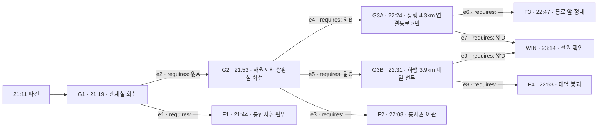

# 해원터널 — 그래프 선행 시험판 03

---

## 1. 로그라인

해원터널 하행 4.2km에서 흰 연기가 오르고, 뒤로 214대가 갇힌다. 요원이 가진 것은 회선 세 개와 조회 권한뿐이고, 그 밤에 요원이 믿은 화면은 두 달째 거짓이었다. 첫 밤의 집계는 118명이며, 그 숫자를 지우는 길은 죽은 사람이 남긴 말 속에만 있다.

---

## 2. 그래프

### 앎 넷

| 코드 | 앎 | 이 앎을 성립시키는 문장 | 성립시키지 못하는 약한 문장 |
|---|---|---|---|
| 앎A | 3구역 제연 팬은 6월 12일부터 정지 상태이고, 관제 화면의 정상 표시는 사람이 덮어 둔 값이다 | "3구역 제연 팬은 6월 12일 이후 한 번도 돌지 않았다. 화면의 정상 표시는 차은표가 손으로 넣은 값이다." | "차은표가 제연을 만지기 전에 정비 이력 화면을 두 번 열었다 닫았다." |
| 앎B | 연결통로 세 짝이 사슬로 묶여 있고, 열쇠는 관리동이 아니라 구본만의 트럭 조수석 서랍에 있다 | "연결통로 2·3·4번은 사슬과 자물쇠로 묶여 있다. 열쇠는 관리동 열쇠함이 아니라 구본만의 트럭 조수석 서랍에 있다." | "연결통로 문이 열리지 않는다는 무전이 두 번 있었다." |
| 앎C | 화물은 서류의 세정제가 아니라 우레탄 원료이고, 연기는 뜨거워 천장에 붙어 바닥 쪽 시야가 한동안 남는다 | "화물칸 라벨은 세정제가 아니라 우레탄 원료다. 연기는 뜨거워 천장에 붙고, 바닥에서 1.5m 아래는 스무 분 넘게 시야가 남았다." | "표기웅이 화물칸을 열지 말라고 세 번 말했다." |
| 앎D | 4.0km에서 4.6km까지 구내 방송 스피커는 3구역 배선과 함께 죽어 있어, 그 안에서는 어떤 방송도 들리지 않는다 | "4.0km에서 4.6km까지 스피커는 3구역 배선과 함께 끊겨 있다. 그 구간 안에서는 어떤 방송도 들리지 않는다." | "방송을 세 번 반복했으나 앞쪽 대열은 움직이지 않았다." |

### 노드 표

| id | 시각 | 장소 | yields |
|---|---|---|---|
| G1 | 21:19 | 관제실 회선 | 관제 화면은 전 구간 정상을 띄운다 / 차은표가 조작 전에 정비 이력 화면을 두 번 열었다 닫았다 / 사고 지점 뒤로 214대가 서 있다 / 신고자는 4.6km 승용차이고 연기는 이미 천장을 덮었다 |
| G2 | 21:53 | 해원지사 상황실 회선 | 상행 5.1km에 접촉사고 차량 두 대가 아직 갓길에 서 있다 / 21:03에 하행 우회 유지 결정이 문서로 올라갔다 / 4.35km 관광버스 승객 44명이 내렸다가 다시 탔다 / 대열 뒤쪽 3.4km까지는 시야가 남아 있다 |
| G3A | 22:24 | 상행 4.3km 연결통로 3번 | 통로 3번 손잡이에 사슬 자국이 남아 있다 / 구본만이 절단기를 들고 반대편 갓길에 서 있다 / 상행선 가압으로 통로 안쪽 공기가 하행으로 밀린다 / 통로에 붙은 사람 수가 스물을 넘지 않는다 |
| G3B | 22:31 | 하행 3.9km 대열 선두 | 3.9km 대열은 걷기 시작했고 4.1km 대열은 서 있다 / 소진아의 어머니는 산소통을 달고 있어 걸을 수 없다 / 관광버스 기사가 문을 열어 둔 채 운전석에 앉아 있다 / 4.2km 이후로는 육성이 닿지 않는다 |
| F1 | 21:44 | 통합지휘 편입 | — 종단 |
| F2 | 22:08 | 통제권 이관 | — 종단 |
| F3 | 22:47 | 통로 앞 정체 | — 종단 |
| F4 | 22:53 | 대열 붕괴 | — 종단 |
| WIN | 23:14 | 전원 확인 | — 종단 |

### 간선 표

| id | 출발 → 도착 | 모이는 스탠스 | requires |
|---|---|---|---|
| e1 | G1 → F1 | S1 화면대로 간다 / S2 출력을 절반으로 낮춰 시간을 번다 | — |
| e2 | G1 → G2 | S3 제연을 전부 세운다 / S4 제연을 세우고 상행 급기를 미리 걸어 둔다 | 앎A |
| e3 | G2 → F2 | S1 국도를 지킨다 / S2 본부로 판단을 올린다 | — |
| e4 | G2 → G3A | S3 상행선을 비우고 옆으로 건네보낸다 | 앎B |
| e5 | G2 → G3B | S4 하행 입구를 닫고 뒤로 걸어 나오게 한다 | 앎C |
| e6 | G3A → F3 | S1 열쇠를 기다린다 / S2 절단을 맡기고 방송으로 유도한다 | — |
| e7 | G3A → WIN | S3 방송을 버리고 통화 릴레이로 대열을 끌어당긴다 | 앎D |
| e8 | G3B → F4 | S1 방송으로 하차와 도보를 반복 지시한다 / S2 버스 기사에게 인솔을 맡기고 방송으로 뒷받침한다 | — |
| e9 | G3B → WIN | S3 말이 닿지 않는 구간을 인정하고 선착대 도보 진입과 통화 릴레이를 요청한다 | 앎D |

### 등장 조건

| 노드 | 조건 |
|---|---|
| G1 | 없음. 파견과 동시에 선다. |
| G2 | 21:40 기준 제연 전 구간 정지, 상행 급기 대기가 걸려 있을 것. |
| G3A | 22:10까지 상행 하행선 우회가 해제되고 상행 4.0~4.6km가 비어 있을 것. |
| G3B | 22:05까지 하행 입구 차단이 내려가고 뒤쪽 구간이 도보 가능으로 선언되어 있을 것. |
| WIN | G3A 또는 G3B를 통과했을 것. |

---

## 3. 네 밤의 진행

**첫 밤**
- 인수인계에 실린 것: 없다. 네 칸이 비어 있다.
- 간 데까지: 21:19 관제실 회선 하나.
- 손이 닿지 않게 된 자리: 21:44. 4.2km 부근에서 흐름이 무너지고 연기가 뒤로 밀린다. 소방 현장지휘가 통합지휘를 선포하고 모든 회선을 한 채널로 묶는다. 요원 회선은 청취 항목으로 편입되고, 그 뒤로 아무도 요원에게 묻지 않는다.
- 캐게 되는 것: 앎A · 앎B · 앎C. 셋 다 밤이 끝까지 흐른 뒤에 드러난다. 앎D의 약한 문장도 여기서 처음 나오지만 성립하지 않는다.

**둘째 밤**
- 인수인계에 실린 것: 앎A.
- 간 데까지: 21:19 관제실을 지나 21:53 지사 상황실까지.
- 손이 닿지 않게 된 자리: 22:08. 명주하가 하행 우회를 유지한 채 국도를 지키고, 상행선도 하행 입구도 요원의 요청 범위를 벗어난다. 본부가 통제권을 지사로 넘긴다.
- 캐게 되는 것: 앎D. 그리고 첫 밤에 놓친 앎B 또는 앎C를 보강한다.

**셋째 밤**
- 인수인계에 실린 것: 앎A · 앎B · 앎D. 또는 앎A · 앎C · 앎D.
- 간 데까지: 앎B를 실었으면 22:24 연결통로까지, 앎C를 실었으면 22:31 대열 선두까지.
- 손이 닿지 않게 된 자리: 없다. 23:14에 전원 확인이 닫힌다.
- 캐게 되는 것: 없다. 여기서 끝난다.

**넷째 밤**
- 여유분이다. 셋째 밤에 앎D 대신 미끼를 실었거나, 앎B의 약한 문장을 실었거나, 앎A를 빼먹고 앎B·앎C·앎D를 실어 첫 게이트에서 다시 떨어진 경우를 위한 자리다.
- 셋째 밤이 F3 또는 F4로 닫혔다면 그 꼬리가 남은 한 칸을 정확히 지목한다. 넷째 밤은 그 한 칸만 바꾸면 된다.

---

## 4. 인물

**차은표 (48 · 해원터널 관제실 야간 당직 주임)**
- 이해관계: 정년까지 2년. 아들이 같은 지사 계약직으로 3년째 재계약을 기다린다. 3구역이 죽은 것을 올리면 두 달 치 일지가 전부 다시 열린다.
- 아는 것: 3구역 제연 팬이 6월 12일부터 돌지 않는다. 정상 표시는 자기가 넣었다. 4.0~4.6km 방송 배선이 같은 반에서 끊겼다는 사실도 안다.
- 모르는 것: 화물이 무엇인지. 상행선 갓길에 사고 차량이 아직 서 있다는 것.
- 게이트: G1.

**명주하 (39 · 도로공사 해원지사 상황실 부팀장)**
- 이해관계: 21:03에 상행 접촉사고를 "정리 중"으로 올리고 하행 우회를 유지했다. 지금 상행선을 비우면 30분 전 판단이 문서로 남는다. 하행 입구를 닫으면 국도로 차가 쏟아지고, 국도는 지난겨울에도 같은 이유로 막혔다.
- 아는 것: 상행 갓길 사고 차량 두 대. 우회 결정의 서명자가 자기라는 것. 차단봉과 전광판을 지금 내릴 수 있다는 것.
- 모르는 것: 제연이 왜 안 도는지. 연결통로가 묶여 있다는 것.
- 게이트: G2.

**구본만 (61 · 터널 유지관리 하청 반장)**
- 이해관계: 봄에 연결통로 안 소화기와 배선 자재가 두 번 없어졌다. 그래서 통로 2·3·4번을 사슬로 묶고 열쇠를 트럭에 두었다. 6월에는 3구역 팬 점검을 나갔다가 부품이 없어 그냥 돌아왔고, 차은표와 같은 종이에 나란히 서명했다.
- 아는 것: 사슬. 열쇠 위치. 3구역 부품이 두 달째 안 왔다는 것.
- 모르는 것: 차은표가 화면 값을 손으로 넣었다는 것. 자기 서명이 그 값의 근거로 붙어 있다는 것.
- 게이트: G3A.

**소진아 (26 · 하행 4.35km 승용차 운전자)**
- 이해관계: 조수석에 어머니가 앉아 있고 무릎 위에 산소통이 있다. 차를 버리면 어머니를 두고 가는 것이다. 그래서 어떤 지시에도 문을 열지 않는다.
- 아는 것: 앞쪽 대열이 전혀 움직이지 않는다는 것. 자기 차 안에서는 어떤 방송도 들리지 않는다는 것. 뒤쪽 하늘이 아직 검지 않다는 것.
- 모르는 것: 방송이 안 들리는 이유. 4.2km 앞에 무엇이 서 있는지.
- 게이트: G3B.

**표기웅 (57 · 화물차 기사 · 사고 차량 운전자)**
- 이해관계: 사흘 연속 야간이고 운행일지는 두 칸이 비어 있다. 적재 서류에는 산업용 세정제라고 적혔지만 실은 발포 우레탄 원료다. 말하면 회사가 닫히고 본인도 남는다.
- 아는 것: 화물의 실체. 물을 뿌리면 안 되는 이유. 연기가 뜨겁게 뜬다는 것.
- 모르는 것: 뒤에 몇 대가 갇혔는지. 제연이 어떻게 도는지.
- 게이트: 없다. 앎C를 실어 나르는 사람이다. 첫 밤 22:58 화학구조대 라벨 판독과 표기웅의 이송 중 진술이 앎C의 두 갈래 출처다.

**이름 없이 지나가는 사람**
- 한마음복지관 나들이 버스. 하행 4.35km에 선다. 승객 41명, 인솔 2명, 기사 1명. 21:22에 문이 열리고 21:24에 다시 닫힌다. 어떤 밤에는 그 문이 다시 열리고 어떤 밤에는 열리지 않는다.
- 4.6km 승용차 신고자. 21:06에 전화를 걸고 21:52에 걸어서 출구로 빠져나간다. 사고 지점 앞쪽이라 어느 밤에도 죽지 않는다.

---

## 5. 게이트

### G1 · 21:19 · 관제실 회선 · 등장 조건 없음

관제실 회선이 열린다. 차은표가 먼저 상황판을 읽는다. 하행 4.2km 화물차 후미, 흰 연기, 화염은 아직 없음. 뒤로 선 차량 214대. 대열은 3.4km까지 이어지고 거기서부터는 아직 전조등이 보인다.

차은표가 제연 상태를 읽어 내려간다. 1구역 정상, 2구역 정상, 3구역 정상, 4구역 정상, 5구역 정상. 읽는 속도가 3구역에서 한 박자 빨라진다. 다음 문장으로 넘어가면서 마우스 소리가 두 번 난다. 이력 화면을 열었다가 닫는 소리다.

교과서는 한 줄이다. 종류환기, 정방향 전량. 연기를 사고 지점 앞쪽으로 밀어내고 뒤에 갇힌 대열 쪽 공기를 살린다. 차은표는 그 한 줄을 알고 있고, 지시만 오면 누른다. 지시를 기다리는 사람의 목소리는 조급하지 않다.

무전 너머로 화물차 쪽 소리가 얇게 들어온다. 누군가 화물칸 근처에서 말리는 소리, 문고리를 때리는 소리. 관제실 회선에는 그 말이 온전히 실리지 않는다.

**질문:** 제연을 어떻게 돌릴 것인가.

**스탠스**
- **S1 화면대로 간다** — 전 구간 정상이면 교과서대로다. 정방향 전량 가동을 요청한다. → e1
- **S2 시간을 번다** — 출력을 절반으로 낮춰 성층을 덜 흔들면서 밀어낸다. → e1
- **S3 세운다** — 제연을 전 구간 정지시킨다. 연기를 천장에 그대로 둔다. → e2
- **S4 세우고 옆을 연다** — 제연을 정지시키고, 동시에 상행선 급기를 대기로 걸어 둘 것을 요청한다. → e2

---

### G2 · 21:53 · 해원지사 상황실 회선 · 등장 조건: 21:40 기준 제연 전 구간 정지, 상행 급기 대기

연기는 천장에 붙어 있다. 4.2km에서 4.6km 사이 천장 아래 1m가 검고, 그 밑은 아직 회색이다. 바닥에서 1.5m 아래로는 전조등 불빛이 지나간다. 시간이 생겼다는 뜻이고, 시간이 얼마인지는 아무도 모른다.

명주하가 회선을 받는다. 목소리가 정확하고 문장이 짧다. 지금 하행선은 21:03부터 상행 우회 통행을 받고 있다. 상행 5.1km 접촉사고 정리가 끝나지 않아 상행 차량이 하행 갓길로 넘어오고 있고, 그래서 하행 입구를 닫으면 상행과 하행이 동시에 국도로 몰린다. 지난겨울 국도 정체는 여섯 시간이었다. 명주하가 그 숫자를 먼저 말한다.

상행선 쪽 CCTV가 뜬다. 상행 4.0km에서 4.6km 구간은 지금 텅 비어 있다. 하행과 상행 사이에는 500m 간격으로 연결통로가 있고, 도면상 4.3km에 3번 통로가 있다. 도면은 열려 있고 문은 아직 아무도 만지지 않았다.

동시에 하행 뒤쪽 3.4km 지점 CCTV. 대열 맨 뒤 차량이 아직 시동을 켜고 있다. 뒤에서 계속 새 전조등이 들어온다. 입구 차단봉은 올라가 있고, 전광판은 아직 전방 사고를 띄우지 않는다. 명주하 손 아래에 두 개의 버튼이 있고, 어느 쪽을 누르든 명주하는 무언가를 내놓는다.

**질문:** 갇힌 대열을 어디로 뺄 것인가.

**스탠스**
- **S1 국도를 지킨다** — 우회를 유지하고 하행 안쪽만 정리한다. 소방이 도착하면 넘긴다. → e3
- **S2 위로 올린다** — 본부에 판단을 올리고 지시를 기다린다. → e3
- **S3 옆으로 건넨다** — 상행 우회를 즉시 해제하고 상행 4.0~4.6km를 비운다. 연결통로로 건너보낸다. → e4
- **S4 뒤로 걷게 한다** — 하행 입구를 닫고 뒤쪽 구간을 도보로 선언한다. 대열을 뒤로 걸어 나오게 한다. → e5

---

### G3A · 22:24 · 상행 4.3km 연결통로 3번 · 등장 조건: 22:10까지 상행 우회 해제 및 상행 4.0~4.6km 소개 완료

상행선이 비었다. 상행 제연이 급기로 돌고, 3번 통로 문틈에서 하행 쪽으로 바람이 나간다. 문 반대편에 사람이 붙어 있다. 두드리는 소리가 규칙적이지 않고 여러 지점에서 동시에 난다.

문은 열리지 않는다. 상행 쪽 손잡이 아래에 사슬이 감겨 있고 자물쇠는 도난 방지용 원통형이다. 관리동 열쇠함에는 이 규격 열쇠가 없다. 구본만이 반대편 갓길에 트럭을 세우고 절단기를 꺼내 든다. 손이 떨리지는 않는다. 다만 절단기를 든 채 문 앞에 서서 아무 말도 하지 않는 시간이 15초쯤 있다.

문을 딴다고 끝나지 않는다. 지금 통로 3번에 붙은 사람은 스물이 안 된다. 4.2km 부근 대열 214대 가운데 문 앞까지 걸어온 인원이 스물이다. 나머지는 여전히 차 안에 앉아 있다. 구내 방송은 세 번 나갔다. 3.4km 대열은 방송을 듣고 차를 버렸고, 4.35km 관광버스는 문을 열지 않았다.

무전에 4.35km 승용차 통화가 겹쳐 들어온다. 소진아다. 방송이 나갔느냐고 묻는다. 나가고 있다고 답하자 잠시 조용하다가, 아무 소리도 안 들린다고 말한다. 통화는 끊기지 않는다.

**질문:** 문 앞에 오지 않은 사람을 어떻게 문 앞까지 오게 할 것인가.

**스탠스**
- **S1 기다린다** — 열쇠를 가져오게 하고 절차대로 연다. 방송을 계속 반복한다. → e6
- **S2 넘긴다** — 절단은 소방에 맡기고, 유도는 구내 방송으로 계속 돌린다. → e6
- **S3 회선을 바꾼다** — 구내 방송을 버린다. 소진아 통화를 살린 채 차창 릴레이로 앞뒤 차량에 육성으로 전달하게 하고, 동시에 라디오 재난 주파수 삽입을 요청한다. → e7

---

### G3B · 22:31 · 하행 3.9km 대열 선두 · 등장 조건: 22:05까지 하행 입구 차단 및 도보 구간 선언

하행 입구가 닫혔다. 뒤에서 새 차가 들어오지 않는다. 연기는 여전히 천장이고, 바닥 쪽으로는 앞이 보인다. 3.4km에서 3.9km 사이 대열은 이미 문을 열고 걷기 시작했다. 걷는 대열은 조용하고, 걸음이 빠르지도 느리지도 않다.

문제는 4.1km부터다. 그 앞으로는 아무도 내리지 않았다. 차량 전조등이 그대로 켜져 있고 브레이크등이 규칙적으로 밝아진다. 사람이 안에 앉아 있다는 뜻이다. 방송은 지금까지 다섯 번 나갔다.

4.35km 관광버스. 기사가 문을 열어 둔 채 운전석에 앉아 있다. 승객 44명 가운데 스스로 계단을 내려올 수 있는 인원이 절반이 안 된다. 기사가 무전으로 묻는다. 내리라는 겁니까 아니면 그냥 있으라는 겁니까. 같은 질문을 두 번 한다.

소진아 통화가 열려 있다. 어머니 무릎에 산소통이 있고 튜브 길이는 2m다. 차에서 내리면 통을 안고 걸어야 하고, 소진아 혼자로는 안 된다. 소진아가 앞쪽 상황을 묻는다. 앞이 안 보인다고 말하는데, 앞이 안 보인다는 말이 연기 때문인지 대열 때문인지는 통화만으로 갈리지 않는다.

**질문:** 걷지 못하는 사람이 섞인 대열을 어떻게 움직일 것인가.

**스탠스**
- **S1 반복한다** — 하차와 도보 지시를 방송으로 반복하고 간격을 좁힌다. → e8
- **S2 위임한다** — 관광버스 기사에게 인솔을 맡기고 방송으로 뒷받침한다. → e8
- **S3 사람을 넣는다** — 방송이 닿지 않는 구간을 인정하고, 소방 선착대 2인의 4.0km 도보 진입과 소진아 통화를 축으로 한 차창 릴레이를 요청한다. 산소 보유자는 들것 우선으로 지정한다. → e9

---

## 6. 결과 꼬리

### F1 · 21:44 · 첫 밤

21:33, 정방향 전량 가동이 들어간다. 1구역과 2구역 팬이 정격으로 올라가고 상황판 화살표가 전부 같은 쪽을 가리킨다. 처음 4분은 좋다. 4.6km 지점 시야가 살아나고 신고자가 앞이 보인다고 말한다.

21:37, 4.2km 부근 천장 카메라 화면이 흔들린다. 검은 층이 아래로 무너진다. 3구역 구간에서 밀려온 공기가 받쳐 줄 것을 못 만나고, 4구역 팬이 당기는 흐름과 4.1km 부근에서 부딪힌다. 성층이 깨진다. 깨진 연기는 위로 안 간다. 옆으로 퍼지고 뒤로 간다.

21:40, 4.35km 관광버스 카메라가 회색으로 덮인다. 21:42, 3.9km. 21:43, 3.6km. 뒤로 밀리는 속도가 걷는 속도보다 빠르다.

21:44, 소방 현장지휘가 통합지휘를 선포한다. 관제실 회선, 지사 회선, 현장 회선이 하나로 묶인다. 요원 회선은 통합 채널의 청취 항목으로 편입된다. 그 뒤로 요원에게 오는 질문은 없다. 요원이 무전 키를 눌러도 채널에 실리지 않는다.

세계는 계속 말한다. 요원은 계속 쓴다.

---

**보고서 1 · 21:44–21:58**

통합 채널을 듣는다. 지휘는 하행 입구 차단을 21:47에 내린다. 차단봉이 내려간 뒤에도 4분 동안 차량 아홉 대가 이미 진입한 상태로 안에 있다.

3.4km 대열이 움직인다. 차 문이 열리는 소리가 무전에 겹쳐 들어온다. 뒤쪽 대열은 걷는다. 걷는 방향은 입구 쪽이고, 거리는 3.4km다.

4.35km 관광버스 무전. 기사가 승객 44명을 보고한다. 계단을 스스로 내려올 수 있는 인원이 열아홉이라고 말한다. 나머지 인원을 어떻게 하느냐고 묻는다. 통합 채널이 대답하지 못한다. 같은 질문이 21:51에 한 번 더 온다.

21:53, 4.35km 승용차 통화가 접수대에 걸린다. 소진아다. 산소통 이야기를 한다. 통을 안고 걸을 수 있는지 묻는 접수대에 대고, 어머니가 앉은 채로 숨을 쉬는 데도 지금 힘이 든다고 답한다.

21:57, 4.2km 부근 온도 센서가 두 대 연속으로 값을 끊는다.

---

**보고서 2 · 21:58–22:12**

22:01, 상행선 소개 지시가 통합 채널에 뜬다. 연결통로를 쓰겠다는 판단이다. 상행 5.1km 접촉사고 차량 두 대를 치우는 데 7분이 걸린다고 보고가 올라온다.

22:06, 상행 4.3km 연결통로 3번에 소방 2인이 도착한다. 문을 당긴다. 열리지 않는다. 무전이 나간다. 통로 3번 잠김.

22:07, 통합 채널이 관리동 열쇠함을 뒤진다. 열쇠함에 통로 열쇠 다섯 개가 걸려 있고 전부 규격이 다르다. 무전으로 자물쇠 형태를 묻는다. 답이 온다. 원통형이고, 문에 달린 게 아니라 사슬을 감아 채운 것이라고.

22:09, 통로 2번에 도착한 다른 조도 같은 보고를 한다. 22:10, 통로 4번도 같다.

22:11, 유지관리 하청 반장 구본만이 통합 채널에 붙는다. 사슬은 본인이 감았다고 말한다. 봄에 통로 안 소화기와 배선 자재가 두 번 없어져서 묶었고, 열쇠는 관리동이 아니라 본인 트럭 조수석 서랍에 있다고 말한다. 트럭은 지금 관리동 앞에 서 있고, 현장까지 11분 거리다.

22:12, 절단기가 없다는 무전. 구본만이 트럭에 절단기가 있다고 말한다. 같은 트럭이다.

---

**보고서 3 · 22:12–22:31**

22:14, 구본만의 트럭이 출발한다.

22:16, 지사 상황실이 통합 채널에서 하행 우회 해제 시각을 보고한다. 21:03에 승인된 하행 우회는 22:01 지시 시점까지 유지되고 있었다. 상행 접촉사고는 20:58에 접수됐고 21:03 문서에는 정리 중으로 올라가 있다. 실제 정리는 22:08에 끝났다. 문서와 현장 사이에 65분이 있다.

22:19, 명주하가 채널에서 그 65분을 설명한다. 국도 이야기가 다시 나온다. 지난겨울 여섯 시간 이야기다. 설명이 끝나고 아무도 대답하지 않는다.

22:23, 통로 3번에서 사람 소리가 난다. 문 반대편이다. 두드리는 소리가 여러 지점에서 나고 규칙이 없다.

22:25, 소방이 문틈으로 육성 유도를 시도한다. 문 두께 때문에 말이 넘어가지 않는다.

22:29, 구본만 트럭 도착. 절단 시작.

---

**보고서 4 · 22:31–22:50**

22:33, 통로 3번 사슬 절단 완료. 문이 열린다. 열린 문으로 검은 공기가 상행 쪽으로 밀려 나온다. 상행 급기가 아직 안 걸려 있어서 압력이 반대다.

22:34, 문 앞에 사람이 있다. 열여섯 명이다. 전부 3.9km에서 4.1km 사이에 서 있던 차량에서 걸어온 인원이다.

22:36, 통합 채널이 구내 방송을 재차 요청한다. 방송이 나간다. 하차 후 상행 연결통로로 이동. 세 번 반복된다.

22:39, 통로 3번에 추가로 도착하는 인원이 없다.

22:41, 방송을 다시 세 번 반복한다. 여전히 없다.

22:43, 3.4km 대열은 방송을 듣고 있다. 걸어 나오는 인원이 계속 늘어난다. 4.2km 이후 대열에서는 아무 반응이 없다. 두 구간의 차이를 채널에서 아무도 짚지 않는다.

22:47, 관제실이 4.35km 관광버스에 개별 무전을 넣는다. 응답이 없다. 21:51 이후로 그 버스 무전은 나가지 않았다.

---

**보고서 5 · 22:50–23:12**

22:52, 화학구조대가 4.2km 화물차에 접근한다. 적재 서류를 확인한다. 산업용 세정제 12드럼.

22:55, 화물칸 측면 라벨을 읽는다. 서류와 다르다. 폴리올과 이소시아네이트, 발포 우레탄 원료다. 무전이 나간다. 주수 중단.

22:58, 화학구조대 판단이 채널에 올라온다. 연소 가스는 부력이 커서 천장에 붙어 흐른다는 것. 초기 20분에서 30분 사이 바닥에서 1.5m 아래 구간에 시야가 남는다는 것. 오늘 21:20부터 21:37까지 4.35km 카메라 하단부에 전조등이 계속 잡혔다는 것이 그 근거로 붙는다.

23:02, 표기웅이 4.0km 지점에서 발견된다. 의식이 있다. 이송 중 진술한다. 소방에게 열지 말라고 세 번 말했다고. 서류가 세정제로 되어 있는 것을 알고 있었다고. 사흘째 야간이었다고.

23:07, 지휘부에서 21:33 제연 조작 시점을 되짚기 시작한다. 정방향 전량 가동 이후 4분 만에 성층이 깨진 이유를 묻는다.

23:11, 관제 로그가 열린다.

---

**보고서 6 · 23:12–23:26**

23:13, 3구역 팬 회전수 로그. 6월 12일 이후 전 구간에 걸쳐 0이다. 61일치다. 같은 기간 상황판 표시는 계속 정상이었다.

23:16, 표시값 입력 이력이 나온다. 6월 12일 22:40, 수동 입력. 계정은 차은표다. 이후 매 근무 교대마다 같은 값이 다시 들어갔다.

23:18, 차은표가 채널에서 말한다. 6월에 부품 신청이 반려됐고, 8월 예산까지 기다리라는 답을 받았고, 그 사이 야간 당직 서류에 비정상을 계속 올리면 반이 통째로 감사에 걸린다고 판단했다고. 6월 12일 점검 서류에 구본만과 나란히 서명한 이야기가 나온다.

23:21, 배전반 도면이 열린다. 3구역 제연 배전반과 4.0km에서 4.6km 구간 구내 방송 스피커 계통이 같은 반에 묶여 있다. 도면을 읽은 사람이 반 번호를 두 번 확인하고 넘어간다. 오늘 밤 방송이 몇 번 나갔는지는 채널에서 세지 않는다.

23:24, 채널이 조용해진다. 조용한 동안 4.35km 관광버스 무전 기록이 다시 열리고, 21:51 이후 송신이 없다는 표시가 화면에 그대로 떠 있다.

---

**보고서 7 · 23:26–23:40**

23:27, 4.35km 승용차 확인. 소진아와 어머니. 두 사람 다 차 안이다. 운전석 창이 5cm 내려가 있다. 통화는 22:19에 끊겼다.

23:30, 관광버스. 문이 열려 있다. 계단 아래로 세 명이 내려와 있고 나머지는 좌석이다.

23:33, 3.4km에서 3.9km 구간 도보 대피 인원 집계. 178명 전원 생존.

23:36, 4.1km 이후 집계가 시작된다.

23:40, 상황 종료 선포.

---

**보고서 8 · 마지막 장**

요원의 마지막 보고서에는 다음 한 줄만 있다.

기록 종료. 21:19 시점에 관제 화면은 전 구간 정상이었다.

---

#### 첫 밤 꼬리에서 캘 수 있는 문장

| 문장 | 성립시키는 앎 | 출처 |
|---|---|---|
| 3구역 제연 팬은 6월 12일 이후 한 번도 돌지 않았다. 화면의 정상 표시는 차은표가 손으로 넣은 값이다. | **앎A** | 보고서 6 · 23:13, 23:16 |
| 차은표가 제연을 만지기 전에 정비 이력 화면을 두 번 열었다 닫았다. | 없음. 약한 문장 | G1 보고서 |
| 차은표가 3구역 팬을 수동으로 두 번 재기동했다. | 없음. 미끼. e1으로 모인다 | 보고서 6 · 23:18 |
| 연결통로 2·3·4번은 사슬과 자물쇠로 묶여 있다. 열쇠는 관리동 열쇠함이 아니라 구본만의 트럭 조수석 서랍에 있다. | **앎B** | 보고서 2 · 22:11 |
| 연결통로 문이 열리지 않는다는 무전이 두 번 있었다. | 없음. 약한 문장 | 보고서 2 · 22:06, 22:09 |
| 화물칸 라벨은 세정제가 아니라 우레탄 원료다. 연기는 뜨거워 천장에 붙고, 바닥에서 1.5m 아래는 스무 분 넘게 시야가 남았다. | **앎C** | 보고서 5 · 22:55, 22:58 |
| 표기웅이 화물칸을 열지 말라고 세 번 말했다. | 없음. 약한 문장 | 보고서 5 · 23:02 |
| 방송을 세 번 반복했으나 앞쪽 대열은 움직이지 않았다. | 없음. 앎D의 약한 문장 | 보고서 4 · 22:36, 22:41 |
| 3구역 제연 배전반과 4.0~4.6km 방송 스피커 계통이 같은 반에 묶여 있다. | 없음. 앎D의 더 센 약한 문장. 배선을 말할 뿐 그 구간에서 방송이 실제로 들리지 않았다는 관측이 아직 없다 | 보고서 6 · 23:21 |
| 상행 우회 해제가 22:01 지시 이후에야 시작됐고 문서와 현장 사이에 65분이 있었다. | 없음. 배경 | 보고서 3 · 22:16 |

---

### F2 · 22:08 · 둘째 밤

제연은 서 있다. 연기는 천장에 붙어 있고 바닥 쪽 시야가 남는다. 그 상태로 15분이 지나간다.

21:53부터 22:08까지 지사 회선이 열려 있다. 명주하는 하행 우회를 유지한다. 상행 5.1km 접촉사고 정리가 아직 끝나지 않았고, 하행 입구를 닫으면 국도가 막힌다. 22:04에 본부가 통제권을 지사로 이관한다. 22:08에 요원 회선은 참조 수신으로 내려간다. 그 뒤로 요원에게 오는 요청은 없다.

22:12, 소방이 도착해 4.2km 진입을 시작한다. 진입로가 하나뿐이라 속도가 나지 않는다. 제연이 서 있어서 연기는 천장에 남아 있고, 그래서 진입은 가능하고 대피 유도는 불가능하다. 사람이 안 나온다.

22:18, 구내 방송이 나간다. 하차 후 입구 방향 도보. 세 번 반복.

22:24, 3.4km 대열이 움직인다. 문이 열리고 사람이 걷는다.

22:27, 방송을 다시 세 번. 4.2km 이후 대열은 그대로다.

22:31, 소방이 4.35km 관광버스에 도착한다. 기사가 방송을 못 들었다고 말한다. 라디오도 켜 봤고 창도 내려 봤다고. 승객 44명 전원이 좌석에 앉아 있다.

22:34, 통합 채널에서 처음으로 구간을 나눠 본다. 3.9km 이전 대열은 방송에 반응했고, 4.0km 이후 대열은 반응이 없다. 경계가 정확히 3.95km 부근이다.

22:38, 관제실이 구간별 스피커 회로를 조회한다. 4.0km에서 4.6km까지 스피커 12기가 하나의 배전반에 묶여 있고, 그 배전반은 3구역 제연 배전반과 같다.

22:41, 차은표가 그 사실을 확인해 준다. 6월 12일 이후 그 구간에는 방송이 나간 적이 없다.

22:44, 소방이 육성 유도로 전환한다. 4.0km까지 걸어 들어가 차창을 두드린다. 인원이 부족해 한 조가 한 번에 여덟 대씩 돈다.

22:53, 상행 연결통로 개방 지시. 통로 3번 잠김 보고. 구본만 열쇠 이야기가 다시 나온다.

23:06, 절단 완료. 개방.

23:11, 천장 성층이 열기 축적으로 내려앉기 시작한다. 제연을 세워 둔 시간의 한계다.

23:29, 4.35km 관광버스에서 스물두 명이 나온다. 나머지는 나오지 못한다.

23:44, 상황 종료.

#### 둘째 밤 꼬리에서 캘 수 있는 문장

| 문장 | 성립시키는 앎 | 출처 |
|---|---|---|
| 4.0km에서 4.6km까지 스피커는 3구역 배선과 함께 끊겨 있다. 그 구간 안에서는 어떤 방송도 들리지 않는다. | **앎D** | 22:38, 22:41 |
| 방송에 반응한 대열과 반응하지 않은 대열의 경계가 3.95km다. | 없음. 앎D의 약한 문장 | 22:34 |
| 연결통로 2·3·4번은 사슬과 자물쇠로 묶여 있다. 열쇠는 관리동 열쇠함이 아니라 구본만의 트럭 조수석 서랍에 있다. | **앎B** | 22:53, 23:06 |
| 제연을 세워 둔 채로는 성층이 두 시간을 못 버틴다. | 없음. 배경 | 23:11 |
| 관광버스 승객 44명 가운데 스스로 계단을 내려올 수 있는 인원은 열아홉이다. | 없음. 배경 | 22:31 |

---

### F3 · 22:47 · 연결통로 앞 정체

통로 3번은 열렸다. 상행 급기가 걸려 있어 바람은 하행 쪽으로 나간다. 문 앞 공기는 맑다. 문제는 문 앞에 오는 사람이 없다는 것이다.

22:47부터 요원 회선은 통로 현장 지휘에 흡수된다. 그 뒤로 채널은 절단과 개방과 인원 확인만 다룬다.

22:52, 통로 2번과 4번도 열린다. 세 문 앞 합계 인원 41명.

23:00, 구내 방송 여덟 번째. 3.4km 대열은 이미 전원 도보로 빠졌다. 4.0km 이후는 그대로다.

23:08, 소방이 육성 유도로 전환한다. 늦었지만 시작한다. 한 조가 여덟 대씩 돈다.

23:19, 4.35km 관광버스 도달. 승객 하차 시작.

23:26, 성층이 내려앉는다.

23:31, 관광버스 승객 가운데 서른다섯 명이 통로까지 도달한다. 아홉 명이 도달하지 못한다.

23:38, 상황 종료.

#### 캘 수 있는 문장
- 4.0km에서 4.6km까지 스피커는 3구역 배선과 함께 끊겨 있다. 그 구간 안에서는 어떤 방송도 들리지 않는다. → **앎D**
- 문을 여는 것과 사람을 문 앞에 오게 하는 것은 다른 일이다. → 배경

---

### F4 · 22:53 · 대열 붕괴

입구는 닫혔고 뒤쪽 대열은 걷는다. 3.4km에서 3.9km 사이 178명이 22:50까지 전원 빠져나간다.

22:53, 4.1km 이후 대열은 움직이지 않는다. 요원 회선은 도보 대피 통제에 흡수되고, 그 뒤로 채널은 인원 계수만 다룬다.

23:02, 소방이 4.0km 도보 진입을 시작한다. 방송이 여덟 번 더 나간다.

23:14, 관광버스에서 하차가 시작된다. 계단을 못 내려오는 인원 스물다섯을 위해 들것이 필요하고, 들것은 두 개다.

23:22, 소진아 차량 도달. 산소통을 든 채 어머니를 옮기는 데 세 사람이 붙는다. 두 사람 다 나온다.

23:27, 성층이 내려앉는다. 남은 인원 열셋이 4.3km에서 4.5km 사이에 있다.

23:41, 상황 종료.

#### 캘 수 있는 문장
- 4.0km에서 4.6km까지 스피커는 3구역 배선과 함께 끊겨 있다. 그 구간 안에서는 어떤 방송도 들리지 않는다. → **앎D**
- 걷지 못하는 인원은 스물다섯이고 들것은 두 개다. 사람이 먼저 들어가야 한다. → 배경

---

## 7. 집계

집계 단위는 셋이다. 사망, 중상, 입건. 전부 사람 수다. 경상은 세지 않는다.

| 종단 | 사망 | 중상 | 입건 |
|---|---|---|---|
| F1 · 21:44 | 118 | 44 | 6 |
| F2 · 22:08 | 61 | 57 | 5 |
| F3 · 22:47 | 9 | 31 | 4 |
| F4 · 22:53 | 13 | 28 | 4 |
| WIN · 23:14 | **0** | **0** | **2** |

터널 안 인원은 341명이다. 사고 지점 뒤로 214대, 그 안에 341명이 있었다.

**F1** — 사망 118. 한마음복지관 버스 44명 전원, 4.1km에서 4.6km 사이 차량 잔류 인원 74명. 중상 44는 3.9km에서 4.1km 사이에서 걸어 나오다 쓰러진 인원. 입건 6은 차은표, 표기웅, 구본만, 명주하, 화물 회사 대표, 운송사 배차 담당.

**F2** — 사망 61. 제연을 세워 시간을 벌었으므로 도보 대피 인원이 훨씬 많다. 남은 61명은 전부 4.2km 이후 잔류 인원이며 관광버스에서 22명이 나왔다. 입건 5는 F1에서 배차 담당이 빠진다.

**F3** — 사망 9. 관광버스 잔류. 입건 4는 차은표, 표기웅, 구본만, 명주하.

**F4** — 사망 13. 4.3km에서 4.5km 사이 잔류. 소진아와 어머니는 살아 나온다. 입건 4는 F3와 같다.

**WIN** — 사망 0. 중상 0. 341명 전원이 23:14까지 터널 밖 또는 상행선에 선다.

WIN에도 값은 남는다. 입건 2는 차은표와 표기웅이다. 차은표는 공전자기록 관련으로, 표기웅은 위험물 허위 신고로 남는다. 해원터널 하행 3.0km에서 5.0km 구간은 제연 및 방송 계통 전면 재시공을 위해 넉 달 폐쇄된다. 명주하는 21:03 우회 결정으로 징계 절차에 들어가지만 입건은 아니다. 구본만은 시정명령을 받고 계약을 잃는다. 이름 옆에 기록이 남는 사람은 넷이고, 죽는 사람은 없다.

**WIN 장면 · 23:14 · 상행 4.3km 또는 하행 입구**

옆으로 건넌 밤이면 상행 4.3km 갓길에 341명이 줄지어 앉는다. 통로 세 짝이 다 열려 있고, 상행 급기가 하행 쪽으로 계속 바람을 보낸다. 마지막으로 건너온 사람은 산소통을 안은 노인이며, 통을 든 사람이 셋이다.

뒤로 걸은 밤이면 하행 입구 200m 앞 갓길에 341명이 선다. 마지막 대열은 4.5km에서 출발해 42분을 걸었다. 걷는 동안 아무도 뛰지 않았다. 4.0km 지점에 소방 두 사람이 서서 차창을 하나씩 두드렸고, 두드린 차량은 61대였다.

두 밤 모두 23:14에 같은 문장이 채널에 올라간다. 인원 확인 341, 미확인 0.

---

## 8. 고정 타임라인

| 시각 | 표면 | 장소 | 사건 |
|---|---|---|---|
| 20:58 | CCTV | 하행 4.2km | 화물차 우측 후미에서 흰 연기가 오른다. 표기웅이 내려 화물칸 문고리를 잡았다가 손을 뗀다. |
| 20:58 | 문서 | 상행 5.1km | 상행 접촉사고 접수. 차량 두 대. |
| 21:03 | 문서 | 해원지사 상황실 | 상행 사고를 정리 중으로 올리고 하행 우회 유지를 승인한다. 서명은 명주하. |
| 21:06 | 통화 | 신고 접수대 | 하행 4.6km 승용차. 터널 안에 흰 연기가 가득하다는 신고. |
| 21:11 | 현장 | 긴급상황대응실 본부 | 요원 파견. 권한은 청취와 조회와 요청. |
| 21:14 | 통화 | 관제실 | 차은표가 제연 상태를 읽는다. 1구역부터 5구역까지 전부 정상. 3구역에서 읽는 속도가 빨라진다. |
| 21:16 | CCTV | 하행 3.4km | 대열 끝. 뒤에서 새 전조등이 계속 들어온다. 입구 차단봉은 올라가 있다. |
| 21:22 | CCTV | 하행 4.35km | 관광버스 정차. 문이 열린다. |
| 21:24 | CCTV | 하행 4.35km | 관광버스 문이 다시 닫힌다. |
| 21:26 | 통화 | 하행 4.35km | 소진아 최초 통화. 조수석 산소통. 튜브 길이 2m. |
| 21:33 | 현장 | 하행 4.2km | 표기웅이 화물칸을 열지 말라고 세 번 말한다. 소방 선착대가 서류를 확인한다. 세정제 12드럼. |
| 21:38 | CCTV | 하행 4.35km | 천장 아래 1m가 검고 그 밑은 회색이다. 화면 하단으로 전조등이 지나간다. |
| 21:47 | 문서 | 상행 5.1km | 접촉사고 정리 미완. 상행 차량이 하행 갓길로 계속 넘어온다. |
| 21:51 | 통화 | 하행 4.35km | 관광버스 기사 무전. 승객 44명, 계단을 스스로 내려올 수 있는 인원 열아홉. 같은 질문을 두 번 한다. |
| 22:01 | CCTV | 상행 4.0~4.6km | 구간이 비어 있다. 연결통로 3번 문은 아직 아무도 만지지 않았다. |
| 22:06 | 현장 | 상행 4.3km | 연결통로 3번. 손잡이 아래 사슬. 원통형 자물쇠. 관리동 열쇠함에 규격이 없다. |
| 22:11 | 통화 | 통합 채널 | 구본만. 봄에 자재 도난 두 건. 사슬은 본인이 감았고 열쇠는 트럭 조수석 서랍. 현장까지 11분. |
| 22:18 | 현장 | 하행 전 구간 | 구내 방송. 하차 후 도보. 세 번 반복. |
| 22:24 | CCTV | 하행 3.4~3.9km | 대열이 문을 열고 걷기 시작한다. |
| 22:27 | CCTV | 하행 4.1~4.6km | 전조등 그대로. 브레이크등이 규칙적으로 밝아진다. 내리는 사람이 없다. |
| 22:34 | 문서 | 관제실 | 방송 반응 경계가 3.95km로 잡힌다. |
| 22:38 | 문서 | 관제실 | 4.0~4.6km 스피커 12기가 3구역 제연 배전반에 함께 묶여 있다. |
| 22:55 | 현장 | 하행 4.2km | 화물칸 측면 라벨. 폴리올과 이소시아네이트. 발포 우레탄 원료. 주수 중단 무전. |
| 22:58 | 현장 | 하행 4.2km | 화학구조대 판단. 연소 가스는 부력이 커 천장에 붙는다. 초기 20~30분 바닥 1.5m 아래 시야 잔존. |
| 23:02 | 통화 | 이송 차량 | 표기웅 진술. 사흘째 야간. 서류가 세정제인 것을 알고 있었다. |
| 23:13 | 문서 | 관제 로그 | 3구역 팬 회전수 61일치 전부 0. 같은 기간 상황판 표시는 정상. |
| 23:16 | 문서 | 관제 로그 | 6월 12일 22:40 수동 입력. 계정 차은표. 이후 교대마다 재입력. |
| 23:18 | 통화 | 통합 채널 | 차은표 진술. 6월 부품 신청 반려. 8월 예산 대기. 6월 12일 점검 서류에 구본만과 나란한 서명. |
| 23:21 | 문서 | 관제실 | 배전반 도면. 3구역 제연 배전반과 4.0~4.6km 방송 스피커 계통이 같은 반에 묶여 있다. |

---

## 9. 자기 검사

### §4 열두 항목

1. **노드마다 시각이 다르다** — G1 21:19, G2 21:53, G3A 22:24, G3B 22:31, F1 21:44, F2 22:08, F3 22:47, F4 22:53, WIN 23:14. 아홉 개 전부 다르고 같은 분에 선 노드가 없다.
2. **게이트마다 requires가 빈 간선이 정확히 하나이고 그 간선이 실패 간선이다** — G1은 e1만 비었고 F1로 간다. G2는 e3만 비었고 F2로 간다. G3A는 e6만 비었고 F3로 간다. G3B는 e8만 비었고 F4로 간다. 나머지 간선은 전부 앎을 요구한다.
3. **1회차는 게이트 하나만 지나고 실패한다** — 인수인계가 비면 G1에서 e2를 탈 수 없다. 앎A는 21:44 이후 보고서 6에서야 나오므로 첫 밤 안에는 존재하지 않는다. 경로는 시작 → G1 → F1이다.
4. **열쇠는 문 뒤에 있다** — 앎A는 G1이 yield하지 않는다. G1의 yields는 화면 표시와 마우스 소리와 대열 규모뿐이며, 정비 이력을 열었다 닫았다는 문장은 앎A를 성립시키지 않는 약한 문장으로 명시했다. 앎B와 앎C는 G1도 G2도 yield하지 않고 F1 꼬리에서만 나온다. 앎D는 G1·G2·G3A·G3B 어디서도 나오지 않고 F2 꼬리에서만 성립한다. G3A의 yields에 든 소진아 통화와 G3B의 yields에 든 육성 도달 한계는 앎D의 약한 문장이며 성립시키지 않는다.
5. **성공에 이르는 경로는 둘이다** — G2 → G3A → WIN과 G2 → G3B → WIN. 하나는 옆으로 건네고 하나는 뒤로 걷는다. 두 경로가 살리는 인원은 같은 341명이다.
6. **이기는 경로의 requires 합이 넷 이하다** — 앎A, 앎B, 앎C, 앎D 넷이다. 실제로 한 밤에 필요한 것은 셋이며, 남는 한 칸이 미끼를 실험할 여유가 된다.
7. **3회차 안에 성공 경로가 열리고, 1회차 꼬리가 앎을 둘 이상 낸다** — 첫 밤 꼬리가 앎A·앎B·앎C 셋을 낸다. 둘째 밤 꼬리가 앎D를 낸다. 셋째 밤에 앎A·앎B·앎D 또는 앎A·앎C·앎D로 WIN에 닿는다.
8. **집계는 마지막으로 밟은 노드가 정한다** — 두 성공 경로가 같은 WIN 노드에서 만나므로 집계가 하나다. 경로별로 다른 값을 주지 않았고, 값이 갈려야 할 자리가 없어 노드를 쪼갤 필요도 없었다.
9. **한 게이트가 두 집계 단위를 반대로 결정하지 않는다** — G2에서 상행을 비우는 쪽과 뒤로 걷는 쪽이 갈리지만 어느 쪽도 사망·중상·입건 가운데 하나를 올려 다른 하나를 내리지 않는다. 명주하가 치르는 값은 국도 정체와 징계이며 집계 단위가 아니다.
10. **모든 집계 단위가 동시에 최선인 경로가 있다** — WIN이 사망 0, 중상 0, 입건 2로 세 단위 모두에서 최소다. 다른 종단은 세 단위가 전부 WIN보다 크다.
11. **yields는 그 라운드 보고서에 실릴 문장이다** — G1의 yields는 21:14와 21:16 행이 실어 나른다. G2의 yields는 21:22·21:24·21:26·21:47 행. G3A의 yields는 22:01·22:06·22:11 행과 §5 통로 장면의 구본만 행동. G3B의 yields는 21:51·22:24·22:27 행과 §5 대열 장면의 기사와 소진아의 말. 앎A는 23:13·23:16·23:18 행, 앎B는 22:06·22:11 행, 앎C는 22:55·22:58·23:02 행, 앎D는 22:34·22:38 행이 실어 나른다. 실리는 행이 없는 앎은 두지 않았다. 앎D는 세기가 다른 세 문장으로 깔았다. 가장 약한 것은 반응 없음, 그다음이 배전반 도면, 성립시키는 것은 경계 관측과 회로 조회가 붙은 문장이다.
12. **실패한 뒤에는 어떤 자리도 열리지 않는다** — F1 뒤에 오는 자리는 G2·G3A·G3B·WIN 넷이다. G2는 21:40 기준 제연 정지를 요구하는데 F1 경로는 21:33에 정방향 전량을 넣었으므로 성립하지 않는다. G3A는 22:10까지 상행 소개를, G3B는 22:05까지 입구 차단과 도보 선언을 요구하는데 F1 경로에서는 상행 소개가 22:08에야 끝나고 입구 차단은 21:47이되 도보 선언이 없다. WIN은 G3A 또는 G3B 통과를 요구하므로 연쇄로 닫힌다. F2 뒤에는 G3A·G3B·WIN이 남는데, F2 경로는 하행 우회를 유지했으므로 22:10 상행 소개가 없고 하행 입구 차단도 없어 둘 다 성립하지 않는다. F3와 F4 뒤에는 WIN만 있고 통과 노드 조건이 이미 소진됐다. 네 실패 노드 어디에서도 조건이 헐거운 자리가 남지 않는다.

### §6 여덟 항목

1. **글자 입력 장치** — 없다. 플레이어가 하는 일은 꼬리 문장 목록에서 네 칸을 채우는 것뿐이며, §6의 문장 목록이 그 재고 전부다.
2. **믿음의 회수 비트** — 없다. 어떤 게이트에서도 요원이 넘겨받은 문장을 의심하거나 되돌리는 장면을 쓰지 않았다. 미끼를 무르는 방법은 반대 내용의 문장을 다음 밤에 싣는 것뿐이다.
3. **순서와 우선순위 장치** — 없다. 네 칸은 동등하고 어느 칸에 무엇이 들어가는지는 결과에 영향을 주지 않는다.
4. **감정 묘사나 인용에 기대야 열리는 경로** — 없다. 네 앎은 전부 사실 문장이다. 회전수 0, 사슬과 열쇠 위치, 라벨과 부력, 배선 계통. 차은표의 사정이나 소진아의 두려움은 어느 requires에도 들어 있지 않다.
5. **요원의 대답을 전제하는 고정 장면** — 없다. 타임라인 어느 행에도 요원의 말이 없고, 요원의 말이 필요한 지점은 전부 게이트로 세웠다. 21:33 정방향 가동은 F1 꼬리 안의 서술이며 그 앞에 G1이 서 있다.
6. **밖을 인지하는 인물** — 없다. 차은표도 명주하도 구본만도 소진아도 표기웅도 그 밤 안에서만 말한다. 반복되는 밤을 아는 사람은 아무도 없다.
7. **게임 어휘 노출** — 장면 산문·보고서·타임라인 어디에도 없다. 노드 id와 간선 id와 스탠스 표기는 §2와 §5의 설계 표에만 두었고, 플레이어에게 닿는 서술에는 회선·채널·보고서·통합지휘 같은 그날의 말만 썼다.
8. **번역투** — §6이 지목한 대명사 넷을 한 번도 쓰지 않았다. 지목된 피동과 양보 어구, 소유격 연쇄, 최상급 상투구, 세미콜론, 문중 괄호도 없다. 수가 드러난 자리에는 `-들`을 붙이지 않고 인원·대열·차량으로 받았다. 인물 절의 이름 뒤 괄호는 §7이 지정한 형식이라 그대로 두었다.

### 끝내 만족시키지 못한 것

없다. 검사 중 네 곳을 고쳤다.

첫째, G3A의 yields에 방송 미도달 문장을 넣었다가 §4-4에 걸려 약한 문장으로 내렸다.

둘째, WIN을 경로별로 둘로 쪼갰다가 §3의 성공 종단 하나 원칙에 걸려 하나로 합치고, 두 경로의 값 차이를 집계가 아닌 서술로 옮겼다.

셋째, 첫 밤 꼬리 23:21이 앎D까지 성립시키고 있었다. 넷을 전부 첫 밤에 내주면 둘째 밤 꼬리가 광맥을 잃고 §3의 진행이 무너진다. 그 행을 배전반 도면 사실까지로 줄여 앎D의 중간 세기 문장으로 내리고, 성립은 둘째 밤 22:34 경계 관측과 22:38 회로 조회에만 남겼다. 결과적으로 앎D는 세기가 다른 세 문장을 갖게 되어 §5의 요구도 함께 만족한다.

넷째, 첫 밤 23:24가 관광버스가 문을 열지 않은 이유를 대신 정리하고 있었다. §5의 재료는 놓되 결론은 놓지 마라에 걸려, 무전 기록 화면에 21:51 이후 송신 없음이 떠 있는 것까지만 남겼다.
