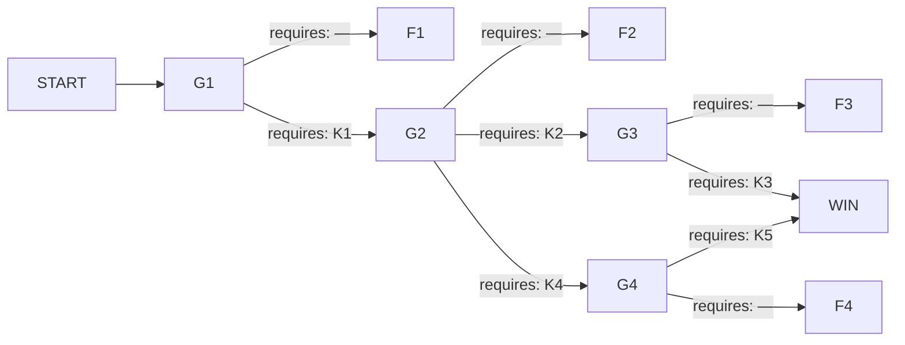

# 해원터널 — 흰 연기

## 1. 로그라인

해원터널 하행 4.2km에서 흰 연기가 오른 밤, 그 밤은 이미 지나갔고 집계는 214명으로 닫혔다.
남은 것은 회선 하나와 그 밤 안으로 들여보낼 수 있는 요원 1기뿐이다.
당신이 할 수 있는 일은 요원이 써 보낸 보고서에서 문장 넷을 골라 다음 요원의 손에 쥐여 주는 것이다.

---

## 2. 그래프

### 노드

| id | 시각 | 장소 | 등장 조건 | yields |
|---|---|---|---|---|
| START | 19:44 | 국가재난대응실 · 회선 개통 | — | — |
| G1 | 19:52 | 통화 · 하행 4.2km 갓길 | — | — |
| F1 | 20:09 | 회선 · 요원 단독 | G1에서 신고 내용 그대로 접수가 나간 밤 | K1, K2, K4 |
| G2 | 20:16 | 통화 · 해원터널 관제실 | G1에서 위험물 격상이 나간 밤 | — |
| F2 | 20:31 | 회선 · 요원 단독 | G2에서 관제 절차 유지가 나간 밤 | K2, K4 |
| G4 | 20:39 | 통화 · 하행 입구 소방 지휘차 | G2에서 진입 경로 재지정이 나간 밤 | — |
| G3 | 20:44 | 통화 · 해원터널 관리동 | G2에서 제연 기동 요청이 나간 밤 | — |
| F4 | 20:53 | 회선 · 요원 단독 | G4에서 진입 순서 유지가 나간 밤 | K5 |
| F3 | 20:58 | 회선 · 요원 단독 | G3에서 관리반장이 대는 통로로 유도가 나간 밤 | K3 |
| WIN | 21:26 | 상행선 3.1~3.6km 구간 | G3에서 상행측 자재 제거가 나갔거나, G4에서 연결로 개방이 나간 밤 | — |

게이트 노드는 yield하지 않는다. 열쇠는 전부 문 뒤에 있다 — 실패 종단에서만 나온다.

### 간선

| 출발 → 도착 | 모이는 스탠스 | requires |
|---|---|---|
| START → G1 | — | — |
| G1 → F1 | S1a | — |
| G1 → G2 | S1b, S1c | K1 |
| G2 → F2 | S2a | — |
| G2 → G3 | S2b, S2c | K2 |
| G2 → G4 | S2d | K4 |
| G3 → F3 | S3a | — |
| G3 → WIN | S3b, S3c | K3 |
| G4 → F4 | S4a | — |
| G4 → WIN | S4b, S4c | K5 |

성공 경로 둘.

- **경로 A — 옆으로 뺀다.** START → G1 → G2 → G3 → WIN. requires K1 · K2 · K3. 세 개.
- **경로 B — 뒤로 뺀다.** START → G1 → G2 → G4 → WIN. requires K1 · K4 · K5. 세 개.

같은 341명을 살린다. 한쪽은 사람을 걸어서 상행으로 넘기고, 다른 쪽은 차를 실은 채 상행으로 돌린다.

---

## 3. 앎

| 코드 | 앎 | 이 앎을 성립시키는 문장 | 성립시키지 못하는 약한 문장 |
|---|---|---|---|
| K1 | 탑차 적재함에 실린 것은 운송장에 적힌 냉동 수산물이 아니라 폐리튬배터리 팔레트다. | `기사가 마지막 무전에서 적재함에 실린 것은 수산물이 아니라고 말한다` | `기사 진술과 운송장이 서로 맞지 않는 데가 있다` |
| K2 | 관제사가 제연 팬을 자기 판단으로 세워 두었다. 상황공유망의 `제연 자동` 표시는 팬이 돌고 있다는 뜻이 아니다. | `제연 감시 기록에 하행 제트팬 열두 기의 회전수가 전부 0으로 남아 있다` | `관제실 화면에는 제연이 작동 중으로 떠 있었다` |
| K3 | 피난연결통로 3번 상행측 출입문 안쪽이 보수 자재로 막혀 있고, 쌓아 둔 사람은 관리반장 본인이다. | `상행측 출입문 안쪽에 방수시트와 배수관이 천장까지 쌓여 있고 쌓은 사람은 관리반장이다` | `통로 3번에서 상행으로 나온 사람이 없었다` |
| K4 | 하행 3.1km 갓길에 상행으로 이어지는 관리용 연결로가 있다. 준공도면에 없다. | `관리반장이 소방에 하행 3.1km 갓길의 상하행 연결로를 대는데 준공도면에 없는 길이다` | `해원터널에는 도면에 없는 시설이 몇 군데 있다` |
| K5 | 연결로 차단봉 자물쇠는 소방 마스터 규격이고, 사본 한 벌이 해원119안전센터 지휘차 열쇠 보관대에 있다. | `차단봉 자물쇠는 소방 마스터 규격이고 사본 한 벌이 관할 센터 지휘차 열쇠 보관대에 있다` | `차단봉이 잠겨 있어 절단기로 끊었다` |

약한 문장 넷은 미끼로 쓰인다. 넘겨도 요원은 움직이지 않고, 왜 안 움직였는지가 그 밤 보고서에 남는다.
특히 K2의 약한 문장은 반대로 끌어당긴다 — `제연이 작동 중으로 떠 있었다`를 받은 요원은 팬이 돌고 있다고 믿고 관제를 그대로 둔다.

---

## 4. 인물

**도희찬** — 41세 · 3.5톤 냉동탑차 기사, 개인 지입.
이해관계: 이번 달만 세 번째 야간 운행이다. 우신에너지가 한서냉장을 통해 넘긴 짐을 냉동 수산물 운송장으로 받았다. 위험물 운송 자격이 없다. 적재함을 열면 자격 없이 실었다는 사실이 그대로 드러나고, 차와 면허가 함께 걸린다.
아는 것: 짐이 무엇인지 안다. 출발 두 시간 전부터 적재함 쪽에서 단내가 났다는 것도 안다.
모르는 것: 그 단내가 무엇인지 모른다. 물을 뿌리면 더 심해진다는 것을 모른다.
게이트: G1.

**명주원** — 38세 · 해원터널 관제사, 7년차, 야간조.
이해관계: 3주 전 하행 오경보 때 제트팬을 잘못 돌려 연기를 정체 구간으로 밀었다. 민원이 붙었고 지금 징계 절차 중이다. 그날 이후 팬에 손을 대지 않는다는 규칙을 스스로 만들었다. 오늘도 자동 모드 표시만 띄워 두고 팬은 세워 뒀다.
아는 것: 팬이 돌지 않는다는 것을 안다. 상황공유망으로는 그것이 보이지 않는다는 것도 안다.
모르는 것: 흰 연기가 무엇인지 모른다. 20:40에 회선을 넘기고 나면 자기가 아무 말도 할 수 없게 된다는 것을 그때까지 생각하지 못한다.
게이트: G2.

**서인목** — 59세 · 해원터널 유지관리반장, 22년차.
이해관계: 지난달 상행 배수공사 자재를 임시로 피난연결통로 3번 상행측 안쪽에 넣어 뒀다. 창고 증축이 미뤄져서 둘 데가 없었다. 점검표에는 통로 3번 이상 없음으로 적었다. 정년까지 열한 달 남았다.
아는 것: 통로 3번은 잠겨 있지 않다. 다만 반대편으로 나갈 수 없다. 그리고 하행 3.1km 갓길의 연결로를 안다 — 2년 전 확장공사 때 만든 임시 통로이고 준공도면에서 빠졌다.
모르는 것: 오늘 밤 통로 3번으로 몇 명이 들어갈지 모른다.
게이트: G3.

**정하람** — 35세 · 해원119안전센터 선착대장.
이해관계: 이 밤에 집행권을 가진 유일한 사람이다. 문을 부술 수 있고 사람을 옮길 수 있다. 그래서 잘못 움직이면 혼자 뒤집어쓴다. 미등재 시설 진입은 승인 사항이고, 오늘 밤 본부는 아무것도 회신하지 않는다.
아는 것: 하행 입구에서 4.2km를 거슬러 오르는 데 25분이 걸린다는 것을 안다. 상행이 비어 있다는 것도 안다.
모르는 것: 연결로가 있다는 것을 모른다. 자기 지휘차 열쇠 보관대에 그 차단봉이 열리는 사본이 있다는 것을 모른다.
게이트: G4.

이름 없이 스쳐 가는 사람들은 타임라인 산문 안에서 살고 죽는다.

---

## 5. 게이트

### G1 · 19:52 · 통화 — 하행 4.2km 갓길 · 등장 조건 —

회선이 붙는다. 숨소리가 먼저 온다. 신고자는 갓길에 서 있고, 뒤로 무엇인가 새는 소리가 길게 깔린다. 바람 소리가 아니다. 끊기지 않는다.

연기는 흰색이다. 탑차 뒤쪽 아래에서 나와 위로 곧게 오른다. 터널 천장에 닿아 옆으로 퍼지는데, 어느 쪽으로도 밀려가지 않는다. 신고자는 타이어에서 탄내가 났다고 말한다. 그러고는 잠깐 말이 없다가, 적재함 문은 열지 않겠다고 한다. 이유는 대지 않는다.

조회에 운송장이 걸린다. 한서냉장, 냉동 수산물 12팔레트, 상차지 우신에너지 3공장. 상차지와 품목이 한 줄에 나란히 적혀 있다. 뒤쪽에서 두 사람이 소화기를 들고 걸어온다. 승용차 두 대가 갓길에 서 있다.

뒤에서는 정체가 길어지고 있다. 하행 2.8km까지 차가 서 있고, 사람들은 대부분 차에서 내리지 않았다. 첫 보고를 어느 등급으로 올리느냐에 따라 소방이 무엇을 싣고 오는지가 갈린다. 지금 올리지 않으면 다음 기회는 소방이 도착한 뒤다.

**요원에게 — 이 연기를 무엇으로 올릴 것인가.**

- **S1a** `그대로 올린다 — 달리 볼 근거가 없으므로, 신고자가 말한 내용 그대로 차량 화재로 접수해 소방에 넘긴다.`
- **S1b** `적재함을 기준으로 본다 — 신고자가 실은 것을 숨기고 있다고 보고, 운송장이 아니라 적재함 내용물을 기준으로 위험물 사고 격상을 요청한다.`
- **S1c** `상차지를 먼저 친다 — 신고자가 실은 것을 숨기고 있다고 보고, 운송장에 적힌 상차지에 직접 조회를 걸어 실제 적재 목록을 받아 낸다.`

간선: S1a → F1. S1b · S1c → G2.

---

### G2 · 20:16 · 통화 — 해원터널 관제실 · 등장 조건: G1에서 위험물 격상이 나간 밤

관제사는 말이 빠르다. 하행 진입은 19:51에 막았고, 전광판은 전 구간 감속으로 돌렸고, 제연은 자동이고, 방송은 매뉴얼대로 차량 내 대기라고 한 번에 읽어 내린다. 읽어 내리고 나서 조용해진다.

요원의 조회 권한은 도로공사 상황공유망까지다. 상황공유망 화면에는 하행 제연 상태가 `자동`으로만 뜬다. 회전수도, 기동 이력도, 정지 이력도 관제 내부망에 있다. 요원이 볼 수 있는 것은 세 글자다.

터널 안 CCTV는 이미 흐리다. 화점에서 나온 연기가 후방으로 내려앉는 중이고, 하행 3.6km 지점의 피난연결통로 안내등이 화면에서 보이지 않는다. 정체 구간에 341명이 있다. 방송은 계속 차량 내 대기를 내보낸다.

관제사는 20:40에 야간 후속조에 회선을 넘긴다. 넘기고 나면 이 사람에게 요청할 수 있는 것은 없다. 소방 선착대는 20:33에 하행 입구에 닿고 20:41에 진입을 시작한다. 진입 대열이 한 번 들어가면 4.2km를 되돌아 나올 수 없다.

**요원에게 — 관제에 무엇을 요청할 것인가.**

- **S2a** `말한 대로 둔다 — 달리 지시할 근거가 없으므로, 관제가 하고 있다고 말하는 절차를 그대로 두고 소방 도착을 기다린다.`
- **S2b** `팬을 지금 돌리게 한다 — 관제가 제연 팬을 자기 판단으로 세워 두었다고 보고, 화면 표시와 무관하게 하행 제트팬 기동을 지금 요청한다.`
- **S2c** `세워 둔 사람에게 말한다 — 관제가 제연 팬을 자기 판단으로 세워 두었다고 보고, 3주 전 일로 팬에 손을 못 대는 당사자에게 이번 기동의 책임은 요원이 진다고 말한다.`
- **S2d** `상행으로 돌린다 — 하행 3.1km 갓길에 준공도면에 없는 상하행 연결로가 있다고 보고, 소방 진입 경로를 상행으로 바꾸도록 관제에 확인시킨다.`

간선: S2a → F2. S2b · S2c → G3. S2d → G4.

---

### G4 · 20:39 · 통화 — 하행 입구 소방 지휘차 · 등장 조건: G2에서 진입 경로 재지정이 나간 밤

선착대장은 지휘차 앞에서 받는다. 뒤로 엔진 소리가 겹쳐 있다. 상행으로 들어가라는 말은 이미 들었다고 한다. 상행은 비어 있고, 상행 3.1km까지는 6분이면 닿는다고도 한다. 거기까지는 이견이 없다.

문제는 차단봉이다. 준공도면에 없는 시설이고, 관리반 열쇠는 관리동에 있고, 관리반장은 지금 하행 안쪽에 들어가 있다. 미등재 시설로 소방차를 넣는 것은 승인 사항이다. 본부는 오늘 밤 아무것도 회신하지 않는다.

부수고 들어갈 수는 있다. 절단기로 차단봉 자물쇠를 끊는 데 11분이 걸린다고 선착대장이 말한다. 11분이면 하행 입구에서 그냥 거슬러 올라가는 25분보다는 빠르지만, 정체 구간의 연기는 그 사이에 바닥까지 내려온다.

대열은 20:41에 움직인다. 지금 통화 중인 2분 안에 경로가 정해지지 않으면 선착대는 원래 계획대로 하행 입구로 들어가고, 그 뒤로는 무전이 끊긴다.

**요원에게 — 선착대에 무엇을 요청할 것인가.**

- **S4a** `대열대로 보낸다 — 달리 지시할 근거가 없으므로, 선착대가 이미 잡아 둔 진입 순서를 그대로 두고 도착을 기다린다.`
- **S4b** `잠금은 이미 열려 있다고 본다 — 차단봉 자물쇠가 소방 마스터 규격이고 사본이 관할 센터에 있다고 보고, 지휘차 열쇠 보관대를 지금 열어 보게 한다.`
- **S4c** `승인을 기다리지 않게 한다 — 차단봉 자물쇠가 소방 마스터 규격이고 사본이 관할 센터에 있다고 보고, 이것이 미등재 시설 무단 진입이 아니라 정당한 개방이라는 근거를 대장에게 넘긴다.`

간선: S4a → F4. S4b · S4c → WIN.

---

### G3 · 20:44 · 통화 — 해원터널 관리동 · 등장 조건: G2에서 제연 기동 요청이 나간 밤

제트팬이 돌기 시작한 지 20분이 지났다. 연기가 하행 진행 방향으로 밀려 올라가고, 정체 구간 위쪽 1미터 남짓이 다시 보인다. 사람들이 차에서 내리기 시작했다. 방송은 도보 대피로 바뀌었는데, 어디로 가라는 말이 아직 붙지 않았다.

관리반장은 관리동에서 받는다. 도면을 펼쳐 놓았다고 한다. 정체 구간 한가운데에 피난연결통로 3번이 있고, 하행 3.6km, 잠겨 있지 않다고 말한다. 안내등 이야기를 하자 말이 한 박자 늦는다. 그러고는 통로 3번으로 보내면 된다고 다시 말한다.

팬이 밀어 올린 연기는 30분쯤 버틴다. 배터리가 다음 단으로 넘어가면 연기량이 배로 늘고 팬 용량을 넘긴다. 그 뒤에는 통로 앞까지 걸어가는 200미터가 통과 불가 구간이 된다.

관리반장은 지금 관리동에 있다. 하행 3.6km까지는 12분, 상행 3.6km까지는 8분이다. 어느 쪽으로 보낼지는 지금 정해야 한다. 한 번 움직이면 되돌릴 시간이 없다.

**요원에게 — 관리반장에게 무엇을 시킬 것인가.**

- **S3a** `대는 대로 보낸다 — 달리 의심할 근거가 없으므로, 관리반장이 대는 통로로 사람들을 유도한다.`
- **S3b** `반대편부터 비우게 한다 — 통로 3번 상행측 출입문 안쪽이 관리반장 본인이 쌓아 둔 자재로 막혀 있다고 보고, 사람이 닿기 전에 상행측으로 돌아가 그것부터 걷어내게 한다.`
- **S3c** `쌓은 사람에게 말하게 한다 — 통로 3번 상행측 출입문 안쪽이 관리반장 본인이 쌓아 둔 자재로 막혀 있다고 보고, 지금 인정하고 위치를 대면 뒷일은 요원이 받는다고 말한다.`

간선: S3a → F3. S3b · S3c → WIN.

---

## 6. 결과 꼬리

### F1 — 20:09 · 첫 밤

20:09에 요원의 회선이 조용해진다. 접수 등급이 차량 화재로 확정되고, 그 등급에 붙는 절차가 자동으로 돌아가기 시작한다. 절차가 돌아가는 동안 요원에게 물어 오는 것은 없다. 이 밤에 요원이 하는 일은 여기까지다. 남은 것은 보는 것과 적는 것이다.

**20:11.** 승용차 운전자 둘이 탑차 뒤쪽에 붙는다. 하나는 소화기를 밑으로 겨누고 하나는 적재함 문틈에 대고 쏜다. 흰 연기가 잠깐 흩어졌다가 더 두껍게 올라온다. 기사가 뛰어와 문에서 떨어지라고 소리친다. 왜냐고 묻는 소리가 CCTV 마이크에 걸리는데 대답은 걸리지 않는다.

**20:14.** 소화기 두 대를 다 쓰고도 연기가 줄지 않는다. 하나가 갓길 소화전으로 달려간다. 호스가 풀리고 물이 적재함 밑으로 들어간다. 3초 뒤 파열음이 난다. 첫 번째 파열음이다.

> **요원 보고 · 제2보 · 20:24**
> 하행 4.2km 화점 유지. 연기 색 변화 없음. 백색.
> 20:14 갓길 소화전 방수 개시. 방수 직후 파열음 1회. 이후 연기량 증가.
> 소화 인원 2명 화점 이탈. 1명 손등 화상.
> 화점 차량 운전자 적재함 접근 저지 행동 관측. 사유 미확인.
> 상황공유망 하행 제연 상태 `자동`. 이상 표시 없음.
> 정체 구간 하행 2.8~4.2km, 차량 189대, 탑승 341명 추정. 차량 내 대기 방송 계속.

**20:26.** 연기가 천장에 닿아 옆으로 퍼지다가 아래로 내려앉기 시작한다. 밀려가지 않는 연기는 결국 내려앉는다. 정체 구간 앞머리부터 시야가 좁아진다. 경적이 몇 번 울리고, 창을 닫는 소리가 이어진다. 방송은 차량 내 대기다.

**20:33.** 소방 선착대가 하행 입구에 닿는다. 등급이 차량 화재라 물탱크차 한 대와 펌프차 한 대다. 화학차는 안 왔다.

**20:41.** 선착대가 하행 입구로 진입한다. 정체 차량 사이를 갈지자로 밀고 올라간다. 예상 25분. 무전이 중간중간 끊긴다.

**20:47.** 두 번째 파열음. 이번에는 길다. 적재함 옆판이 벌어지고 안쪽이 처음으로 보인다. 팔레트가 층으로 쌓여 있고 각 층에서 흰 것이 밀려 나온다. 수산물이 아니다. 이 장면은 CCTV 39번에 8초간 남는다.

**20:52.** 정체 구간 앞머리 40미터가 시야 0이 된다. 차에서 내리는 사람들이 나온다. 어디로 가야 하는지 아무도 말해 주지 않는다. 대부분 하행 진행 방향으로 걷는다 — 화점 쪽이다. 그쪽이 밝아 보이기 때문이다.

> **요원 보고 · 제3보 · 20:51**
> 20:47 화점 2차 파열. 적재함 측판 개방. 내부 적재 형태 팔레트 다층 확인.
> 냉동 화물 형태와 일치하지 않음. 백색 분출 계속. 화염 미관측.
> 연기 하강 진행. 하행 4.2km 기준 후방 400미터 시야 저하.
> 제연 효과 관측되지 않음. 연기 이동 방향 없음. 천장 체류 후 하강.
> 상황공유망 제연 상태 `자동` 유지.
> 선착대 20:41 하행 진입. 현재 위치 하행 0.9km. 진행 속도 시속 4km 이하.

**21:01.** 관리반장이 관리동에서 하행 3.6km로 들어간다. 혼자다. 피난연결통로 3번 안내등이 3주째 꺼져 있는 것을 아는 사람은 이 사람뿐이고, 손전등을 들고 문 앞에 서서 사람들을 불러 모으기 시작한다.

**21:03.** 기사의 무전이 마지막으로 잡힌다. 목소리가 갈라져 있다.

> 적재함에 든 건 수산물이 아닙니다. 우신에너지에서 나온 겁니다. 물 뿌리지 마세요. 물 뿌리지 말라고.

그 뒤로 회선이 열려 있지만 아무 말도 오지 않는다. 21:06에 세 번째 파열음이 나고, 21:07에 회선이 닫힌다.

**21:12.** 통로 3번 앞에 사람들이 몰린다. 문이 열린다. 잠겨 있지 않았다. 앞줄이 들어가고, 그 뒤로 계속 들어간다. 상행 3.6km 출구 쪽에서는 아무도 나오지 않는다. 상행 순찰차가 그 앞에 20분간 서 있었고, 나온 사람은 없었다고 나중에 진술한다.

**21:19.** 연기가 정체 구간 전체를 채운다. 하행 2.8km 이후 CCTV 전 화면이 백색이다. 방송이 도보 대피로 바뀌지만, 이 시점에서 방송은 방향을 말하지 않는다.

> **요원 보고 · 제4보 · 21:18**
> 21:03 화점 차량 운전자 최종 교신. 적재물 수산물 아님 진술. 상차지 우신에너지 진술. 방수 중지 요청 진술.
> 21:06 3차 파열. 21:07 화점 교신 두절.
> 21:12 하행 3.6km 피난연결통로 3번 개방. 문 잠금 없음. 진입 인원 다수.
> 동 시각 상행 3.6km 출구 측 인원 유출 미관측.
> 21:19 정체 구간 전 구간 시야 0.
> 선착대 현재 위치 하행 2.4km. 잔여 1.8km.

**21:31.** 선착대가 하행 3.1km를 지난다. 갓길 오른쪽에 차단봉이 하나 있다. 아무도 보지 않는다. 도면에 없는 것은 화면에도 없다.

**21:38.** 선착대가 하행 3.6km 통로 3번 앞에 닿는다. 문 안쪽 3미터 지점부터 사람이 겹쳐 있다. 통로 안쪽 끝, 상행측 출입문 앞에서 걸음이 멈췄고 뒤에서 계속 밀려 들어왔다. 통로 길이는 34미터다.

**21:44.** 선착대가 상행 3.6km로 돌아 나가려 한다. 상행으로 넘어가는 길이 없다. 하행 입구로 되돌아가면 25분, 하행 출구로 뚫고 나가면 화점을 지나야 한다.

> **요원 보고 · 제5보 · 21:46**
> 21:38 선착대 하행 3.6km 도달. 피난연결통로 3번 내부 인원 밀집 확인.
> 통로 내부 통과 불가 상태. 상행측 출입문 개방되지 않음. 사유 현장 미확인.
> 21:44 선착대 상행 우회로 탐색. 하행 3.6km 부근 상하행 연결 시설 없음으로 판단.
> 정체 구간 인원 이동 방향 통제 없음.

**21:57.** 관리반장이 통로 3번 안쪽에서 나온다. 사람을 여섯 끌고 나온다. 나머지는 못 끌어낸다.

**22:03.** 관리반장이 선착대장을 잡고 말한다. 3.1km 갓길에 상행으로 넘어가는 길이 있다고. 2년 전 확장공사 때 낸 것이고 도면에서 빠졌다고. 지금 열면 상행으로 뺄 수 있다고.

**22:07.** 선착대가 3.1km로 되돌아간다. 차단봉이 잠겨 있다. 절단기로 끊는다. 11분 걸린다.

**22:18.** 연결로가 열린다. 상행 방향으로 사람이 나오기 시작한다.

> **요원 보고 · 제6보 · 22:11**
> 22:03 관리반장 진술. 하행 3.1km 갓길 상하행 연결로 존재. 2년 전 확장공사 시공. 준공도면 미등재.
> 22:07 선착대 3.1km 이동. 차단봉 잠금 확인. 절단 개시.
> 해당 시설 최초 인지 시각 22:03. 상황 발생 후 2시간 25분 경과.

**22:29.** 마지막 보고가 온다.

> **요원 보고 · 제7보 · 22:29**
> 하행 제연 감시 기록 사후 열람분 도착.
> 19:38 이후 하행 제트팬 열두 기 회전수 전 구간 0.
> 자동 모드 표시 유지. 수동 정지 조작 이력 19:22. 조작자 야간조 관제사.
> 화점 적재물 예비 판정 폐리튬이온전지 팔레트 12단. 상차지 우신에너지 3공장.
> 운송장 기재 품목 냉동 수산물. 운송 자격 미보유.
> 하행 3.1km 상하행 연결로 확인. 준공도면 미등재.
> 집계 진행 중.

**꼬리에서 캘 수 있게 되는 문장**

- **K1 성립** — `기사가 마지막 무전에서 적재함에 실린 것은 수산물이 아니라고 말한다` (21:03 · 제4보)
- **K2 성립** — `제연 감시 기록에 하행 제트팬 열두 기의 회전수가 전부 0으로 남아 있다` (제7보)
- **K4 성립** — `관리반장이 소방에 하행 3.1km 갓길의 상하행 연결로를 대는데 준공도면에 없는 길이다` (22:03 · 제6보)
- K3 미성립 — 약한 문장만 나온다. `통로 3번에서 상행으로 나온 사람이 없었다` (21:12 · 제4보). 왜 안 나왔는지는 이 밤에 나오지 않는다.
- K5 미성립 — 약한 문장만 나온다. `차단봉이 잠겨 있어 절단기로 끊었다` (22:07 · 제6보). 열쇠 이야기는 이 밤에 나오지 않는다.

---

### F2 — 20:31

20:31에 회선이 조용해진다. 격상은 나갔다. 화학차가 붙고, 방수 금지가 걸리고, 화점 접근이 통제된다. 기사는 20:19에 차에서 떨어졌고 소화기를 든 두 사람도 물러났다. 화점 옆에서는 아무도 죽지 않는다.

문제는 뒤쪽이다. 팬은 계속 서 있다. 연기는 밀려가지 않고 내려앉는다. 정체 구간 341명은 차 안에 있으라는 방송을 21:04까지 듣는다. 21:04에 방송이 바뀌지만 그때는 시야가 없다.

**21:22.** 선착대가 방독면을 나눠 주며 하행 2.8km부터 후진 유도를 시작한다. 189대 중 앞쪽 60대는 뺐다. 그 뒤로는 사람이 차를 버리고 걷기 시작해서 통로가 막힌다.

**21:40.** 관리반장이 통로 3번을 연다. 사람이 들어간다. 나오지 못한다. 이 밤에도 통로 안에서 사람이 겹친다.

**22:02.** 관리반장이 3.1km 연결로를 댄다. 선착대가 차단봉을 끊는다. 11분.

> **요원 보고 · 제5보 · 22:14**
> 하행 제연 감시 기록 사후 열람분 도착. 19:38 이후 제트팬 회전수 전 구간 0.
> 수동 정지 조작 이력 19:22. 조작자 야간조 관제사.
> 상황공유망 표시 `자동`은 팬 회전 상태를 나타내지 않음. 표시와 실제 상이.
> 22:02 관리반장 진술. 하행 3.1km 갓길 상하행 연결로. 준공도면 미등재.
> 통로 3번 상행측 인원 유출 미관측. 사유 미확인.

**꼬리에서 캘 수 있게 되는 문장**

- **K2 성립** — 제연 표시와 실제가 다르다는 것이 여기서 못 박힌다. 첫 밤에 K2의 약한 문장을 넘겨 요원이 팬을 그냥 두었다면, 이 밤이 그것을 되돌려 놓는다.
- **K4 성립** — 22:02 진술.
- K3 미성립 — 약한 문장만. K5 미성립 — 약한 문장만.

---

### F3 — 20:58

20:58에 회선이 조용해진다. 유도는 나갔다. 통로 3번으로 가라는 방송이 전 구간에 반복된다. 팬은 돌고 있고, 연기는 위로 밀려 있고, 사람들은 걸을 수 있다. 여기까지는 잘 된 밤이다.

**21:09.** 통로 3번 앞에 줄이 선다. 문이 열린다. 앞줄이 34미터를 걸어 들어간다. 상행측 출입문 앞에서 멈춘다. 문은 열리는데, 열린 문 안쪽에 방수시트 두루마리와 배수관이 천장까지 쌓여 있다. 사람 하나가 지나갈 틈이 없다.

**21:14.** 앞줄이 되돌아 나오려 한다. 뒤에서 계속 들어온다. 통로 폭은 1.8미터다.

**21:26.** 관리반장이 상행 3.6km에 닿는다. 밖에서 자재를 끌어내기 시작한다. 혼자다. 배수관 한 다발이 80킬로다.

**21:41.** 선착대 두 명이 상행으로 붙는다. 셋이서 걷어낸다. 21:53에 길이 뚫린다. 44분 늦었다.

> **요원 보고 · 제4보 · 21:58**
> 21:09 통로 3번 진입 개시. 21:11 상행측 출입문 앞 정체.
> 상행측 출입문 안쪽 적치물 확인. 방수시트 및 배수관 자재. 적치 높이 천장.
> 적치 시점 지난달. 적치자 유지관리반장 본인 진술.
> 21:26 관리반장 상행측 도착 후 제거 개시. 21:53 통과 개통.
> 통로 내부 체류 시간 최장 44분.

**꼬리에서 캘 수 있게 되는 문장**

- **K3 성립** — `상행측 출입문 안쪽에 방수시트와 배수관이 천장까지 쌓여 있고 쌓은 사람은 관리반장이다` (제4보)
- 이 밤 이후 경로 A가 완성된다. K1 · K2 · K3, 세 칸.

---

### F4 — 20:53

20:53에 회선이 조용해진다. 진입 경로 재지정은 나갔다. 선착대는 상행으로 들어간다. 6분 만에 상행 3.1km에 닿는다. 거기서 멈춘다.

**20:47.** 차단봉이 잠겨 있다. 관리반 열쇠는 관리동에 있고, 관리반장은 하행 안쪽이다. 선착대장이 승인을 조회한다. 회신이 없다.

**21:00.** 절단기를 꺼낸다. 자물쇠에 대는 순간 대원 하나가 규격을 알아본다. 소방 마스터 규격이다. 지휘차 열쇠 보관대에 사본이 있다. 2년 전 준공 때 관할 센터로 한 벌 갔다.

**21:04.** 열쇠로 연다. 그때까지 17분을 썼다.

**21:11.** 상행에서 하행으로 넘어가 후진 유도를 시작한다. 팬은 서 있고 연기는 이미 내려앉았다. 17분이 그대로 값이 된다.

> **요원 보고 · 제4보 · 21:22**
> 20:47 상행 3.1km 연결로 차단봉 잠금 확인. 승인 조회 회신 없음.
> 21:00 절단 준비 중 자물쇠 규격 확인. 소방 마스터 규격.
> 사본 소재 해원119안전센터 지휘차 열쇠 보관대. 2년 전 준공 시 교부.
> 21:04 개방. 잠금 확인부터 개방까지 17분 소요.

**꼬리에서 캘 수 있게 되는 문장**

- **K5 성립** — `차단봉 자물쇠는 소방 마스터 규격이고 사본 한 벌이 관할 센터 지휘차 열쇠 보관대에 있다` (제4보)
- 이 밤 이후 경로 B가 완성된다. K1 · K4 · K5, 세 칸.

---

## 7. 집계

집계 단위 셋. 전부 사람이다.

- **하행 2.8~4.2km에 갇힌 사람** — 341명
- **화점 옆에 섰던 사람** — 3명. 기사와 소화기를 든 운전자 둘.
- **터널로 들어간 대응 인력** — 7명. 관리반장과 선착대 여섯.

| 종단 | 갇힌 사람 341 | 화점 옆 3 | 대응 인력 7 | 사망 합계 |
|---|---|---|---|---|
| F1 | 207 사망 | 3 사망 | 4 사망 | **214** |
| F2 | 152 사망 | 0 | 3 사망 | **155** |
| F4 | 61 사망 | 0 | 0 | **61** |
| F3 | 47 사망 | 0 | 1 사망 | **48** |
| WIN | 0 | 0 | 0 | **0** |

**F1 · 214명.** 기록이다. 이 밤이 그대로 남았고, 해원터널 하행 4.2km 사고는 이 숫자로 불린다.

**F2 · 155명.** 화점에서는 아무도 죽지 않았다. 뒤쪽에서 152명이 죽었다.

**F4 · 61명.** 17분이 61명이다.

**F3 · 48명.** 34미터짜리 통로 안에서 47명이 죽었다. 관리반장은 여섯을 끌어내고 마지막에 나오지 못했다.

**WIN · 0명.** 341명이 상행으로 넘어갔다. 22:40에 마지막 인원 확인이 끝나고, 하행 터널은 그대로 탄다. 값은 목숨이 아닌 것으로 치러진다 — 기사는 위험물 무허가 운송으로 입건되고 운송사와 상차지가 함께 걸린다. 관리반장은 피난연결통로 적치로 입건되고 22년이 열한 달 남기고 끝난다. 관제사는 직위에서 내려오고 3주 전 건과 병합 조사에 들어간다. 선착대장은 미등재 시설 진입으로 감찰을 받는다. 해원터널 하행은 6주 폐쇄되고 우회 국도로 하루 4만 대가 넘어간다. 이름 옆에 기록이 남는다. 사람은 남는다.

---

## 8. 고정 타임라인

| 시각 | 표면 | 장소 | 사건 | 조건 |
|---|---|---|---|---|
| 19:38 | 통화 | 119 접수대 | 화물차 기사가 하행 4.2km에서 흰 연기를 신고한다. 타이어 탄내가 난다고 말한다. | — |
| 19:41 | 문서 | 화물 운송장 | 조회에 운송장이 걸린다. 한서냉장, 냉동 수산물 12팔레트, 상차지 우신에너지 3공장. | — |
| 19:44 | 현장 | 하행 4.2km | 탑차 뒤쪽 아래에서 흰 연기가 나온다. 불꽃은 보이지 않는다. 연기가 위로 곧게 오른다. | — |
| 19:47 | CCTV | 하행 4.1km | 승용차 두 대가 갓길에 선다. 운전자 둘이 소화기를 들고 탑차 쪽으로 걸어간다. | — |
| 19:49 | 통화 | 하행 4.2km | 기사가 적재함 문을 열지 않겠다고 말한다. 이유는 대지 않는다. | — |
| 19:51 | 문서 | 관제 조작 이력 | 하행 진입 차단. 전광판 전 구간 감속. 제연 자동 표시. | — |
| 19:58 | CCTV | 하행 2.8~4.2km | 정체가 1.4km로 늘어난다. 차량 189대. 사람들이 차에서 내리지 않는다. | — |
| 20:03 | 현장 | 하행 4.2km | 소화기 두 대를 다 쓰고도 연기가 줄지 않는다. 흰 연기가 두꺼워진다. | — |
| 20:07 | 현장 | 하행 4.2km | 적재함 바닥 이음매에서 흰 연기가 갈라져 나온다. 기사가 운전석으로 돌아가지 않는다. | — |
| 20:14 | 현장 | 하행 4.2km | 갓길 소화전에서 물이 나간다. 3초 뒤 파열음 1회. 연기량이 늘어난다. | 위험물 격상이 나가지 않은 밤에만 |
| 20:19 | 통화 | 하행 4.2km | 화점 반경 50미터가 통제된다. 기사와 소화 인원 둘이 물러난다. 방수가 금지된다. | 위험물 격상이 나간 밤에만 |
| 20:22 | 통화 | 관제실 | 관제사가 3주 전 하행 오경보 건을 말한다. 말끝이 늦다. | 위험물 격상이 나간 밤에만 |
| 20:26 | CCTV | 하행 3.8km | 천장에 닿은 연기가 옆으로 퍼지다 아래로 내려앉는다. 정체 앞머리 시야가 좁아진다. | 제연 기동 요청이 나가지 않은 밤에만 |
| 20:33 | 현장 | 하행 입구 | 소방 선착대가 닿는다. 물탱크차와 펌프차. | 위험물 격상이 나가지 않은 밤에만 |
| 20:33 | 현장 | 하행 입구 | 소방 선착대가 닿는다. 화학차가 함께 온다. | 위험물 격상이 나간 밤에만 |
| 20:36 | CCTV | 하행 4.4km | 제트팬이 돌기 시작한다. 연기가 하행 진행 방향으로 밀려 올라간다. 정체 구간 위쪽이 보인다. | 제연 기동 요청이 나간 밤에만 |
| 20:41 | 현장 | 하행 입구 | 선착대가 하행으로 진입한다. 정체 차량 사이를 갈지자로 오른다. 예상 25분. | 진입 경로 재지정이 나가지 않은 밤에만 |
| 20:41 | 현장 | 상행 입구 | 선착대가 상행으로 진입한다. 상행은 비어 있다. 상행 3.1km까지 6분. | 진입 경로 재지정이 나간 밤에만 |
| 20:47 | 현장 | 하행 4.2km | 두 번째 파열음. 적재함 측판이 벌어진다. 팔레트가 층으로 쌓여 있고 각 층에서 흰 것이 밀려 나온다. | — |
| 20:47 | 현장 | 상행 3.1km | 차단봉 자물쇠가 잠겨 있다. 관리반 열쇠는 관리동에 있다. 승인 조회에 회신이 없다. | 진입 경로 재지정이 나갔고 열쇠 확인이 나가지 않은 밤에만 |
| 20:52 | CCTV | 하행 3.9km | 차에서 내린 사람들이 하행 진행 방향으로 걷는다. 그쪽이 밝아 보인다. | 제연 기동 요청이 나가지 않은 밤에만 |
| 21:00 | 현장 | 상행 3.1km | 절단기를 자물쇠에 댄다. 대원 하나가 규격을 알아본다. 소방 마스터 규격이다. | 진입 경로 재지정이 나갔고 열쇠 확인이 나가지 않은 밤에만 |
| 21:01 | 현장 | 하행 3.6km | 관리반장이 손전등을 들고 통로 3번 앞에 선다. 안내등은 3주째 꺼져 있다. | — |
| 21:03 | 통화 | 하행 4.2km | 기사가 마지막 무전을 보낸다. 적재함에 든 것은 수산물이 아니라고, 우신에너지에서 나온 것이라고, 물을 뿌리지 말라고 말한다. | 위험물 격상이 나가지 않은 밤에만 |
| 21:09 | 현장 | 하행 3.6km | 통로 3번 문이 열린다. 앞줄이 34미터를 걸어 들어간다. | 통로 3번 유도가 나간 밤에만 |
| 21:11 | 현장 | 상행 3.6km | 통로 상행측 출입문 안쪽에 방수시트와 배수관이 천장까지 쌓여 있다. 사람이 지나갈 틈이 없다. | 통로 3번 유도가 나갔고 자재 제거가 나가지 않은 밤에만 |
| 21:12 | CCTV | 상행 3.6km | 통로 3번 상행측 출구에서 나오는 사람이 없다. 상행 순찰차가 앞에 서 있다. | 자재 제거가 나가지 않은 밤에만 |
| 21:26 | 현장 | 상행 3.6km | 자재가 걷힌다. 통로 반대편이 뚫린다. 사람들이 상행으로 넘어오기 시작한다. | 자재 제거가 나간 밤에만 |
| 21:31 | 현장 | 상행 3.1km | 연결로가 열린다. 정체 차량이 앞머리부터 상행으로 돌아 나간다. | 연결로 개방이 나간 밤에만 |
| 21:38 | 현장 | 하행 3.6km | 선착대가 통로 3번 앞에 닿는다. 문 안쪽 3미터부터 사람이 겹쳐 있다. | 위험물 격상이 나가지 않은 밤에만 |
| 22:03 | 현장 | 하행 3.1km | 관리반장이 선착대장에게 3.1km 갓길의 연결로를 댄다. 2년 전 확장공사 때 낸 길이고 준공도면에서 빠졌다고 말한다. | 진입 경로 재지정이 나가지 않은 밤에만 |
| 22:07 | 현장 | 하행 3.1km | 차단봉을 절단기로 끊는다. 11분 걸린다. | 진입 경로 재지정이 나가지 않은 밤에만 |
| 22:29 | 문서 | 제연 감시 기록 사후 열람분 | 19:38 이후 하행 제트팬 열두 기의 회전수가 전 구간 0으로 남아 있다. 수동 정지 조작 이력 19:22. | 제연 기동 요청이 나가지 않은 밤에만 |
| 22:40 | 문서 | 인원 확인 기록 | 상행으로 넘어온 인원 341명. 미확인 0명. | 341명 전원이 상행으로 넘어온 밤에만 |

---

## 9. 네 밤의 진행

**1회차**
- 인수인계에 실린 것: 없다. 네 칸이 비어 있다.
- 어디까지 갔나: G1.
- 어디서 손이 닿지 않게 됐나: G1에서 S1a. 20:09에 회선이 조용해진다.
- 그 꼬리에서 캘 수 있게 된 것: **K1 · K2 · K4**. K3과 K5는 약한 문장으로만 나온다 — 통로에서 나온 사람이 없었다는 것, 차단봉을 절단기로 끊었다는 것. 이유는 아직 어디에도 없다.

**2회차 — 갈래 A**
- 인수인계: K1 강 · K2 강. 남은 두 칸은 비었거나 미끼가 들어간다.
- 어디까지 갔나: G1 통과 → G2 → S2b 또는 S2c → G3.
- 어디서 손이 닿지 않게 됐나: G3에서 S3a. 관리반장이 대는 통로로 보냈고, 20:58에 회선이 조용해진다.
- 캘 수 있게 된 것: **K3**. 상행측 출입문 안쪽 자재, 쌓은 사람의 이름.

**2회차 — 갈래 B**
- 인수인계: K1 강 · K4 강.
- 어디까지 갔나: G1 통과 → G2 → S2d → G4.
- 어디서 손이 닿지 않게 됐나: G4에서 S4a. 20:53.
- 캘 수 있게 된 것: **K5**. 자물쇠 규격과 사본 소재.

**3회차 — 여기서 열린다**
- 인수인계 A: K1 강 · K2 강 · K3 강. 한 칸 여유.
- 경로: G1 → G2 → G3 → **WIN**. 사망 0.
- 인수인계 B: K1 강 · K4 강 · K5 강. 한 칸 여유.
- 경로: G1 → G2 → G4 → **WIN**. 사망 0.

**4회차 — 여유분**
- 2회차에 약한 문장을 골랐으면 여기서 만회한다. `관제실 화면에는 제연이 작동 중으로 떠 있었다`를 넘긴 밤은 F2에 닿고, F2 꼬리가 K2와 K4를 다시 못 박아 준다.
- K2와 K4를 한 밤에 같이 넘기면 요원이 어느 쪽을 고를지는 요원의 몫이다. K3만 챙기고 K5를 안 챙긴 인수인계로 요원이 S2d를 고르면 F4에 닿는다. 이 한 번의 어긋남을 받아 주는 것이 4회차다.

---

## 10. 자기 검사

### §4 — 그래프

1. **노드마다 시각이 다르다.** 19:44 · 19:52 · 20:09 · 20:16 · 20:31 · 20:39 · 20:44 · 20:53 · 20:58 · 21:26. 열 개 전부 다르다. ✔
2. **게이트마다 requires가 빈 간선은 정확히 하나이고 그것이 실패 간선이다.** G1→F1, G2→F2, G3→F3, G4→F4. 각 게이트에 하나씩. 나머지 간선은 전부 requires를 갖는다. ✔
3. **1회차는 게이트 하나만 지나고 실패한다.** START → G1 → F1. G1→G2가 요구하는 K1은 21:03 기사의 마지막 무전과 제7보 사후 판정에서만 나온다 — 재난이 끝까지 흘러간 뒤다. ✔
4. **열쇠는 문 뒤에 있다.** K1은 F1에서만, K2는 F1·F2에서만, K3은 F3에서만, K4는 F1·F2에서만, K5는 F4에서만 나온다. 어느 열쇠도 그 문까지 가는 경로 위 노드가 yield하지 않는다. 게이트 노드의 yields는 전부 비어 있다. §1이 미리 준 것도 없다 — §1이 주는 것은 요원의 권한과 처지뿐이다. ✔
5. **성공 경로가 둘이다.** A는 통로 3번으로 걸어서 상행, B는 연결로로 차째 상행. 같은 341명을 살린다. ✔
6. **경로당 requires 총합 4 이하.** A는 K1·K2·K3으로 셋, B는 K1·K4·K5로 셋. 네 칸 중 한 칸이 남는다. ✔
7. **3회차 안에 성공 경로가 열린다.** 1회차 꼬리에서 셋, 2회차 꼬리에서 마지막 하나, 3회차 완주. §9에 두 갈래 모두 적었다. ✔
8. **집계는 마지막으로 밟은 노드가 정한다.** 표가 종단별로만 끊긴다. 두 성공 경로가 같은 집계를 받으므로 WIN을 쪼갤 이유가 없다. ✔
9. **한 게이트가 두 집계 단위를 반대 방향으로 결정하지 않는다.** G1은 화점 옆 3명과 대응 인력 7명을 같은 방향으로 움직인다 — 격상하면 둘 다 산다. G2·G3·G4는 갇힌 341명을 한 방향으로만 움직인다. 이쪽을 살리면 저쪽이 죽는 자리는 없다. 제연을 방향 선택이 아니라 회전 여부로 만든 것이 이 조항 때문이다. ✔
10. **모든 집계 단위가 동시에 최선인 경로가 있다.** WIN에서 341·3·7이 전부 0 사망. ✔
11. **yields를 타임라인 행이나 인물의 말이 실어 나른다.** K1은 21:03 통화 행, K2는 22:29 문서 행, K3은 21:11 현장 행, K4는 22:03 현장 행, K5는 21:00 현장 행. 전부 조건 칸을 달아 두었다. ✔
12. **실패한 뒤에는 어떤 자리도 열리지 않는다.** F1 이후 — G2는 위험물 격상을 요구하고 F1로 간 밤에는 격상이 나가지 않았다. G3은 제연 기동을, G4는 진입 경로 재지정을, WIN은 자재 제거 또는 연결로 개방을 요구한다. F1 뒤에는 앞의 어느 조건도 성립하지 않는다. F2 이후 — G3·G4·WIN 전부 G2에서 나갔어야 할 요청을 조건으로 달고 있고, F2로 간 밤에는 아무 요청도 나가지 않았다. F3 이후 — 남은 자리는 WIN뿐이고 자재 제거가 나가지 않았다. F4 이후 — 남은 자리는 WIN뿐이고 연결로 개방이 나가지 않았다. 조건이 헐거운 자리는 없다. ✔
13. **첫 밤의 꼬리는 앎을 둘 이상 내놓되 전부는 아니다.** K1·K2·K4 셋을 내놓고 K3·K5를 남긴다. 가장 깊은 둘은 둘째 밤 이후의 꼬리에서만 나온다. ✔
14. **모든 시각이 자정 전이다.** 문서 전체에서 가장 이른 시각 19:22, 가장 늦은 시각 22:40. 게이트도, 종단도, 타임라인도, 네 개의 꼬리 안 서술도 전부 19시대에서 22시대 사이다. 마지막 종단 WIN이 21:26에 닫힌다. 자정을 넘는 시각은 하나도 없다. ✔

### §5 — 스탠스

1. **라벨이 자기를 설명한다.** 열두 개 스탠스 전부 `이름 — 전제 + 행위` 형태다. 맨 명사만 놓은 라벨은 없다. ✔
2. **기본 간선 라벨은 근거의 부재만 말한다.** S1a `달리 볼 근거가 없으므로`, S2a `달리 지시할 근거가 없으므로`, S3a `달리 의심할 근거가 없으므로`, S4a `달리 지시할 근거가 없으므로`. ✔
3. **기본 라벨에 사실을 싣지 않았다.** S1a는 운송장 이야기를 하지 않는다 — 하면 요원이 `진술과 운송장이 맞는다`를 확정 사실로 삼고 K1을 기각한다. S3a에서 `통로 3번이 열려 있다`를 뺀 것도 같은 이유다. 대신 `관리반장이 대는 통로로`라고만 적었다. ✔
4. **나머지 간선 라벨은 딛고 선 전제를 말한다.** `신고자가 실은 것을 숨기고 있다고 보고`, `관제가 제연 팬을 자기 판단으로 세워 두었다고 보고`, `상행측 출입문 안쪽이 관리반장 본인이 쌓아 둔 자재로 막혀 있다고 보고`, `차단봉 자물쇠가 소방 마스터 규격이라고 보고`. 빈 인수인계로는 어느 전제도 가질 수 없다. ✔
5. **자기 수확을 말하는 라벨이 없다.** `차단 로그를 펼쳐 내놓는다` 계열을 전부 뺐다. S1c는 `상차지에 조회를 걸어 실제 적재 목록을 받아 낸다`인데, 이것은 K1을 이미 전제한 요원만 갈 수 있는 자리다 — 전제 없이는 무엇을 받아 낼지가 라벨에서 보이지 않는다. 다만 `받아 낸다`라는 어미가 수확처럼 읽힐 여지가 남는다. 이 항목은 완전히 깨끗하지 않다. ⚠
6. **비기본 전제가 §1이 이미 준 것이 아니다.** §1이 주는 것은 요원에게 집행권이 없다는 것, 현장에 없다는 것, 본부가 회신하지 않는다는 것뿐이다. K1~K5 어느 것도 여기서 나오지 않는다. `현장 판단이 관제보다 정확하다` 같은 공짜 전제를 쓴 라벨은 없다 — S2b·S2c는 관제 일반이 아니라 이 관제사가 팬을 세웠다는 특정 사실 위에 선다. ✔
7. **탈출구가 없다.** `일단 확인부터` 계열을 넣지 않았다. 앎을 쥐지 않은 요원이 고를 수 있는 것은 각 게이트에서 기본 하나뿐이다. S1c와 S4b가 확인 행위처럼 보이지만 전제가 각각 K1과 K5라서, 쥐지 않은 요원은 전제 자체를 가질 수 없다. ✔
8. **한 간선에 모인 스탠스가 발화에서 갈린다.** S1b는 소방·관제에 격상을 올리는 말, S1c는 상차지에 거는 말. S2b는 관제 조작 지시, S2c는 책임 인수 발언. S3b는 상행측으로 돌아가라는 지시, S3c는 인정을 요구하는 말. S4b는 열쇠 보관대를 열어 보라는 지시, S4c는 승인 문제를 덮어 주는 말. 이유만 같고 입에서 나오는 말이 같은 쌍은 없다. ✔
9. **여유를 닫았다.** 관제사가 20:40에 회선을 넘긴다. 선착대 대열이 20:41에 움직이고 들어가면 되돌아 나올 수 없다. 팬이 밀어 올린 연기는 30분만 버틴다. 관리반장이 상행 3.6km까지 8분, 자재 제거에 다시 시간이 든다. 모든 게이트 앞에 마감이 하나씩 서 있다. ✔
10. **열쇠 문장이 지목하는 대상이 유일하다.** `적재함`은 탑차 화물칸만 가리킨다 — 정하람 쪽은 `열쇠함`이 아니라 `열쇠 보관대`로 적어 겹침을 없앴다. `문`이 여러 개라서 K3 문장은 `상행측 출입문`으로 못 박았고, 적재함 쪽은 `적재함 문`, 차단봉 쪽은 `자물쇠`로 서로 다른 낱말을 썼다. 소화기 관련 서술에서 `비우다`를 피하고 `두 대를 다 쓰고도`로 적었다. ✔

### §7 — 금지

1. **플레이어가 글자를 입력하는 장치.** 없다. 플레이어가 하는 일은 보고서 문장을 네 칸에 올리는 것뿐이다. ✔
2. **넘겨준 믿음이 의심이나 회수로 되돌려지는 비트.** 없다. K2의 약한 문장 `화면에는 제연이 작동 중으로 떠 있었다`는 회수 장치가 아니라 반대 내용을 가진 별개 문장이고, 해독제는 강한 문장 하나뿐이다. ✔
3. **인수인계 안의 순서·우선순위를 다루는 장치.** 없다. 네 칸은 평평하다. ✔
4. **감정 묘사나 인용에 기대야만 열리는 정답 경로.** 없다. 다섯 열쇠 전부 물리적 사실이다 — 상자에 무엇이 들었는가, 팬이 도는가, 문 뒤에 무엇이 쌓였는가, 길이 있는가, 열쇠가 어디 있는가. ✔
5. **요원의 대답을 전제하는 고정 장면.** 없다. 타임라인 행 가운데 요원이 말하는 행은 없고, 요원의 말이 필요한 네 순간은 전부 게이트다. 꼬리 안에서 요원은 쓰기만 한다. ✔
6. **재구성 안의 인물이 밖을 인지하는 장면.** 없다. 보고서는 본부로 가고, 본부는 회신하지 않는다. 그 밤 안의 누구도 이 밤이 다시 돌려진다는 것을 모른다. ✔
7. **왼쪽 칸에 게임 어휘가 드러나는 것.** 로그라인·인물·게이트 산문·스탠스·꼬리·집계 문장·타임라인 사건 칸에서 해당 어휘를 쓰지 않았다. 타임라인 조건 칸과 §2·§3·§9·§10은 오른쪽 칸이라 설계 어휘를 쓴다. 다만 로그라인에 `집계`가 들어가 있고 §7의 금지어 목록에는 없으나 게임 쪽 냄새가 옅게 난다 — 그 밤의 사고 보고서도 쓰는 말이라 남겨 두었다. ⚠
8. **번역투.** 대명사 그·그녀·그것·그들을 쓰지 않았다. `~에 의해`, `~되어지다`, `~에도 불구하고`, 소유격 연쇄, 세미콜론, 산문 안 문중 괄호를 쓰지 않았다 — 괄호는 §9-4가 요구하는 나이·역할 표기 형식에만 쓰고 그마저 서술형으로 풀었다. 수가 이미 드러난 자리의 `-들`을 쓰지 않았다. 문장을 짧게 끊고 동사로 끝냈다. ✔
