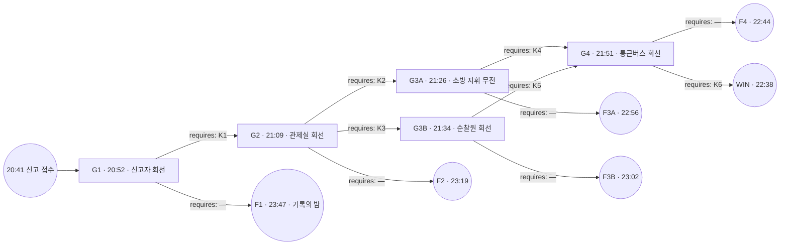

# 해원터널 — 4.2km의 흰 연기

## 1. 로그라인

해원터널 하행 4.2km에서 흰 연기가 오르고, 뒤에 멈춰 선 차량 일흔여덟 대 안에 이백스무 명이 앉아 있다. 요원에게 있는 것은 회선 하나와 말뿐이고, 화물차는 어느 밤에도 반드시 탄다. 바뀌는 것은 불이 붙는 시각이 아니라, 그 시각에 터널 안에 누가 남아 있는가다.

---

## 2. 그래프

### 노드 표

| id | 시각 | 장소 | 등장 조건 | yields |
|---|---|---|---|---|
| G1 | 20:52 | 신고자 회선 · 하행 4.2km 갓길 | — | — |
| G2 | 21:09 | 해원터널 통합관제실 회선 | 4.2km 적재물이 신고 내용과 다르다는 전제가 20:52 판단에 실린 밤에만 | — |
| G3A | 21:26 | 해원소방서 현장지휘 무전 · 하행 입구 | 환기 실태가 관제 화면과 다르다는 전제로 연기 도달 시각이 21:09에 다시 잡힌 밤에만 | K3 |
| G3B | 21:34 | 순찰원 회선 · 하행 4.0km 점검구 | 3번 연결통로 실사가 21:09 판단으로 소방 회선에 걸린 밤에만 | K2 |
| G4 | 21:51 | 통근버스 회선 · 하행 3.9km | 4.9km 갓길 정리가 착수됐거나 상행 전 차로 정지가 걸린 밤에만 | — |
| F1 | 23:47 | 종단 | G1의 빈 간선을 밟은 밤 | K1, K2 |
| F2 | 23:19 | 종단 | G2의 빈 간선을 밟은 밤 | K4, K6 |
| F3A | 22:56 | 종단 | G3A의 빈 간선을 밟은 밤 | K5 |
| F3B | 23:02 | 종단 | G3B의 빈 간선을 밟은 밤 | K4 |
| F4 | 22:44 | 종단 | G4의 빈 간선을 밟은 밤 | K3 |
| WIN | 22:38 | 종단 | 버스 좌석 실인원이 손으로 확인된 밤에만 | — |

### 간선 표

| 출발 → 도착 | 모이는 스탠스 | requires |
|---|---|---|
| G1 → F1 | S1a, S1b | — |
| G1 → G2 | S1c, S1d | K1 |
| G2 → F2 | S2a, S2b | — |
| G2 → G3A | S2c | K2 |
| G2 → G3B | S2d | K3 |
| G3A → F3A | S3a, S3b | — |
| G3A → G4 | S3c, S3d | K4 |
| G3B → F3B | S3e, S3f | — |
| G3B → G4 | S3g, S3h | K5 |
| G4 → F4 | S4a, S4b | — |
| G4 → WIN | S4c, S4d | K6 |

성공 경로는 둘이다.

- **경로 A · 앞을 비운다** — START → G1(K1) → G2(K2) → G3A(K4) → G4(K6) → WIN. requires 넷.
- **경로 B · 옆으로 뺀다** — START → G1(K1) → G2(K3) → G3B(K5) → G4(K6) → WIN. requires 넷.

---

## 3. 앎

| 코드 | 앎 | 이 앎을 성립시키는 문장 | 성립시키지 못하는 약한 문장 |
|---|---|---|---|
| K1 | 4.2km 화물차 적재함에는 운송장에 적히지 않은 물건이 실려 있다 | 적재함 안쪽 팔레트는 운송장 어느 줄에도 없다 | 신고자가 적재물을 두고 말을 아꼈다 · 신고자 목소리가 갈라져 있었다 |
| K2 | 하행 3~5구간 제트팬 여덟 대 가운데 실제로 도는 것은 다섯 대이고, 관제 화면은 여덟 대 모두를 가동으로 띄운다 | 정비 대장에 걸린 세 대가 관제 화면에서는 초록으로 떠 있다 | 환기가 생각만큼 듣지 않았다 · 연기가 예상보다 빨리 올라왔다 |
| K3 | 3번 연결통로는 잠긴 것이 아니라, 하행 쪽 문 앞에 방음패널 묶음이 쌓여 있어 밀리지 않는다 | 3번 연결통로 하행 쪽 앞에 방음패널 묶음 열두 단이 서 있다 | 3번 연결통로가 안 열렸다 · 대피로 하나가 못 쓰게 돼 있었다 |
| K4 | 4.9km 갓길을 문 견인차가 하행 두 개 차로를 막고 있어, 앞 차량은 스스로 빠져나가지 못한다 | 견인차 붐이 4.9km에서 두 개 차로를 가로질러 서 있다 | 앞이 막혀 있었다 · 전방 정체가 안 풀렸다 |
| K5 | 3번 연결통로 상행 쪽에는 갓길이 없고, 상행 전 차로를 세우지 않으면 문을 열어도 사람이 설 자리가 없다 | 3번 연결통로 상행 쪽 출구는 주행 차로에 바로 붙어 있다 | 상행이 위험했다 · 반대편도 차가 다녔다 |
| K6 | 통근버스 승객 서른넷 가운데 열하나는 한국어 안내를 알아듣지 못하고, 기사는 그것을 알고 있다 | 버스 뒤쪽 열한 자리는 안내 방송이 나가도 아무도 일어서지 않았다 | 승객 일부가 늦게 내렸다 · 안내가 잘 안 닿았다 |

약한 문장은 미끼로도 쓴다. 넘겨도 요원은 움직이지 않고, 왜 움직이지 않았는지가 그 밤 보고서에 남는다.

---

## 4. 인물

### 차동일 (52 · 5톤 화물차 기사, 최초 신고자)

- **이해관계** — 차량 할부 스물두 달이 남았고, 위험물 미신고 운송으로 걸리면 면허와 차를 같이 잃는다. 회수 배터리 운반은 단가가 두 배다.
- **아는 것** — 적재함에 폐리튬 셀 팔레트 열두 개가 실려 있다는 것. 운송장에는 폐플라스틱 스크랩으로 적혀 있다는 것. 화물칸 왼쪽 뒤에서 처음 연기가 났다는 것.
- **모르는 것** — 물로는 꺼지지 않는다는 것. 한 번 꺼진 것처럼 보여도 다시 붙는다는 것. 뒤에 일흔여덟 대가 서 있다는 것.
- **어느 게이트인가** — G1.

### 명주현 (41 · 해원터널 통합관제실 야간 당직 주임)

- **이해관계** — 지난달 하행 4구간 제트팬 두 대를 소손시키고 정비 요청만 올린 채 사고 보고를 넣지 않았다. 이번 주에 한 대가 더 멈췄다. 관제 화면은 정비 대장과 연동되지 않아, 여덟 대가 전부 초록으로 뜬다.
- **아는 것** — 실제로 도는 팬이 다섯 대라는 것. 화면이 거짓말한다는 것. 하행 4구간 풍속 실측값이 설계치의 절반이라는 것.
- **모르는 것** — 적재물이 무엇인지. 연기가 상류로 되말려 올라오는 속도.
- **어느 게이트인가** — G2.

### 한도경 (45 · 해원소방서 현장지휘팀장)

- **이해관계** — 대원 다섯을 데리고 들어간다. 진입 시각을 미루면 지휘 판단으로 남고, 밀고 들어가서 잃으면 이름으로 남는다.
- **아는 것** — 하행 입구에서 4.2km까지 소방차로 접근 가능한 거리. 공기호흡기 잔압으로 버틸 수 있는 왕복 시간.
- **모르는 것** — 4.9km 갓길을 문 견인차가 두 개 차로를 막고 있다는 것. 앞 차량이 스스로 못 빠진다는 것. 적재물이 재발화한다는 것.
- **어느 게이트인가** — G3A.

### 배수호 (19 · 터널 유지관리 야간 순찰원, 계약직)

- **이해관계** — 재계약 심사가 다음 달이다. 지난주에 3번 연결통로 하행 쪽 앞에 방음패널 묶음이 적치된 것을 봤고, 자재를 쌓은 사람이 직속 반장이라 보고서에 적지 않았다.
- **아는 것** — 3번 연결통로가 밀리지 않는다는 것. 그 이유가 자물쇠가 아니라는 것. 4.0km 점검구에서 4.1km까지 걸어서 일 분이라는 것.
- **모르는 것** — 상행 쪽 출구에 갓길이 없다는 것. 도면 위에서만 통로를 본 적이 있어 반대편을 밟아 본 적이 없다.
- **어느 게이트인가** — G3B.

### 유선재 (29 · 통근버스 기사, 하행 3.9km)

- **이해관계** — 야간조 서른넷을 태우고 하루 두 번 왕복한다. 회사 규정은 정차 중 하차 금지이고, 어긴 기록이 이미 한 번 있다.
- **아는 것** — 뒤쪽 열한 자리에 앉은 승객이 한국어 안내를 못 알아듣는다는 것. 평소 정류장에서도 손으로 짚어 깨워야 내린다는 것.
- **모르는 것** — 연기가 상류로 올라오고 있다는 것. 앞이 왜 안 빠지는지.
- **어느 게이트인가** — G4.

---

## 5. 게이트

### G1 — 적재함

`20:52 · 신고자 회선 · 하행 4.2km 갓길 · 등장 조건: —`

회선이 붙자마자 잡음이 먼저 들어온다. 팬 소리도 아니고 바람 소리도 아닌, 금속판이 안쪽에서 두들겨 맞는 소리다. 차동일은 갓길에 서 있다고 말한다. 흰 연기가 화물칸 왼쪽 뒤 이음매에서 올라오고 있고, 아직 불꽃은 보이지 않는다고 한다. 목소리는 또박또박한데 문장이 짧다. 묻지 않은 것을 먼저 말한다. 짐은 별거 없습니다. 그냥 폐플라스틱입니다.

조회 화면에 운송장이 뜬다. 폐합성수지 스크랩 4.1톤, 출발지 남부 재활용단지, 도착지 해원 서편 처리장. 차량 번호도 맞고 중량도 맞다. 발부 시각은 오후 여섯 시 사십분. 같은 화면 아래쪽에 계근 기록이 하나 더 붙어 있다. 남부 재활용단지 계근대에서 잰 총중량이 운송장 중량보다 팔백 킬로그램 무겁다. 계근 오차 허용 범위 안이라는 주석이 자동으로 달려 있다.

차동일이 다시 말한다. 소화기를 하나 비웠는데 잠깐 잦아들었다가 또 올라온다고 한다. 두 개째를 들고 있다고 한다. 회선 너머에서 손잡이를 뽑는 소리가 난다.

관제 CCTV 4.2km 화면은 오 분 전부터 백화 상태다. 뒤쪽 3.9km 화면에는 정지등이 줄지어 켜져 있다. 아직 아무도 차에서 내리지 않았다.

**요원에게 던지는 질문** — 4.2km에 선 화물차를 무엇으로 다룰 것인가.

**스탠스**

- **S1a** `달리 볼 근거가 없으므로, 신고자가 말한 적재 내용을 그대로 상황에 올리고 차량에서 떨어지라고 안내한다` — 운송장과 신고자 진술이 하나로 맞물린 상태에서, 요원은 일반 차량 화재로 상황을 세운다. 초기 대응은 물 계열로 잡히고, 화학 대응 요청은 나가지 않는다.
- **S1b** `달리 지시할 근거가 없으므로, 신고자를 먼저 대피시키고 차량 판단은 소방 선착대에 넘긴다` — 요원은 회선을 짧게 끊고 사람만 뺀다. 4.2km의 물건이 무엇인지는 선착대가 도착하는 21:31까지 아무도 묻지 않는다.
- **S1c** `신고자가 적재물을 숨기고 있다고 보고, 적재함을 열지 말라고 못박은 뒤 화학 대응을 함께 요청한다` — 요원은 진술을 근거에서 내리고, 최악을 전제로 대응 등급을 올린다. 열 폭주를 전제로 한 요청이 20:5x대에 나가면, 관제실은 환기 계획을 다시 계산해야 한다.
- **S1d** `신고자가 적재물을 숨기고 있다고 보고, 신고 내용을 물러 세우고 최악 적재를 전제로 차단 범위를 넓게 잡는다` — 요원은 화물차 한 대가 아니라 구간 전체를 대상으로 놓는다. 상행 통제와 후방 진입 차단이 같은 무전에 실려 나가고, 관제실은 요원의 예측을 받아 적어야 하는 처지가 된다.

**간선** — S1a · S1b → F1. S1c · S1d → G2.

---

### G2 — 여덟 개의 초록

`21:09 · 해원터널 통합관제실 회선 · 등장 조건: 4.2km 적재물이 신고 내용과 다르다는 전제가 20:52 판단에 실린 밤에만`

관제실 회선은 두 번 만에 붙는다. 명주현은 야간 당직 주임이고, 옆에 보조 하나가 앉아 있다. 화면을 읽어 달라는 요청에 대답이 빠르게 나온다. 하행 3구간부터 5구간까지 제트팬 여덟 대 전부 가동, 방향 정방향, 풍속 정상. 숫자를 부르는 속도가 일정하다.

같은 회선에 하행 4구간 풍속계 실측값이 붙어 온다. 초당 일 점 사 미터. 설계 기준은 초당 이 점 오 미터다. 명주현은 화재 시 온도 상승으로 계기가 흔들리는 구간이라고 말한다. 그 설명은 계기 편람에 실제로 적혀 있는 문장이다.

CCTV 3.9km 화면에서 정지등 줄이 길어진다. 4.6km 아래쪽 화면은 아직 맑다. 연기는 정방향으로 밀려 내려가고 있어야 하는데, 4.0km 점검구 카메라 하단에 흰 띠가 걸리기 시작한다. 점검구는 화재 지점보다 이백 미터 위다.

요청 하나를 넣을 시간이 있다. 소방 선착대가 하행 입구에 붙는 시각은 21:31이고, 그 뒤로 회선 지휘권은 현장으로 넘어간다. 넘어간 뒤에 관제실은 요원의 전화를 받지 않는다.

**요원에게 던지는 질문** — 연기가 몇 분 뒤 어디에 닿을지를 무엇으로 잡을 것인가.

**스탠스**

- **S2a** `달리 볼 이유가 없으므로, 관제 화면이 내놓은 환기 상태를 그대로 받아 도달 예측을 세운다` — 여덟 대가 도는 것을 전제로 계산하면 연기는 하류로 빠진다. 요원은 상류를 안전 구역으로 잡고, 정체 구간 차량에 차 안에 머무르라는 안내를 내보낸다.
- **S2b** `달리 지시할 근거가 없으므로, 당직 주임에게 규정대로 하라고만 이르고 회선을 소방으로 넘긴다` — 요원은 판단을 만들지 않고 전달만 한다. 21:31에 지휘권이 넘어가고, 관제실은 그 뒤로 아무에게도 실측값을 다시 부르지 않는다.
- **S2c** `당직 주임이 정비 이력을 감추고 있다고 보고, 환기가 없다는 전제로 연기 도달 시각을 다시 잡는다` — 요원은 화면을 근거에서 내린다. 도달 예측이 십사 분 앞당겨지고, 상류가 안전하지 않다는 결론이 21:2x대 무전에 실린다. 소방 지휘는 그 예측을 받고 진입 계획을 다시 짜야 한다.
- **S2d** `연결통로가 도면대로 열리지 않는다고 보고, 환기를 포기하고 통로 실사를 먼저 세운다` — 요원은 연기를 다루는 대신 사람을 빼는 쪽으로 축을 옮긴다. 3번 연결통로 실사 요청이 소방 회선에 걸리고, 가장 가까이 있는 사람이 4.0km 점검구의 순찰원이라는 사실이 그 요청 위에 얹힌다.

**간선** — S2a · S2b → F2. S2c → G3A. S2d → G3B.

---

### G3A — 4.9km의 붐

`21:26 · 해원소방서 현장지휘 무전 · 하행 입구 · 등장 조건: 환기 실태가 관제 화면과 다르다는 전제로 연기 도달 시각이 21:09에 다시 잡힌 밤에만`

한도경의 무전은 짧고 끊긴다. 선착대 다섯이 하행 입구에 붙기 오 분 전이고, 진입 순서는 이미 잡혀 있다. 갱내 진입 후 4.2km까지 직진, 화점 제압, 후방 차량 순차 후진 유도. 공기호흡기 잔압으로 왕복이 되는 거리는 사 점 사 킬로미터까지다.

요원의 화면에는 다른 것이 떠 있다. 20:22에 접수된 4.9km 갓길 접촉사고, 그리고 20:38에 도착한 견인차 한 대. 처리 상태는 작업중으로 멈춰 있다. 4.9km 카메라는 각도가 틀어져 갓길 절반만 잡는데, 그 절반 안에 붐이 뻗어 있고 붐 그림자가 두 번째 차로 도색을 넘어가 있다. 하행 차로는 세 개다.

한도경은 후방 차량이 순차로 후진해 나가면 진입로가 열린다고 말한다. 요원의 화면에서는 후방이 아니라 전방이 문제다. 4.2km부터 4.9km 사이에 갇힌 차량이 앞으로 빠지지 못하면, 후진으로 밀려나는 줄은 4.2km 화점을 지나야 한다.

무전 잔여 시간은 길지 않다. 진입 개시 시각이 21:31로 못박혀 있고, 개시 이후에 지휘 계획을 바꾸는 요청은 접수되지 않는다.

**요원에게 던지는 질문** — 하행 출구 쪽에 갇힌 줄을 무엇으로 풀 것인가.

**스탠스**

- **S3a** `달리 볼 이유가 없으므로, 지휘팀장이 잡은 진입 순서를 그대로 지지한다` — 요원은 현장 계획에 손대지 않는다. 21:31에 다섯이 들어가고, 후진 유도가 시작되고, 줄은 화점 쪽으로 밀린다.
- **S3b** `달리 지시할 근거가 없으므로, 진입은 소방에 맡기고 요원은 상행 통제만 요청한다` — 요원은 자기 권한 안에서 할 수 있는 가장 안전한 일을 한다. 상행선은 비지만, 하행 4.2km와 4.9km 사이의 줄에는 아무 변화도 생기지 않는다.
- **S3c** `전방이 스스로 빠지지 못하는 상태라고 보고, 진입보다 4.9km 갓길 정리를 먼저 세운다` — 요원은 순서를 뒤집는다. 갓길 정리 요청이 21:2x대에 나가면 견인 작업이 중단되고 두 개 차로가 열린다. 앞이 열리면 후진 유도 자체가 필요 없어진다.
- **S3d** `전방이 스스로 빠지지 못하는 상태라고 보고, 지휘팀장의 진입 시각을 미루게 하고 견인 회선을 붙잡는다` — 요원은 소방에 대고 시간을 사고, 그 시간을 견인 기사와의 통화에 쓴다. 진입 개시가 늦춰지고, 대원 다섯은 앞이 열린 뒤에 들어간다.

**간선** — S3a · S3b → F3A. S3c · S3d → G4.

---

### G3B — 방음패널 열두 단

`21:34 · 순찰원 회선 · 하행 4.0km 점검구 · 등장 조건: 3번 연결통로 실사가 21:09 판단으로 소방 회선에 걸린 밤에만`

배수호의 목소리는 젊고 숨이 차 있다. 점검구 안쪽 통로에 서 있다고 한다. 밖은 이미 뿌옇고, 방독면은 점검구 캐비닛 것을 썼고, 필터 유효 시간이 사십 분이라고 적혀 있다고 한다. 3번 연결통로까지는 걸어서 일 분이다.

배수호가 3번 앞에 도착한다. 문은 안 밀린다고 한다. 잠긴 것 같다고 한다. 요원의 화면에는 통로 개폐 대장이 떠 있고, 3번 항목은 지난주 점검에서 정상으로 찍혀 있다. 점검자 이름 칸에 배수호의 이름이 있다.

배수호가 한 박자 늦게 말을 잇는다. 손잡이는 도는데 문짝이 안 간다고 한다. 밀면 아래쪽에서 뭔가 걸리는 소리가 난다고 한다. 자재 적치 금지 표지가 문 옆 벽에 붙어 있다는 말은 하지 않는다.

3.9km 쪽에서 사람들이 걸어 오기 시작한다. 정체 줄에서 내린 사람이 스물 남짓이고, 앞쪽이 안 보이니 옆으로 난 문을 향해 온다. 이십 분이면 그 수는 백을 넘는다. 문 앞에 사람이 차면 문 앞에서 아무것도 못 한다.

**요원에게 던지는 질문** — 3번 연결통로를 무엇으로 열 것인가.

**스탠스**

- **S3e** `달리 볼 이유가 없으므로, 순찰원이 말한 개폐 상태를 그대로 받아 대피 방향을 정한다` — 3번이 잠겼다는 전제로 계획이 다시 짜인다. 요원은 사람들을 2번 연결통로 쪽으로 돌리고, 2번은 3.7km에 있고, 그 방향은 연기가 되말려 올라오는 방향이다.
- **S3f** `달리 지시할 근거가 없으므로, 순찰원을 먼저 빼내고 통로 판단은 소방에 넘긴다` — 요원은 필터 사십 분을 근거로 사람 하나를 살린다. 3번 앞에 모여드는 줄은 그대로 남고, 소방이 그 문에 닿는 시각은 22:0x대다.
- **S3g** `문을 열어도 맞은편에 설 자리가 없다고 보고, 상행 전 차로를 세우는 것부터 요청한다` — 요원은 문보다 문 너머를 먼저 만든다. 상행 정지가 걸리면 사람이 나가서 설 곳이 생기고, 그 요청이 걸린 뒤에야 문을 여는 일이 의미를 갖는다.
- **S3h** `문을 열어도 맞은편에 설 자리가 없다고 보고, 순찰원에게 문보다 상행 갓길 폭을 먼저 재게 한다` — 요원은 사람 하나를 문에서 떼어 반대편으로 보낸다. 배수호가 상행 쪽으로 돌아 나가는 동안 하행 3번 앞은 비고, 되돌아온 실측이 상행 정지 요청의 근거가 된다.

**간선** — S3e · S3f → F3B. S3g · S3h → G4.

---

### G4 — 뒤쪽 열한 자리

`21:51 · 통근버스 회선 · 하행 3.9km · 등장 조건: 4.9km 갓길 정리가 착수됐거나 상행 전 차로 정지가 걸린 밤에만`

유선재는 통화 중에도 계속 움직인다. 발판을 내리고 문을 열고 통로를 걸어 내려가는 소리가 회선에 다 실린다. 서른넷 태웠고 지금 내리고 있다고 한다. 인원은 승차 명부대로라고 한다.

명부는 요원 화면에도 떠 있다. 야간조 서른넷, 소속 세 개 업체, 이름 표기가 두 가지 방식으로 섞여 있다. 승차 시각은 저녁 여덟 시 십분.

버스 실내 CCTV가 삼 초 간격으로 갱신된다. 앞쪽 절반은 자리가 비어 간다. 뒤쪽에서 열한 자리가 그대로다. 방금 안내 방송이 나갔고, 유선재는 방송을 한 번 더 틀겠다고 말한다. 세 번째 갱신에서도 뒤쪽 열한 자리는 그대로다. 앉은 사람들은 앞을 보고 있다.

밖에서 사람들이 걷기 시작했다. 버스 문 앞으로 줄이 지나가고, 유선재는 통로를 다시 앞으로 나오는 중이다. 필요한 것은 몇 분이 아니라 한 번의 판단이다. 22:04에 적재함 안쪽에서 두 번째 폭주가 온다.

**요원에게 던지는 질문** — 버스 안 서른넷을 무엇으로 내보낼 것인가.

**스탠스**

- **S4a** `달리 볼 이유가 없으므로, 기사가 전한 인원수대로 하차를 안내한다` — 명부와 기사 진술이 맞물려 있고 요원은 숫자를 받아 적는다. 하차 완료 보고가 올라오고, 그 보고는 좌석을 센 것이 아니라 방송을 센 것이다.
- **S4b** `달리 지시할 근거가 없으므로, 안내 방송은 기사에게 맡기고 요원은 인원 집계만 받는다` — 요원은 버스 한 대에 회선을 오래 붙들지 않는다. 방송은 두 번 나가고, 두 번 다 같은 언어로 나간다.
- **S4c** `안내가 닿지 않는 사람이 차 안에 있다고 보고, 기사에게 좌석을 한 줄씩 손으로 짚어 세게 한다` — 요원은 방송을 근거에서 내린다. 유선재가 통로를 뒤까지 걸어가 어깨를 짚고, 열한 명이 그 손을 보고서야 일어선다.
- **S4d** `안내가 닿지 않는 사람이 차 안에 있다고 보고, 하차를 말이 아니라 손잡고 끌어내는 방식으로 바꾸게 한다` — 요원은 방식 자체를 갈아 끼운다. 앞서 내린 승객 둘이 다시 올라가고, 세 사람이 좌석 사이에서 사람을 끌어낸다. 마지막 한 명이 발판을 밟는 시각이 22:0x대 안으로 들어온다.

**간선** — S4a · S4b → F4. S4c · S4d → WIN.

---

## 6. 결과 꼬리

### F1 — 기록의 밤 · 20:52 → 23:47

요원의 마지막 무전은 20:52에 나간다. 4.2km 차량에서 떨어지라는 안내, 그리고 소방 선착대에 인계한다는 한 줄. 그 뒤로 요원의 회선에서는 아무것도 나가지 않는다. 질문이 오지 않고, 판단을 내놓을 자리가 열리지 않는다. 남는 것은 받아 적는 일뿐이다.

**20:58 · 첫 보고서**

차동일이 두 번째 소화기를 비운다. 흰 연기가 잠깐 얇아지고, 차동일은 회선에 대고 잡힌 것 같다고 말한다. 갓길에 서서 화물칸을 본다. 이음매에서 다시 연기가 나온다. 이번에는 흰색이 아니다. 회색이 섞여 있고, 아래쪽에서 위로 곧게 오른다. 차동일이 운전석으로 돌아가 시동을 건다. 차를 갓길 밖으로 빼려는 동작이고, 기어가 들어가지 않는다. 배선이 이미 죽었다.

관제실은 21:00에 하행 3~5구간 제트팬 전량 가동을 지시한다. 화면에 초록 여덟 개가 뜬다. 실제로 도는 것은 다섯이고, 그 사실은 이 시점에 아무 화면에도 나타나지 않는다.

**21:20 · 두 번째 보고서**

21:03에 적재함 안쪽에서 첫 열 폭주가 온다. 소리는 폭발이 아니라 연쇄적인 파열음이고, 스물세 초 동안 이어진다. 적재함 왼쪽 판이 부풀어 오른다. 차동일은 갓길 벽 쪽으로 이십 미터 물러나 있다.

연기 색이 바뀐다. 흰 연기가 회백색으로, 다시 검은 띠가 섞인 회색으로 간다. 4.0km 점검구 카메라 하단에 흰 띠가 걸리는 시각이 21:07이다. 화재 지점보다 이백 미터 위쪽이다. 연기는 정방향으로 다 빠져나가지 못하고 천장을 타고 되말려 올라온다.

3.9km에서 정지등 줄이 멈춰 선다. 앞이 안 빠진다. 4.9km에서 견인차 붐이 두 번째 차로를 물고 있고, 견인 기사는 20:38부터 같은 자세로 작업 중이다. 접촉사고 차량 두 대는 아직 갓길에 있다.

관제실 방송이 나간다. 차량 안에 머무르십시오. 창문을 닫으십시오. 방송은 하행 전 구간에 같은 문장으로 나가고, 3.9km 통근버스 안에도 들어간다.

**21:47 · 세 번째 보고서**

소방 선착대가 21:31에 하행 입구에 붙고, 한도경이 다섯을 데리고 들어간다. 진입 계획은 4.2km 직진, 화점 제압, 후방 순차 후진 유도다. 4.4km 지점에서 시야가 이 미터로 떨어진다. 열화상으로 잡히는 화점 온도가 예상 범위를 넘어간다. 물을 쏘면 잠깐 내려갔다가 다시 올라온다.

후진 유도가 시작된다. 3.9km부터 4.2km 사이 차량이 뒤로 밀린다. 뒤로 밀린 줄은 되말려 오는 연기 쪽으로 들어간다. 사람들이 차에서 내리기 시작한다. 방송은 계속 차 안에 머무르라고 나온다.

배수호가 4.0km 점검구에서 나와 3번 연결통로로 간다. 문이 안 밀린다. 무전으로 잠긴 것 같다고 보고한다. 하행 쪽 문 앞에 방음패널 묶음 열두 단이 서 있고, 배수호의 무전에는 그 문장이 들어가지 않는다.

**22:14 · 네 번째 보고서**

22:04에 두 번째 폭주가 온다. 첫 번째보다 길고, 적재함 왼쪽 판이 떨어져 나간다. 팔레트가 무너지면서 셀이 갓길로 굴러 나온다. 굴러 나온 것이 각각 다시 붙는다.

통근버스에서 하차가 시작된다. 유선재가 방송을 두 번 튼다. 앞쪽 절반이 내린다. 뒤쪽 열한 자리는 그대로다. 유선재는 통로 뒤까지 가지 못한다. 밖에서 사람이 밀려와 문이 막혔고, 유선재는 문 앞에서 사람을 받아 내리느라 앞쪽에 서 있다.

3번 연결통로 앞에 사람이 찬다. 백을 넘는다. 문은 열리지 않는다. 배수호가 사람들 사이에 끼여 문에서 삼 미터 뒤로 밀린다. 방독면 필터 표시가 절반을 지난다.

**22:41 · 다섯 번째 보고서**

한도경이 4.4km에서 대원 둘을 잃는다. 잔압 경보가 울리는 시점과 후진 줄이 화점을 지나는 시점이 겹친다. 지휘는 22:2x대에 전원 후퇴를 건다. 셋이 나온다.

하행 3.6km부터 4.2km 사이가 연기로 채워진다. 이 구간에 서 있던 차량은 일흔여덟 대다.

관제실에서 명주현이 하행 4구간 풍속 실측값을 다시 부른다. 초당 영 점 구 미터. 화면에는 여전히 여덟 개 초록이 떠 있다. 명주현은 정비 대장을 연다. 소손 두 대, 이번 주 한 대. 대장을 연 시각이 로그에 남는다.

**23:08 · 여섯 번째 보고서**

진화가 아니라 소진이다. 셀이 다 타고 나서야 온도가 내려간다. 하행 입구 쪽으로 배연이 겨우 잡히기 시작한다.

차동일은 갓길 벽 쪽에서 발견된다. 살아 있다. 화상은 없고 연기를 마셨다. 구급차 안에서 처음으로 배터리라는 말을 한다.

3번 연결통로 앞의 사람들은 22:5x대에 상행 쪽에서 문을 뜯고 들어온 대원에게 열린다. 그때 문 앞에 서 있던 사람 가운데 일부는 이미 주저앉아 있다. 문이 열린 뒤 상행 쪽으로 나간 사람들은 갓길 없는 주행 차로에 선다. 상행 통제는 22:4x대에 걸렸고, 그 사이 이십여 분 동안 상행선은 정상 통행이었다.

**23:35 · 일곱 번째 보고서**

집계가 붙기 시작한다. 4.2km 잔해에서 팔레트 열두 개 자리가 확인된다. 운송장에는 폐합성수지 스크랩 4.1톤이 적혀 있고, 계근 기록에는 팔백 킬로그램의 차이가 오차 주석과 함께 남아 있다. 적재함 안쪽 팔레트는 운송장 어느 줄에도 없다.

**23:47 · 종단**

하행 전면 폐쇄. 관제 로그와 정비 대장이 나란히 봉인된다. 정비 대장에 걸린 세 대가 관제 화면에서는 초록으로 떠 있다. 배수호의 지난주 점검표에는 3번 정상이 찍혀 있고, 그 옆 벽에는 자재 적치 금지 표지가 붙어 있다.

**이 꼬리에서 캘 수 있게 되는 것**

- **K1 성립** — `적재함 안쪽 팔레트는 운송장 어느 줄에도 없다`
- **K2 성립** — `정비 대장에 걸린 세 대가 관제 화면에서는 초록으로 떠 있다`
- K3 — 약한 문장으로만. `3번 연결통로가 안 열렸다` · `대피로 하나가 못 쓰게 돼 있었다`. 무엇이 문을 막았는지는 이 밤 안에서 누구도 말하지 않는다.
- K4 — 약한 문장으로만. `앞이 막혀 있었다` · `전방 정체가 안 풀렸다`. 4.9km 카메라는 각도가 틀어져 있고, 견인차가 몇 개 차로를 물었는지는 잔해 보고에 들어가지 않는다.
- K5 — 약한 문장으로만. `상행이 위험했다`.
- K6 — 나오지 않는다. 버스 뒤쪽 열한 자리에 대한 문장은 이 밤 어느 보고서에도 없다.

---

### F2 — 21:09 → 23:19

요원의 마지막 판단은 21:09에 나간다. 그 뒤로 요원의 회선은 조용하다.

**21:38 · 첫 보고서**

관제실은 21:14에 하행 3~5구간 전량 가동을 건다. 화면 초록 여덟. 실제 다섯. 21:20부터 연기가 상류로 되말려 오른다.

소방 진입은 21:31에 개시된다. 한도경은 요원의 예측 없이 계획을 세웠고, 계획은 상류를 안전 구역으로 놓고 있다.

**22:09 · 두 번째 보고서**

4.9km에서 견인 작업이 계속된다. 견인차 붐이 4.9km에서 두 개 차로를 가로질러 서 있다. 무전에 전방 차량이 스스로 빠지지 못한다는 말이 처음 실린다. 후진 유도가 걸리고, 줄이 화점 쪽으로 밀린다.

통근버스에서 하차가 시작된다. 유선재가 방송을 튼다. 버스 뒤쪽 열한 자리는 안내 방송이 나가도 아무도 일어서지 않았다. 실내 CCTV가 그 열한 자리를 세 번 연속으로 같은 그림으로 갱신한다.

**22:47 · 세 번째 보고서**

22:04 두 번째 폭주 이후 구간이 채워진다. 유선재는 문 앞에서 사람을 받다가 뒤로 가지 못한다. 열한 명이 앉은 채로 있다.

3번 연결통로가 안 열린다는 보고가 다시 올라온다. 이번에는 상행 쪽에서 대원이 붙고, 하행 쪽 문 앞에 방음패널 묶음 열두 단이 서 있다는 문장이 22:3x대 무전에 실린다.

**23:19 · 종단**

하행 폐쇄. 견인 기사와 차동일이 나란히 조사 대상에 오른다.

**이 꼬리에서 캘 수 있게 되는 것**

- **K4 성립** — `견인차 붐이 4.9km에서 두 개 차로를 가로질러 서 있다`
- **K6 성립** — `버스 뒤쪽 열한 자리는 안내 방송이 나가도 아무도 일어서지 않았다`
- K3 — 상행 쪽 대원 무전에 방음패널 문장이 실리지만, 이 밤 요원 보고서에 옮겨 적히는 것은 `대피로 하나가 못 쓰게 돼 있었다`까지다.
- K5 — 약한 문장으로만. `반대편도 차가 다녔다`.

---

### F3A — 21:26 → 22:56

요원은 21:26에 진입 순서를 그대로 지지하거나 상행 통제만 요청한다. 그 뒤로 요원의 자리는 열리지 않는다.

**21:54 · 첫 보고서**

한도경이 다섯을 데리고 21:31에 들어간다. 후진 유도가 걸린다. 앞이 안 열려 있어 줄은 뒤로만 간다. 요원이 21:09에 올린 도달 예측 덕분에 상류에 있던 차량 상당수가 이미 문을 열고 내려 있었고, 걸어서 2번 연결통로 쪽으로 빠진 사람이 많다.

**22:28 · 두 번째 보고서**

3번 연결통로가 22:1x대에 상행 쪽에서 열린다. 나간 사람들이 상행 주행 차로에 그대로 선다. 3번 연결통로 상행 쪽 출구는 주행 차로에 바로 붙어 있다. 상행 통제가 걸려 있던 밤에는 여기서 아무도 다치지 않고, 걸리지 않았던 밤에는 접촉이 두 건 난다.

대원 둘이 4.4km에서 잔압 경보를 받고 후퇴한다.

**22:56 · 종단**

**이 꼬리에서 캘 수 있게 되는 것**

- **K5 성립** — `3번 연결통로 상행 쪽 출구는 주행 차로에 바로 붙어 있다`
- K4 — 약한 문장으로만. `앞이 막혀 있었다`.

---

### F3B — 21:34 → 23:02

요원은 21:34에 순찰원의 개폐 진술을 그대로 받거나 순찰원만 빼낸다.

**22:02 · 첫 보고서**

사람들이 2번 연결통로 쪽으로 돌려진다. 2번은 3.7km이고, 되말려 오는 연기 방향이다. 3번 앞에는 아직 사람이 남아 있고, 문은 밀리지 않는다.

**22:35 · 두 번째 보고서**

4.9km에서 견인 작업이 중단되지 않는다. 견인차 붐이 4.9km에서 두 개 차로를 가로질러 서 있다. 후진 유도가 걸린 줄이 화점을 지난다.

배수호는 필터가 다 되기 전에 점검구로 돌아온다. 살아서 나온다.

**23:02 · 종단**

**이 꼬리에서 캘 수 있게 되는 것**

- **K4 성립** — `견인차 붐이 4.9km에서 두 개 차로를 가로질러 서 있다`
- K3 — 이미 손에 있다. 이 밤은 K3를 쥐고 들어온 밤이다.

---

### F4 — 21:51 → 22:44

요원은 21:51에 기사가 전한 숫자를 받는다. 그 뒤로 요원의 자리는 열리지 않는다.

**22:16 · 첫 보고서**

앞은 열려 있다. 4.9km 갓길이 정리됐거나 상행 정지가 걸려 있어서, 정체 구간 차량과 걸어 나온 사람들이 순서대로 빠진다. 하행 3.6km부터 4.2km 사이가 비어 간다.

버스만 남는다. 하차 완료 보고가 22:0x대에 올라오고, 보고에 적힌 숫자는 서른넷이다. 유선재는 문 앞에서 셌다. 실내 CCTV에 뒤쪽 열한 자리가 그대로 잡혀 있고, 그 화면을 이 밤에는 아무도 다시 보지 않는다.

**22:44 · 종단**

버스는 3.9km에 그대로 서 있다. 문은 열려 있다.

**이 꼬리에서 캘 수 있게 되는 것**

- **K3 성립** — `3번 연결통로 하행 쪽 앞에 방음패널 묶음 열두 단이 서 있다`. 사람이 빠진 뒤 문 앞이 비었고, 정리 작업에서 자재가 먼저 나온다.
- K6 — 이 밤에는 성립하지 않는다. 하차 완료 보고가 숫자를 덮는다.

---

## 7. 집계

집계 단위는 넷이다.

- **정체 구간 차량 탑승자** — 하행 3.6km부터 4.2km 사이 일흔여덟 대, 통근버스를 뺀 186명
- **통근버스 승객** — 3.9km, 34명
- **터널 내 근무자** — 순찰원 배수호, 견인 기사 성기명, 2명
- **진입 소방대원** — 5명

| 종단 | 정체 차량 186 | 버스 34 | 근무자 2 | 대원 5 | 사망 합계 |
|---|---|---|---|---|---|
| F1 | 141 | 24 | 1 | 2 | **168** |
| F2 | 52 | 15 | 1 | 3 | **71** |
| F3A | 14 | 6 | 0 | 2 | **22** |
| F3B | 11 | 7 | 0 | 1 | **19** |
| F4 | 0 | 11 | 0 | 0 | **11** |
| WIN | 0 | 0 | 0 | 0 | **0** |

**결말 문장**

- **F1** — 해원터널 하행 4.2km 화재, 사망 168명. 하행 전면 폐쇄 열하루. 원인 조사 착수.
- **F2** — 사망 71명. 관제 로그와 정비 대장 봉인. 당직 주임 직위 해제.
- **F3A** — 사망 22명. 소방 대원 둘. 진입 판단 감찰 개시.
- **F3B** — 사망 19명. 2번 연결통로 유도 경로 재검토 지시.
- **F4** — 사망 11명. 전원 통근버스 뒷좌석. 하차 완료 보고 허위 기재로 기사 입건.
- **WIN** — 사망 0명. 화물차 한 대 전소, 하행 전면 폐쇄 아흐레. 차동일은 위험물 미신고 운송으로 입건되고 면허가 취소된다. 명주현은 사고 보고 누락으로 징계 기록이 남고 관제직에서 내려온다. 배수호는 점검표 허위 기재로 계약이 해지되고, 자재를 쌓은 반장은 경고로 끝난다. 유선재는 정차 중 하차로 회사 규정 위반 두 번째가 되어 운행 정지 삼 개월을 받는다. 아무도 죽지 않은 밤에도 값은 남고, 그 값은 목숨이 아닌 것으로 치러진다.

---

## 8. 고정 타임라인

| 시각 | 표면 | 장소 | 사건 | 조건 |
|---|---|---|---|---|
| 20:22 | 통화 | 하행 4.9km 갓길 | 접촉사고 신고 접수. 승용 두 대, 부상 없음 | — |
| 20:38 | CCTV | 하행 4.9km | 견인차 도착. 붐을 펴고 두 번째 차로까지 물고 작업 시작 | — |
| 20:41 | 통화 | 하행 4.2km 갓길 | 차동일이 흰 연기를 신고한다. 화물칸 왼쪽 뒤 이음매 | — |
| 20:44 | 문서 | 조회 화면 | 운송장 표시. 폐합성수지 스크랩 4.1톤. 계근 총중량이 800kg 무겁고 오차 주석이 자동으로 달린다 | — |
| 20:47 | CCTV | 하행 4.2km | 화면 백화. 이후 갱신 없음 | — |
| 20:50 | 통화 | 하행 4.2km 갓길 | 차동일이 소화기 한 개를 비우고 두 개째를 든다 | — |
| 20:52 | 통화 | 신고자 회선 | **G1** | — |
| 20:58 | 통화 | 하행 4.2km 갓길 | 연기가 흰색에서 회색으로 간다. 차동일이 시동을 걸고 기어가 들어가지 않는다 | — |
| 21:00 | 문서 | 관제실 | 하행 3~5구간 제트팬 전량 가동 지시. 화면에 초록 여덟 | — |
| 21:03 | 현장 | 하행 4.2km | 적재함 안쪽 첫 열 폭주. 스물세 초. 왼쪽 판이 부푼다 | — |
| 21:07 | CCTV | 하행 4.0km 점검구 | 화면 하단에 흰 띠. 화점보다 200m 위 | — |
| 21:09 | 통화 | 관제실 회선 | **G2** | 20:52에 적재물 전제가 실린 밤에만 |
| 21:11 | 통화 | 관제실 회선 | 하행 4구간 풍속 실측 1.4m/s. 설계 기준 2.5m/s | 20:52에 적재물 전제가 실린 밤에만 |
| 21:14 | 문서 | 관제실 | 정비 대장 세 대 등재. 관제 화면에는 초록 여덟 유지 | — |
| 21:20 | 현장 | 하행 3.9~4.2km | 연기가 천장을 타고 상류로 되말려 오른다 | — |
| 21:22 | 현장 | 하행 4.0km 점검구 | 배수호가 캐비닛 방독면을 쓴다. 필터 유효 40분 | 21:09에 통로 실사가 걸린 밤에만 |
| 21:26 | 통화 | 하행 입구 · 지휘 무전 | **G3A** | 21:09에 환기 실태 전제로 예측이 다시 잡힌 밤에만 |
| 21:31 | 현장 | 하행 입구 | 소방 선착대 다섯 진입 개시. 이후 지휘 계획 변경 요청 접수 불가 | 진입 시각을 미루지 않은 밤에만 |
| 21:33 | 현장 | 하행 4.1km | 배수호가 3번 연결통로 앞에 선다. 문이 밀리지 않는다 | 21:09에 통로 실사가 걸린 밤에만 |
| 21:34 | 통화 | 순찰원 회선 | **G3B** | 21:09에 통로 실사가 걸린 밤에만 |
| 21:40 | CCTV | 하행 4.1km | 3번 연결통로 앞에 사람이 모이기 시작한다. 스물 남짓 | 21:09에 통로 실사가 걸린 밤에만 |
| 21:44 | 현장 | 하행 4.9km | 견인 작업 중단. 두 개 차로가 열린다 | 4.9km 갓길 정리를 세운 밤에만 |
| 21:47 | 문서 | 상행 관제 | 상행 전 차로 정지. 갓길 없는 구간에 사람이 설 자리가 생긴다 | 상행 정지를 요청한 밤에만 |
| 22:18 | CCTV | 상행 4.1km | 3번 연결통로 상행 쪽 출구가 주행 차로에 바로 붙어 있다. 나온 사람이 차로 위에 선다 | 21:26에서 손이 닿지 않게 된 밤에만 |
| 21:50 | CCTV | 통근버스 실내 | 안내 방송 1회. 앞쪽 절반이 일어선다. 뒤쪽 열한 자리 변화 없음 | — |
| 21:51 | 통화 | 통근버스 회선 | **G4** | 4.9km 정리 착수 또는 상행 정지가 걸린 밤에만 |
| 21:56 | CCTV | 통근버스 실내 | 유선재가 통로 뒤까지 걸어가 어깨를 짚는다. 열한 명이 일어선다 | 좌석을 손으로 짚은 밤에만 |
| 22:01 | 현장 | 하행 3.6~4.2km | 정체 구간 마지막 차량이 빠지거나 3번 연결통로를 지난다 | 4.9km 정리 착수 또는 상행 정지가 걸린 밤에만 |
| 22:04 | 현장 | 하행 4.2km | 두 번째 열 폭주. 적재함 왼쪽 판이 떨어지고 셀이 갓길로 굴러 나온다 | — |
| 22:12 | 현장 | 하행 4.1km | 상행 쪽에서 대원이 3번 문을 뜯는다. 하행 쪽 앞 방음패널 열두 단 확인 | 21:34에서 손이 닿지 않게 된 밤에만 |
| 22:26 | 무전 | 하행 4.4km | 잔압 경보. 지휘가 전원 후퇴를 건다 | 진입을 미루지 않은 밤에만 |
| 22:38 | 문서 | 대응실 | 인원 확인 종료. 잔류 없음 | **WIN** |
| 22:44 | 문서 | 하행 3.9km | 버스 하차 완료 보고. 기재 인원 34, 실인원 23 | **F4** |
| 22:56 | 문서 | 대응실 | 진입 판단 감찰 개시 | **F3A** |
| 23:02 | 문서 | 대응실 | 2번 연결통로 유도 경로 재검토 지시 | **F3B** |
| 23:08 | 현장 | 하행 4.2km | 셀이 다 타고 온도가 내려간다. 배연 시작 | 22:26 후퇴가 걸린 밤에만 |
| 23:19 | 문서 | 대응실 | 관제 로그와 정비 대장 봉인 | **F2** |
| 23:35 | 문서 | 하행 4.2km 잔해 | 팔레트 열두 개 자리 확인. 운송장 대조 | F1로 흘러간 밤에만 |
| 23:41 | 문서 | 관제실 | 정비 대장 세 대와 관제 화면 초록 여덟이 나란히 기록된다 | F1로 흘러간 밤에만 |
| 23:47 | 문서 | 대응실 | 하행 전면 폐쇄. 원인 조사 착수 | **F1** |

---

## 9. 네 밤의 진행

**1회차**

- 인수인계에 실린 것 — 없음. 네 칸이 비어 있다.
- 어디까지 갔나 — G1.
- 어디서 손이 닿지 않게 됐나 — 20:52. 요원은 운송장과 진술이 맞물린 상태에서 근거 없이 달리 볼 자리가 없고, S1a 또는 S1b로 간다. F1.
- 캘 수 있게 된 것 — K1, K2. K3와 K4와 K5는 약한 문장으로만 남고, K6는 나오지 않는다.

**2회차**

- 인수인계에 실린 것 — K1 한 장. 남은 세 칸은 약한 문장으로 채워도 되고 비워도 된다. 약한 문장을 채운 밤에는 요원이 왜 그 문장에 움직이지 않았는지가 보고서에 남는다.
- 어디까지 갔나 — G1 통과, G2.
- 어디서 손이 닿지 않게 됐나 — 21:09. K2도 K3도 없으므로 요원은 화면을 근거에서 내릴 전제를 갖지 못한다. F2.
- 캘 수 있게 된 것 — K4, K6. 이제 손에 K1, K2, K4, K6가 있다. 경로 A가 정확히 네 칸으로 채워진다.

**3회차**

- 인수인계에 실린 것 — K1, K2, K4, K6. 네 칸이 꽉 찬다.
- 어디까지 갔나 — G1 → G2 → G3A → G4 → WIN.
- 어디서 손이 닿지 않게 됐나 — 어디에서도 닿지 않게 되지 않는다. 22:38에 잔류 없음으로 닫힌다.
- 캘 수 있게 된 것 — 이 밤은 캐는 밤이 아니라 치르는 밤이다. 사망 0, 그리고 입건 하나와 징계 하나와 해지 하나와 정지 하나.

**4회차 · 여유분**

- 3회차에서 칸 하나를 잘못 골라 실패한 경우를 위한 밤이다. 예를 들어 K4 대신 `앞이 막혀 있었다`를 올린 밤은 G3A에서 손이 닿지 않게 되고 F3A로 흘러간다. F3A는 K5를 내놓는다.
- K5가 손에 들어오면 경로 B가 열린다. K1, K3, K5, K6. K3는 F4에서, 또는 G3A를 밟은 밤의 보고서에서 나온다.
- 그러니 4회차는 경로 A를 다시 정확히 밟는 밤이거나, 경로 B로 갈아타는 밤이다. 서로 다른 방법으로 같은 사람들을 살린다.

---

## 10. 자기 검사

### §4 — 그래프

1. **노드마다 시각이 다르다** — G1 20:52 · G2 21:09 · G3A 21:26 · G3B 21:34 · G4 21:51 · WIN 22:38 · F4 22:44 · F3A 22:56 · F3B 23:02 · F2 23:19 · F1 23:47. 열한 개 전부 다르다. ✓
2. **게이트마다 requires 빈 간선이 정확히 하나이고 그것이 실패 간선이다** — G1→F1, G2→F2, G3A→F3A, G3B→F3B, G4→F4. 각 게이트에 빈 간선은 하나뿐이고 전부 실패 노드로 간다. ✓
3. **1회차는 게이트 하나만 지나고 실패한다** — START → G1 → F1. G1의 나머지 간선이 요구하는 K1은 F1이 yield하고, F1은 밤이 23:47까지 다 흐른 뒤의 잔해 대조에서 나온다. ✓
4. **열쇠는 문 뒤에 있다** — K1은 START만 앞에 있고, K2와 K3는 앞에 G1뿐인데 G1은 yield가 없다. K4 앞의 G3A는 K3를 yield하고, K5 앞의 G3B는 K2를 yield한다. K6 앞에는 G3A와 G3B가 있고 각각 K3와 K2를 yield한다. 겹치지 않는다. §1이 준 것도 아니다. ✓
5. **성공 경로는 둘이다** — 경로 A는 앞을 비우고, 경로 B는 옆으로 뺀다. 두 경로 다 정체 구간 186명과 버스 34명과 근무자 2명과 대원 5명을 살린다. ✓
6. **경로 하나당 requires 총합이 넷 이하다** — 경로 A는 K1·K2·K4·K6로 넷, 경로 B는 K1·K3·K5·K6로 넷. 합집합은 여섯이지만 어느 밤도 여섯을 필요로 하지 않는다. ✓
7. **3회차 안에 성공 경로가 열린다** — 1회차 F1이 K1과 K2를, 2회차 F2가 K4와 K6를 내놓아 3회차에 경로 A가 정확히 네 칸으로 선다. ✓
8. **집계는 마지막으로 밟은 노드가 정한다** — §7의 표는 종단 노드 여섯 개에만 붙어 있고, 경로를 묻는 칸이 없다. 두 성공 경로는 같은 WIN으로 모이고 같은 0을 받는다. ✓
9. **한 게이트가 두 집계 단위를 반대 방향으로 결정하지 않는다** — G1과 G2는 네 단위 전부를 같은 방향으로 움직인다. G3A는 갓길을 비워 정체 차량과 버스와 대원을 함께 살리고, G3B는 통로를 열어 같은 셋을 함께 살린다. G4는 버스 단위 하나만 움직이고 나머지 셋에 아무 영향을 주지 않는다. 이쪽을 살리면 저쪽이 죽는 자리는 없다. ✓
10. **모든 집계 단위가 동시에 최선인 경로가 있다** — WIN에서 네 단위 전부 0이다. ✓
11. **yields는 그 라운드 보고서에 실릴 문장이다** — K1은 23:35 행, K2는 23:41 행, K3는 22:12 행, K4는 20:38 행과 F2 두 번째 보고서, K5는 22:18 행과 F3A 두 번째 보고서, K6는 21:50 행이 실어 나른다. 특정 경로에서만 일어나는 행은 조건 칸을 달았다. ✓
12. **실패한 뒤에는 어떤 자리도 열리지 않는다** — F1 뒤: G2 조건은 20:52 판단에 적재물 전제가 실렸을 것을 요구하고 S1a/S1b는 그 전제를 갖지 않는다. G3A/G3B 조건은 21:09 판단을 요구하고 G2가 열리지 않았으므로 성립하지 않는다. G4 조건은 갓길 정리나 상행 정지를 요구하고 둘 다 없다. WIN 조건은 좌석 실인원 확인을 요구하고 없다. F2 뒤: G3A/G3B 조건이 21:09의 특정 전제를 요구하는데 S2a/S2b는 그 전제를 갖지 않는다. 이하 동일. F3A 뒤와 F3B 뒤: G4 조건인 갓길 정리도 상행 정지도 S3a/S3b/S3e/S3f에서는 나가지 않는다. F4 뒤: WIN 조건인 좌석 실인원 확인이 S4a/S4b에서는 일어나지 않는다. 어느 실패 뒤에도 열리는 자리가 없다. ✓
13. **첫 밤의 꼬리는 앎을 둘 이상 내놓되 전부는 아니다** — F1은 K1과 K2 둘을 성립시키고, K3·K4·K5는 약한 문장으로만 남기고, K6는 전혀 내놓지 않는다. 가장 깊은 K6는 F2에서만 나온다. ✓
14. **모든 시각이 자정 전이다** — 문서 전체에서 가장 늦은 시각은 F1 종단 23:47이고, 타임라인의 마지막 행도 23:47이다. 꼬리 안에서 서술된 시각은 20:58 · 21:20 · 21:38 · 21:47 · 21:54 · 22:02 · 22:09 · 22:14 · 22:16 · 22:28 · 22:35 · 22:41 · 22:47 · 23:08 · 23:19 · 23:35 · 23:47이고 전부 23시대 안이다. 00시대 시각은 하나도 없다. ✓

### §5 — 스탠스

1. **라벨이 자기를 설명한다** — 열여덟 개 스탠스 라벨이 전부 `이유 — 행동` 형태다. 맨 명사는 하나도 없다. ✓
2. **기본 간선의 라벨은 근거의 부재만 말한다** — S1a `달리 볼 근거가 없으므로` · S1b `달리 지시할 근거가 없으므로` · S2a `달리 볼 이유가 없으므로` · S2b · S3a · S3b · S3e · S3f · S4a · S4b. 열 개 전부 부재로 시작한다. ✓
3. **기본 라벨에 사실을 싣지 않는다** — 어느 기본 라벨에도 `운송장과 진술이 어긋나지 않으므로` 같은 확정 문장이 없다. `신고자가 말한 적재 내용을`, `기사가 전한 인원수대로`는 출처를 밝힌 전달이지 요원이 확인한 사실이 아니다. 나중에 넘어온 앎과 부딪힐 근거를 만들지 않는다. ✓
4. **나머지 간선의 라벨은 딛고 선 전제를 말한다** — `신고자가 적재물을 숨기고 있다고 보고` · `당직 주임이 정비 이력을 감추고 있다고 보고` · `연결통로가 도면대로 열리지 않는다고 보고` · `전방이 스스로 빠지지 못하는 상태라고 보고` · `문을 열어도 맞은편에 설 자리가 없다고 보고` · `안내가 닿지 않는 사람이 차 안에 있다고 보고`. 빈 인수인계는 이 전제를 가질 수 없다. ✓
5. **어떤 라벨도 자기 수확을 말하지 않는다** — 조회·열람·확인 같은 정보 취득 동사를 비기본 라벨에서 전부 뺐다. S1d는 `차단 범위를 넓게 잡는다`, S3d는 `견인 회선을 붙잡는다`, S3h는 `상행 갓길 폭을 먼저 재게 한다`로, 실사 하나가 남아 있으나 이것은 요원이 아니라 순찰원이 수행하는 대피로 확보 행위이고 라벨은 무엇을 얻는지 말하지 않는다. ✓
6. **비기본 전제가 §1이 이미 준 것이 아니다** — §1이 주는 것은 권한 셋, 현장 부재, 본부 무응답이다. 여섯 전제는 전부 특정 인물이 무엇을 감추고 있는가에 관한 것이고, 어느 것도 요원의 처지에서 연역되지 않는다. ✓
7. **탈출구 금지** — `일단 확인부터` 계열이 하나도 없다. 각 게이트의 스탠스 넷은 부재 전제 둘과 확정 전제 둘로 갈리고, 앎을 쥔 요원에게 부재 전제는 이미 거짓이며 쥐지 않은 요원에게 확정 전제는 딛을 바닥이 없다. 양쪽이 다 고를 수 있는 자리는 없다. ✓
8. **한 간선에 모이는 스탠스가 발화에서 갈린다** — S1c는 적재함을 열지 말라고 못박고, S1d는 차단 범위를 넓게 잡는다. S3c는 갓길 정리를 세우고, S3d는 진입 시각을 미루게 한다. S3g는 상행 정지를 요청하고, S3h는 순찰원을 반대편으로 보낸다. S4c는 좌석을 짚게 하고, S4d는 방식을 갈아 끼운다. 입에서 나오는 말이 전부 다르다. ✓
9. **여유를 닫았다** — 21:31 선착대 진입 개시 이후 지휘 계획 변경 요청 접수 불가, 관제실 지휘권 이양으로 21:31 이후 회선 단절, 방독면 필터 40분, 22:04 두 번째 열 폭주, 3번 연결통로 앞이 20분이면 백 명으로 찬다는 것. 어느 게이트에도 다음 자리까지 미룰 여유가 없다. ✓
10. **열쇠 문장이 지목하는 대상이 유일하다** — `적재함`은 차동일의 화물칸에만 쓰고, 소화기와 팔레트와 셀은 다른 낱말이다. `문`은 3번 연결통로에만 쓰고, 화물칸 쪽은 `적재함`과 `왼쪽 판`으로만 부른다. `열두`는 방음패널 묶음 단수와 팔레트 개수에 함께 나오므로 K3 열쇠 문장을 `방음패널 묶음 열두 단`으로, K1 열쇠 문장을 `적재함 안쪽 팔레트`로 써서 두 문장이 서로 다른 명사를 지목하게 했다. `열한`은 버스 뒷좌석에만 쓴다. ✓

### §7 — 금지

1. **글자 입력 장치 없음** — 플레이어가 하는 일은 보고서 문장을 골라 네 칸에 올리는 것뿐이다. 문서 어디에도 타이핑이 등장하지 않는다. ✓
2. **믿음을 되돌리는 비트 없음** — 어느 꼬리에도 요원이 넘겨받은 문장을 의심하거나 철회하는 장면이 없다. 해독제는 반대 내용의 문장뿐이고, §3 표의 오른쪽 칸이 그 역할을 한다. ✓
3. **순서·우선순위 장치 없음** — 네 칸은 평평하다. 어느 절에도 먼저 읽히는 칸이나 가중치가 없다. ✓
4. **감정이나 인용에 기대는 정답 경로 없음** — K1부터 K6까지 전부 물리적 사실이다. 팔레트가 운송장에 없다, 팬 셋이 죽었다, 문 앞에 자재가 있다, 붐이 두 차로를 문다, 출구에 갓길이 없다, 열한 자리가 안 일어선다. 목소리가 갈라졌다는 문장은 약한 문장 칸에만 있다. ✓
5. **요원의 대답을 전제하는 고정 장면 없음** — 요원의 말이 필요한 순간은 전부 게이트다. 타임라인에서 요원이 말하는 행은 G1·G2·G3A·G3B·G4 다섯 개뿐이고 전부 게이트 행이다. 꼬리 안에서 요원은 한 번도 입을 열지 않는다. ✓
6. **밖에서 보는 사람을 인지하는 장면 없음** — 그 밤 안의 다섯 사람 가운데 누구도 자기가 다시 돌려지고 있다는 것을 모른다. 회선 너머는 언제나 대응실이다. ✓
7. **왼쪽 칸에 게임 어휘 없음** — 로그라인·인물·게이트 산문·요원에게 던지는 질문·스탠스 라벨과 설명·결과 꼬리·집계 결말 문장·타임라인 사건 칸을 훑었다. `런`·`회차`·`에이전트`·`스탠스`·`게이트`·`노드`·`간선`·`앎`·`플레이어`가 하나도 없다. §9-9의 `1회차`와 §9-2의 `G1`은 오른쪽 칸이고, 게이트 절의 제목 아래 `**스탠스**`와 `**간선**` 머리말은 설계 표지이지 그날 안에서 쓴 글이 아니다. ✓
8. **번역투 없음** — 대명사 그·그녀·그것·그들을 쓰지 않았다. `~에 의해`, `~되어지다`, `~에도 불구하고`, 소유격 연쇄, 수가 드러난 자리의 `-들`, `가장 ~한 것 중 하나`, 세미콜론, 문중 괄호가 없다. 수를 밝힌 자리는 `대원 다섯`, `팔레트 열두 개`, `열한 자리`처럼 세고, 중첩 관형절은 문장을 끊어 풀었다. ✓
