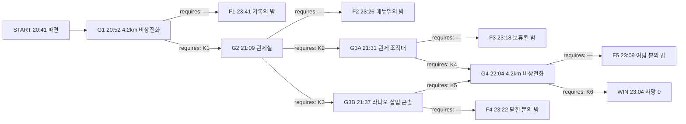

# 해원터널 — 하행 4.2km

## 1. 로그라인

해원터널 하행 4.2km에서 흰 연기가 올라온 밤, 기사는 실은 것을 말하지 않고 관제원은 고장 난 설비를 말하지 못한다. 요원에게 있는 것은 회선 하나와 세 시간이고, 없는 것은 집행권과 회신이다. 그날 죽은 사람은 이미 죽었고, 남은 질문은 무엇을 알았더라면 저 세 시간이 다르게 흘렀겠는가다.

---

## 2. 그래프

### 노드

| id | 시각 | 장소 | 등장 조건 | yields |
|---|---|---|---|---|
| START | 20:41 | 긴급상황대응실 → 회선 개통 | — | — |
| G1 | 20:52 | 하행 4.2km 비상전화 회선 | — | W1 |
| G2 | 21:09 | 해원터널 관제실 | G1에서 E1-key를 지난 밤에만 | W2, W3 |
| G3A | 21:31 | 해원터널 관제 조작대 | G2에서 E2-A를 지난 밤에만 | W4 |
| G3B | 21:37 | 해원터널 라디오 재방송 삽입 콘솔 | G2에서 E2-B를 지난 밤에만 | W5 |
| G4 | 22:04 | 하행 4.2km 비상전화 회선 | G3A에서 E3A-key를 지났거나 G3B에서 E3B-key를 지난 밤에만 | W6 |
| F1 | 23:41 | 하행 3.1~4.2km / 해원 IC 임시본부 | G1에서 E1-fail로 나간 밤에만 | K1, K2, K3, W4, W5, W6 |
| F2 | 23:26 | 하행 3.6~4.2km / 관제실 | G2에서 E2-fail로 나간 밤에만 | K6 |
| F3 | 23:18 | 관제 조작대 / 하행 3.6~4.4km | G3A에서 E3A-fail로 나간 밤에만 | K4, K6 |
| F4 | 23:22 | 하행 4.6km 피난연결통로 앞 | G3B에서 E3B-fail로 나간 밤에만 | K5, K6 |
| F5 | 23:09 | 하행 4.2km / 상행 3.8km 배수 갱도 | G4에서 E4-fail로 나간 밤에만 | K6 |
| WIN | 23:04 | 상행 3.8km 배수 갱도 출구 / 해원 IC | G4에서 E4-key를 지난 밤에만 | — |

### 간선

| id | 출발 → 도착 | 모이는 스탠스 | requires |
|---|---|---|---|
| E1-fail | G1 → F1 | S1-1 그대로 올린다 · S1-2 등급을 낮게 유지한다 | — |
| E1-key | G1 → G2 | S1-3 적재물로 코드를 매긴다 · S1-4 적재함을 열게 한다 | K1 |
| E2-fail | G2 → F2 | S2-1 매뉴얼을 지킨다 · S2-2 속도만 당긴다 | — |
| E2-A | G2 → G3A | S2-3 풍향을 눈으로 받는다 | K2 |
| E2-B | G2 → G3B | S2-4 스피커를 버린다 | K3 |
| E3A-fail | G3A → F3 | S3A-1 보류를 받는다 · S3A-2 본부에 올린다 | — |
| E3A-key | G3A → G4 | S3A-3 남은 기록을 앞에 둔다 · S3A-4 반려한 사람을 짚는다 | K4 |
| E3B-fail | G3B → F4 | S3B-1 표시된 곳으로 보낸다 · S3B-2 차에 남긴다 | — |
| E3B-key | G3B → G4 | S3B-3 배수 갱도로 보낸다 · S3B-4 유도 방향을 뒤집는다 | K5 |
| E4-fail | G4 → F5 | S4-1 그대로 둔다 · S4-2 물러나게만 한다 | — |
| E4-key | G4 → WIN | S4-3 앞 무더기만 끌어내리게 한다 · S4-4 앞과 뒤를 가르게 한다 | K6 |

**성공 경로 둘**

- 환기 갈래: START → G1 → G2 → G3A → G4 → WIN. requires = K1, K2, K4, K6 (네 개)
- 피난 갈래: START → G1 → G2 → G3B → G4 → WIN. requires = K1, K3, K5, K6 (네 개)

---

## 3. 앎

| 코드 | 앎 | 이 앎을 성립시키는 문장 | 성립시키지 못하는 약한 문장 |
|---|---|---|---|
| K1 | 4.2km에 선 탑차의 적재함에는 재활용장으로 가는 폐배터리가 실려 있고, 운송 신고는 되어 있지 않다 | 「적재함에 실린 것은 폐리튬전지이고 위험물 운송 신고 이력이 없다」 | (W1) 「기사의 대답이 한 박자씩 늦다」 |
| K2 | 하행 3구역 제트팬 두 대는 점검 뒤 역상으로 결선되어, 관제 화면이 가리키는 송풍 방향과 갱도 안 실제 방향이 반대다 | 「3구역 제트팬 지령 방향과 갱도 풍향계 기록이 서로 반대로 남는다」 | (W2) 「관제원이 조작대 앞에서 두 번 손을 멈춘다」 |
| K3 | 하행 3구역 이후 터널 스피커는 소리를 내지 못하고, 살아 있는 것은 차량 라디오 재방송 회선뿐이다 | 「3구역 이후 방송 앰프는 7월 낙뢰 이후 급전이 끊긴 채이고, 라디오 재방송 송출만 정상이다」 | (W3) 「방송을 내보냈는데 아무도 차에서 내리지 않는다」 |
| K4 | 21일 시험가동에서 3구역 풍향 역치 알람이 찍혔고, 그 보고를 반려한 사람이 오늘 야간 회선을 인수하는 팀장이며, 알람 원본은 관제 서버가 아니라 도로공사 원격감시에 그대로 남아 있다 | 「21일 3구역 풍향 역치 알람은 원격감시에 남아 있고, 그 보고를 닫은 결재자가 오늘 야간 인수자다」 | (W4) 「팀장이 조작 기록을 남기는 일을 꺼린다」 |
| K5 | 4.6km 피난연결통로 방화문은 도장 양생 때문에 안쪽에서 고정되어 열리지 않고, 대신 3.8km 배수 점검구가 자재 반입용으로 열린 채다 | 「4.6km 연결통로 방화문은 안쪽에서 각목으로 물려 있고, 3.8km 배수 점검구는 잠금이 풀린 채 열려 있다」 | (W5) 「유지관리 작업차가 4.6km 근처에 세워져 있다」 |
| K6 | 적재함 안 폐전지 상자는 앞·가운데·뒤 세 무더기로 실려 있고, 김이 오르는 것은 문 쪽 앞 무더기 하나뿐이다 | 「적재함 안은 세 무더기이고 열이 오른 것은 문 쪽 앞 무더기뿐, 나머지 둘은 아직 상온이다」 | (W6) 「적재함 안쪽에서 무언가 부풀어 오르는 소리가 난다」 |

W1~W6은 미끼다. 넘겨도 요원은 전제로 세우지 못하고, 왜 세우지 못했는지가 그 밤 보고서에 남는다.

---

## 4. 인물

**강태식 (52 · 화물차 기사)**
스물두 해째 5톤 탑차를 몬다. 오늘 짐은 부산 재활용장으로 가는 폐리튬전지 마흔여섯 상자다. 배차 사무실이 「일반 잡화」로 인수증을 끊었고, 강태식은 그것이 무엇을 뜻하는지 안다. 신고 없이 실은 위험물은 면허와 차를 함께 가져간다.
- 이해관계: 말하는 순간 입건이고, 차는 압류다. 밤을 조용히 넘기면 아무 일도 없었던 것이 된다.
- 아는 것: 적재함 안이 어떻게 실려 있는지. 어느 무더기에서 김이 오르는지. 인수증에 적힌 이름이 자기 것이 아니라는 것.
- 모르는 것: 폐전지가 물로 꺼지지 않는다는 것. 뒤쪽 갱도에 몇 대가 서 있는지.
- 게이트: G1, G4.

**오유리 (29 · 해원터널 관제 야간 관제원)**
야간 단독 근무 3년차. 조작대와 방송 콘솔과 라디오 삽입 콘솔이 전부 한 사람 손에 있다.
- 이해관계: 지난달 방송 앰프 급전이 끊긴 것도, 이달 3구역 팬 결선이 뒤집힌 것도 문서로 올렸고 둘 다 닫혔다. 오늘 갱도 안에서 무슨 일이 나면 조작 기록에 남는 이름은 오유리다.
- 아는 것: 21일 시험가동 때 3구역 풍향계 바늘이 지령과 반대로 튀었다는 것. 3구역 뒤 스피커가 소리를 내지 못한다는 것. 라디오 재방송 삽입은 정시 송출 사이에만 열린다는 것.
- 모르는 것: 4.6km 방화문이 어떤 상태인지. 적재함 안에 무엇이 실렸는지.
- 게이트: G2, G3A, G3B.

**정만호 (58 · 해원터널 관제 야간팀장)**
22시에 회선을 인수한다. 21일 「3구역 풍향 역치 알람」 보고를 「계기 오류」로 닫은 결재자다.
- 이해관계: 화면상 정상인 설비를 반대로 돌리는 조작은 조작 이력에 남고, 그 이력은 지난주 반려를 다시 꺼내 온다. 정년이 두 해 남았다.
- 아는 것: 자기가 무엇을 닫았는지. 조작 이력이 어디에 쌓이는지.
- 모르는 것: 21일 알람 원본이 관제 서버 밖 원격감시에도 올라가 있다는 것.
- 게이트: G3A.

**문재경 (41 · 유지관리 하청 반장)**
지난주부터 4.6km 피난연결통로 도장 작업을 맡았다. 양생 중인 방화문이 닫히지 않도록 안쪽에서 각목을 물려 두었고, 자재를 나르려고 3.8km 배수 점검구 잠금을 풀어 두었다. 둘 다 서류에 없다.
- 이해관계: 말하면 계약 해지고, 계약 해지는 열한 명 몫이다. 오늘 야간에 각목을 빼러 들어갈 예정이었다.
- 아는 것: 도면에 열려 있어야 할 문이 실제로는 열리지 않는다는 것. 도면에 없는 점검구가 열려 있다는 것.
- 모르는 것: 4.2km에서 무슨 일이 났는지. 갱도 안 풍향이 어느 쪽인지.
- 게이트: G3B.

**한소연 (37 · 소방 현장지휘)**
해원 IC 임시본부에서 지휘한다. 하행 입구는 3.1km 앞부터 굳어 소방차가 들어가지 못하고, 상행 역주행 진입은 상행 전면 통제가 끝나야 연다. 통제 완료 예정 22:12.
- 이해관계: 진입 인원 열한 명의 이름을 적는 사람이 자기다.
- 아는 것: 진입까지 남은 분. 관창으로 잡을 수 있는 불과 잡을 수 없는 불의 차이.
- 모르는 것: 요원이 무엇을 알아냈는지. 회선은 한 방향이다.
- 게이트: 없다. 이 사람이 세워 두는 것은 마감이다.

---

## 5. 게이트

### G1 — 20:52 · 하행 4.2km 비상전화 회선 · 등장 조건: —

비상전화 수화기가 들린 지 십일 분이 지났다. 회선 너머에서 들리는 것은 두 가지다. 하나는 갱도가 만드는 저음, 하나는 강태식의 숨소리다. 강태식은 차에서 세 걸음 떨어진 자리에 서 있다고 말한다.

「브레이크가 좀 탔습니다. 내리막을 길게 밟았어요. 물 좀 뿌리면 잡힙니다.」

CCTV 4.2km 카메라가 잡는 것은 탑차 뒤쪽에서 올라오는 흰 김이다. 곧게 오르다가 천장 3미터 아래에서 옆으로 눕는다. 갱도 안 공기가 어느 쪽으로 가는지를 그 눕는 방향이 말한다. 화면 오른쪽 끝, 4.25km 표지 아래로 승용차 두 대가 비상등을 켠 채 멈춰 선다. 그 뒤로 여섯 대. 그 뒤는 화면 밖이다.

강태식은 묻지 않은 것을 두 번 말한다. 짐은 별것 아니라고, 그냥 잡화라고. 첫 번째는 신고할 때 말했고 두 번째는 방금 말했다. 물어본 사람은 없다.

관제실에서 올라온 첫 통보는 「하행 4.2km 차량 연기, 일반 차량화재 준함」이다. 상황 코드가 그대로 굳으면 소방 출동 편성과 관제 환기 매뉴얼이 같이 따라 굳는다. 코드를 고쳐 올릴 수 있는 시간은 관제가 매뉴얼 A 첫 단계를 밟기 전까지다.

**요원에게 던지는 질문:** 4.2km에서 올라온 것을 무엇으로 올릴 것인가.

**스탠스**

- **S1-1 그대로 올린다** — 달리 볼 이유가 없으므로, 기사가 말한 브레이크 과열을 그대로 상황 코드에 적어 올린다.
  - 설명: 요원은 회선 너머 진술을 그대로 받아 적어 올렸다. 상황 코드는 일반 차량화재로 굳었고, 소방은 펌프차 두 대 편성으로 출동했으며, 관제는 매뉴얼 A 첫 단계인 3구역 제트팬 정방향 최대를 밟았다.
- **S1-2 등급을 낮게 유지한다** — 달리 등급을 올릴 근거가 없으므로, 일반 차량 연기로 접수해 두고 관제 매뉴얼이 정한 순서에 맡긴다.
  - 설명: 요원은 상황 코드에 손대지 않고 관제 절차가 먼저 굴러가게 두었다. 결과는 같았다. 코드가 굳는 순간 요원이 회선에 얹을 수 있는 무게가 사라졌다.
- **S1-3 적재물로 코드를 매긴다** — 기사가 실은 것을 말하지 않고 있다고 보고, 브레이크가 아니라 적재물을 기준으로 상황 코드를 올려 소방에 넘긴다.
  - 설명: 요원은 진술이 아니라 짐을 기준으로 코드를 다시 매겼다. 위험물 준함으로 올라가면서 소방 편성이 화학차 포함으로 바뀌었고, 관제 환기 절차도 매뉴얼 A에서 B로 넘어가 관제원과 요원 사이에 회선 하나가 더 열렸다.
- **S1-4 적재함을 열게 한다** — 기사가 적재함 뒤쪽을 보여 주지 않으려 한다고 보고, 문을 연 상태로 확인해 달라고 요청하고 그 응답을 상황 코드에 반영한다.
  - 설명: 요원은 적재함을 열어 달라고 요청했다. 강태식은 열지 않았고, 열지 않는다는 사실 자체가 코드를 올렸다. 위험물 준함으로 격상되면서 관제 절차가 매뉴얼 B로 넘어갔다.

**간선 집결:** S1-1, S1-2 → E1-fail(F1) / S1-3, S1-4 → E1-key(G2)

---

### G2 — 21:09 · 해원터널 관제실 · 등장 조건: G1에서 E1-key를 지난 밤에만

관제실은 한 사람이다. 오유리는 조작대와 방송 콘솔 사이에 의자를 놓고 앉아 있고, 위험물 준함 통보가 뜬 뒤로 매뉴얼 B를 화면에 띄워 둔 채다. 매뉴얼 B는 두 줄로 시작한다. 3구역 제트팬 정방향 최대. 3~5구역 피난 방송 반복.

오유리는 첫 줄에서 손을 멈춘다. 한 번 멈추고, 다시 올리고, 또 멈춘다. 회선으로는 자판 소리만 넘어온다. 조작대 왼쪽 아래에 3구역 풍향계 눈금이 있고, 오유리의 시선이 화면과 눈금 사이를 오간다.

두 번째 줄에서도 손이 멈춘다. 방송 콘솔 위에 노란 딱지가 붙어 있다. 글씨는 회선 너머로 보이지 않는다. 오유리는 딱지를 손톱으로 한 번 긁고, 대신 라디오 삽입 콘솔 쪽으로 몸을 돌렸다가 되돌아온다.

「매뉴얼대로 갑니다. 3구역 팬 올리고 방송 돌립니다. 이의 있으면 지금 말씀하세요. 한 번 올리면 갱도 안 공기가 자리를 잡는 데 십 분입니다.」

십 분이면 4.2km 뒤에 굳은 줄이 얼마나 길어지는지가 정해진다. 21:19에 하행 입구 차단이 완료되고, 그 뒤로 갱도 안 대수는 더 늘지 않는다. 늘지 않는 대신, 그 안에 있는 대수가 그대로 그 밤의 분모가 된다.

**요원에게 던지는 질문:** 관제원에게 무엇을 요청할 것인가.

**스탠스**

- **S2-1 매뉴얼을 지킨다** — 달리 지시할 근거가 없으므로, 관제가 정한 절차 순서를 그대로 두고 회선을 비운다.
  - 설명: 요원은 아무것도 요청하지 않았다. 3구역 제트팬이 정방향 최대로 올라갔고 3~5구역 피난 방송이 반복 송출되었다. 두 조작 모두 화면상으로는 완료로 찍혔다.
- **S2-2 속도만 당긴다** — 달리 다른 순서를 댈 근거가 없으므로, 같은 절차를 더 빨리 밟아 달라고만 요청한다.
  - 설명: 요원은 절차를 앞당겨 달라고 요청했다. 오유리는 그대로 따랐고, 매뉴얼 B 두 줄이 예정보다 사 분 일찍 끝났다. 사 분은 방향을 바꾸지 못한다.
- **S2-3 풍향을 눈으로 받는다** — 관제 화면이 가리키는 송풍 방향이 갱도 안 실제와 반대라고 보고, 3구역 송풍은 화면값이 아니라 갱도 풍향계 실측으로 판단해 달라고 요청한다.
  - 설명: 요원은 화면을 기준에서 내리고 눈금을 기준으로 올렸다. 오유리는 삼 초 동안 대답하지 않다가 3구역 지령을 보류로 걸고 풍향계 값을 읽어 회선에 불렀다. 지령과 눈금이 반대였다.
- **S2-4 스피커를 버린다** — 3구역 뒤 터널 스피커가 소리를 내지 못한다고 보고, 피난 안내를 방송이 아니라 차량 라디오 재방송 회선으로 내보내 달라고 요청한다.
  - 설명: 요원은 방송 콘솔을 버리고 라디오 삽입 콘솔을 요청했다. 오유리는 노란 딱지를 떼어 회선 앞에 읽어 주었고, 삽입 창이 다음 정시 송출 사이에 열린다고 알렸다.

**간선 집결:** S2-1, S2-2 → E2-fail(F2) / S2-3 → E2-A(G3A) / S2-4 → E2-B(G3B)

---

### G3A — 21:31 · 해원터널 관제 조작대 · 등장 조건: G2에서 E2-A를 지난 밤에만

풍향계 값을 읽은 뒤 오유리가 한 일은 조작이 아니라 전화였다. 화면상 정상인 설비를 화면과 반대로 돌리는 조작은 단독 근무자가 혼자 찍을 수 없다. 야간팀장 승인이 이력에 함께 박힌다.

정만호는 아직 관제실에 없다. 인수는 22시다. 휴대전화로 붙은 회선은 잡음이 섞인다.

「눈금 튀는 건 21일에도 그랬어. 계기 문제라고 이미 정리된 건이야. 정상 표시 나는 설비를 역으로 돌려? 그거 이력에 남는 거 알지. 나 올라갈 때까지 손대지 마. 인수하고 내가 보고 판단해.」

오유리는 「예」라고 대답하지 않는다. 대답하지 않은 채로 조작대 앞에 앉아 있다. 3구역 지령은 보류로 걸린 상태고, 보류는 십오 분 뒤 자동으로 풀려 매뉴얼 값으로 되돌아간다. 21:46이다.

22:00에 회선이 넘어가면 요청의 상대가 바뀐다. 그 뒤로 요원이 무엇을 말하든 조작대 앞에 앉은 사람은 오유리가 아니다.

**요원에게 던지는 질문:** 팀장이 건 보류를 어떻게 할 것인가.

**스탠스**

- **S3A-1 보류를 받는다** — 달리 다툴 근거가 없으므로, 팀장이 건 보류를 받아들이고 인수 시각까지 기다린다.
  - 설명: 요원은 기다렸다. 21:46에 보류가 자동으로 풀리며 3구역 지령이 매뉴얼 값으로 되돌아갔고, 팬은 화면상 정방향으로 다시 올라갔다. 22:00 인수 뒤 정만호가 조작대에 앉았고, 실측을 확인하고 지령을 뒤집은 것은 22:19다.
- **S3A-2 본부에 올린다** — 달리 뒤집을 근거가 없으므로, 보류 사실만 본부 교신에 남기고 다음 지시를 기다린다.
  - 설명: 요원은 교신을 올렸다. 본부는 받았고, 회신하지 않았다. 파견 뒤에 내려오는 지시는 없다. 21:46에 보류가 풀렸다.
- **S3A-3 남은 기록을 앞에 둔다** — 팀장이 감추려는 것이 이미 관제실 바깥에 올라가 있다고 보고, 21일 알람이 남아 있는 자리를 팀장 앞에 놓고 조작을 요청한다.
  - 설명: 요원은 원격감시 쪽에 남은 21일 알람을 회선 위에 올렸다. 정만호는 두 번 되물었고, 세 번째에는 되묻지 않았다. 승인 코드가 21:38에 찍혔다.
- **S3A-4 반려한 사람을 짚는다** — 지난주 그 보고를 닫은 사람과 지금 보류를 건 사람이 같다고 보고, 그 반려 건을 앞에 놓고 조작을 요청한다.
  - 설명: 요원은 반려 결재선을 회선 위에 올렸다. 정만호는 인수를 앞당기겠다고 말했다가 말을 바꿔 전화로 승인 코드를 불렀다. 21:39에 3구역 지령이 실측 기준으로 뒤집혔다.

**간선 집결:** S3A-1, S3A-2 → E3A-fail(F3) / S3A-3, S3A-4 → E3A-key(G4)

---

### G3B — 21:37 · 해원터널 라디오 재방송 삽입 콘솔 · 등장 조건: G2에서 E2-B를 지난 밤에만

노란 딱지에 적힌 것은 「3구역 이후 방송 급전 없음, 7/19 낙뢰, 복구 미정」이다. 오유리가 그것을 회선 앞에 읽어 준 뒤로 방송 콘솔은 꺼져 있다.

라디오 삽입 콘솔은 살아 있다. 터널 안 차량 라디오는 갱도 재방송 중계기를 탄다. 삽입 창은 정시 송출 사이에만 열리고, 이번 창은 21:44다. 놓치면 다음은 22:14다. 삼십 분이다.

원고는 한 문장이다. 그 한 문장이 갱도 안 삼백 대 남짓에게 어느 방향으로 걸으라고 말한다. 하행 갱도 피난 표시는 4.6km 피난연결통로를 가리킨다. 도면에도 그렇게 있다. 4.2km에 선 줄에서 4.6km는 진행 방향으로 사백 미터고, 되돌아 걷는 3.8km는 사백 미터다. 거리는 같다.

CCTV 상행 4.6km 카메라에 유지관리 작업차 한 대가 잡힌다. 적재함에 도장 자재가 실려 있고, 운전석은 비어 있다. 하행 카메라에는 3.8km 벽면에 세워 둔 자재 팔레트가 걸린다.

오유리가 원고 입력창에 커서를 놓고 기다린다. 「어디로 보낼까요. 한 번 나가면 그 방향으로 다 움직입니다.」

**요원에게 던지는 질문:** 21:44 창으로 사람을 어디로 보낼 것인가.

**스탠스**

- **S3B-1 표시된 곳으로 보낸다** — 달리 다른 곳을 댈 근거가 없으므로, 갱도 피난 표시가 가리키는 방향으로 걸어가라고 내보낸다.
  - 설명: 요원은 표시를 따르게 했다. 원고가 21:44에 나갔고, 갱도 안 사람이 차에서 내려 진행 방향으로 걷기 시작했다. 걸어간 끝에 있던 것은 열리지 않는 방화문이다.
- **S3B-2 차에 남긴다** — 달리 움직이게 할 근거가 없으므로, 창을 닫고 차 안에서 기다리라고 내보낸다.
  - 설명: 요원은 사람을 차 안에 두었다. 원고가 21:44에 나갔고 대부분이 따랐다. 연기가 3.6km까지 내려온 것은 22:03이다.
- **S3B-3 배수 갱도로 보낸다** — 표시가 가리키는 통로가 실제로는 열리지 않는다고 보고, 되돌아 걸어 3.8km 배수 점검구로 나가라고 내보낸다.
  - 설명: 요원은 도면에 없는 문을 원고에 적게 했다. 오유리는 점검구 위치를 두 번 확인하고 21:44 창에 밀어 넣었다. 「진행 방향 아님, 뒤로 사백 미터, 벽 오른쪽 철문」이 갱도 안 라디오로 흘렀다.
- **S3B-4 유도 방향을 뒤집는다** — 사람이 모이면 못 나오는 문이 앞에 있다고 보고, 유도 방향을 진행 반대쪽으로 뒤집어 내보낸다.
  - 설명: 요원은 방향부터 뒤집었다. 원고는 목적지 대신 방향만 담았고, 되돌아 걷던 줄이 3.8km 자재 팔레트 앞에서 열린 철문을 찾아냈다.

**간선 집결:** S3B-1, S3B-2 → E3B-fail(F4) / S3B-3, S3B-4 → E3B-key(G4)

---

### G4 — 22:04 · 하행 4.2km 비상전화 회선 · 등장 조건: G3A에서 E3A-key를 지났거나 G3B에서 E3B-key를 지난 밤에만

상행 전면 통제가 22:12에 끝난다. 소방 1진 열한 명이 상행 역주행으로 들어가 4.2km 맞은편에 붙는 데까지 다시 육 분이다. 요원에게 남은 것은 여덟 분이고, 여덟 분 동안 4.2km에 있는 사람은 강태식 하나다.

강태식은 아직 회선을 놓지 않았다. 목소리가 아까와 다르다. 갱도 저음 위로 짧고 둔한 소리가 규칙 없이 섞인다. 무언가 부풀었다가 터지는 소리다.

「안에서 자꾸 소리가 납니다. 문은 안 엽니다. 열면 바람 들어가서 더 커진다고, 그렇게 배웠습니다.」

배운 것은 맞다. 다만 배운 그것은 기름불 이야기다. 적재함 안에서 진행 중인 것은 스스로 산소를 만들며 옆으로 옮겨 붙는 반응이고, 옮겨 붙는 속도는 사이가 얼마나 떨어져 있느냐로 정해진다. 옮겨 붙기 전까지는 되돌릴 수 없는 지점이 아니고, 옮겨 붙은 뒤에는 되돌릴 것이 없다.

강태식이 문을 열지 않는 이유는 하나 더 있다. 문을 열면 마흔여섯 상자가 다 보인다. 인수증에는 잡화라고 적혀 있다.

「차에서 떨어지라고요. 이 차 두고 어디로 갑니까.」

**요원에게 던지는 질문:** 남은 여덟 분 동안 기사에게 무엇을 요청할 것인가.

**스탠스**

- **S4-1 그대로 둔다** — 달리 손댈 근거가 없으므로, 적재함을 닫아 둔 채 소방 진입까지 기다려 달라고 요청한다.
  - 설명: 요원은 현 상태 유지를 요청했다. 강태식은 그대로 있었다. 22:17에 안쪽에서 옮겨 붙었고, 22:18에 적재함 옆판이 벌어졌다.
- **S4-2 물러나게만 한다** — 달리 시킬 근거가 없으므로, 기사에게 차에서 떨어져 걸어 나오라고만 요청한다.
  - 설명: 요원은 물러나라고 요청했다. 요원에게는 집행권이 없고, 강태식은 운전석 문에 손을 얹은 채 서 있었다. 회선은 22:18까지 열려 있었다.
- **S4-3 앞 무더기만 끌어내리게 한다** — 김이 오르는 것은 문 쪽 앞 무더기 하나뿐이라고 보고, 적재함을 열고 그 무더기만 갓길로 끌어내려 달라고 요청한다.
  - 설명: 요원은 열라고 했고, 무엇을 얼마나 내릴지까지 말했다. 강태식이 문을 열고 앞 무더기 열여섯 상자를 갓길 배수구 쪽으로 밀어 내렸다. 22:11이다. 남은 두 무더기는 상온이었다.
- **S4-4 앞과 뒤를 가르게 한다** — 아직 상온인 짐이 안쪽에 남아 있다고 보고, 열이 오른 쪽과 남은 쪽 사이를 갈라 달라고 요청한다.
  - 설명: 요원은 무더기 사이를 벌리라고 요청했다. 강태식이 문을 열고 앞 무더기를 밀어낸 뒤 가운데 무더기를 안쪽 벽까지 당겼다. 사이가 이 미터 벌어졌다. 22:10이다.

**간선 집결:** S4-1, S4-2 → E4-fail(F5) / S4-3, S4-4 → E4-key(WIN)

---

## 6. 결과 꼬리

### F1 — 기록의 밤 (20:52 손이 닿지 않게 됨 → 23:41 종단)

상황 코드가 「하행 4.2km 일반 차량화재」로 굳는다. 그 뒤로 요원이 회선에 얹을 자리는 없다. 관제는 매뉴얼 A를 순서대로 밟고, 소방은 펌프차 두 대를 편성해 출발하고, 강태식은 차 옆에 서 있고, 아무도 요원에게 아무것도 묻지 않는다. 요원의 무전은 나가지 않는다. 나갈 자리가 없다.

**20:58.** 오유리가 매뉴얼 A 첫 단계를 밟는다. 3구역 제트팬 네 대 정방향 최대. 조작대 화면에 완료가 뜬다. 왼쪽 아래 풍향계 눈금이 반대로 눕는다. 오유리는 눈금을 삼 초 본다. 화면 쪽을 다시 본다. 손을 무릎에 내린다.

**21:03.** CCTV 4.2km 화면에서 흰 김이 방향을 바꾼다. 아까까지 진행 방향으로 눕던 것이 입구 쪽으로 눕는다. 4.25km에서 4.15km로, 4.15km에서 4.05km로, 카메라 세 대가 차례로 뿌예진다.

**21:14 — 요원 보고서 1신.**
> 20:58 관제 3구역 송풍 조작 완료 통보. 조작대 화면 완료 표시 확인.
> 21:03 4.2km 이후 하행 카메라 화면 백탁 시작. 백탁 진행 방향은 갱도 입구 쪽.
> 조작 통보의 지령 방향과 화면상 확산 방향이 서로 반대다. 두 값을 같이 적어 둔다.
> 하행 입구 차단 21:19 예정. 차단 시점 갱도 내 대수 집계 요청은 통보되지 않았다.

**21:19.** 하행 입구가 닫힌다. 갱도 안에 남은 것은 승용차 이백사십일 대, 승합 열아홉 대, 화물 넷, 통근버스 하나. 사람은 삼백열한 명이다. 그 숫자는 이 밤이 끝날 때까지 분모다.

**21:22.** 오유리가 매뉴얼 A 둘째 줄을 밟는다. 3~5구역 피난 방송 반복 송출. 콘솔에 송출 램프가 들어온다. 갱도 안에서는 아무 소리도 나지 않는다. CCTV 4.0km, 3.9km, 3.8km — 창을 내린 사람은 없고 내린 사람도 없다. 오유리가 송출 버튼을 두 번 더 누른다. 세 번째에 콘솔 위 노란 딱지를 손톱으로 긁는다.

**21:34.** 4.05km 부근에서 승합차 한 대가 문을 연다. 남자 하나가 내려 앞쪽을 보다가 다시 탄다. 창을 올린다.

**21:52 — 요원 보고서 2신.**
> 21:19 하행 입구 차단 완료. 갱도 내 차량 이백육십오 대 통보.
> 21:22 피난 방송 송출 개시 통보. 송출 램프 점등 확인.
> 21:22부터 21:50까지 3~5구역 카메라 열한 대에서 하차 인원 누계 한 명. 하차 후 재승차.
> 방송이 나간 구간과 사람이 움직인 구간이 겹치지 않는다. 겹치지 않는다는 것만 적어 둔다.
> 관제 콘솔 상단에 부착물 있음. 내용 판독 불가.

**22:06.** 회선 너머 강태식의 말이 끊긴다. 끊기기 전 마지막 열 초 동안 짧고 둔한 소리가 넷 들어온다. 그다음이 하나 더 있고, 그것은 짧지 않다. CCTV 4.2km 카메라가 흰색에서 주황색으로 바뀌었다가 신호를 잃는다.

**22:11.** 4.2km 이후 갱도 온도계 세 개가 차례로 상한을 넘는다. 3.9km 카메라에 사람이 처음으로 여럿 보인다. 차에서 내려 입구 쪽으로 걷는다. 걷는 쪽으로 연기가 오고 있다. 연기가 오는 방향과 사람이 가는 방향이 같다.

**22:23 — 요원 보고서 3신.**
> 22:06 4.2km 비상전화 회선 단절. 단절 직전 압력 파열음 다섯 회 청취. 마지막 한 회는 지속음.
> 22:06 4.2km 카메라 신호 상실.
> 22:11부터 3.9km 이하 구간 하차 인원 급증. 이동 방향 입구 쪽.
> 갱도 내 기류 방향 입구 쪽. 도보 이동 방향과 기류 방향 일치.
> 4.2km 차량 적재물에 관해 20:52 청취 내용은 「잡화」. 파열음 성상은 잡화 적재와 부합하지 않는다. 부합하지 않는다는 것만 적어 둔다.

**22:12.** 상행 전면 통제 완료. 22:18에 소방 1진 열한 명이 상행 역주행으로 들어간다. 4.6km 피난연결통로로 붙어 하행으로 건너갈 계획이다.

**22:31.** 1진이 상행 4.6km에 붙는다. 방화문이 열리지 않는다. 안쪽에서 무언가 물려 있다. 열한 명이 문 앞에서 육 분을 쓴다. 22:37에 계획을 바꿔 상행 3.8km로 이동한다. 벽면 자재 팔레트 옆 철문이 열려 있다. 그 문으로 배수 갱도를 타고 하행으로 건넌다. 22:49다.

**22:58 — 요원 보고서 4신.**
> 22:18 소방 1진 열한 명 상행 진입.
> 22:31 상행 4.6km 피난연결통로 도달. 개방 실패. 사유 미통보.
> 22:37 이동 개시. 22:49 상행 3.8km 배수 점검구 경유 하행 진입 완료.
> 도면상 피난 경로와 실제 사용 경로가 다르다. 4.6km에 유지관리 작업차 정차 중. 3.8km 벽면 도장 자재 적치 확인.
> 1진 중 두 명 이탈. 22:52 하행 3.7km에서 후송.

**23:02.** 1진이 하행 3.6km에서 사람을 만난다. 처음 스물넷은 걸어 나온다. 그다음부터는 업고 나온다. 3.4km에서 통근버스를 연다. 안에 열아홉이 있다. 열아홉 중 넷이 스스로 내린다.

**23:20.** 하행 3.1km 이후 갱도가 조용해진다. 조용해졌다는 것은 두 가지 중 하나를 뜻하고, 이 밤에는 뒤엣것이다.

**23:26 — 요원 보고서 5신.**
> 23:02 1진 하행 진입 후 인명 접촉 개시. 자력 보행 스물넷.
> 23:14 통근버스 개방. 탑승 열아홉, 자력 보행 넷.
> 23:20 하행 3.1~4.2km 구간 반응 없음.
> 4.2km 차량 운전자 강태식, 22:06 이후 접촉 없음.

**23:41 — 요원 최종 보고서.**
> 하행 4.2km 정차 차량 적재물 확인. 폐리튬전지 마흔여섯 상자. 위험물 운송 신고 이력 없음. 인수증 품목란 「잡화」. 인수증 서명은 배차 사무실 명의.
> 3구역 제트팬 조작 이력 대조. 20:58 지령 정방향. 같은 시각 3구역 풍향계 기록 역방향. 지령과 기록이 전 구간에서 반대.
> 3구역 이후 방송 앰프 급전 계통 확인. 7월 19일 낙뢰 이후 복구 미실시. 21:22 이후 송출 램프는 점등, 갱도 음압 기록은 무. 라디오 재방송 중계기는 같은 시각 정상 송출.
> 4.6km 피난연결통로 방화문 개방 실패 사유 미확인. 3.8km 배수 점검구 잠금 해제 상태.
> 집계는 별도.

이 밤에 요원이 한 판단은 하나였다. 20:52에 상황 코드를 적은 것. 그 뒤 두 시간 사십구 분 동안 요원이 한 일은 받아 적는 것이었다.

**이 꼬리에서 캘 수 있게 되는 문장**

- **K1 성립** — 「적재함에 실린 것은 폐리튬전지이고 위험물 운송 신고 이력이 없다」 (최종 보고서)
- **K2 성립** — 「3구역 제트팬 지령 방향과 갱도 풍향계 기록이 서로 반대로 남는다」 (최종 보고서, 1신이 재료)
- **K3 성립** — 「3구역 이후 방송 앰프는 7월 낙뢰 이후 급전이 끊긴 채이고, 라디오 재방송 송출만 정상이다」 (최종 보고서, 2신이 재료)
- W4만 있음 — 「팀장이 조작 기록을 남기는 일을 꺼린다」는 이 밤에 성립하지 않는다. 정만호는 이 밤에 회선에 등장하지 않았다. K4는 아직 없다.
- W5만 있음 — 「유지관리 작업차가 4.6km 근처에 세워져 있다」까지가 4신이 준 전부다. 방화문이 왜 열리지 않았는지는 미통보로 남았다. K5는 아직 없다.
- W6만 있음 — 「적재함 안쪽에서 무언가 부풀어 오르는 소리가 난다」까지다. 안이 어떻게 실려 있었는지는 이 밤에 아무도 보지 못했다. K6는 아직 없다.

---

### F2 — 매뉴얼의 밤 (21:09 손이 닿지 않게 됨 → 23:26 종단)

상황 코드는 위험물 준함으로 올라갔다. 소방 편성에 화학차가 붙고 진입 판단이 빨라진다. 바뀌지 않은 것은 갱도 안 공기다.

21:14에 3구역 제트팬이 정방향 최대로 올라가고 21:19에 기류가 입구 쪽으로 눕는다. 21:26에 피난 방송이 나가고 아무도 내리지 않는다. 21:40에 화학차가 해원 IC에 도착하고, 하행 입구가 3.1km 앞부터 굳어 있어 들어가지 못한다. 22:02에 상행 통제가 앞당겨 끝나고 22:08에 1진이 들어간다. 4.6km 방화문에서 육 분을 버리고 3.8km 배수 점검구로 돌아 22:39에 하행에 붙는다.

**22:16 — 요원 보고서 1신.**
> 21:14 3구역 송풍 조작 완료. 21:19 기류 입구 쪽 확인. 지령과 기록 방향 상반.
> 21:26 방송 송출. 하차 인원 무.
> 21:58 4.2km 회선 단절. 단절 직전 파열음 다수.

**23:26 — 요원 최종 보고서.**
> 22:39 1진 하행 진입. 자력 보행 백구십사, 후송 육십.
> 4.2km 차량 적재함 잔해 확인. 상자 잔해가 세 무리로 나뉜 채 남아 있다. 문 쪽 무리는 전소, 안쪽 두 무리는 외피만 그을렸다. 무리 사이 간격 약 1.4미터.
> 4.2km 차량 운전자 강태식, 21:58 이후 접촉 없음. 22:41 운전석 옆에서 수습.
> 3구역 조작 이력 및 4.6km 개방 실패 건은 별건 조사로 넘긴다.

**이 꼬리에서 캘 수 있게 되는 문장**

- **K6 성립** — 「적재함 안은 세 무더기이고 열이 오른 것은 문 쪽 앞 무더기뿐, 나머지 둘은 아직 상온이다」 (최종 보고서. 안쪽 두 무리가 외피만 그을린 채 남았다는 것이 그것을 말한다)
- K2, K3은 첫 밤에 이미 성립했다. 이 밤은 그 둘을 다시 확인해 주기만 한다.
- K4, K5는 없다. 정만호는 이 밤에도 회선에 등장하지 않고, 방화문 건은 별건으로 넘어간다.

---

### F3 — 보류된 밤 (21:31 손이 닿지 않게 됨 → 23:18 종단)

보류는 21:46에 자동으로 풀린다. 풀리는 소리는 나지 않는다. 조작대 화면에서 3구역 지령이 매뉴얼 값으로 되돌아가고, 오유리는 그것을 본다.

22:00에 정만호가 관제실에 들어와 인수를 찍는다. 조작대 앞에 앉는다. 풍향계 눈금을 본다. 십구 분 동안 본다. 22:19에 3구역 지령을 실측 기준으로 뒤집는다. 뒤집는 조작에는 정만호 자기 이름이 찍힌다.

기류가 돌아서는 데 십 분이 더 걸린다. 22:29에 4.2km 이후 카메라가 다시 맑아지기 시작한다. 그 삼십삼 분 동안 연기가 내려간 곳은 3.4km까지다.

**22:34 — 요원 보고서 1신.**
> 21:46 3구역 지령 보류 자동 해제. 매뉴얼 값 복귀.
> 22:00 야간 인수. 22:19 3구역 지령 역전 조작. 조작자 야간팀장.
> 21:46부터 22:19까지 33분간 기류 입구 쪽 유지. 연기 도달 하행 3.4km.

**23:18 — 요원 최종 보고서.**
> 22:29 이후 기류 반전 확인. 22:44 1진 하행 진입.
> 자력 보행 이백팔십구, 후송 이십이.
> 4.2km 차량 적재함 잔해. 상자 잔해 세 무리. 문 쪽 무리 전소, 안쪽 두 무리 외피 그을림. 무리 사이 1.4미터.
> 21일 3구역 풍향 역치 알람 조회. 관제 서버 기록은 「계기 오류」로 종결, 결재자 야간팀장 정만호. 같은 알람이 도로공사 원격감시 서버에 원본으로 남아 있다. 원격감시 기록은 관제실에서 삭제할 수 없다.
> 4.2km 차량 운전자 강태식, 22:21 수습.

**이 꼬리에서 캘 수 있게 되는 문장**

- **K4 성립** — 「21일 3구역 풍향 역치 알람은 원격감시에 남아 있고, 그 보고를 닫은 결재자가 오늘 야간 인수자다」 (최종 보고서)
- **K6 성립** — 「적재함 안은 세 무더기이고 열이 오른 것은 문 쪽 앞 무더기뿐, 나머지 둘은 아직 상온이다」 (최종 보고서)
- K5는 없다. 이 밤에 4.6km 방화문은 열지 않아도 되었다. 1진이 하행 입구 쪽으로 붙었다.

---

### F4 — 닫힌 문의 밤 (21:37 손이 닿지 않게 됨 → 23:22 종단)

21:44 창으로 원고가 나간다. 라디오는 살아 있었고, 사람도 살아 있었다. 21:47부터 하행 3.6~4.2km 구간에서 차 문이 열리기 시작한다. 처음에는 몇, 그다음에는 줄이 된다. 줄은 진행 방향으로 걷는다. 표시가 그쪽을 가리킨다.

**21:58 — 요원 보고서 1신.**
> 21:44 라디오 재방송 삽입 송출. 21:47부터 하차 개시.
> 21:55 기준 도보 이동 인원 누계 이백삼십 이상. 이동 방향 진행 쪽.
> 방송 콘솔 대비 라디오 회선 도달률 현저히 높다.

**22:09.** 선두가 4.6km 피난연결통로에 닿는다. 손잡이를 당긴다. 열리지 않는다. 어깨로 민다. 안쪽에서 무언가 걸려 있고 문틈으로 페인트 냄새가 난다. 뒤에서 사람이 계속 온다. 통로 앞은 폭 3미터고, 사람은 사백 미터 줄에서 계속 흘러든다.

**22:14.** 연기가 4.2km에서 밀려 4.6km 쪽으로도 얇게 돈다. 4.2km에서 22:11에 옮겨 붙었고 갱도 안 압력이 한 번 흔들렸다. 흔들린 압력이 연기를 양쪽으로 나눈다.

**22:22.** 문 앞에 백사십 명이 모여 있다. 뒤로 돌아 걷기 시작한 사람과 앞으로 밀려드는 사람이 통로 입구에서 부딪힌다.

**22:47 — 요원 보고서 2신.**
> 22:09 선두 4.6km 도달. 22:09부터 22:31까지 개방 시도 반복. 개방되지 않음.
> 22:22 통로 앞 체류 인원 백사십 이상. 22:29 대열 역류 발생.
> 22:11 4.2km 파열. 이후 4.6km 방향으로도 연기 확산.

**23:22 — 요원 최종 보고서.**
> 22:38 1진 상행 진입. 22:51 상행 4.6km 도달. 하행 쪽 방화문 개방 실패. 상행 쪽에서도 열리지 않는다.
> 23:01 상행 3.8km 배수 점검구 경유 하행 진입.
> 4.6km 하행 쪽 방화문 안쪽에 각목 두 개가 문틀과 문짝 사이에 물려 있다. 도장 양생 중 문이 닫히지 않도록 물린 것으로 보인다. 작업 기록은 서류에 없다.
> 3.8km 배수 점검구는 잠금이 풀린 채 열려 있었다. 벽면에 도장 자재 적치. 도면상 피난 경로에 포함되지 않는다.
> 자력 보행 이백칠십, 후송 사십.
> 4.2km 차량 적재함 잔해. 상자 잔해 세 무리. 문 쪽 무리 전소, 안쪽 두 무리 외피 그을림.
> 4.2km 차량 운전자 강태식, 22:33 수습.

**이 꼬리에서 캘 수 있게 되는 문장**

- **K5 성립** — 「4.6km 연결통로 방화문은 안쪽에서 각목으로 물려 있고, 3.8km 배수 점검구는 잠금이 풀린 채 열려 있다」 (최종 보고서)
- **K6 성립** — 「적재함 안은 세 무더기이고 열이 오른 것은 문 쪽 앞 무더기뿐, 나머지 둘은 아직 상온이다」 (최종 보고서)
- K4는 없다. 이 밤에 조작대 쪽 회선은 열리지 않았다.

---

### F5 — 여덟 분의 밤 (22:04 손이 닿지 않게 됨 → 23:09 종단)

여기까지 온 밤은 사람을 다 살렸다. 갱도 안 삼백열한 명은 22:04 시점에 이미 연기 밖이다. 남은 것은 4.2km에 선 한 사람과, 22:18에 들어갈 열한 명이다.

**22:17.** 적재함 안에서 앞 무더기가 가운데 무더기로 옮겨 붙는다. 옮겨 붙는 데 걸린 시간은 십삼 분이었고, 사이가 벌어져 있었다면 더 걸렸을 것이다.

**22:18.** 옆판이 벌어진다. 회선이 끊긴다. 같은 시각 1진 열한 명이 상행 갱도에 들어간다.

**22:41.** 1진이 3.8km 배수 갱도를 타고 하행 4.0km에 붙는다. 4.0km에서 4.2km까지 이백 미터를 남기고 두 번째 파열이 온다. 셋이 넘어지고 하나가 일어나지 못한다.

**23:09 — 요원 최종 보고서.**
> 22:18 4.2km 회선 단절. 22:41 1진 하행 접근. 22:44 2차 파열.
> 진입 인원 열한 명 중 세 명 부상, 한 명 사망.
> 4.2km 차량 운전자 강태식, 22:52 운전석 옆에서 수습.
> 적재함 잔해. 상자 잔해 세 무리. 문 쪽 무리와 가운데 무리 사이 간격 0.3미터, 가운데와 안쪽 사이 0.4미터. 세 무리 모두 반응 진행.
> 22:04 시점 촬영본 대조. 문 쪽 무리에서만 증기가 올라오고 있었다.

**이 꼬리에서 캘 수 있게 되는 문장**

- **K6 성립** — 「적재함 안은 세 무더기이고 열이 오른 것은 문 쪽 앞 무더기뿐, 나머지 둘은 아직 상온이다」 (최종 보고서. 22:04 시점 촬영본 대조가 그것을 말한다)
- 다른 앎은 이미 손에 있는 밤이다. 여기까지 왔다는 것이 그 증거다.

---

### WIN — 23:04 종단

기류든 발이든, 삼백열한 명이 연기보다 먼저 자리를 옮겼다. 강태식이 문을 열고 앞 무더기를 갓길로 내렸다. 22:11이다. 남은 두 무더기가 상온으로 남았고 옮겨 붙지 않았다. 소방 1진이 22:24에 4.2km에 붙어 갓길에 내려놓은 열여섯 상자를 모래로 덮는다. 물은 쓰지 않는다.

강태식은 자기 발로 나온다. 나오는 길에 인수증을 접어 주머니에 넣었고, 23:00에 그것을 꺼내 놓는다.

23:04에 하행 갱도가 닫힌다. 열이틀 동안 닫혀 있게 된다.

---

## 7. 집계

집계 단위는 셋이다.

- **4.2km 뒤에 갇힌 사람** — 21:19 입구 차단 시점 삼백열한 명
- **4.2km에 선 화물차 기사** — 한 명
- **갱도로 들어간 대원** — 열한 명

| 종단 | 갇힌 사람 | 기사 | 대원 | 사망 합계 | 그 밤이 남기는 것 |
|---|---|---|---|---|---|
| F1 | 194 사망 | 사망 | 2 사망 | **197** | 하행 갱도 삼 주 폐쇄. 원인 조사는 브레이크 과열로 시작해 넉 달을 쓴다. |
| F2 | 57 사망 | 사망 | 0 | **58** | 3구역 조작 이력과 4.6km 개방 실패가 각각 별건으로 넘어가 서로 만나지 않는다. |
| F3 | 22 사망 | 사망 | 0 | **23** | 정만호 파면. 오유리 조작 이력에 21:46 자동 해제가 남는다. |
| F4 | 40 사망 | 사망 | 0 | **41** | 문재경과 하청 열한 명 계약 해지. 문재경 입건. 4.6km 통로 앞 백사십 명 체류가 기록에 남는다. |
| F5 | 0 | 사망 | 1 사망 | **2** | 강태식 사망으로 인수증 명의자 수사가 배차 사무실까지 가지 못한다. |
| WIN | 0 | 0 | 0 | **0** | 강태식 입건. 문재경 입건과 하청 계약 해지. 정만호 징계. 오유리 이름이 조작 이력에 남는다. 하행 갱도 열이틀 폐쇄. |

WIN에서도 값은 남는다. 남는 값이 목숨이 아닐 뿐이다.

---

## 8. 고정 타임라인

| 시각 | 표면 | 장소 | 사건 | 조건 |
|---|---|---|---|---|
| 20:39 | 통화 | 하행 4.2km 비상전화 | 강태식이 신고한다. 브레이크 과열, 흰 연기, 곧 잡힌다고 말한다. 짐은 잡화라고 덧붙인다. 물은 사람은 없다. | — |
| 20:41 | 문서 | 긴급상황대응실 | 하행 4.2km 차량 연기 접수. 요원 파견. 회선 개통. | — |
| 20:44 | CCTV | 하행 4.2km | 탑차 뒤쪽에서 흰 김이 오른다. 천장 3미터 아래에서 진행 방향으로 눕는다. | — |
| 20:47 | CCTV | 하행 4.25km | 승용차 두 대가 비상등을 켜고 멈춘다. 뒤로 여섯 대. | — |
| 20:50 | 통화 | 하행 4.2km 비상전화 | 강태식이 짐이 잡화라고 두 번째로 말한다. 대답이 한 박자씩 늦다. | — |
| 20:56 | 문서 | 배차 사무실 | 인수증 품목란 「잡화」. 서명 명의는 배차 사무실. 강태식 서명 없음. | 적재물 조회가 걸린 밤에만 |
| 20:58 | 현장 | 관제 조작대 | 3구역 제트팬 정방향 최대. 화면 완료. 왼쪽 아래 풍향계 눈금이 반대로 눕는다. | 코드가 일반 차량화재로 굳은 밤에만 |
| 21:03 | CCTV | 하행 4.05~4.25km | 흰 김이 입구 쪽으로 방향을 바꾼다. 카메라 세 대가 차례로 뿌예진다. | 3구역 지령이 정방향인 밤에만 |
| 21:06 | 현장 | 관제실 | 위험물 준함 통보. 매뉴얼 B가 화면에 뜬다. 오유리가 조작대 앞에서 두 번 손을 멈춘다. | 코드가 위험물로 올라간 밤에만 |
| 21:12 | 현장 | 관제실 | 방송 콘솔 위 노란 딱지. 「3구역 이후 방송 급전 없음, 7/19 낙뢰, 복구 미정」. 회선 너머로는 글씨가 보이지 않는다. | — |
| 21:19 | 문서 | 하행 입구 | 입구 차단 완료. 갱도 내 이백육십오 대, 삼백열한 명. | — |
| 21:22 | 현장 | 관제실 / 하행 3.4~4.2km | 피난 방송 송출. 램프 점등. 갱도 안에서 소리가 나지 않는다. 창을 내린 사람이 없다. | 방송 콘솔로 유도한 밤에만 |
| 21:26 | 통화 | 관제실 ↔ 야간팀장 휴대전화 | 정만호가 손대지 말라고 말한다. 계기 문제로 이미 정리된 건이라고 말한다. 인수는 22시. | 3구역 지령이 보류로 걸린 밤에만 |
| 21:29 | 현장 | 관제 조작대 | 3구역 지령 보류. 보류는 십오 분 뒤 자동 해제되어 매뉴얼 값으로 돌아간다. 해제 예정 21:46. | 3구역 지령이 보류로 걸린 밤에만 |
| 21:33 | CCTV | 상행 4.6km / 하행 3.8km | 유지관리 작업차가 상행 4.6km에 서 있다. 운전석이 비어 있다. 하행 3.8km 벽면에 도장 자재 팔레트. | — |
| 21:35 | 현장 | 관제실 | 라디오 재방송 삽입 창은 정시 송출 사이에만 열린다. 이번 창 21:44, 다음 창 22:14. | 라디오 회선을 요청한 밤에만 |
| 21:44 | 현장 | 하행 3.4~4.2km 차량 라디오 | 삽입 원고 송출. 갱도 안 라디오로 유도 문안이 흐른다. | 라디오 회선으로 유도한 밤에만 |
| 21:47 | CCTV | 하행 3.6~4.2km | 차 문이 열리기 시작한다. 처음 몇, 그다음 줄. | 라디오 회선으로 유도한 밤에만 |
| 21:52 | 현장 | 관제 조작대 | 3구역 지령이 실측 기준으로 뒤집힌다. 기류가 돌아서는 데 십 분. | 야간팀장 승인이 21:44 이전에 찍힌 밤에만 |
| 22:00 | 문서 | 관제실 | 야간 회선 인수. 조작대 앞에 앉는 사람이 바뀐다. | — |
| 22:03 | CCTV | 하행 4.2km | 적재함 옆판이 안쪽에서 부푼다. 짧고 둔한 소리가 규칙 없이 섞인다. | — |
| 22:09 | CCTV | 하행 4.6km 피난연결통로 앞 | 선두가 방화문에 닿는다. 열리지 않는다. 문틈에서 페인트 냄새가 난다. | 표시 방향으로 유도한 밤에만 |
| 22:11 | 현장 | 하행 4.2km 갓길 | 적재함이 열린다. 앞 무더기 열여섯 상자가 갓길 배수구 쪽으로 내려간다. 뒤 두 무더기는 손이 닿지 않을 만큼 차다. | 기사에게 적재함을 열게 한 밤에만 |
| 22:12 | 문서 | 해원 IC 임시본부 | 상행 전면 통제 완료. 1진 열한 명 진입 준비. | — |
| 22:17 | CCTV | 하행 4.2km | 앞 무더기에서 가운데 무더기로 옮겨 붙는다. 사이는 0.3미터였다. | 적재함이 닫힌 채 남은 밤에만 |
| 22:22 | CCTV | 하행 4.6km 통로 앞 | 문 앞 체류 백사십 이상. 돌아서는 사람과 밀려드는 사람이 통로 입구에서 부딪힌다. | 표시 방향으로 유도한 밤에만 |
| 22:24 | 현장 | 하행 4.2km | 1진이 갓길에 내려놓은 열여섯 상자를 모래로 덮는다. 물은 쓰지 않는다. | 앞 무더기가 갓길에 내려간 밤에만 |
| 22:31 | 현장 | 상행 4.6km | 1진이 방화문 앞에서 육 분을 쓴다. 상행 쪽에서도 열리지 않는다. | 1진이 4.6km로 붙은 밤에만 |
| 22:49 | 현장 | 상행 3.8km 배수 점검구 | 잠금이 풀린 철문. 배수 갱도를 타고 하행으로 건넌다. | 1진이 3.8km로 돌아간 밤에만 |
| 23:00 | 문서 | 해원 IC 임시본부 | 강태식이 접어 두었던 인수증을 꺼내 놓는다. | 강태식이 걸어 나온 밤에만 |
| 23:04 | 문서 | 하행 갱도 | 갱도 폐쇄. 열이틀. | 사망 0으로 닫힌 밤에만 |
| 23:38 | 문서 | 해원 IC 임시본부 | 적재물 확인. 폐리튬전지 마흔여섯 상자. 위험물 운송 신고 이력 없음. 3구역 지령과 풍향계 기록이 전 구간 반대. 3구역 이후 방송 앰프 급전 7월 19일 이후 미복구, 같은 시각 라디오 재방송 중계기는 정상 송출. | 요원의 손이 20:52에 멈춘 밤에만 |

---

## 9. 네 밤의 진행

**1회차**
- 인수계 네 칸: 비어 있다.
- 어디까지: START → G1.
- 손이 닿지 않게 된 자리: G1. 요원은 20:52에 상황 코드를 적었고, 그 뒤 두 시간 사십구 분 동안 받아 적기만 했다.
- 캐낸 것: K1, K2, K3이 성립한다. W4, W5, W6은 약한 문장으로만 남는다. 첫 밤의 최종 보고서가 세 앎을 한꺼번에 문서로 확정해 주지만, 정만호도 방화문 안쪽도 적재함 안쪽도 이 밤에는 아무도 보지 못했다.

**2회차 — 환기 갈래로 갈 때**
- 인수계: K1, K2. 두 칸이 빈다.
- 어디까지: START → G1 → G2 → G3A.
- 손이 닿지 않게 된 자리: G3A. 정만호가 건 보류를 요원이 뒤집지 못했고, 21:46에 보류가 자동으로 풀렸다.
- 캐낸 것: K4, K6.

**2회차 — 피난 갈래로 갈 때**
- 인수계: K1, K3. 두 칸이 빈다.
- 어디까지: START → G1 → G2 → G3B.
- 손이 닿지 않게 된 자리: G3B. 21:44 창으로 표시 방향을 내보냈고, 사백 미터 앞에 열리지 않는 문이 있었다.
- 캐낸 것: K5, K6.

**3회차 — 여기서 성공이 열린다**
- 환기 갈래: K1, K2, K4, K6. START → G1 → G2 → G3A → G4 → WIN. 사망 0.
- 피난 갈래: K1, K3, K5, K6. START → G1 → G2 → G3B → G4 → WIN. 사망 0.
- 두 갈래 모두 네 칸이 정확히 찬다. 남는 칸이 없다.

**4회차 — 여유분**
- 실수 한 번이 여기서 회수된다. 흔한 실수는 셋이다.
  - 갈래를 섞는다. K1, K2, K5, K6을 올리면 G2에서 환기 갈래로 들어간 뒤 G3A에서 K4가 없어 F3에 닿는다. 그 꼬리가 K4를 준다.
  - 약한 문장을 올린다. W2를 올리면 요원은 「관제원이 손을 멈춘다」를 전제로 세우지 못하고 G2에서 매뉴얼을 그대로 둔다. F2가 그것을 보고서에 적어 돌려준다.
  - 2회차에 K1만 올린다. G2에서 F2에 닿고 K6만 얻는다. 3회차에 갈래 하나를 골라 진입하고 그 꼬리에서 K4나 K5를 채운 뒤 4회차에 닫는다.

---

## 10. 자기 검사

### §4 — 열네 항목

1. **노드마다 시각이 다르다.** 20:41 / 20:52 / 21:09 / 21:31 / 21:37 / 22:04 / 23:04 / 23:09 / 23:18 / 23:22 / 23:26 / 23:41. 열두 노드, 겹치는 값 없음. ✅
2. **게이트마다 requires가 빈 간선은 정확히 하나이고 그것이 실패 간선이다.** G1은 E1-fail 하나, G2는 E2-fail 하나(나머지 둘은 K2, K3), G3A는 E3A-fail 하나, G3B는 E3B-fail 하나, G4는 E4-fail 하나. ✅
3. **1회차는 게이트 하나만 지나고 실패한다.** 빈 인수계로는 G1의 S1-3·S1-4가 딛고 설 전제가 없어 E1-fail로만 나간다. K1은 F1 최종 보고서에서 처음 성립한다 — 재난이 끝까지 흘러간 뒤다. ✅
4. **열쇠는 문 뒤에 있다.** K1~K6은 어느 것도 게이트 노드가 yield하지 않는다. 게이트 노드는 W1~W6만 yield하고, K는 종단 노드에서만 나온다. §1이 준 것(권한 세 가지, 현장 부재, 본부 무응답)과 겹치는 앎도 없다. ✅
5. **성공 경로는 둘이다.** 환기 갈래와 피난 갈래. 하나는 연기를 사람에게서 떼어 놓고, 하나는 사람을 연기에서 떼어 놓는다. 살리는 삼백열한 명은 같다. ✅
6. **경로 하나당 requires 네 개 이하.** 환기 갈래 K1·K2·K4·K6 = 4. 피난 갈래 K1·K3·K5·K6 = 4. 합집합은 여섯이지만 한 밤에 밟는 것은 넷이다. ✅
7. **3회차 안에 성공이 열린다.** 1회차 꼬리가 K1·K2·K3, 2회차 꼬리가 (K4·K6) 또는 (K5·K6). 3회차에 네 칸이 찬다. 4회차는 여유분. ✅
8. **집계는 마지막 노드가 정한다.** §7 표는 종단 여섯에만 붙는다. 두 성공 경로가 같은 집계를 받아야 하므로 같은 WIN으로 모았다. ✅
9. **한 게이트가 두 집계 단위를 반대 방향으로 결정하지 않는다.** G2의 두 갈래는 삼백열한 명을 서로 다른 방법으로 같이 살린다. 4.2km 앞쪽 차량은 20:5x에 출구로 빠져나가므로 집계 단위가 아니고, 따라서 뒤쪽과 맞바꿔지지 않는다. G4는 기사와 대원을 같은 방향으로 움직인다. ✅
10. **모든 단위가 동시에 최선인 경로가 있다.** WIN에서 311 / 1 / 11 전부 0. ✅
11. **yields는 그 라운드 보고서에 실린다.** K1·K2·K3은 F1 23:41 보고서와 §8의 23:38 행, K4는 F3 최종 보고서, K5는 F4 최종 보고서, K6은 F2·F3·F4·F5 최종 보고서의 잔해 서술. W1~W6은 §8의 20:50 / 21:06 / 21:22 / 21:26 / 21:33 / 22:03 행. ✅
12. **실패한 뒤에는 어떤 자리도 열리지 않는다.** F1을 잡으면 G2 등장 조건(E1-key)이 성립하지 않고, G2가 열리지 않으므로 G3A·G3B도, 따라서 G4도 열리지 않는다. F2를 잡으면 G3A·G3B 조건이 함께 무너지고 G4 조건도 무너진다. F3·F4는 G4의 두 조건을 각각 부정한다. F5 뒤에는 노드가 없다. 조건이 헐거운 자리는 남기지 않았다. ✅
13. **첫 밤의 꼬리는 둘 이상 내놓되 전부는 아니다.** K1·K2·K3 셋이 성립하고 K4·K5·K6은 약한 문장으로만 남는다. 가장 깊은 앎인 K6은 어느 종단에서도 둘째 밤 이후에만 나온다. ✅
14. **모든 시각이 자정 전이다.** 문서 전체에서 가장 늦은 시각은 F1 종단 23:41이다. 게이트 20:52~22:04, 종단 23:04~23:41, 타임라인 20:39~23:38, 꼬리 안 서술은 전부 23:41 이하. 00시대 표기는 없다. ✅

### §5 — 열 항목

1. **라벨이 자기를 설명한다.** 스탠스 이름은 짧은 동사구지만 뒤에 이유 절이 붙어 하나의 라벨을 이룬다. 맨 명사만 놓은 자리는 없다. ✅
2. **기본 간선 라벨은 근거의 부재만 말한다.** 「달리 볼 이유가 없으므로」「달리 등급을 올릴 근거가 없으므로」「달리 지시할 근거가 없으므로」「달리 다른 순서를 댈 근거가 없으므로」「달리 다툴 근거가 없으므로」「달리 뒤집을 근거가 없으므로」「달리 다른 곳을 댈 근거가 없으므로」「달리 움직이게 할 근거가 없으므로」「달리 손댈 근거가 없으므로」「달리 시킬 근거가 없으므로」. ✅
3. **기본 라벨에 사실을 싣지 않는다.** S3B-1의 초안은 「도면에 표시된 4.6km 통로로」였다. K5와 정면으로 부딪혀 열쇠를 기각시킬 문장이라 「갱도 피난 표시가 가리키는 방향으로」로 고쳤다 — 도면이 옳다는 사실을 세우지 않고 표시가 있다는 지시만 남긴다. ✅ (고쳐서 통과)
4. **나머지 간선 라벨은 딛고 선 전제를 말한다.** 「기사가 실은 것을 말하지 않고 있다고 보고」「관제 화면이 가리키는 송풍 방향이 갱도 안 실제와 반대라고 보고」「3구역 뒤 터널 스피커가 소리를 내지 못한다고 보고」「팀장이 감추려는 것이 이미 관제실 바깥에 올라가 있다고 보고」「표시가 가리키는 통로가 실제로는 열리지 않는다고 보고」「김이 오르는 것은 문 쪽 앞 무더기 하나뿐이라고 보고」. 전부 빈 인수계로는 세울 수 없는 전제다. ✅
5. **어떤 라벨도 자기 수확을 말하지 않는다.** 초안의 S1-3은 「운송 신고와 계약 상대를 조회한 뒤」였다. 정보를 얻는 행동이 라벨에 들어가면 정보를 원하는 요원이 전제 없이도 끌린다. 「브레이크가 아니라 적재물을 기준으로 코드를 올려 소방에 넘긴다」로 고쳤다. ✅ (고쳐서 통과)
6. **비기본 전제가 §1이 준 것이 아니다.** 여섯 전제 전부 갱도 설비와 사람의 숨김에 관한 것이고, 요원의 권한·부재·본부 무응답과 겹치지 않는다. ✅
7. **탈출구 금지.** 초안의 G1 넷째 스탠스는 「브레이크에서 난 연기가 흰색일 수 없다고 보고」였다. 이것은 K1 없이도 설 수 있는 전제라 빈 인수계 요원이 첫 밤에 집었을 것이다. 「기사가 적재함 뒤쪽을 보여 주지 않으려 한다고 보고」로 바꿔 K1 위에만 서게 했다. G3A의 초안 넷째 「팀장이 자기 이름으로 남는 조작만 막고 있다고 보고」도 같은 이유로 버리고 「지난주 그 보고를 닫은 사람과 지금 보류를 건 사람이 같다고 보고」로 바꿨다 — 반려 결재선은 K4 안에만 있다. 「일단 확인부터」 계열은 어느 게이트에도 두지 않았다. ✅ (고쳐서 통과)
8. **한 간선에 모이되 발화에서 갈린다.** E1-key는 서류로 코드를 매기는 말과 현장에 문을 열라는 말. E3A-key는 남은 기록을 내미는 말과 반려한 사람을 짚는 말. E3B-key는 목적지를 지정하는 말과 방향만 뒤집는 말. E4-key는 무엇을 내리라는 말과 무엇을 벌리라는 말. 실패 쌍도 마찬가지로 갈린다. ✅
9. **여유를 닫았다.** 21:19 입구 차단, 21:46 보류 자동 해제, 21:44와 22:14 두 개뿐인 라디오 삽입 창, 22:00 회선 인수, 22:12 상행 통제 완료와 22:18 진입, 그리고 옮겨 붙은 뒤에는 되돌릴 것이 없는 반응. ✅
10. **열쇠 문장의 지목 대상이 유일하다.** K6 초안은 「문 쪽 첫 열」이었다. 한국어에서 「열」이 뜨거움과 줄을 함께 가리켜 요원이 거꾸로 읽을 자리였다. 「앞·가운데·뒤 세 무더기」로 바꾸고 열은 「김이 오른다」로만 표현했다. K5의 「열려 있다」는 4.6km 문과 3.8km 문 사이에서만 쓰이고, 적재함 문은 다른 게이트 다른 시각에 있으며 K6 문장 안에 「열린다」를 쓰지 않았다. ✅ (고쳐서 통과)

### §7 — 여덟 항목

1. **글자 입력 장치 없음.** 플레이어가 하는 일은 보고서에서 문장을 골라 네 칸에 올리는 것뿐이다. 라디오 원고도 요원이 스탠스로 정하고 오유리가 친다. ✅
2. **믿음이 회수되는 비트 없음.** 어떤 게이트도 앞서 넘긴 앎을 의심하게 만들지 않는다. K2와 K3은 서로 다른 갈래를 열 뿐 서로를 부정하지 않는다. ✅
3. **순서·우선순위 장치 없음.** 네 칸은 평평하다. K1·K2·K4·K6은 어느 자리에 놓여도 같다. ✅
4. **감정이나 인용에 기대는 정답 없음.** 여섯 열쇠 전부 확인 가능한 사실이다. 신고 이력, 풍향계 기록, 급전 계통, 원격감시 로그, 문틀에 물린 각목, 상온인 두 무더기. ✅
5. **요원의 대답을 전제하는 고정 장면 없음.** 요원의 말이 필요한 순간은 전부 게이트다. §8의 조건 칸이 붙은 행은 요원이 이미 말한 뒤의 결과이지 요원의 말을 지어내지 않는다. ✅
6. **밖을 인지하는 인물 없음.** 강태식도 오유리도 정만호도 문재경도 한소연도 자기 밤이 다시 돌아가는 것을 모른다. ✅
7. **왼쪽 칸에 게임 어휘 없음.** 로그라인·인물·장면 산문·스탠스 라벨과 설명·결과 꼬리·집계 이름·타임라인 사건 칸을 훑어 런·회차·에이전트·스탠스·게이트·노드·간선·앎·플레이어 같은 말이 없는지 확인했다. §9-9의 「인수계」는 워크숍 칸이다. ✅
8. **번역투 없음.** 그·그녀·그것·그들 없음. ~에 의해·~되어지다·~에도 불구하고 없음. 소유격 연쇄 없음. 세미콜론 없음. 문중 괄호는 산문에 없고 §9-4의 이름 표기와 §9-6의 출처 표시에만 쓴다. 수가 드러난 자리의 「-들」은 「사람」「승객」으로 바꿔 두었다. ✅

**끝내 걸리는 것 하나.** §5-7과 §7-4가 G4에서 가장 얇다. S4-3의 전제 「김이 오르는 것은 문 쪽 앞 무더기 하나뿐」은 K6 없이는 성립하지 않지만, G4 산문이 「짧고 둔한 소리가 규칙 없이 섞인다」로 안쪽 상태를 암시한다. 암시가 전제를 대신할 만큼 세지 않다고 판단해 남겼으나, 실측에서 빈 인수계 요원이 G4에 도달하는 밤은 없으므로 이 얇음이 첫 밤을 오염시키지는 않는다. 확인이 필요한 자리로 적어 둔다.
