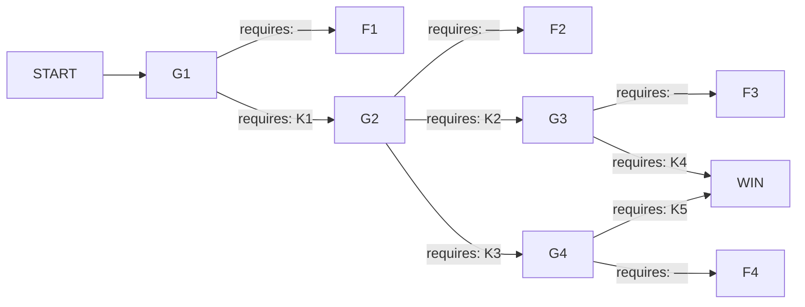

# 해원터널 — 하행 4.2km

## 1. 로그라인

해원터널 하행 4.2km에 흰 연기가 보인다는 신고를 받고 회선을 잡았습니다. 제게 있는 것은 듣는 귀와 조회할 화면과 부탁할 목소리뿐이고, 안에는 234명이 서 있습니다. 관제실 화면은 전부 정상이라고 합니다.

---

## 2. 그래프

### 노드

| id | 시각 | 장소 | 등장 조건 | yields |
|---|---|---|---|---|
| START | 21:52 | 본부 회선 | — | — |
| G1 | 22:14 | 관제실 회선 | — | — |
| G2 | 22:38 | 오세라 회선 · 관제실 회선 | G1에서 제연 전 계열이 선 결과에 이른 밤에만 | — |
| G3 | 23:01 | 차우진 회선 | G2에서 회사 무전으로 전파한 결과에 이른 밤에만 | — |
| G4 | 23:05 | 관제실 회선 | G2에서 구내 방송으로 전파한 결과에 이른 밤에만 | — |
| F1 | 23:40 | 하행 2.9~4.2km | — | K1 · K2 · K3 |
| F2 | 23:33 | 하행 2.9~4.2km | — | K4 약한 문장까지만 |
| F3 | 23:37 | 하행 4.19km | — | K4 |
| F4 | 23:35 | 하행 4.00km | — | K5 |
| WIN | 23:29 | 상행 3.9~4.1km | — | — |

게이트 넷의 `yields`가 전부 `—`인 것은 설계다. 게이트가 내놓는 것은 그 게이트까지 가는 모든 경로 위에 있으므로 뒤 게이트의 열쇠가 될 수 없다. 열쇠는 전부 실패 종단의 꼬리에서 나온다.

### 간선

| 출발 → 도착 | 모이는 스탠스 | requires |
|---|---|---|
| G1 → F1 | 유지 · 증속 | — |
| G1 → G2 | 전면 정지 · 순차 재기동 | K1 |
| G2 → F2 | 현상 유지 · 출구 도보 | — |
| G2 → G3 | 무전 전파 | K2 |
| G2 → G4 | 구내 방송 | K3 |
| G3 → F3 | 전달 요청 · 퇴거 지시 | — |
| G3 → WIN | 표찰 낭독 · 대피 반경 | K4 |
| G4 → F4 | 현상 유지 · 증원 | — |
| G4 → WIN | 조명 회로 · 통로 재지정 | K5 |

---

## 3. 앎

| 코드 | 앎 | 이 앎을 성립시키는 문장 | 성립시키지 못하는 약한 문장 |
|---|---|---|---|
| K1 | 관제실이 돌리는 제연은 정체 구간 쪽으로 밀고 있고, 반대편 계열은 애초에 돌지 않는다 | `제트팬 4번부터 9번까지 날개가 돌지 않았습니다. 실제로 돈 것은 3.2 · 3.5 · 3.8km 세 기뿐입니다` | `구본석 주임의 제연 보고는 믿을 수 없습니다` · `제연이 제대로 되지 않았습니다` |
| K2 | 16번 연결통로 문은 당겨서 열리지 않는다 | `16번 통로 문은 상행 쪽에서 밀어서 열렸습니다. 하행 쪽 사람들은 손잡이를 당기고 있었습니다` | `오세라가 16번 문을 못 열었습니다` · `통로 문이 뻑뻑합니다` |
| K3 | 하행 전 구간 비상방송은 관제실 마이크 하나로 나가고, 그 밤에 한 번도 열리지 않았다 | `하행 방송 송출 로그에 오늘 밤 기록이 0건입니다. 마이크는 관제실 조작반 오른쪽에 있습니다` | `방송이 나갔으면 좋았을 것입니다` · `관제실에 방송 설비가 있습니다` |
| K4 | 탱크로리에 실린 것은 운송장에 적힌 것과 다르다 | `차우진이 과산화수소라고 말했습니다. 운송장에는 식품첨가물 원액으로 적혀 있습니다` | `차우진이 적재함을 두고 가지 않으려 했습니다` · `탱크로리가 위험합니다` |
| K5 | 15번 연결통로 조명 회로는 꺼져 있고, 관제 화면에는 켜진 것으로 뜬다 | `15번 통로 등은 3개월 전부터 꺼져 있었습니다. 관제 화면에는 그동안 계속 점등으로 떠 있었습니다` | `사람들이 16번으로만 몰렸습니다` · `통로가 어둡습니다` |

---

## 4. 인물

### 구본석 (52 · 해원터널 관제실 야간 당직 주임)

- **회선에서 받은 것** — 제연 전 계열 정상 가동 중이라고 했습니다. 팬이 몇 기 도느냐고 물었더니 계열 단위로만 뜬다고 했습니다. 연기 방향을 물었을 때 대답이 한 박자 늦었습니다. 상급 상황실에 상황을 올렸느냐고 물었더니 아직이라고 했습니다.
- **조회로 확인한 것** — 3개월 전 정기 점검 보고서에 제트팬 전 계열과 통로 조명 회로 전부 정상으로 적혀 있습니다. 같은 분기 보수 예산 신청 건이 반려로 처리돼 있습니다. 두 서류의 날짜가 나흘 차이입니다.
- **제가 끝내 확인하지 못한 것** — 두 서류가 왜 나흘 차이인지 오늘 밤에는 묻지 못했습니다. 아는 것을 언제부터 안 채로 근무했는지도 모릅니다.
- **게이트** — G1 · G4

### 오세라 (34 · 광역 5401번 시내버스 기사)

- **회선에서 받은 것** — 승객이 마흔한 명이고 명부는 없다고 했습니다. 정원이 서른아홉이라고 스스로 덧붙였습니다. 회사 공용 무전으로 뒤차 기사와 이어진다고 했습니다. 유리 아래로 앞차가 보이는지 아닌지를 제가 물을 때마다 세 번 다르게 답했습니다.
- **조회로 확인한 것** — 배차 기록상 이 편 출발 시각이 규정보다 12분 빠릅니다. 그래서 이 시각 4.14km에 있습니다.
- **제가 끝내 확인하지 못한 것** — 12분을 왜 당겼는지 묻지 않았습니다. 뒤로 몇 대가 서 있는지는 오세라도 모릅니다.
- **게이트** — G2

### 차우진 (41 · 탱크로리 기사)

- **회선에서 받은 것** — 최초 신고자입니다. 앞차 짐칸에서 흰 연기가 난다고 했습니다. 적재함을 두고 갈 수 없다고 했습니다. 무엇이 실렸느냐고 물었을 때 서류에 있는 그대로라고 했고, 그 대답만 빨랐습니다.
- **조회로 확인한 것** — 운송장에 식품첨가물 원액 8톤, 상차지 해원산단, 적재 19시 40분으로 적혀 있습니다. 같은 노선 운행 이력이 넉 달째입니다.
- **제가 끝내 확인하지 못한 것** — 탱크 외벽 표찰 번호를 이 밤 안에 듣지 못한 회차가 있습니다. 누가 실으라고 했는지는 어느 회차에서도 듣지 못했습니다.
- **게이트** — G3

이름을 적었지만 위 셋에 넣지 않은 사람이 있습니다. 진입조 1팀장 문경일과 다섯 명, 그리고 4.20km에서 짐칸에 불이 붙은 1톤 트럭 기사입니다. 트럭 기사와는 회선이 닿은 적이 없고, 다른 사람이 전해 준 말로만 압니다.

---

## 5. 게이트

### G1 — 제연 (22:14 · 관제실 회선 · 등장 조건 없음)

21시 52분에 걸려 온 신고를 받고 하행 4.2km로 붙었습니다. 신고자는 차우진, 앞차 짐칸에서 흰 연기가 난다고 했습니다. CCTV 41번을 열었더니 화면 위쪽 3분의 1이 희고 차 지붕은 보이는데 번호판은 안 보입니다. 하행은 4.2km 지점부터 뒤로 서 있습니다. 4.2km 앞쪽 화면은 비어 있습니다.

관제실 구본석 주임에게 제연 상태를 물었습니다. 전 계열 정상 가동 중이고 화면에도 그렇게 떠 있다고 했습니다. 팬이 몇 기 도느냐고 다시 물었더니 계열 단위로만 뜬다고 했습니다. 연기가 어느 쪽으로 가고 있느냐고 물었습니다. 대답이 한 박자 늦게 돌아왔고, 화면으로는 판단이 안 된다고 했습니다.

조작반 규정을 조회했습니다. 전 계열을 세우면 재기동에 상급 상황실 승인이 필요하고, 야간 승인은 평균 40분이 걸립니다. 지금 세우면 오늘 밤 안에는 다시 못 켭니다.

소방 진입조는 입구에서 장비를 내리는 중이고, 4.2km까지 도보로 30분 이상 걸립니다. 그때까지 제연을 어떻게 둘지는 요원이 지금 말해야 합니다.

**요원에게 던지는 질문** — 제연을 어떻게 할 것인가.

**스탠스**

- `유지 — 달리 볼 근거가 없으므로, 관제가 하고 있는 대로 두고 다음 보고를 기다린다.` → G1 → F1
- `증속 — 배출이 모자라다고 보고, 가동 중인 계열을 최대로 올려 달라고 요청한다.` → G1 → F1
- `전면 정지 — 화면의 가동 표시가 팬이 도는 것을 보고 켜진 것이 아니라고 보고, 제연 전 계열을 세워 달라고 요청한다.` → G1 → G2
- `순차 재기동 — 도는 것과 도는 것으로 뜨는 것이 다르다고 보고, 전 계열을 세운 뒤 한 기씩 올리며 회전을 눈으로 확인하게 한다.` → G1 → G2

---

### G2 — 전파 (22:38 · 오세라 회선 · 관제실 회선 · 등장 조건: G1에서 제연 전 계열이 선 결과에 이른 밤에만)

제연이 선 뒤에 오세라 회선을 다시 잡았습니다. 천장 쪽만 뿌옇고 유리 아래로는 앞차 뒷범퍼가 보인다고 했습니다. 아까는 앞이 하나도 안 보였다고 했습니다.

CCTV는 39번부터 43번까지 흰 화면만 나옵니다. 카메라가 천장에 붙어 있어서 먼저 죽었습니다. 정체 구간 안을 보는 눈은 이제 오세라 목소리 하나입니다. 승객은 마흔한 명이고 명부는 없다고 했습니다. 뒤로 몇 대가 서 있느냐고 물었더니, 유리로는 셋까지밖에 안 보인다고 했습니다.

차우진에게도 물었습니다. 왜 차를 두고 오지 않느냐고 했더니 적재함을 두고 갈 수 없다고 했습니다.

연기층은 천장에 얹혀 있지만 시간이 갈수록 내려옵니다. 제연은 오늘 밤 다시 못 켭니다. 안에 있는 사람에게 지금 무엇을 하라고 전할지, 그리고 무엇으로 전할지를 요원이 정해야 합니다.

**요원에게 던지는 질문** — 차 안에 있는 사람을 어떻게 움직일 것인가.

**스탠스**

- `현상 유지 — 달리 지시할 근거가 없으므로, 창문을 닫고 차 안에서 대기하도록 오세라를 통해 전한다.` → G2 → F2
- `출구 도보 — 걸어 나가는 편이 빠르다고 보고, 하행 진행 방향으로 걸어서 빠져나가게 한다.` → G2 → F2
- `무전 전파 — 16번 통로 문이 여는 방법의 문제였다고 보고, 오세라의 회사 무전으로 뒤차 기사들에게 문을 밀고 16번으로 넘어가라고 전하게 한다.` → G2 → G3
- `구내 방송 — 관제실 마이크가 오늘 밤 한 번도 열리지 않았다고 보고, 구본석에게 하행 전 구간 방송으로 16번 통로 대피를 알리게 한다.` → G2 → G4

---

### G3 — 탱크로리 (23:01 · 차우진 회선 · 등장 조건: G2에서 회사 무전으로 전파한 결과에 이른 밤에만)

오세라가 회사 무전으로 뒤차에 전했다고 했습니다. 응답이 온 것은 3.3km까지고, 그 아래로는 아무도 받지 않는다고 했습니다. 무전기를 켜 둔 기사만 들었다는 뜻입니다.

차우진 회선을 잡았습니다. 지금 서 있는 자리가 4.19km, 불붙은 트럭에서 열 걸음 뒤입니다. 뒤차 쪽으로 목소리가 닿는 자리에 있는 사람은 차우진뿐입니다. 뒤로 소리쳐 전할 수 있겠느냐고 물었더니 할 수 있다고 했습니다. 그러면 왜 아직 안 했느냐고 물었습니다. 대답이 없었습니다.

문경일이 3.6km를 지났다고 알려 왔습니다. 여섯 명이 4.2km 쪽으로 붙고 있고, 20분 안에 불 앞에 섭니다.

운송장을 조회했습니다. 식품첨가물 원액 8톤, 적재 시각 19시 40분, 상차지 해원산단. 차우진에게 적재물을 물었더니 서류에 있는 그대로라고 했습니다. 대답이 빨랐습니다.

**요원에게 던지는 질문** — 이 회선으로 지금 무엇을 할 것인가.

**스탠스**

- `전달 요청 — 달리 물을 근거가 없으므로, 지금 자리에서 뒤차에 대피를 소리쳐 전하라고 요청한다.` → G3 → F3
- `퇴거 지시 — 불에 가까운 사람부터 빼야 한다고 보고, 차를 두고 뒤로 물러나라고 요청한다.` → G3 → F3
- `표찰 낭독 — 운송장에 적힌 것과 탱크에 붙은 것이 다르다고 보고, 탱크 외벽 표찰 번호를 소리 내어 읽게 한다.` → G3 → WIN
- `대피 반경 — 탱크가 실은 것이 서류와 다르다고 보고, 문경일과 차우진 양쪽에 탱크에서 200m 밖으로 물러나라고 동시에 요청한다.` → G3 → WIN

---

### G4 — 통로 (23:05 · 관제실 회선 · 등장 조건: G2에서 구내 방송으로 전파한 결과에 이른 밤에만)

방송이 나갔습니다. 구본석이 마이크를 열었고, 하행 전 구간에 16번 통로로 대피하라는 안내가 두 번 나갔습니다. 상급 상황실 로그에 그 시각이 남았습니다.

오세라가 회선으로 전했습니다. 사람들이 차에서 내려 뒤로 걷고 있고, 16번 문 앞에 줄이 백 미터를 넘었다고 했습니다. 문 한 짝으로 한 사람씩 지나간다고 했습니다. 15번 쪽으로 걸어가는 사람은 안 보인다고 했습니다.

구본석에게 통로 상태를 물었습니다. 14번부터 18번까지 전부 정상이고 문 위 등도 전부 점등으로 뜬다고 했습니다. 15번은 왜 아무도 안 가느냐고 물었습니다. 화면상으로는 이유가 없다고 했습니다.

연기층은 지금 사람 키 높이보다 조금 위에 있습니다. 줄이 이 속도로 빠지면 마지막 사람이 문을 지나는 것은 30분 뒤입니다. 그 전에 층이 내려옵니다.

**요원에게 던지는 질문** — 관제실에 무엇을 요청할 것인가.

**스탠스**

- `현상 유지 — 달리 요청할 근거가 없으므로, 16번 줄이 빠지는 속도를 계속 보고받는다.` → G4 → F4
- `증원 — 문 하나로는 늦다고 보고, 진입조를 통로 앞으로 돌려 흐름을 정리하게 한다.` → G4 → F4
- `조명 회로 — 15번이 어두워서 사람이 문을 못 찾는 것이라고 보고, 15번 통로 조명 회로를 살려 달라고 요청한다.` → G4 → WIN
- `통로 재지정 — 화면의 점등 표시가 실제 등을 보고 켜진 것이 아니라고 보고, 14번과 15번 문 위 등을 사람이 직접 확인하러 가게 한 뒤 그쪽으로 다시 방송하게 한다.` → G4 → WIN

---

## 6. 결과 꼬리

### F1 — 제연을 그대로 둔 밤 (22:14 → 23:40)

22시 14분 이후로 제 판단이 들어갈 자리가 없었습니다. 이 아래는 들은 것과 조회한 것만 적습니다.

**첫 번째 보고 (22:26 ~ 22:58)**

22시 26분에 광역 5401번 기사 오세라가 회선을 잡았습니다. 승객이 마흔한 명이고 명부는 없다고 했습니다. 뒤로 몇 대냐고 물었더니 유리로는 셋까지밖에 안 보인다고 했습니다.

22시 33분부터 CCTV 39번에서 43번까지 흰 화면만 나옵니다. 41번은 22시 03분에는 위쪽 3분의 1만 희었습니다. 30분 만에 전부 덮였습니다. 정체 구간을 보는 눈이 없어졌습니다.

22시 47분에 차우진에게 왜 차를 두고 오지 않느냐고 물었습니다. 적재함을 두고 갈 수 없다고 했습니다. 무엇이 실렸느냐고 다시 물었더니 서류에 있는 대로라고 했습니다.

22시 58분에 진입조 1팀장 문경일이 입구를 통과했다고 알려 왔습니다. 여섯 명입니다. 4.2km까지 30분 잡는다고 했습니다.

**두 번째 보고 (23:11 ~ 23:22)**

23시 11분에 오세라가 사람들이 차에서 내리기 시작했다고 전했습니다. 뒤쪽 어딘가에서 누가 소리를 질렀고 그 뒤로 문이 여닫히는 소리가 이어졌다고 했습니다. 어디로 가느냐고 물었더니 다들 뒤로 걷는다고 했습니다. 뒤는 2.9km 방향입니다. 걸어서 입구까지 두 시간 반입니다.

23시 19분에 문경일이 16번 통로 문을 상행 쪽에서 밀어서 열었다고 알려 왔습니다. 문 뒤에 사람이 열둘 서 있었다고 했습니다. 손잡이를 당기고 있었다고 했습니다. 그 열둘은 상행으로 넘어왔습니다.

23시 22분에 오세라 회선이 끊겼습니다. 마지막에 승객 수를 다시 세겠다고 했습니다. 세는 소리가 열아홉까지 들렸습니다.

**세 번째 보고 (23:31 ~ 23:40)**

23시 31분에 구본석이 화면이 전부 나갔다고 했습니다. 하행 4.2km 구간 압력 경보가 한꺼번에 올라왔다고 했습니다. 문경일 회선은 그 시각에 잡음만 나왔고 3분 뒤에 다시 열렸습니다. 여섯 명 다 무사하고 3.6km에서 되돌아 나오는 중이라고 했습니다.

23시 34분에 구본석이 먼저 말했습니다. 제트팬 4번부터 9번까지 3개월 전부터 안 돈다고 했습니다. 오늘 밤 실제로 돈 것은 3.2 · 3.5 · 3.8km 세 기뿐이고, 세 기 전부 입구 방향으로 분다고 했습니다. 화면 표시는 스위치가 올라가 있으면 켜진다고 했습니다. 점검 보고서에는 정상으로 올렸다고 했습니다.

23시 38분에 하행 비상방송 송출 로그를 조회했습니다. 오늘 밤 기록이 0건입니다. 마이크는 관제실 조작반 오른쪽에 있고 회선 하나로 하행 전 구간에 나갑니다.

23시 40분에 상행 3.9km 집결지에서 생존자를 셌습니다. 세 번 셌고 61 · 63 · 62였습니다. 명부가 없어서 어느 수가 맞는지 지금은 말할 수 없습니다.

**이 밤에서 캘 수 있게 되는 문장**

- K1 성립 — `제트팬 4번부터 9번까지 날개가 돌지 않았습니다. 실제로 돈 것은 3.2 · 3.5 · 3.8km 세 기뿐입니다`
- K2 성립 — `16번 통로 문은 상행 쪽에서 밀어서 열렸습니다. 하행 쪽 사람들은 손잡이를 당기고 있었습니다`
- K3 성립 — `하행 방송 송출 로그에 오늘 밤 기록이 0건입니다. 마이크는 관제실 조작반 오른쪽에 있습니다`
- K4 약한 문장까지만 — `차우진이 적재함을 두고 가지 않으려 했습니다`
- K5 없음 — 16번 앞에 줄이 선 적이 없어서 15번을 물을 일이 없었습니다

### F2 — 제연은 세웠으나 아무도 움직이지 않은 밤 (22:38 → 23:33)

22시 38분 이후로 제 판단이 들어갈 자리가 없었습니다.

연기층이 천장에 얹혀서 22시 52분에는 오세라가 유리 아래로 앞차 뒷범퍼가 보인다고 했습니다. 23시 05분에는 앞차 번호판까지 읽어 줬습니다. 23시 20분에는 다시 안 보인다고 했습니다. 층이 내려왔습니다.

그 사이에 차 문을 연 사람은 없었습니다. 창문을 닫고 있으라는 말이 무전을 타고 뒤로 갔고, 오세라가 다섯 번 반복했다고 했습니다.

23시 24분에 차우진에게 탱크 외벽에 붙은 표찰 번호를 읽어 달라고 했습니다. 못 읽어 드린다고 했습니다. 왜냐고 물었더니 대답이 없었습니다.

23시 31분에 관제실 압력 경보가 한꺼번에 올라왔습니다. 진입조는 그때 3.4km에 있었고 전원 되돌아 나왔습니다.

23시 33분에 집결지 수를 받았습니다.

**이 밤에서 캘 수 있게 되는 문장**

- K4 약한 문장까지만 — `차우진이 표찰 번호를 못 읽어 주겠다고 했습니다`. 무엇이 실렸는지는 끝내 듣지 못했습니다
- K1 · K2 · K3는 이미 손에 있는 밤에만 여기까지 옵니다

### F3 — 무전으로 전파했으나 탱크를 묻지 않은 밤 (23:01 → 23:37)

23시 01분 이후로 제 판단이 들어갈 자리가 없었습니다.

23시 12분에 오세라가 버스 승객 마흔한 명이 16번 통로를 넘었다고 전했습니다. 무전을 들은 기사들이 뒤차 사람을 데리고 왔다고 했습니다. 3.3km 아래는 여전히 응답이 없다고 했습니다.

23시 20분에 문경일이 4.0km를 지났다고 알려 왔습니다. 연기층이 얹혀 있어서 예상보다 빨리 붙었다고 했습니다. 불붙은 트럭까지 200m 남았고 탱크로리가 그 앞을 막고 있다고 했습니다.

23시 26분에 차우진이 회선으로 말했습니다. 과산화수소라고 했습니다. 그 뒤에 다른 말을 더 하려는 소리가 났고 회선이 끊겼습니다. 운송장을 다시 조회했습니다. 식품첨가물 원액으로 적혀 있습니다.

23시 29분에 문경일 회선이 끊겼습니다. 6분 뒤에 2팀장이 회선을 잡고 1팀 여섯 중 둘만 걸어 나왔다고 알려 왔습니다.

23시 37분에 집결지 수를 받았습니다.

**이 밤에서 캘 수 있게 되는 문장**

- K4 성립 — `차우진이 과산화수소라고 말했습니다. 운송장에는 식품첨가물 원액으로 적혀 있습니다`

### F4 — 방송은 냈으나 통로가 하나였던 밤 (23:05 → 23:35)

23시 05분 이후로 제 판단이 들어갈 자리가 없었습니다.

23시 14분에 오세라가 16번 앞 줄이 백이십 미터라고 전했습니다. 23시 21분에도 백 미터라고 했습니다. 줄이 안 줄었습니다.

23시 23분에 오세라에게 15번 쪽을 봐 달라고 했습니다. 그쪽은 캄캄해서 문이 어디 있는지 모르겠다고 했습니다. 16번은 문 위에 초록 등이 켜져 있어서 멀리서도 보인다고 했습니다.

23시 25분에 관제 화면을 조회했습니다. 14번부터 18번까지 전부 점등으로 떠 있습니다. 유지보수 이력을 열었습니다. 15번 조명 회로는 3개월 전 정기 점검 항목에 정상으로 적혀 있고 그 뒤 작업 기록이 없습니다.

23시 30분에 연기층이 사람 키 아래로 내려왔다고 오세라가 전했습니다. 줄 뒤쪽부터 앉기 시작했다고 했습니다.

23시 35분에 집결지 수를 받았습니다.

**이 밤에서 캘 수 있게 되는 문장**

- K5 성립 — `15번 통로 등은 3개월 전부터 꺼져 있었습니다. 관제 화면에는 그동안 계속 점등으로 떠 있었습니다`

### WIN — 전원이 상행으로 넘어간 밤 (23:29)

23시 29분에 상행 3.9km에서 4.1km 사이 갓길에 사람이 다 나왔습니다. 오세라가 승객 마흔한 명을 두 번 세고 같은 수를 얻었습니다. 차우진은 탱크에서 240m 뒤에 있습니다. 문경일과 다섯 명은 4.0km에서 물러나 있습니다.

23시 44분에 탱크가 열렸습니다. 그 시각 하행 2.9km에서 4.4km 사이에 서 있는 사람은 없었습니다.

---

## 7. 집계

세는 자리가 둘입니다.

- **하행 정체 구간 234명** — 하행 요금소 통과 기록과 차량별 탑승 인원을 되짚어 234로 봤습니다. 오세라와 승객 마흔하나, 차우진, 짐칸에 불이 붙은 트럭 기사가 이 안에 듭니다. 명부는 끝까지 없었으므로 이 수도 되짚은 수입니다.
- **진입조 6명** — 문경일이 입구를 통과하면서 여섯이라고 알려 준 수입니다.

| 종단 | 하행 234명 | 진입조 6명 | 총 사망 | 결말 문장 |
|---|---|---|---|---|
| F1 | 사망 174 | 사망 0 | **174** | 집결지에서 세 번 셌고 61 · 63 · 62였습니다. 명부가 없어서 어느 수가 맞는지 지금은 말할 수 없습니다. 광역 5401번 기사 오세라는 세 수 어디에도 없습니다. |
| F2 | 사망 58 | 사망 0 | **58** | 문을 연 사람만 나왔습니다. 창문을 닫고 있으라는 말을 다섯 번 반복한 사람은 마지막까지 운전석에 있었습니다. |
| F3 | 사망 31 | 사망 4 | **35** | 버스 승객 마흔하나는 상행으로 넘어왔습니다. 3.3km 아래에서 무전을 못 들은 사람과 1팀 넷은 넘어오지 못했습니다. |
| F4 | 사망 19 | 사망 0 | **19** | 16번 문을 지난 사람은 215명입니다. 줄 뒤쪽에 앉았던 열아홉은 지나지 못했습니다. 15번 문은 그 시각까지 닫혀 있었습니다. |
| WIN | 사망 0 | 사망 0 | **0** | 234명 전원이 상행 갓길에 섰습니다. 두 번 세고 같은 수를 얻었습니다. 23시 51분에 상황실이 회선으로 알려 왔습니다. 차우진은 미신고 위험물 운송으로, 구본석은 점검 보고서 허위 작성으로 입건 처리한다고 했습니다. 하행은 최소 9일 폐쇄라고 했습니다. 오세라 건은 운행 기록에 12분 조기 출발로 남기는 선에서 끝난다고 들었습니다. |

---

## 8. 고정 타임라인

| 시각 | 표면 | 장소 | 요원의 기록 | 조건 |
|---|---|---|---|---|
| 21:52 | 통화 | 본부 회선 | 차우진이라는 사람이 하행 4.2km에서 신고했습니다. 앞차 짐칸에서 흰 연기가 난다고 했습니다. 자기 차는 바로 뒤라고 했습니다 | — |
| 22:03 | CCTV | 하행 4.0km | CCTV 41번을 열었습니다. 화면 위쪽 3분의 1이 흽니다. 차 지붕은 보이는데 번호판은 안 보입니다 | — |
| 22:09 | 통화 | 관제실 | 구본석 주임에게 제연 상태를 물었습니다. 전 계열 정상 가동 중이고 화면에도 그렇게 떠 있다고 했습니다 | — |
| 22:26 | 통화 | 하행 4.14km | 광역 5401번 기사 오세라가 회선을 잡았습니다. 승객이 마흔한 명인데 명부는 없다고 했습니다 | — |
| 22:33 | CCTV | 하행 4.0km | CCTV 41번이 흰 화면만 내보냅니다. 39번부터 43번까지 같습니다 | — |
| 22:47 | 통화 | 하행 4.19km | 차우진에게 왜 차를 두고 오지 않느냐고 물었습니다. 적재함을 두고 갈 수 없다고 했습니다 | — |
| 22:52 | 통화 | 하행 4.14km | 오세라가 천장 쪽만 뿌옇고 유리 아래로 앞차 뒷범퍼가 보인다고 했습니다 | 제연 전 계열을 세운 밤에만 |
| 22:58 | 현장 | 하행 입구 | 진입조 1팀장 문경일이 입구를 통과했다고 알려 왔습니다. 여섯 명입니다 | — |
| 23:08 | 통화 | 하행 4.14km | 오세라가 회사 무전으로 뒤차에 전했다고 했습니다. 3.3km 아래로는 응답이 없다고 했습니다 | 회사 무전으로 전파한 밤에만 |
| 23:15 | 통화 | 하행 4.00km | 오세라가 16번 앞 줄이 백 미터를 넘는다고 했습니다. 15번 쪽으로는 아무도 가지 않는다고 했습니다 | 구내 방송으로 전파한 밤에만 |
| 23:19 | 현장 | 하행 4.00km | 문경일이 16번 통로 문을 상행 쪽에서 밀어서 열었다고 알려 왔습니다. 문 뒤에 사람이 열둘 서 있었고 손잡이를 당기고 있었다고 했습니다 | 16번 통로 대피가 전파되지 않은 밤에만 |
| 23:22 | 통화 | 하행 4.14km | 오세라 회선이 끊겼습니다. 마지막에 승객 수를 다시 세겠다고 했습니다. 세는 소리가 열아홉까지 들렸습니다 | 16번 통로 대피가 전파되지 않은 밤에만 |
| 23:26 | 통화 | 하행 4.19km | 차우진이 과산화수소라고 말했습니다. 회선이 그 뒤로 끊겼습니다 | 회사 무전으로 전파하고 표찰을 묻지 않은 밤에만 |
| 23:31 | 통화 | 관제실 | 구본석이 화면이 전부 나갔다고 했습니다. 하행 4.2km 압력 경보가 한꺼번에 올라왔다고 했습니다 | 차우진이 탱크에서 물러나지 않은 밤에만 |
| 23:34 | 통화 | 관제실 | 구본석이 먼저 말했습니다. 제트팬 4번부터 9번까지 3개월 전부터 안 돈다고 했습니다. 화면 표시는 스위치가 올라가 있으면 켜진다고 했습니다 | 제연 전 계열을 세우지 못한 밤에만 |
| 23:38 | 문서 | 본부 | 하행 비상방송 송출 로그를 조회했습니다. 오늘 밤 기록이 0건입니다 | 제연 전 계열을 세우지 못한 밤에만 |

총 16행.
첫 밤이 보는 행은 12행이다 — 조건이 `—`인 일곱 행에, 16번 통로 대피가 전파되지 않은 밤의 두 행, 차우진이 탱크에서 물러나지 않은 밤의 한 행, 제연 전 계열을 세우지 못한 밤의 두 행.

---

## 9. 네 밤의 진행

**1회차**

- 인수인계 — 비어 있다.
- 어디까지 — G1까지. 전제를 가진 스탠스가 하나도 서지 않아서 유지나 증속으로 간다.
- 손이 닿지 않게 된 곳 — G1 → F1. 22시 14분부터 23시 40분까지 요원의 판단 자리가 없다.
- 캔 것 — K1 · K2 · K3. K4는 `차우진이 적재함을 두고 가지 않으려 했습니다`라는 약한 문장으로만 남는다. K5는 아예 나오지 않는다.

**2회차 (갑 경로를 밟는 경우)**

- 인수인계 — K1 · K2. 한 칸이 빈다.
- 어디까지 — G1 통과, G2에서 무전 전파, G3 도달.
- 손이 닿지 않게 된 곳 — G3 → F3. 표찰을 묻는 전제가 손에 없다.
- 캔 것 — K4 성립.

**2회차 (을 경로를 밟는 경우)**

- 인수인계 — K1 · K3.
- 어디까지 — G1 통과, G2에서 구내 방송, G4 도달.
- 손이 닿지 않게 된 곳 — G4 → F4.
- 캔 것 — K5 성립.

**3회차 — 성공이 열린다**

- 인수인계 — 갑이면 K1 · K2 · K4, 을이면 K1 · K3 · K5. 어느 쪽이든 세 칸이고 한 칸이 빈다.
- 어디까지 — WIN.
- 손이 닿지 않게 된 곳 — 없다.
- 캔 것 — 사망 0.

**4회차 — 여유분**

- 3회차에 약한 문장을 하나 섞어 넣었거나, 갑에서 캔 K4를 을 경로에 올려 G4가 열리지 않은 경우를 받는다. K1은 어느 경로에서든 공통이므로 G1은 다시 뚫린다. 두 번째 갈래를 처음부터 다시 밟을 필요가 없다.

---

## 10. 자기 검사

### §4 — 그래프

1. **노드마다 시각이 다르다** — G1 22:14 · G2 22:38 · G3 23:01 · G4 23:05 · WIN 23:29 · F2 23:33 · F4 23:35 · F3 23:37 · F1 23:40. 아홉 개 전부 다르다.
2. **게이트마다 requires가 빈 간선이 정확히 하나** — G1은 F1로, G2는 F2로, G3은 F3으로, G4는 F4로. 각각 하나뿐이고 전부 실패 간선이다.
3. **1회차는 게이트 하나만 지나고 실패** — 경로는 START → G1 → F1. G1의 전면 정지와 순차 재기동이 딛고 선 전제는 23시 34분에 구본석이 무너진 뒤에야 생긴다.
4. **열쇠는 문 뒤에 있다** — K1의 앞 경로에는 게이트만 있고 게이트는 yield하지 않는다. K2 · K3은 G1 뒤, K4는 G1 · G2 뒤, K5는 G1 · G2 뒤. §1이 준 것은 요원의 권한과 처지뿐이고 다섯 앎 전부 세계의 사실이다.
5. **성공 경로는 둘** — 갑은 G1 → G2 → G3 → WIN, 을은 G1 → G2 → G4 → WIN. 회사 무전으로 사람을 옮기느냐 구내 방송으로 옮기느냐가 다르고, 살리는 사람은 같은 234명이다.
6. **경로당 requires 셋** — 갑 K1 · K2 · K4, 을 K1 · K3 · K5. 넷 중 한 칸이 빈다.
7. **3회차 안에 성공이 열린다** — 1회차 F1이 셋을 내놓고, 2회차가 넷째를 내놓고, 3회차가 WIN에 닿는다.
8. **집계는 마지막으로 밟은 노드가 정한다** — 다섯 종단 각각에 값이 붙어 있고 경로를 묻지 않는다. 갑과 을이 다른 값을 받아야 하는 자리는 F3과 F4로 이미 쪼개져 있다.
9. **한 게이트가 두 집계 단위를 반대로 결정하지 않는다** — G1 · G2 · G4의 실패는 하행 234명만 움직이고 진입조는 건드리지 않는다. G3만 두 단위를 함께 움직이는데, 표찰 낭독과 대피 반경 둘 다 두 단위를 동시에 살린다.
10. **모든 단위가 동시에 최선인 경로가 있다** — WIN에서 234명 전원과 진입조 여섯이 산다.
11. **yields는 그 라운드의 보고서에 실린다** — K1은 23:34행, K2는 23:19행, K3은 23:38행, K4는 23:26행, K5는 F4 꼬리의 23:23과 23:25 청취·조회에 실린다. K5를 실은 자리는 타임라인이 아니라 꼬리 안 보고서이고, 그 앞에 23:15행이 조건부로 깔려 있다.
12. **실패한 뒤에는 어떤 자리도 열리지 않는다** — F1 뒤에 남은 자리는 G2 · G3 · G4 셋이다. G2는 제연 전 계열이 선 결과를 요구하고, G3은 회사 무전 결과를, G4는 구내 방송 결과를 요구한다. F1 경로는 셋 중 어느 상태도 세우지 못한다. F2 뒤에 남은 G3 · G4도 같은 이유로 열리지 않는다. F3 · F4 뒤에는 게이트가 없다.
13. **첫 밤의 꼬리는 앎을 둘 이상 내놓되 전부는 아니다** — F1이 K1 · K2 · K3 셋을 내놓고, K4와 K5는 둘째 밤 이후의 꼬리에서만 나온다.
14. **모든 시각이 자정 전** — 아래 통합 항목에 적었다.

### §5 — 스탠스

1. **라벨이 자기를 설명한다** — 열여섯 스탠스 전부 `라벨 — 딛고 선 전제와 실제 하는 말` 형태다. 맨 명사만 놓은 자리가 없다.
2. **기본 간선의 라벨은 근거의 부재만 말한다** — `달리 볼 근거가 없으므로` · `달리 지시할 근거가 없으므로` · `달리 물을 근거가 없으므로` · `달리 요청할 근거가 없으므로`.
3. **기본 라벨에 사실을 싣지 않았다** — 실패 간선에 모이는 여덟 스탠스를 다시 읽었다. 증속은 `배출이 모자라다고 보고`, 출구 도보는 `걸어 나가는 편이 빠르다고 보고`, 퇴거 지시는 `불에 가까운 사람부터 빼야 한다고 보고`, 증원은 `문 하나로는 늦다고 보고`. 전부 해석이고 검증된 사실은 없다.
4. **나머지 간선의 라벨은 딛고 선 전제를 말한다** — `화면의 가동 표시가 팬이 도는 것을 보고 켜진 것이 아니라고 보고` · `16번 통로 문이 여는 방법의 문제였다고 보고` · `관제실 마이크가 오늘 밤 한 번도 열리지 않았다고 보고` · `운송장에 적힌 것과 탱크에 붙은 것이 다르다고 보고` · `15번이 어두워서 사람이 문을 못 찾는 것이라고 보고`.
5. **어떤 라벨도 자기 수확을 말하지 않는다** — `로그를 펼쳐 본다` · `이력을 조회한다` 계열이 라벨에 하나도 없다. 전부 요청과 지시로 끝난다.
6. **비기본 전제가 §1이 이미 준 것이 아니다** — 여덟 개 전부 팬·문·마이크·표찰·조명이라는 물건의 상태에 관한 것이고, 요원의 권한이나 처지에서 나오지 않는다.
7. **탈출구 없음** — `일단 확인부터` 계열을 넣지 않았다. 유지와 현상 유지는 근거의 부재로만 서 있어서, 앎을 쥔 요원이 거기로 숨을 이유가 라벨 안에 없다. 증속·출구 도보·퇴거 지시·증원의 전제는 각각 K1·K2·K4·K5와 정면으로 부딪힌다.
8. **한 간선에 모인 스탠스가 발화에서 갈린다** — 전면 정지는 `세워 달라`, 순차 재기동은 `한 기씩 올리며 눈으로 보라`. 표찰 낭독은 `번호를 읽어라`, 대피 반경은 `200m 밖으로 물러나라`. 조명 회로는 `회로를 살려라`, 통로 재지정은 `사람을 보내 확인하고 다시 방송하라`. 유지는 `기다린다`, 증속은 `최대로 올려라`.
9. **여유를 닫았다** — 제연 재기동에 상급 상황실 승인 40분이라는 불가역, CCTV 39~43번 백화라는 단절, 진입조가 불 앞에 서기까지 남은 20분이라는 마감, 오세라 회선 단절, 연기층이 사람 키로 내려오는 시각. 게이트 넷 전부 앞에 하나씩 서 있다.
10. **열쇠가 지목하는 대상이 유일하다** — K2의 `16번`은 페이로드 안에서 통로 하나만 가리키고, K5의 `15번`도 마찬가지다. 둘이 같은 문장에 함께 나오는 자리는 없다. K1의 `4번부터 9번까지`는 제트팬 번호이고 통로 번호와 자릿수가 겹치지 않도록 통로를 14~18번으로 잡았다. K4의 `표찰`은 탱크 외벽의 것 하나뿐이고, `운송장`과 짝으로만 등장한다.

### §7 — 금지

1. **글자 입력 장치 없음** — 플레이어가 하는 일은 문장을 골라 네 칸에 올리는 것뿐이다. 문서 어디에도 타이핑이 없다.
2. **믿음을 되돌리는 비트 없음** — 어떤 꼬리도 앞서 넘긴 문장을 의심하거나 회수하지 않는다. 약한 문장의 해독제는 같은 앎의 강한 문장뿐이다.
3. **순서·우선순위 장치 없음** — 네 칸은 평평하다. 어느 칸에 무엇을 넣는지가 결과를 바꾸는 자리가 없다.
4. **감정이나 인용에 기대는 정답 경로 없음** — 다섯 앎 전부 물건의 상태다. 날개가 안 돈다, 문이 미는 문이다, 로그가 0건이다, 실린 것이 다르다, 등이 꺼졌다.
5. **요원의 대답을 전제하는 고정 장면 없음** — 타임라인의 요원 발화는 전부 청취와 조회다. 판단이 필요한 순간은 넷 다 게이트로 세웠다.
6. **인물이 밖을 인지하는 장면 없음** — 구본석도 오세라도 차우진도 이 밤이 다시 돌아간다는 것을 모른다.
7. **왼쪽 칸에 게임 어휘 없음** — 로그라인 · 인물 · 게이트 산문 · 스탠스 · 꼬리 · 집계 · 타임라인 사건 칸을 훑었다. `밤`이라는 낱말은 조건 칸과 워크숍 절에만 있고, 플레이어가 읽는 자리에는 없다.
8. **번역투 없음** — 대명사 그·그녀·그것·그들을 쓰지 않았다. `~에 의해` · `~되어지다` · `~에도 불구하고` 없음. 소유격 연쇄 없음. 수가 드러난 자리의 `-들` 없음. 세미콜론 없음. 문중 괄호 없음 — 괄호가 남은 자리는 인물 이름 뒤의 나이와 역할, 게이트 제목의 시각과 등장 조건뿐이고 둘 다 §9가 지정한 형식이다. 초고의 인물 절이 관형절을 두 겹 쌓은 자리가 있었고, 절을 세 칸으로 갈라 다시 쓰면서 사라졌다.
9. **요원이 알 수 없는 것 없음** — 아래 통합 항목에 적었다.

### 통합 검사 셋

**자정 초과 시각 0건.** 게이트 넷은 22:14 · 22:38 · 23:01 · 23:05. 종단 다섯은 23:29 · 23:33 · 23:35 · 23:37 · 23:40. 타임라인 열여섯 행은 21:52부터 23:38까지. 꼬리 안에 서술한 시각은 F1이 22:26부터 23:40, F2가 22:52부터 23:33, F3이 23:12부터 23:37, F4가 23:14부터 23:35. WIN 꼬리의 마지막 시각은 탱크가 열린 23:44이고, 문서 전체에서 가장 늦은 시각은 WIN 결말 문장의 23:51이다. 전부 자정 전이다.

**게이트 산문이 열쇠 일을 미리 해 주지 않는다.**

- G1 — 산문은 화면이 정상이라고 말하고 대답이 늦었다고 말한다. 팬이 도는지 아닌지는 아무도 말하지 않는다. `화면 표시는 스위치를 보고 켜진다`는 문장은 산문에 없고 23시 34분 청취에만 있다.
- G2 — 산문은 층이 얹혀 있다고, 카메라가 죽었다고, 차우진이 적재함을 두고 못 간다고 말한다. 문을 어떻게 여는지는 나오지 않는다. 마이크가 안 열렸다는 것도 나오지 않는다.
- G3 — 산문은 무전이 3.3km까지 닿았다고, 차우진이 대답을 안 했다고, 운송장에 식품첨가물로 적혀 있다고 말한다. 탱크에 실린 것과 서류가 다르다는 말은 없다. `대답이 빨랐습니다`까지가 재료이고 결론은 놓지 않았다.
- G4 — 여기가 가장 새기 쉬운 자리라 두 번 고쳤다. 산문은 15번으로 가는 사람이 안 보인다고 말하고, 화면상 전부 점등이라고 말한다. 15번이 캄캄하다는 것도, 등이 3개월 전부터 꺼져 있었다는 것도 산문에 없다. 오세라가 15번 쪽을 직접 본 것은 F4 꼬리 23시 23분이고 게이트 앞이 아니다.

**요원이 알 수 없는 문장 0건.** 초고에서 로그라인 · 인물 절 · 집계 도입부가 3인칭 설계문으로 남아 있었고, 특히 인물 절은 예산 반려 경위와 정년 같은 요원이 그 밤에 닿을 수 없는 것을 담고 있었다. 셋 다 요원의 송신문으로 다시 썼고, 인물 절은 `회선에서 받은 것 · 조회로 확인한 것 · 끝내 확인하지 못한 것` 세 칸으로 갈라 통로가 없는 항목을 마지막 칸으로 옮겼다. 타임라인 열여섯 행의 표면은 통화 아홉, CCTV 둘, 현장 둘, 문서 하나이고 `현장` 두 행은 문경일이 회선으로 알려 온 것이다. 꼬리도 한 줄씩 짚었다. F1의 파열은 요원이 직접 보지 않고 구본석이 전한 화면 상실과 압력 경보로만 안다. F3의 진입조 손실은 2팀장이 회선으로 알려 준 것이고, 1팀 넷에게 무엇이 일어났는지는 끝내 적히지 않았다. F1의 오세라 최후는 회선이 끊긴 것과 세는 소리가 열아홉까지 들린 것뿐이다. WIN 꼬리의 23시 44분 탱크 개방은 상행 갓길에 선 사람들이 소리를 들은 자리에서 나온 것으로, 요원은 회선으로 그 소리를 받았다. 집계 수는 전부 집결지에서 누가 세어 회선으로 올린 수이고, 그래서 F1에서는 세 번 다르다.
