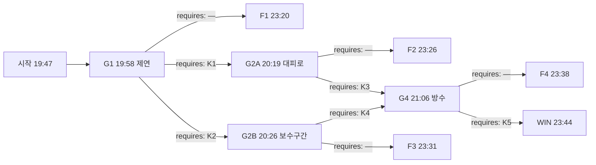

# 해원터널 — 그래프 선행 초안 v3.1-01

## 1. 로그라인

해원터널 하행 4.2킬로미터에서 흰 연기가 올라온 밤, 대응실은 회선 세 개를 붙든 요원 하나를 들여보냈다.
요원에게 있는 것은 듣고 조회하고 부탁하는 권한뿐이었고, 그 밤에 백열여덟 명이 나오지 못했다.
다음 요원의 손에 어떤 문장을 쥐여 보내야 그 수가 달라지는가.

---

## 2. 그래프

### 노드

| id | 시각 | 장소 | 등장 조건 | yields |
|---|---|---|---|---|
| G1 | 19:58 | 대응실 상황대 · 해원터널 방재실 회선 | — | — |
| G2A | 20:19 | 대응실 상황대 · 하행 4.63 통근버스 회선 | 하행 진입 차단이 위험물 사고로 격상되어 나간 밤에만 | — |
| G2B | 20:26 | 대응실 상황대 · 방재실 회선 · 공사 야간 회선 | 갱내 풍속 실측 요청이 선착대로 나간 밤에만 | — |
| G4 | 21:06 | 대응실 상황대 · 소방 지휘 회선 | 4.9킬로 갓길 역주 도보 대피가 개시됐거나 4.60 연락갱이 개통된 밤에만 | — |
| F1 | 23:20 | 하행 입구 집결지 | G1에서 실패 간선을 밟은 밤 | K1, K2 |
| F2 | 23:26 | 하행 입구 집결지 | G2A에서 실패 간선을 밟은 밤 | K3, K4, K5 |
| F3 | 23:31 | 하행 입구 집결지 | G2B에서 실패 간선을 밟은 밤 | K3, K4, K5 |
| F4 | 23:38 | 하행 입구 집결지 | G4에서 실패 간선을 밟은 밤 | K5 |
| WIN | 23:44 | 하행 입구 집결지 | G4에서 K5 간선을 밟은 밤 | — |

게이트 노드가 아무것도 yield하지 않는 것은 §4-4 때문이다. 게이트가 내놓는 것은 그 게이트까지 가는 모든 경로 위에 있으므로 뒤에 오는 어떤 게이트의 열쇠도 될 수 없다. 열쇠는 전부 실패 종단의 꼬리에서 나온다.

### 간선

| 출발 → 도착 | 모이는 스탠스 | requires |
|---|---|---|
| G1 → F1 | S1, S2 | — |
| G1 → G2A | S3 | K1 |
| G1 → G2B | S4 | K2 |
| G2A → F2 | S5, S6 | — |
| G2A → G4 | S7 | K3 |
| G2B → F3 | S8, S9 | — |
| G2B → G4 | S10 | K4 |
| G4 → F4 | S11, S12 | — |
| G4 → WIN | S13 | K5 |

성공 경로는 둘이다.

- **경로 갑** — G1 → G2A → G4 → WIN. requires는 K1 · K3 · K5로 셋. 사람을 연기 아래에서 걸어 나오게 하는 길이다.
- **경로 을** — G1 → G2B → G4 → WIN. requires는 K2 · K4 · K5로 셋. 막힌 통로를 실제로 열어 사람을 옆 터널로 넘기는 길이다.

둘 다 인수인계 네 칸 중 셋만 쓴다. 한 칸은 확신 없는 문장을 걸어 보는 자리로 남는다.

---

## 3. 앎

| 코드 | 앎 | 이 앎을 성립시키는 문장 | 성립시키지 못하는 약한 문장 |
|---|---|---|---|
| K1 | 한도욱 탑차의 적재물은 반입 대장이 말하는 냉동식품이 아니라 리튬 배터리 팔레트이고, 흰 연기는 배터리가 내는 가스다 | `한도욱 탑차에 실린 것은 냉동식품이 아니라 리튬 배터리 팔레트입니다. 흰 연기는 배터리가 내는 가스입니다` | `한도욱이 화물에 대해 무언가를 숨기고 있습니다` |
| K2 | 해원터널 제3송풍기는 6월 12일부터 정지해 있고, 방재실이 읽어 주는 풍속은 계기가 아니라 설계값이다 | `제3송풍기는 6월 12일부터 정지해 있습니다. 방재실이 읽어 주는 풍속은 계기값이 아니라 설계값입니다` | `방재실이 말하는 값과 선착대 실측이 달랐습니다` |
| K3 | 하행 4.35와 4.60 연락갱은 보수 가설물로 막혀 있어 갱내 쪽에서 열리지 않는다. 그 구간에 피난 통로는 도면대로 서 있지 않다 | `하행 4.35와 4.60 연락갱은 갱내 쪽에서 열리지 않습니다. 4.2에서 4.85 사이에 나갈 수 있는 통로는 없습니다` | `연락갱 문이 잘 안 열린다는 말이 있었습니다` |
| K4 | 4.60을 막은 가설 강판은 볼트 열여섯 개로 조인 것이고, 갱내 쪽에서 뜯어낼 수 있다 | `4.60 가설 강판은 볼트 열여섯 개로 조인 것입니다. 갱내 쪽에서 공구로 뜯어낼 수 있습니다` | `공사 구간이니 업체에 물어보아야 합니다` |
| K5 | 이 화물의 불은 직사 방수를 맞으면 3분 안에 커진다. 잡는 방법은 소화가 아니라 냉각 살수다 | `이 화물에 직사 방수를 하면 3분 안에 불길이 커집니다. 노즐을 냉각 살수로 돌려야 합니다` | `방수는 신중하게 해야 합니다` |

K3과 K4는 같은 자리를 다루지만 지목하는 대상이 다르다. K3이 가리키는 것은 통로의 유무이고, K4가 가리키는 것은 볼트다. 한 밤에 둘을 같이 올려도 서로를 뒤집어 읽을 자리가 없다.

---

## 4. 인물

### 곽재림 · 51 · 해원터널 방재실 야간 당직 주임

- **이해관계** — 제3송풍기 정지를 6월부터 덮어 왔다. 정비 유예 결재에 자기 서명이 있고, 갱내 실측이 한 번 나가면 서명이 드러난다. 밤새 지키려는 것은 터널이 아니라 결재란이다.
- **아는 것** — 실제 풍속이 설계값에 못 미친다는 것. 4.35와 4.60 연락갱이 보수로 막혔다는 것. 유예 문서에 4.35만 적혀 있어서, 4.60은 서류상 멀쩡하다고 믿고 있다는 것.
- **모르는 것** — 탑차에 실린 물건. 배터리 화재의 성질. 자기가 지목한 4.60에도 강판이 서 있다는 것.
- **게이트** — G1과 G2B. 한 사람이 두 게이트를 진다. 첫 번째로는 계기값을 지키고, 두 번째로는 서류가 말하는 문을 지킨다.

### 한도욱 · 43 · 냉동탑차 기사 · 최초 신고자

- **이해관계** — 위험물 신고 없이 리튬 배터리를 실었다. 입을 열면 면허와 회사가 함께 끝난다. 그래서 불을 신고하면서도 무엇이 타는지는 말하지 않는다.
- **아는 것** — 팔레트에 실린 것. 화물칸 문이 어느 쪽부터 뜨거워졌는지. 배터리를 실은 것이 오늘이 처음이 아니라는 것.
- **모르는 것** — 터널 제연의 구조. 연락갱이 막혔다는 것. 뒤쪽에 몇 대가 서 있는지.
- **게이트** — G4. 요원이 다루는 것은 소방 지휘 회선이지만 판단의 대상은 한도욱이 실은 물건이고, 그 회선에는 한도욱이 아직 붙어 있다.

### 윤소진 · 34 · 하행 4.63킬로에 선 통근버스 기사

- **이해관계** — 승객 명단에 없는 열한 명을 태웠다. 야간조를 태워 달라는 부탁을 매주 받아 왔고, 매주 받아 주었다. 인원을 물을 때마다 수가 달라지는 이유는 명단에 없는 열한 명이다.
- **아는 것** — 차 안 상황. 뒤쪽 차량이 어디까지 서 있는지. 갓길로 걸어간 사람이 몇이나 되는지.
- **모르는 것** — 연기가 어느 쪽으로 밀리는지. 연락갱 상태. 자기 뒤에 소방이 몇 미터까지 왔는지.
- **게이트** — G2A. 그리고 이 사람이 집계의 얼굴이다. 요원이 이름으로 부르고 목소리로 아는 유일한 사람이고, 아무것도 바꾸지 못한 밤에 회선에서 사라지는 사람이다.

배경은 인물이 아니다. 공사 야간 반장 도문영, 소방 선착대 지휘 염기수, 4.35 연락갱 문을 두드린 이름 모를 사람들은 요원의 기록 산문 안에서만 산다.

---

## 5. 게이트

### G1 — 제연

`19:58 · 대응실 상황대와 해원터널 방재실 회선 · 등장 조건 —`

19시 47분에 하행 4.2킬로에서 흰 연기가 보인다는 신고를 받았습니다. 신고자는 그 지점에 선 냉동탑차 기사 한도욱입니다. 자기 차 뒤쪽에서 연기가 올라온다고 했고, 불꽃이 보이느냐고 묻자 보이지 않는다고 답했습니다. 냄새를 물었더니 대답이 한 박자 늦게 돌아왔습니다.

위험물 반입 대장을 조회했습니다. 오늘 하행으로 들어간 신고 위험물은 없습니다. 한도욱 차량은 냉동식품 팔레트 열둘로 올라 있고, 적재 확인 서명은 오후 5시 40분입니다.

해원터널 방재실 회선을 열었습니다. 야간 당직 주임 곽재림이 받았습니다. 제연 송풍기 네 대가 전량 정상이고 갱내 풍속은 초속 2.5미터라고 읽어 주었습니다. 매뉴얼상 초기 조치는 연기 확산을 억제하기 위해 제연을 정지하는 것이라고 덧붙였습니다. 정지하면 4.2 뒤쪽은 어떻게 되느냐고 물었고, 뒤쪽은 정체가 없다는 답을 받았습니다.

CCTV 하행 3.8 구간을 확인했습니다. 정체가 900미터 이어져 있고 차에서 내린 사람이 갓길로 걷고 있습니다. 소방 선착대 지휘 염기수가 하행 입구에서 통보해 왔습니다. 갱내 진입 개시까지 11분이고, 진입 뒤에는 제연 조작 권한이 소방으로 넘어가 본부 요청은 참고 사항이 된다고 했습니다.

**요원에게 던지는 질문** — 진입 개시까지 11분이다. 본부는 지금 무엇을 요청할 것인가.

| 스탠스 | 라벨 | 설명 | 간선 |
|---|---|---|---|
| S1 | `계기를 달리 볼 이유가 없으므로, 방재실이 읽어 주는 값을 그대로 올리고 매뉴얼대로 제연 정지를 요청한다` | 19시 59분에 제연이 전량 정지했다. 연기가 흐르지 않고 4.2 위쪽에 고여 두께를 키웠다. 20시 47분에 선착대가 갱내 200미터에서 시야를 잃고 되돌아 나왔다. 하행 4.2에서 5.1 사이는 그 뒤로 아무도 들어가지 못한 구간이 되었다. | G1 → F1 |
| S2 | `갱내를 달리 볼 근거가 없으므로, 진입 차단만 요청하고 제연 조작은 방재실 판단에 맡긴다` | 하행 입구가 20시 3분에 닫혔다. 뒤따라 들어오는 차는 없어졌고, 이미 들어간 차에 대해서는 아무 조치도 나가지 않았다. 방재실은 매뉴얼대로 제연을 정지했다. 20시 47분 이후 상황은 S1과 같아졌다. | G1 → F1 |
| S3 | `탑차에 실린 것이 반입 대장과 다르다고 보고, 위험물 사고로 격상해 상류 진입 차단과 열화상 선행을 요청한다` | 20시 4분에 사고 등급이 위험물로 올라갔다. 선착대가 방열복과 열화상으로 편성을 바꾸었고, 제연 정지 요청은 보류되었다. 연기가 하류로 밀려 4.4 뒤쪽 시야가 20분쯤 더 버텼다. 그 20분 안에 요원이 4.63 회선을 붙들 수 있었다. | G1 → G2A |
| S4 | `방재실 계기가 실제 풍속을 말하지 못한다고 보고, 선착대에 갱내 풍속 실측을 먼저 요청한다` | 20시 11분에 선착대가 갱내 300미터에서 초속 0.4미터를 실측해 올렸다. 방재실이 읽던 값과 여섯 배 차이가 났다. 제연 운전이 소방 지휘로 넘어갔고, 곽재림은 그때부터 묻는 말에만 답했다. 갱내 통로 상태를 확인해야 하는 자리가 그 자리에서 생겼다. | G1 → G2B |

### G2A — 대피로

`20:19 · 대응실 상황대와 하행 4.63 통근버스 회선 · 등장 조건: 하행 진입 차단이 위험물 사고로 격상되어 나간 밤에만`

윤소진 회선을 유지하고 있습니다. 하행 4.63킬로에 선 통근버스 기사입니다. 차 안 승객이 몇이냐고 세 번 물었고 41, 47, 44로 답이 달랐습니다. 마지막에는 뒤쪽 두 줄이 안 보인다고 했습니다. 왜 안 보이느냐고 물었더니 불을 껐다고 했습니다.

20시 18분에 하행 4.35 연락갱 앞에서 문이 열리지 않는다는 전달을 윤소진을 통해 받았습니다. 앞차 사람 몇이 그쪽으로 걸어갔다가 되돌아왔다고 합니다. 방재실에 물었고, 그 구간은 보수 중이라 감리 승인 없이는 손댈 수 없다는 답을 곽재림에게 받았습니다. 손댈 수 없다는 것이 열 수 없다는 뜻이냐고 되물었고, 절차상 그렇다는 답이 돌아왔습니다.

CCTV 하행 4.4 카메라는 3월부터 신호가 없습니다. 4.2에서 4.9 사이에 관제로 볼 수 있는 화면은 없고, 그 구간에서 벌어지는 일은 윤소진이 전해 주는 만큼만 들어옵니다.

염기수가 통보해 왔습니다. 열화상 선행조가 4.2 화점까지 도달하는 데 35분이 더 걸리고, 그 전에 갱내에서 스스로 움직이지 않은 사람은 선착대가 닿을 때까지 그 자리에 있게 된다고 했습니다.

**요원에게 던지는 질문** — 4.4킬로 뒤에 선 사람들을 어디로 내보낼 것인가.

| 스탠스 | 라벨 | 설명 | 간선 |
|---|---|---|---|
| S5 | `달리 지시할 근거가 없으므로, 도면이 가장 가깝다고 말하는 연락갱으로 유도해 달라고 요청한다` | 20시 24분에 4.35 연락갱으로 유도가 나갔다. 버스 승객과 뒤쪽 차량 인원이 그쪽으로 모였다. 문은 열리지 않았고, 사람들은 문 앞에서 기다렸다. 21시 49분에 선착대가 반대쪽에서 강판을 뜯고 들어갔다. | G2A → F2 |
| S6 | `그쪽으로 보낼 근거가 없으므로, 차 안에 남아 창을 닫고 기다려 달라고 전한다` | 20시 26분에 차내 대기 지시가 나갔다. 30분쯤 지키다 앞쪽 사람들이 걷기 시작했고, 윤소진의 승객도 따라 내렸다. 걸어간 방향은 도면이 통로를 표시한 4.35였다. 21시 49분 이후 상황은 S5와 같아졌다. | G2A → F2 |
| S7 | `그 구간의 피난 통로가 도면대로 서 있지 않다고 보고, 4.9킬로부터 갓길을 따라 연기 반대쪽으로 걸어 나가 달라고 요청한다` | 20시 54분에 역주 도보 대피가 개시됐다. 윤소진이 버스 승객을 내려 4.9 쪽으로 돌려세웠고, 뒤쪽 차량 사람들이 따라붙었다. 갓길 폭이 좁아 줄이 길게 늘어졌지만 줄은 끊기지 않았다. 21시 2분에 마지막 인원이 5.1을 지났다는 전달이 왔다. | G2A → G4 |

### G2B — 보수 구간

`20:26 · 대응실 상황대와 방재실 회선 · 공사 야간 회선 · 등장 조건: 갱내 풍속 실측 요청이 선착대로 나간 밤에만`

실측값이 올라온 뒤 제연 운전이 소방 지휘로 넘어갔습니다. 남은 송풍기로 하류 방향 풍속을 만들고 있고, 20시 24분 기준 초속 1.6미터입니다. 염기수는 이 값으로는 4.4 뒤쪽 연기를 30분쯤 늦출 뿐이라고 통보했습니다.

하행 4.35 연락갱 앞에서 문이 열리지 않는다는 전달을 윤소진을 통해 받았습니다. 방재실에 열 수 있는 문이 어디냐고 물었습니다. 곽재림은 보수 대상은 4.35 하나이고 4.60은 서류상 정상이라고 답했습니다. 서류 말고 오늘 확인한 사람이 있느냐고 물었고, 대답이 오지 않았습니다.

공사 야간 회선을 열었습니다. 반장 도문영이 4.9킬로 컨테이너에서 받았습니다. 그 구간에 무엇을 세워 두었느냐고 물었더니, 자기는 야간 인원 배치만 맡고 시공 내역은 감리에 있다고 했습니다. 감리 사무실은 20시에 닫혔습니다.

윤소진 회선이 다시 들어왔습니다. 사람들이 4.35 앞에 서 있고, 문 반대쪽에서 소리가 나는지 물어보는 중이라고 했습니다. 소리는 나지 않는다고 했습니다.

**요원에게 던지는 질문** — 보수 구간에 갇힌 통로를 어떻게 할 것인가.

| 스탠스 | 라벨 | 설명 | 간선 |
|---|---|---|---|
| S8 | `달리 지시할 근거가 없으므로, 방재실이 정해 주는 문으로 유도해 달라고 요청한다` | 20시 33분에 4.60 연락갱으로 유도가 나갔다. 곽재림이 지목한 문이었다. 사람들이 250미터를 더 걸어가 도착했고, 4.60에도 강판이 서 있었다. 되돌아오기에는 연기가 이미 4.4까지 내려와 있었다. | G2B → F3 |
| S9 | `달리 물을 데가 없으므로, 감리 연락이 닿을 때까지 공사 구간 밖에서 대기해 달라고 요청한다` | 20시 35분에 4.2에서 4.85 사이 인원에게 갓길 대기 지시가 나갔다. 감리 당직 번호는 21시 12분까지 닿지 않았다. 대기가 풀렸을 때 사람들이 향한 곳은 가장 가까운 4.60이었고, 그 문에는 강판이 서 있었다. 21시 49분 이후 상황은 S8과 같아졌다. | G2B → F3 |
| S10 | `그 벽이 구조물이 아니라 공사가 세워 둔 것이라고 보고, 도문영에게 갱내 쪽에서 강판을 뜯어 달라고 요청한다` | 20시 41분에 도문영이 야간 인원 넷과 공구를 들고 4.9에서 들어갔다. 볼트를 푸는 데 14분이 걸렸다. 20시 58분에 4.60이 열렸고 상행 터널로 통로가 났다. 상행은 21시 4분에 전면 통제됐다. | G2B → G4 |

### G4 — 방수

`21:06 · 대응실 상황대와 소방 지휘 회선 · 등장 조건: 4.9킬로 갓길 역주 도보 대피가 개시됐거나 4.60 연락갱이 개통된 밤에만`

염기수가 통보해 왔습니다. 열화상 선행조가 4.2 화점 20미터 앞까지 접근했고, 21시 10분에 관창 두 대로 직사 방수를 개시한다고 했습니다. 화점은 탑차 화물칸이고 문은 아직 닫혀 있으며, 표면 온도가 계속 올라가는 중이라고 했습니다.

한도욱 회선이 아직 살아 있습니다. 4.2에서 300미터 물러난 갓길에 있습니다. 방수 개시를 알렸더니 숨소리가 들리다 끊겼습니다. 할 말이 있느냐고 물었고, 없다고 했습니다. 한 번 더 물었고, 화물칸 문을 자기가 열면 안 되겠느냐고 되물었습니다. 왜 그러느냐고 물었을 때 회선이 잡음으로 덮였습니다.

반입 대장을 다시 조회했습니다. 적재 확인 서명자는 발송 창고 담당이고 오늘 밤 연락이 닿지 않습니다. 화주 회사 야간 당직은 팔레트 내역을 조회하려면 아침을 기다려야 한다고 답했습니다.

염기수가 두 번째로 통보해 왔습니다. 관창 압력을 이미 걸었고, 본부 요청은 개시 전까지만 받겠다고 했습니다. 남은 시간은 4분입니다.

**요원에게 던지는 질문** — 4분 뒤 개시되는 직사 방수를 본부는 어떻게 할 것인가.

| 스탠스 | 라벨 | 설명 | 간선 |
|---|---|---|---|
| S11 | `달리 볼 이유가 없으므로, 선착대가 정한 방수 개시를 그대로 통과시킨다` | 21시 10분에 관창 두 대가 화물칸에 직사로 들어갔다. 21시 14분에 불길이 화물칸 밖으로 터져 나왔고 선행조 셋이 뒤로 밀렸다. 갱내 온도가 다시 올라 4.2 구간이 90분 동안 접근 불가가 되었다. | G4 → F4 |
| S12 | `연기가 짙은 쪽부터 잡아야 한다고 보고, 방수 지점을 화점 상류로 옮겨 달라고 요청한다` | 21시 9분에 관창 하나가 상류로 옮겨졌다. 나머지 하나는 화물칸에 그대로 들어갔다. 21시 14분 이후 상황은 S11과 같아졌고, 상류로 옮긴 관창이 되돌아오는 데 6분이 더 걸렸다. | G4 → F4 |
| S13 | `그 화물은 직사 방수를 맞으면 더 커진다고 보고, 방수를 멈추고 노즐을 냉각 살수로 돌려 달라고 요청한다` | 21시 9분에 관창 두 대가 분무로 바뀌었다. 화물칸 표면 온도가 20분 동안 천천히 내려갔고 불길이 밖으로 나오지 않았다. 22시 40분에 화물칸을 열었을 때 팔레트 열둘 중 셋만 탄 상태였다. 갱내 진입 금지는 한 번도 걸리지 않았다. | G4 → WIN |

---

## 6. 결과 꼬리

### F1 — 19시 58분에 손이 닿지 않게 된 밤

가장 오래 흐르는 꼬리다. 요원은 그 뒤로 네 시간 가까이 회선을 붙들고 있지만, 요원에게 무엇을 정하라고 묻는 자리는 다시 열리지 않는다. 요원은 자기가 손을 놓았다는 것을 모르므로 끝까지 묻고 조회하고 부탁한다. 다만 답이 오지 않거나, 와도 늦다.

20시 0분에 제연이 전량 정지한다. 요원이 방재실에 정지 뒤 갱내 상태를 두 번 묻고, 두 번 다 계기값을 받아 적는다.

20시 6분에 CCTV로 하행 3.8 정체를 확인한다. 차에서 내린 사람이 갓길로 걷는 것이 보이지만, 4.4 카메라는 3월부터 신호가 없어 그 뒤는 보이지 않는다.

20시 11분에 윤소진 회선이 잡힌다. 요원이 승객 수를 세 번 묻고 세 번 다른 수를 받는다. 이 밤에 요원이 이름으로 아는 유일한 사람이 여기서 생긴다.

20시 18분에 4.35 연락갱이 열리지 않는다는 전달이 윤소진을 거쳐 들어온다. 요원이 방재실에 문을 열어 달라고 요청하고, 감리 승인이 필요하다는 답을 받는다. 요원은 감리 당직 번호를 세 번 돌리고 세 번 다 받지 못한다.

20시 33분에 한도욱이 화물칸 손잡이가 뜨겁다고 알려 온다. 요원이 문을 열지 말고 물러나라고 부탁한다. 이 부탁은 지켜진다.

20시 47분에 선착대가 갱내 200미터에서 시야를 잃고 되돌아 나온다. 염기수가 실측 풍속 초속 0.4미터를 회선으로 올린다. 요원이 방재실에 같은 시각의 값을 다시 묻고, 초속 2.5미터를 받는다. 두 값을 나란히 받아 적는 것이 이 밤에 요원이 한 마지막 조회에 가깝다.

21시 26분에 윤소진 회선이 무응답으로 바뀐다. 요원이 재호출을 여섯 번 건다. 복구되지 않는다.

22시 12분에 한도욱이 먼저 회선을 열어 팔레트에 실린 것이 리튬 배터리라고 말한다. 요원이 왜 지금 말하느냐고 묻는다. 답은 기록에 없다.

22시 34분에 요원이 해원터널 정비 유예 결재를 조회한다. 제3송풍기가 6월 12일부터 정지 상태이고 유예 결재란에 곽재림 서명이 있다. 요원이 방재실을 다시 호출하지만 곽재림은 받지 않는다.

23시 16분에 하행 입구 집결지에서 인원 확인이 끝난다. 나오지 못한 사람이 114명, 선착대와 구조대에서 4명이다.

**이 꼬리에서 캘 수 있게 되는 문장**

- **K1 성립.** 22시 12분 행이 한도욱 본인의 말로 배터리를 실어 나른다. 요원의 보고서에는 그 통화가 반드시 들어간다.
- **K2 성립.** 20시 47분 행의 두 값 대조와 22시 34분 행의 결재 조회가 한 밤 안에 같이 있다. 요원이 두 값을 나란히 적어 두었으므로 보고서에서 분리되지 않는다.
- **K3 아직 약하다.** 20시 18분 행은 문이 열리지 않았다는 전달까지다. 통로가 도면대로 없다는 것을 말할 재료가 없다. 이 밤의 보고서에서 나오는 것은 `연락갱 문이 잘 안 열린다는 말이 있었습니다` 수준이다.
- **K4 아직 약하다.** 감리 승인 이야기만 남는다. 볼트를 본 사람이 이 밤에는 없다.
- **K5 나오지 않는다.** 이 밤에는 방수가 개시되지 않는다. 선착대가 화점에 닿지 못했으므로 물과 불길을 잇는 행이 존재하지 않는다.

### F2 — 20시 19분에 손이 닿지 않게 된 밤

위험물 격상 덕에 선착대 편성이 바뀌어 있고, 그래서 이 밤에는 소방이 화점까지 간다. 요원은 20시 24분 이후로 아무것도 정하지 않지만 회선을 놓지 않는다.

20시 24분에 4.35 연락갱 유도가 나간다. 21시 무렵까지 윤소진이 몇 번 상황을 전한다. 문 앞에 사람이 계속 모이고, 반대쪽에서 소리가 나는지 물어본다는 말이 반복된다. 요원이 방재실과 감리에 번갈아 요청을 넣는다.

21시 10분에 선행조가 직사 방수를 개시하고, 21시 14분에 불길이 화물칸 밖으로 터진다. 염기수가 물을 넣은 뒤 커졌다고 회선으로 올린다. 요원이 몇 분 만이냐고 묻고 3분이라는 답을 받는다.

21시 49분에 선착대가 4.35 반대쪽에서 가설 강판을 뜯고 들어간다. 볼트를 푸는 데 걸린 시간과 개수가 회선으로 올라온다. 문 앞에서 다수가 발견된다. 윤소진 회선은 그 시각 이후 복구되지 않는다.

22시 12분에 한도욱이 배터리를 말한다. 요원이 21시 14분 일과 이 말을 같은 종이에 적는다.

23시 16분에 인원 확인이 끝난다. 나오지 못한 사람이 39명, 선착대에서 2명이다.

**이 꼬리에서 캘 수 있게 되는 문장**

- **K3 성립.** 21시 49분 행이 문 앞의 사람들과 뜯긴 강판을 한 장면에 담는다. 요원의 보고서에 통로가 서 있지 않았다는 문장이 들어갈 수밖에 없다.
- **K4 성립.** 같은 행에 볼트 개수와 해체 소요 시간이 실린다.
- **K5 성립.** 21시 10분과 21시 14분의 간격을 요원이 직접 묻고 답을 받았고, 22시 12분에 무엇이 실렸는지가 들어온다. 두 행이 한 밤 안에 있어야만 성립한다.

### F3 — 20시 26분에 손이 닿지 않게 된 밤

제연이 소방 지휘로 넘어가 있어서 연기가 30분쯤 늦게 내려온다. 그 30분을 사람들이 걷는 데 쓴다. 다만 걸어간 방향이 곽재림이 지목한 문이다.

20시 33분에 4.60 유도가 나간다. 요원이 4.60은 확인된 문이냐고 한 번 더 묻고, 서류상 정상이라는 답을 받는다.

21시 무렵에 4.60에도 강판이 서 있다는 전달이 들어온다. 요원이 도문영에게 지금이라도 들어가 달라고 부탁한다. 도문영은 감리 승인 없이는 못 한다고 답하고, 요원이 감리 당직에 계속 전화를 건다.

21시 10분에 직사 방수가 개시되고 21시 14분에 불길이 커진다. 염기수가 3분이라고 회선으로 올린다.

21시 49분에 선착대가 4.60 강판을 뜯고 들어간다. 볼트 열여섯 개, 해체 14분이 회선으로 올라온다. 문 앞에서 다수가 발견되고, 윤소진 회선은 그 시각 이후 복구되지 않는다.

23시 16분에 인원 확인이 끝난다. 나오지 못한 사람이 61명, 선착대에서 2명이다. F2보다 많은 것은 250미터를 더 걸어간 뒤에 막혔기 때문이다.

**이 꼬리에서 캘 수 있게 되는 문장**

- **K3 성립.** 21시 49분 행이 두 번째 문에도 강판이 있었다는 것을 보여 준다.
- **K4 성립.** 볼트 열여섯과 14분이 같은 행에 실린다.
- **K5 성립.** F2와 같은 근거다.

### F4 — 21시 6분에 손이 닿지 않게 된 밤

이 밤에는 사람들이 이미 걷고 있거나 옆 터널로 넘어가는 중이다. 그래서 잃는 수가 적다. 다만 화점 앞에 서 있던 사람들이 있다.

21시 10분에 직사 방수가 개시된다. 21시 14분에 불길이 화물칸 밖으로 터지고 선행조 셋이 뒤로 밀린다. 요원이 부상자 수를 세 번 묻고 세 번 다른 수를 받는다.

21시 30분 무렵 갱내 온도 상승으로 4.2 구간 접근이 금지된다. 아직 5.1을 지나지 못한 후미 인원이 그 구간 안쪽에 남는다. 요원이 상행 통제선을 통해 반대쪽에서 접근할 수 없느냐고 두 번 요청한다.

22시 12분에 한도욱이 배터리를 말한다. 요원이 그때 왜 화물칸을 열겠다고 했느냐고 묻는다. 답은 기록에 없다.

23시 16분에 인원 확인이 끝난다. 나오지 못한 사람이 6명, 선착대와 구조대에서 3명이다.

**이 꼬리에서 캘 수 있게 되는 문장**

- **K5 성립.** 21시 10분과 21시 14분의 간격, 그리고 22시 12분의 실토가 같은 밤에 있다.
- 나머지 앎은 이 경로에 오기 전에 이미 손에 있다.

---

## 7. 집계

집계 단위는 둘이다. **터널 안에서 나오지 못한 사람**과 **구조와 진화에 들어갔다 돌아오지 못한 사람**. 두 단위가 반대로 움직이는 게이트는 없다. 어느 게이트에서든 한쪽이 나아지면 다른 쪽도 나아지거나 그대로다.

| 종단 | 나오지 못한 사람 | 돌아오지 못한 사람 | 합 | 목숨이 아닌 값 |
|---|---|---|---|---|
| F1 | 114 | 4 | 118 | 하행 전면 폐쇄 14주. 곽재림 입건. 한도욱 구속. 윤소진 이름은 나오지 못한 사람 명단에 있다 |
| F2 | 39 | 2 | 41 | 하행 폐쇄 11주. 곽재림 입건. 한도욱 구속. 윤소진 이름은 나오지 못한 사람 명단에 있다 |
| F3 | 61 | 2 | 63 | 하행 폐쇄 11주. 곽재림 입건. 한도욱 구속. 도문영 입건. 윤소진 이름은 나오지 못한 사람 명단에 있다 |
| F4 | 6 | 3 | 9 | 하행 폐쇄 12주. 곽재림 입건. 한도욱 구속. 윤소진은 나온다 |
| WIN | 0 | 0 | 0 | 하행 폐쇄 9주. 곽재림 입건. 한도욱 구속. 도문영 서면 경고. 윤소진은 승객 전수 확인에서 명단에 없는 열한 명이 드러나 운전 자격 3개월 정지 |

WIN에서도 값은 남는다. 다만 목숨이 아닌 것으로 치른다.

---

## 8. 고정 타임라인

| 시각 | 표면 | 장소 | 요원의 기록 | 조건 |
|---|---|---|---|---|
| 19:47 | 통화 | 하행 4.21 냉동탑차 | 하행 4.2킬로에서 흰 연기가 보인다는 신고를 접수했습니다. 신고자는 그 지점에 선 기사 한도욱이고, 자기 차 뒤에서 올라온다고 했습니다. 냄새를 묻자 대답이 한 박자 늦게 돌아왔습니다 | — |
| 19:51 | 문서 | 위험물 반입 대장 | 오늘 하행 반입 대장을 조회했습니다. 신고 위험물은 없습니다. 한도욱 차량은 냉동식품 팔레트 열둘로 올라 있고 적재 확인 서명은 오후 5시 40분입니다 | — |
| 19:56 | 통화 | 해원터널 방재실 | 곽재림에게 제연 상태를 물었습니다. 송풍기 네 대 전량 정상, 갱내 풍속 초속 2.5미터라고 읽어 주었습니다. 매뉴얼상 제연을 정지해야 한다고 했고, 4.2 뒤쪽은 정체가 없다고 덧붙였습니다 | — |
| 20:06 | CCTV | 하행 3.8 구간 | CCTV로 하행 3.8을 확인했습니다. 정체가 900미터 이어져 있고 차에서 내린 사람이 갓길로 걷고 있습니다. 4.4 카메라는 3월부터 신호가 없어 그 뒤는 볼 수 없습니다 | — |
| 20:11 | 통화 | 하행 4.63 통근버스 | 윤소진 회선을 잡았습니다. 승객이 몇이냐고 세 번 물었고 41, 47, 44로 답이 달랐습니다. 뒤쪽 두 줄이 안 보인다고 했고, 불을 껐다고 했습니다 | — |
| 20:18 | 현장 | 하행 4.35 연락갱 | 윤소진을 통해 4.35 연락갱 문이 열리지 않는다는 전달을 받았습니다. 방재실에 열어 달라고 요청했고, 보수 구간이라 감리 승인 없이는 손댈 수 없다는 답을 받았습니다 | — |
| 20:33 | 통화 | 하행 4.21 냉동탑차 | 한도욱이 화물칸 손잡이가 뜨겁다고 알려 왔습니다. 열지 말고 물러나 달라고 부탁했습니다. 몇 미터냐고 되물어서 300미터라고 답했습니다 | — |
| 20:47 | 현장 | 하행 3.6 선착대 | 염기수가 갱내 실측 풍속 초속 0.4미터를 올렸습니다. 같은 시각 방재실에 다시 물었고 초속 2.5미터를 받았습니다. 두 값을 나란히 적었습니다 | — |
| 20:54 | 현장 | 하행 4.4에서 5.1 갓길 | 4.9 쪽으로 역주 도보 대피가 개시됐다는 전달을 윤소진에게 받았습니다. 줄이 길게 늘어졌지만 끊기지 않았고, 21시 2분에 마지막 인원이 5.1을 지났다고 했습니다 | 갓길 역주 도보 대피를 지시한 밤에만 |
| 20:58 | 현장 | 하행 4.60 연락갱 | 도문영이 4.60 가설 강판 볼트를 풀어 통로를 냈다고 알려 왔습니다. 볼트 열여섯 개에 14분 걸렸다고 했습니다. 상행은 21시 4분에 전면 통제됐습니다 | 가설 강판 해체를 요청한 밤에만 |
| 21:14 | 현장 | 하행 4.21 화점 | 염기수가 21시 10분에 직사 방수를 개시했고 4분 만에 불길이 화물칸 밖으로 터졌다고 올렸습니다. 몇 분 만이냐고 되물었고 물이 들어간 지 3분이라는 답을 받았습니다 | 직사 방수가 개시된 밤에만 |
| 21:26 | 통화 | 하행 4.63 통근버스 | 윤소진 회선이 무응답으로 바뀌었습니다. 재호출을 여섯 번 걸었고 복구되지 않았습니다 | 대피 지시가 4.6킬로 뒤로 나가지 않은 밤에만 |
| 21:49 | 현장 | 유도된 연락갱 | 선착대가 반대쪽에서 가설 강판을 뜯고 들어갔다고 올렸습니다. 문 앞에서 다수가 발견됐습니다. 윤소진 회선은 그 시각 이후 복구되지 않았습니다 | 연락갱으로 유도한 밤에만 |
| 22:12 | 통화 | 하행 4.21 냉동탑차 | 한도욱이 먼저 회선을 열어 팔레트에 실린 것이 리튬 배터리라고 말했습니다. 왜 지금 말하느냐고 물었습니다 | — |
| 22:34 | 문서 | 해원터널 정비 유예 결재 | 정비 유예 결재를 조회했습니다. 제3송풍기가 6월 12일부터 정지 상태이고 유예란에 곽재림 서명이 있습니다. 방재실을 다시 호출했고 받지 않았습니다 | 제연을 방재실 매뉴얼에 맡긴 밤에만 |
| 23:16 | 통화 | 하행 입구 집결지 | 집결지에서 인원 확인이 끝났다는 통보를 받았습니다. 센 수가 세 번 달라서 세 번 다 적었고, 마지막 수를 올렸습니다 | — |

**총 16행.** **첫 밤이 보는 행은 12행** — 조건이 비어 있는 10행에 21시 26분 행과 22시 34분 행이 더해진다.

나머지 밤도 12행을 넘지 않는다. F2와 F3은 10행에 21시 14분과 21시 49분이 더해져 12행이다. 22시 34분 결재 조회 행을 제연을 방재실에 맡긴 밤으로 묶어 둔 것이 이 두 밤을 12행 안에 눌러 준다. F4는 10행에 21시 14분과 도보 대피 또는 연락갱 개통 중 하나가 더해져 12행이다. WIN은 11행이다.

행마다 두 가지 일을 시켰다. 19시 51분 행은 G1이 딛고 설 사건이면서 K1의 약한 문장이 자라는 자리다. 20시 11분 행은 집계의 얼굴을 세우면서 수가 흔들린다는 것을 심는다. 20시 47분 행은 첫 밤 꼬리의 장면이면서 K2를 절반 만든다. 21시 49분 행은 F2와 F3의 꼬리 장면이면서 K3과 K4를 동시에 실어 나른다. 23시 16분 행은 집계이면서 20시 11분의 흔들리는 수를 밤 끝에서 한 번 더 되받는다.

---

## 9. 네 밤의 진행

**첫째 밤** — 인수인계 네 칸이 비어 있다. G1에서 요원은 전제를 가질 수 없어 S1이나 S2로 간다. 19시 58분에 손이 닿지 않게 되고, 그 뒤로 세 시간 넘게 요원이 묻고 조회하고 부탁하는 것만 기록에 남는다. 118명. 꼬리에서 K1과 K2가 성립하고, K3과 K4는 약한 문장으로만 남고, K5는 나오지 않는다.

**둘째 밤** — K1의 강한 문장을 한 칸에 올린다. G1에서 S3이 열리고 위험물 격상이 나간다. G2A에 닿지만 통로가 서 있지 않다는 것을 아직 모르므로 S5나 S6으로 간다. 20시 19분에 손이 닿지 않게 된다. 41명. 꼬리에서 K3, K4, K5가 한꺼번에 성립한다. K2를 대신 올린 밤이라면 G2B에 닿아 F3에서 끊기고, 63명이 되며 같은 셋이 성립한다.

**셋째 밤** — K1, K3, K5를 세 칸에 올리고 한 칸을 비워 둔다. G1에서 S3, G2A에서 S7, G4에서 S13. 20시 54분에 사람들이 걷기 시작하고 21시 9분에 노즐이 분무로 바뀐다. 0명. 경로 을을 고른 플레이어라면 K2, K4, K5로 같은 자리에 닿는다. 여기서 성공이 열린다.

**넷째 밤** — 여유분이다. 셋째 밤에 K5 대신 `방수는 신중하게 해야 합니다`를 올렸다면 G4에서 S11이나 S12로 가서 9명으로 닫힌다. 그 밤의 꼬리가 21시 10분과 21시 14분의 간격을 다시 보여 주므로, 넷째 밤에 문장 하나만 바꿔 끼우면 된다.

---

## 10. 자기 검사

### §4 — 열네 항목

1. **노드마다 시각이 다르다** — 19:58 · 20:19 · 20:26 · 21:06 · 23:20 · 23:26 · 23:31 · 23:38 · 23:44. 중복 없음.
2. **게이트마다 requires 빈 간선이 정확히 하나이고 그 간선이 실패 간선** — G1은 F1행 하나, G2A는 F2행 하나, G2B는 F3행 하나, G4는 F4행 하나. 각 게이트에 빈 간선은 하나씩이다.
3. **1회차는 게이트 하나만 지나고 실패** — 빈 인수인계로는 S3과 S4의 전제를 가질 수 없다. K1과 K2는 재난이 끝까지 흘러간 뒤 22시 12분과 22시 34분 행에서 나온다.
4. **열쇠는 문 뒤에 있다** — K1과 K2는 첫 밤의 23시 16분 이후에나 성립하고, K3·K4·K5는 둘째 밤 꼬리에서만 성립한다. §1이 준 것은 요원의 권한과 처지뿐이고 그중 어느 것도 requires에 없다.
5. **성공 경로는 둘** — 경로 갑은 사람을 연기 아래로 걸어 나오게 하고, 경로 을은 막힌 문을 열어 옆 터널로 넘긴다. 같은 사람들이 산다.
6. **경로당 requires 셋** — 갑은 K1·K3·K5, 을은 K2·K4·K5. 넷 중 한 칸이 남는다.
7. **3회차 안에 성공이 열린다** — 첫 밤 꼬리가 K1과 K2를, 둘째 밤 꼬리가 K3·K4·K5를 내놓으므로 셋째 밤에 세 칸이 채워진다.
8. **집계는 마지막 노드가 정한다** — 표는 종단 다섯 개에만 붙어 있다. 경로별 집계는 없다.
9. **한 게이트가 두 집계 단위를 반대로 결정하지 않는다** — 어느 간선에서도 터널 안 사람과 구조 인원이 서로를 대가로 삼지 않는다.
10. **모든 단위가 동시에 최선인 경로가 있다** — WIN에서 두 단위가 모두 0이다.
11. **yields는 그 라운드 보고서에 실릴 문장** — K1은 22:12 행, K2는 20:47과 22:34 행, K3과 K4는 21:49 행, K5는 21:14와 22:12 행이 실어 나른다. 행 없는 앎은 없다.
12. **실패 뒤에는 어떤 자리도 열리지 않는다** — F1 뒤로 G2A는 위험물 격상을, G2B는 실측 요청을, G4는 도보 대피나 연락갱 개통을 요구하는데 F1 밤에는 셋 다 나가지 않았다. F2 뒤와 F3 뒤로는 G4의 조건이 성립하지 않는다. F4 뒤는 종단이다.
13. **첫 밤 꼬리는 둘 이상 내놓되 전부는 아니다** — K1과 K2가 성립하고 K3·K4는 약한 문장으로만 남으며 K5는 나오지 않는다. 가장 깊은 K5는 둘째 밤 이후에만 나온다.
14. **모든 시각이 자정 전** — 마지막 종단이 23:44다. 아래 통합 항목에서 다시 확인했다.

### §5 — 열 항목

1. **라벨이 자기를 설명한다** — 맨 명사 라벨은 하나도 없다. 열세 개 전부 이유가 문장 안에 들어 있다.
2. **기본 간선 라벨은 근거의 부재만 말한다** — S1은 `계기를 달리 볼 이유가 없으므로`, S2는 `갱내를 달리 볼 근거가 없으므로`, S5와 S8은 `달리 지시할 근거가 없으므로`, S11은 `달리 볼 이유가 없으므로`. S6과 S9도 각각 근거와 물을 데의 부재다.
3. **기본 라벨에 사실을 싣지 않았다** — 기본 라벨 어디에도 값이나 수량이나 사실 진술이 없다. `방재실이 읽어 주는 값`은 출처를 가리킬 뿐 값을 확정하지 않는다.
4. **나머지 라벨은 딛고 선 전제를 말한다** — S3은 대장과 다르다는 전제, S4는 계기가 실제를 말하지 못한다는 전제, S7은 통로가 도면대로 없다는 전제, S10은 벽이 세워 둔 것이라는 전제, S13은 물을 맞으면 커진다는 전제.
5. **어떤 라벨도 자기 수확을 말하지 않는다** — S3은 격상과 차단이라는 행동까지만, S4는 실측 요청까지만, S13은 노즐 전환까지만 말한다. `무엇을 알게 된다`는 문구는 없다.
6. **비기본 전제가 §1이 준 것이 아니다** — 다섯 전제 전부 그 밤의 사실에 관한 것이고, 요원의 권한이나 위치나 본부와의 관계에서 공짜로 나오지 않는다.
7. **탈출구 없음** — `일단 확인부터` 계열을 한 곳도 두지 않았다. G1의 S4는 실측 요청이지만 K2 없이는 계기를 의심할 전제가 서지 않고, 실측이 나가면 그 밤은 경로 을로 확정된다. 앎을 쥔 요원과 쥐지 않은 요원이 함께 갈 수 있는 비기본 스탠스는 없다.
8. **한 간선에 모인 스탠스가 발화에서 갈린다** — S1은 방재실에 말하고 S2는 경찰과 도로공사에 말한다. S5는 문으로 보내고 S6은 차에 남긴다. S8은 방재실에 문을 정해 달라 하고 S9는 감리를 기다린다. S11은 통과시키고 S12는 위치를 옮긴다.
9. **여유를 닫았다** — G1은 진입 개시까지 11분과 권한 이관, G2A는 선행조 도달까지 35분, G2B는 감리 사무실이 20시에 닫힌 것과 풍속이 벌어 준 30분, G4는 관창 압력이 이미 걸린 4분.
10. **열쇠가 지목하는 대상이 유일하다** — K3은 통로의 유무를, K4는 볼트를 가리킨다. `강판`이라는 낱말이 K4에만 있고 K3에는 없다. `팔레트`는 K1에만 있고 K5는 `이 화물`로 받는다. 거꾸로 읽힐 자리를 두지 않았다.

### §7 — 열 항목

1. **글자 입력 장치 없음** — 플레이어가 하는 일은 보고서에서 문장을 골라 네 칸에 올리는 것뿐이다.
2. **믿음의 회수 비트 없음** — 반대 내용의 문장으로만 뒤집힌다. 의심이나 철회 장치를 두지 않았다.
3. **순서와 우선순위 장치 없음** — 네 칸은 자리일 뿐이고 어느 칸이 먼저인지 문서 어디에도 없다.
4. **감정 묘사나 인용에 기대는 정답 경로 없음** — K1부터 K5까지 전부 사물과 수치에 관한 사실이다.
5. **요원의 대답을 전제하는 고정 장면 없음** — 요원의 말이 필요한 순간은 전부 게이트로 만들었다. 타임라인의 요원 발화는 이미 지나간 자리의 질문뿐이다.
6. **재구성 안의 인물이 밖을 인지하지 않는다** — 곽재림도 한도욱도 윤소진도 밤이 다시 돌아간다는 것을 모른다.
7. **왼쪽 칸에 게임 어휘 없음** — 로그라인, 게이트 장면 산문, 스탠스 라벨과 설명, 인물 항목, 집계 표의 이름과 문장, 타임라인 사건 칸을 훑었다. `런`·`회차`·`스탠스`·`노드`·`앎` 같은 낱말은 오른쪽 칸에만 있다. 다만 §9의 회차 서술과 §2·§3의 표는 워크숍용이다.
8. **번역투 없음** — 대명사 그·그녀·그것·그들, `~에 의해`, `~되어지다`, `~에도 불구하고`, 소유격 연쇄, 수가 드러난 자리의 `-들`, `가장 ~한 것 중 하나`, 세미콜론, 문중 괄호를 훑어 지웠다.
9. **요원이 알 수 없는 것을 적지 않았다** — 아래 통합 항목에서 행마다 짚었다.
10. **요원이 구조를 내려다보는 문장 없음** — 꼬리 어디에도 `이 아래는 들은 것만 적습니다` 류가 없다. F1 꼬리에서 요원은 감리 번호를 세 번 돌리고 재호출을 여섯 번 걸고 방재실을 다시 호출한다. 끝까지 일한다.

### 통합 확인 세 줄

- **자정 초과 시각 0건** — 게이트 넷은 19:58부터 21:06까지, 종단 다섯은 23:20부터 23:44까지, 타임라인 열여섯 행은 19:47부터 23:16까지, 꼬리 안에서 서술한 시각은 19:59부터 23:16까지다. 24시를 넘는 값이 하나도 없다.
- **게이트 장면 산문이 열쇠의 일을 미리 하지 않는다** — G1의 산문은 계기값과 CCTV 정체를 나란히 놓지만 어느 쪽이 틀렸는지 말하지 않고, 대장과 연기를 같이 놓지만 대장이 거짓이라고 말하지 않는다. G2A는 문이 안 열린다는 전달과 감리 절차까지만 놓고 통로가 없다고 말하지 않는다. G2B는 곽재림이 서류를 근거로 4.60을 정상이라 부른 것까지만 놓고 4.60에도 강판이 있다고 말하지 않으며, 도문영이 시공 내역을 모른다고 한 것까지만 놓고 볼트를 언급하지 않는다. G4는 온도 상승과 한도욱이 화물칸을 열겠다고 되물은 것까지만 놓고 물에 대해 한 글자도 쓰지 않는다. 마지막 게이트에서 새지 않았는지 두 번 읽었다.
- **요원이 알 수 없는 문장 0건** — 타임라인 열여섯 행의 표면은 통화 일곱, 문서 둘, CCTV 하나, 현장 여섯이고 `현장`은 전부 염기수·도문영·윤소진 중 누군가가 회선으로 전한 것이다. 4.4 카메라를 3월부터 죽여 둔 것이 그 구간을 윤소진의 입에만 의존하게 만든다. 꼬리 서술도 한 줄씩 짚었다. 강판을 뜯은 볼트 개수와 소요 시간은 선착대가 회선으로 올린 값이고, 문 앞에서 다수가 발견됐다는 것도 같은 회선이다. 윤소진이 언제 어떻게 잃었는지는 끝내 기록에 없다. 요원이 아는 것은 회선이 무응답으로 바뀌었고 재호출 여섯 번이 복구되지 않았다는 것뿐이다.

### 끝내 만족시키지 못한 것

- **§7-7** — §9 「네 밤의 진행」에 `첫째 밤`·`둘째 밤` 같은 회차 표현이 있다. §8이 §9-9를 워크숍 칸으로 지정했으므로 규칙 위반은 아니지만, 이 절이 플레이어 쪽으로 새면 그날 안의 말이 아니다. 이식 시 왼쪽으로 옮기지 말 것.
- **§5-7** — G2B의 S9 `감리 연락이 닿을 때까지 대기`는 지연 계열이라 여유가 있으면 K4를 쥔 요원도 끌릴 수 있다. 감리 사무실을 20시에 닫아 두고 풍속이 벌어 준 시간을 30분으로 못박아 막았으나, 실측에서 이 스탠스가 K4 보유 요원을 빨아들이는지 확인이 필요하다.
