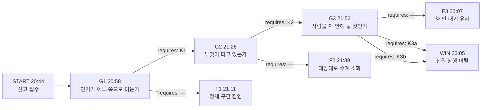

# 해원터널 — 흰 연기

## 1. 로그라인

해원터널 하행 4.2km에서 흰 연기가 올라온 밤, 요원이 회선으로 붙든 사람은 셋이다 — 프리셋에서 손을 떼려는 야간 관제원, 실은 것을 줄여 말한 화물차 운전자, 승객 서른한 명과 함께 정체 안에 갇힌 통근버스 기사.
요원에게는 듣고 조회하고 부탁하는 것 말고 아무 권한이 없고, 불은 어느 밤에나 똑같이 커진다.
바뀌는 것은 23시에 하행 입구 집결지에서 몇 사람이 자기 이름을 대답하는가다.

---

## 2. 그래프

### 노드

| id | 시각 | 장소 | 등장 조건 | yields |
|---|---|---|---|---|
| START | 20:44 | 본부 회선 · 하행 4.2km | 없음 | — |
| G1 | 20:58 | 방재센터 회선 | 없음 | 방재센터 야간 근무가 오건표 한 사람이라는 것 |
| G2 | 21:26 | 문세리 회선 · 하행 입구 소방 회선 | G1에서 하행 제연 계통 전환이 실제로 걸린 밤에만 | 소방 선착대 지휘가 남기철이고 진입 판단을 요원 회신에 걸어 둔다는 것 |
| G3 | 21:52 | 구도림 회선 · 방재센터 회선 | G2에서 소방이 건식 대응으로 전환한 밤에만 | — |
| F1 | 21:11 | 하행 2.4–4.2km | G1에서 제어를 그대로 둔 밤 | 꼬리에서 K1 · K2 |
| F2 | 21:39 | 하행 4.2km | G2에서 대장 품목을 그대로 올린 밤 | 꼬리에서 K3a |
| F3 | 22:07 | 하행 3.6km | G3에서 차 안 대기를 유지시킨 밤 | 꼬리에서 K3b |
| WIN | 23:05 | 상행 3-5번 연결통로 앞 | G3에서 통로 개방이나 방송 문안 변경이 실제로 걸린 밤 | — |

### 간선

| 출발 → 도착 | 모이는 스탠스 | requires |
|---|---|---|
| START → G1 | — | — |
| G1 → F1 | S1a | — |
| G1 → G2 | S1b · S1c | K1 |
| G2 → F2 | S2a | — |
| G2 → G3 | S2b · S2c | K2 |
| G3 → F3 | S3a | — |
| G3 → WIN | S3b · S3c | K3a |
| G3 → WIN | S3d | K3b |

---

## 3. 앎

| 코드 | 앎 | 이 앎을 성립시키는 문장 | 성립시키지 못하는 약한 문장 |
|---|---|---|---|
| K1 | 하행 제연 계통이 상행 공사 배전반에 물려 있어, 지금 도는 환기가 하행 연기를 정체 차량 쪽으로 민다 | `하행 제연 계통이 상행 공사 배전반에 물려 있다. 지금 도는 환기는 하행 연기를 입구 쪽 정체로 민다` | `환기 방향이 이상하다` · `오건표는 프리셋을 무서워한다` · `상행선 보수공사가 3주째다` |
| K2 | 문세리 화물차에는 반입 대장에 없는 드럼이 넷 더 실려 있고, 대장의 품목명으로는 이 연기가 나오지 않는다 | `문세리 차에는 대장에 없는 드럼이 넷 더 있다. 대장의 수성 세정제로는 흰 연기가 나오지 않는다` | `문세리가 무언가 숨기고 있다` · `적재물이 의심스럽다` · `드럼 수를 다시 세야 한다` |
| K3a | 3-5번 피난연결통로의 유도등 회로는 상행 공사 조명 분전반에 물려 내려가 있고, 통로 문 자체는 전원과 무관하게 손으로 열린다 | `3-5번 통로 유도등 회로는 상행 공사 조명 분전반에서 내려가 있다. 통로 문은 전원과 무관하게 손으로 열린다` | `유도등이 안 들어온다` · `터널에는 피난연결통로가 있다` |
| K3b | 오건표는 두 달 전 봉수터널에서 자기가 낸 조기 대피 방송 뒤에 한 사람이 갓길에서 차에 치여 죽는 것을 겪었고, 그래서 차선 위로 사람을 내보내는 문안을 내지 않는다 | `오건표는 두 달 전 봉수터널에서 자기 대피 방송 뒤에 갓길에서 한 사람을 잃었다. 오건표가 막는 것은 차선 위 대피다` | `오건표가 방송 문안을 바꾸기 싫어한다` · `오건표에게 시말서 이력이 있다` |

---

## 4. 인물

### 오건표 — 58세 · 해원터널 방재센터 야간 관제원

- **이해관계.** 야간 단독 근무다. 제트팬, 차단막, 전광판, 비상방송이 전부 한 자리에서 나간다. 두 달 전 봉수터널에서 근무하다 자기 판단으로 조기 대피 방송을 냈고, 그 방송을 듣고 차에서 내린 사람 하나가 갓길에서 차에 치여 죽었다. 그 뒤로 해원으로 옮겨 왔고, 매뉴얼 프리셋 바깥으로 손을 내밀지 않는다.
- **아는 것.** 지금 환기가 어느 프리셋으로 도는지. 상행 보수가 3주차라는 것. 각 피난연결통로 번호와 위치. 유도등이 어느 반에서 내려가는지.
- **모르는 것.** 하행 정체가 몇 킬로미터인지. 자기가 지금 지키고 있는 프리셋이 상행 배기를 우선으로 잡는다는 것이 오늘 밤 무슨 뜻인지.
- **게이트.** G1과 G3의 한쪽 간선.

### 문세리 — 34세 · 화물차 운전자 · 최초 신고자

- **이해관계.** 20:10에 반입 승인을 받고 들어왔다. 대장에 적힌 것은 수성 세정제 넉 드럼이고, 실제로는 다른 이름으로 넉 드럼을 더 실었다. 승인 취소가 두 번 쌓이면 노선 배차가 끊긴다.
- **아는 것.** 연기가 자기 적재함 뒤칸에서 났다는 것. 드럼이 몇 개이고 무엇인지. 20:38부터 냄새가 났다는 것.
- **모르는 것.** 그 드럼에 물을 쓰면 안 된다는 것. 뒤로 늘어선 차가 몇 대인지.
- **게이트.** G2.

### 구도림 — 41세 · 통근버스 기사 · 집계의 얼굴

- **이해관계.** 하행 3.6km 지점, 불이 난 자리보다 600m 뒤에 서 있다. 승객 서른한 명은 야간조 교대 인원이고 이름표를 달고 있다. 요원은 20:56부터 이 회선을 놓지 않는다.
- **아는 것.** 뒤로 차가 얼마나 늘어섰는지. 천장 팬이 도는 소리와 바람이 어느 쪽으로 부는지. 방재센터 방송이 지금 무슨 말을 하는지.
- **모르는 것.** 차 앞 스물여섯 걸음 자리에 3-5번 피난연결통로 문이 있다는 것. 표시등이 꺼져 있어 벽만 보인다.
- **게이트.** G3.

---

## 5. 게이트

### G1 — 연기가 어느 쪽으로 미는가

`20:58 · 방재센터 회선 · 등장 조건 없음`

20:51에 방재센터 회선을 잡았습니다. 야간 근무자는 오건표 한 사람이라고 합니다. 상행선 보수가 3주차라 야간 환기는 공사 프리셋으로 돌고 있고, 오늘 프리셋에 손을 댄 적은 없다고 했습니다. 지금 화면에 하행 제트팬 열두 대가 전부 운전 표시로 떠 있다고 합니다.

20:56에 하행 3.6km에서 통근버스 기사 구도림 회선이 들어왔습니다. 승객이 서른한 명이고, 앞쪽 400미터쯤에 정지등이 줄지어 서 있다고 했습니다. 천장에서 팬 소리가 나는데 바람이 이쪽으로 온다고 했습니다. 어느 쪽에서 오느냐고 다시 물었고, 앞에서 뒤로 부는 것이 맞다고 답했습니다.

오건표에게 지금 프리셋의 이름을 물었습니다. 대답이 한 박자 늦게 돌아왔고, 프리셋 번호는 자기 권한으로 바꾸는 것이 아니라고 했습니다. 소방 선착대는 하행 입구까지 아직 도착 전이라고 합니다. 하행 입구 차단은 20:53에 이미 내려갔습니다.

**질문.** 지금 도는 환기를 그대로 둘 것인가.

| 스탠스 | 라벨 | 설명 |
|---|---|---|
| S1a | 유지 — 달리 볼 근거가 없으므로, 방재센터가 걸어 둔 환기 제어를 그대로 두고 소방 선착대에 인계한다 | 요원이 회선을 소방 쪽으로 넘겼고, 오건표는 프리셋에 손을 대지 않았다. 하행 제트팬은 상행 배기를 우선으로 계속 돌았고, 4.2km에서 난 연기는 입구 쪽 정체 위로 밀려 내려갔다. 21:11에 하행 2.4km까지 시야가 없어졌다. |
| S1b | 역전 — 지금 도는 환기가 하행 연기를 정체 뒤쪽으로 밀고 있다고 보고, 오건표에게 하행 제트팬 수동 정방향 전환을 요청한다 | 오건표가 프리셋 바깥으로 손을 내밀었다. 하행 열두 대를 출구 방향으로 다시 세우는 데 4분이 걸렸고, 21:06에 구도림 회선으로 바람이 뒤집혔다는 말이 돌아왔다. 오건표 이름이 조작 로그에 남았다. |
| S1c | 배전 — 상행 보수 배전이 하행 방재 계통까지 물고 있다고 보고, 오건표에게 하행 계통을 공사 프리셋에서 분리하도록 요청한다 | 오건표가 공사 감독 회선을 따로 잡아 분리 승인을 받아 냈다. 상행 배기가 함께 멈추면서 상행 작업 구간에 분진 경보가 울렸고, 공사는 그 자리에서 중단됐다. 하행 연기는 21:07부터 출구 쪽으로 흘렀다. |

간선: S1a → F1. S1b · S1c → G2.

### G2 — 무엇이 타고 있는가

`21:26 · 문세리 회선 · 하행 입구 소방 회선 · 등장 조건: G1에서 하행 제연 계통 전환이 실제로 걸린 밤에만`

21:20에 반입 대장을 조회했습니다. 문세리 차량은 20:10 승인, 품목은 공업용 세정제 수성 넉 드럼입니다. 21:04에 CCTV 41번으로 적재함을 봤을 때 문이 열려 있었고 드럼 윤곽이 보였습니다. 연기 때문에 수를 셀 수 없었습니다.

21:31에 하행 입구에서 소방 선착대 지휘 남기철 대장 회선이 들어왔습니다. 진입 준비가 끝났고, 수계 소화로 들어갈지 여부만 회신해 달라고 했습니다. 관창 전개까지 6분, 그 뒤로는 되돌리지 않는다고 했습니다.

문세리에게 다시 물었습니다. 연기가 흰색이고 냄새가 시큼하다고 했습니다. 언제부터 났느냐고 물었고, 20:38부터라고 답했습니다. 반입 승인은 20:10입니다. 드럼을 몇 개 실었느냐고 물었을 때 대답이 돌아오는 데 시간이 걸렸고, 대장에 적힌 대로라고 했습니다.

**질문.** 소방에 무엇을 올릴 것인가.

| 스탠스 | 라벨 | 설명 |
|---|---|---|
| S2a | 대장대로 — 달리 의심할 근거가 없으므로, 반입 대장에 적힌 품목을 그대로 소방 선착대에 올린다 | 남기철이 수성 세정제 기준으로 관창을 전개했다. 21:39에 방수가 시작됐고, 흰 연기가 잿빛으로 바뀌면서 부피가 몇 배로 늘었다. 정방향 환기로도 잡히지 않고 양쪽으로 퍼졌다. |
| S2b | 허위 적재 — 신고자가 실을 수 없는 것을 실었다고 보고, 문세리에게 드럼 표기를 직접 읽어 달라고 한다 | 문세리가 적재함 옆으로 돌아가 라벨을 읽었다. 대장에 없는 이름이 나왔고, 남기철이 그 이름 하나로 관창을 접고 분말과 질식포로 바꿨다. 문세리 진술이 그대로 조서가 됐다. |
| S2c | 건식 요청 — 대장에 적힌 품목으로는 이 연기가 나오지 않는다고 보고, 소방에 물을 쓰지 말 것부터 요청한다 | 남기철이 품목을 모르는 채로 수계를 보류했다. 진입이 9분 늦어졌고, 그동안 4.2km 지점 화세가 커졌다. 대신 방수로 인한 확산은 일어나지 않았고, 21:50에 건식 장비가 올라갔다. |

간선: S2a → F2. S2b · S2c → G3.

### G3 — 사람을 차 안에 둘 것인가

`21:52 · 구도림 회선 · 방재센터 회선 · 등장 조건: G2에서 소방이 건식 대응으로 전환한 밤에만`

21:47부터 구도림 회선을 계속 잡고 있습니다. 연기는 출구 쪽으로 나가고 있고 3.6km 지점 시야는 아직 있습니다. 다만 앞쪽에서 뭔가 터지는 소리가 두 번 났고, 승객 중 앞자리에 앉은 사람 하나가 내리겠다고 일어섰다고 합니다.

방재센터 비상방송은 하행 전 구간 동보로 나갑니다. 21:50 기준 문안은 「차량 안에서 대기하십시오」이고, 3분 간격으로 반복 중이라고 오건표가 확인해 줬습니다. 구도림에게 그 방송이 들리느냐고 물었고, 잘 들린다고, 그래서 승객을 앉혀 뒀다고 했습니다.

구도림에게 차 주변을 보게 했습니다. 오른쪽 벽에 소화기함이 있고, 그 너머로는 표시가 아무것도 없다고 했습니다. 벽만 있다고 했습니다. 뒤로 늘어선 차는 자기가 보는 데까지 마흔 대가 넘는다고 합니다.

오건표에게 방송 문안 변경이 가능하냐고 물었습니다. 야간 문안은 매뉴얼 순서대로 나가는 것이라고 했습니다. 남기철 대장은 22:10에 4.2km 지점 진입 예정이고, 진입하면 하행 회선 우선권이 소방으로 넘어갑니다.

**질문.** 구도림에게 무엇을 시킬 것인가.

| 스탠스 | 라벨 | 설명 |
|---|---|---|
| S3a | 현행 유지 — 달리 지시할 근거가 없으므로, 방재센터 방송에 맞춰 구도림에게 차 안 대기를 유지시킨다 | 구도림이 일어선 승객을 다시 앉혔다. 22:10에 회선 우선권이 소방으로 넘어갔고, 그 뒤로 3.6km 지점에는 아무 지시도 닿지 않았다. 서른두 명이 자리에 앉은 채로 남았다. |
| S3b | 유도등 부재 — 유도등이 꺼진 것이지 통로가 없는 것이 아니라고 보고, 구도림에게 진행 방향 거리로 3-5번 문 위치를 짚어 준다 | 구도림이 소화기함에서 스물여섯 걸음을 세어 걸었고 손잡이를 찾았다. 문이 열렸고 승객이 상행 쪽으로 넘어가기 시작했다. 통로를 처음 통과한 사람이 22:31, 마지막이 22:47이었다. |
| S3c | 직접 개방 — 통로 문은 전원과 무관하게 열린다고 보고, 구도림에게 승객 둘을 붙여 수동 개방을 부탁한다 | 구도림이 승객 둘을 데리고 벽을 따라 손으로 훑었다. 문틀을 먼저 찾고 손잡이를 나중에 찾았다. 셋이 매달려 여는 데 2분이 걸렸고, 그 사이 나머지 승객이 줄을 만들었다. 22:47에 상행 갓길에서 인원 확인이 끝났다. |
| S3d | 갓길이 아니다 — 오건표가 막고 있는 것은 차선 위 대피라고 보고, 이번 이동이 횡갱 안이라는 것을 전제로 방송 문안 변경을 요청한다 | 오건표가 문안을 바꿨다. 21:58부터 「가장 가까운 피난연결통로 번호로 이동하십시오」가 나갔고, 구간별 번호를 오건표가 직접 읽었다. 3.6km 구간에 3-5번이 불렸고, 구도림 차 말고도 뒤쪽 승용차 사람들이 함께 움직였다. 오건표 이름이 방송 변경 로그에 남았다. |

간선: S3a → F3. S3b · S3c → WIN. S3d → WIN.

---

## 6. 결과 꼬리

### F1 — 21:11 정체 구간 침연 (1회차 꼬리)

`21:11 → 23:20`

21:11, 구도림 회선으로 앞쪽이 하얗게 닫혔다는 말이 돌아온다. 요원은 연기가 낮은지 높은지 묻고, 낮게 깔린다는 답을 받는다. 요원이 승객을 내리게 할지 판단하는 자리는 열리지 않고, 구도림이 스스로 문을 열었다가 다시 닫는다. 그 사실은 구도림이 회선으로 말해 줘서 기록에 남는다.

21:20, 요원이 반입 대장을 조회한다. 수성 세정제 넉 드럼. 요원은 이 값을 그대로 하행 입구로 올린다.

21:31, 남기철 회선이 들어온다. 요원은 진입 조건을 묻고, 대장 값을 전달한다. 21:38, 요원은 오건표에게 하행 제트팬 방향을 다시 요청한다. 오건표는 프리셋 번호를 자기가 바꾸는 것이 아니라고 답한다. 요원은 같은 요청을 21:44에 한 번 더 넣고, 이번에는 감독 회선 번호를 달라고 한다. 번호가 오지 않는다.

21:47, 구도림 회선이 응답을 멈춘다. 요원은 3분 간격으로 다시 건다. 22:02, 22:05, 22:08. 신호는 가지만 받지 않는다.

22:14, 남기철이 하행 4.2km에 진입한다. 수계 소화가 시작되고, 회선으로 연기가 잿빛으로 바뀐다는 말이 온다. 요원은 배기 상황을 방재센터에 묻고, 오건표는 하행 배기가 상행 우선이라 지금 값이 안 올라온다고 답한다. 요원은 처음으로 배전 계통도를 조회 요청한다. 접수 번호가 돌아온다.

22:36, 하행 입구 집결지에서 소방이 인원을 센다. 회선으로 세 번 올라오는데 값이 다 다르다. 206, 189, 194. 요원은 어느 값이 맞느냐고 묻고, 다시 세는 중이라는 답을 받는다.

23:02, 해원병원 응급실 회선으로 문세리 진술이 들어온다. 드럼은 여섯이었고 넷은 대장에 없는 이름이었다고 한다. 요원은 그 이름을 받아 적고 남기철에게 전달한다. 방수는 22:14에 이미 시작됐다.

23:14, 요청했던 방재 배전 계통도가 문서로 도착한다. 하행 제연 계통이 상행 공사 배전반에 물려 있다. 요원은 도면 번호를 확인하고, 오늘 밤 하행 제트팬이 상행 배기를 우선으로 돌고 있었다는 것을 계통도 위에서 읽는다. 요원은 오건표 회선에 다시 건다. 교대 시각이 지나 있다.

23:20, 사망 집계가 닫힌다.

**이 꼬리가 요원의 보고서에 반드시 담게 되는 것**

- 라운드 후반 보고서에 방재 배전 계통도 조회 결과가 실린다. 근거는 §9-8의 23:14 행이다. 하행 제연 계통과 상행 공사 배전반이 한 반에 물려 있다는 도면 사실은 요원이 문서로 직접 읽은 것이므로 문장으로 남는다. → **K1 성립**
- 마지막 보고서에 문세리 진술이 실린다. 근거는 23:02 행이다. 드럼 여섯, 그중 넷은 대장에 없는 이름. → **K2 성립**
- 22:36 행 때문에 집결지 집계가 세 번 다르게 올라왔다는 문장이 실린다. 어느 값이 맞는지는 실리지 않는다.
- 3-5번 통로에 관한 문장은 실리지 않는다. 이 밤 요원은 통로 번호를 들을 자리가 없다. **K3a와 K3b는 성립하지 않는다.**

### F2 — 21:39 대장대로 수계 소화

`21:39 → 23:11`

21:39, 남기철 회선으로 방수 개시가 통보된다. 21:44, 같은 회선으로 연기 색이 바뀌었다는 말이 온다. 흰색에서 잿빛, 부피가 몇 배. 요원은 정방향 환기가 유지되고 있는지 방재센터에 확인하고, 유지 중이라는 답을 받는다. 그래도 연기가 양쪽으로 간다.

21:52, 요원이 구도림에게 상황을 묻는다. 앞쪽이 흐려진다고 한다. 요원은 남기철에게 3.6km 지점에 사람이 있다고 알린다. 22:19, 소방 대원 한 조가 3-5번 연결통로로 진입한다. 남기철 회선으로 통로를 찾는 데 시간이 걸렸다는 말이 온다. 유도등이 안 들어와서 벽을 손으로 훑었다고, 나중에 상행 공사 조명 분전반이 내려가 있는 것을 확인했다고 한다. 문 자체는 그냥 열렸다고 한다.

22:31, 통로로 나온 사람들이 상행 갓길에 선다. 구도림 차에서 아홉 명이 나오지 못한다. 구도림은 의식이 없는 상태로 나온다. 요원은 이송 병원과 상태를 계속 묻는다.

23:11, 사망 집계가 닫힌다.

**이 꼬리가 요원의 보고서에 반드시 담게 되는 것**

- 22:19 행 때문에 3-5번 통로 유도등 회로와 상행 공사 조명 분전반, 그리고 문이 전원과 무관하게 열렸다는 문장이 실린다. → **K3a 성립**
- 오건표에 관해서는 방송 문안이 매뉴얼 순서대로 나갔다는 문장까지만 실린다. → **K3b는 성립하지 않는다.**

### F3 — 22:07 차 안 대기 유지

`22:07 → 23:17`

22:07, 방재센터 방송이 「차량 안에서 대기하십시오」로 계속 나간다. 22:10, 하행 회선 우선권이 소방으로 넘어간다. 요원은 구도림 회선을 개별로 붙들고 있고, 회선은 아직 살아 있다.

22:26, 요원이 오건표에게 문안 변경을 다시 요청한다. 세 번째 요청이다. 오건표는 매뉴얼 순서를 말한다. 요원은 3.6km에 서른두 명이 있다는 것과 그중 서른한 명이 야간조 교대 인원이라는 것을 알린다.

22:40, 구도림 회선으로 앞쪽에서 파열음이 났다는 말이 온다. 화물차 타이어라고 한다. 그쪽 기류가 흐트러지면서 연기가 되돌아온다고 한다. 요원은 창을 닫고 외기 순환을 끄라고 부탁하고, 구도림이 그렇게 한다.

22:52, 오건표가 회선을 먼저 연다. 두 달 전 봉수터널에서 자기가 조기 대피 방송을 냈고, 그 방송을 듣고 차에서 내린 사람 하나가 갓길에서 차에 치여 죽었다고 말한다. 요원은 계속 듣는다. 22:55에 요원이 다시 문안 변경을 요청한다. 오건표가 문안을 바꾼다. 22:58부터 통로 번호가 나간다.

23:02, 구도림 회선이 응답을 멈춘다. 23:09, 소방이 3-5번 통로 안쪽에서 사람들을 확인한다. 스물다섯 명이 통로 안에 있다. 일곱 명이 차 안에 남아 있다. 구도림이 그중 하나다.

23:17, 사망 집계가 닫힌다.

**이 꼬리가 요원의 보고서에 반드시 담게 되는 것**

- 22:52 행 때문에 오건표 진술이 실린다. 봉수터널, 자기 방송, 갓길에서 죽은 한 사람. 22:58에 문안이 실제로 바뀌었다는 사실도 같은 라운드에 실린다. → **K3b 성립**
- 3-5번 통로가 존재하고 사람들이 그 안까지 갔다는 문장은 실리지만, 유도등 회로가 왜 죽었는지는 이 밤 어느 회선으로도 들어오지 않는다. → **K3a는 약한 문장으로만 남는다.**

---

## 7. 집계

| 종단 | 사망 | 중태 | 이름이 불리는 자리 | 목숨이 아닌 값 |
|---|---|---|---|---|
| F1 | 118명 | 19명 | 구도림과 승객 서른한 명 전원 | 하행 무기한 폐쇄. 입건 없음 — 문세리도 사망자 안에 있다 |
| F2 | 24명 | 41명 | 구도림 차 승객 아홉 명. 구도림은 중태 | 문세리 입건. 하행 8주 폐쇄 |
| F3 | 7명 | 12명 | 구도림. 승객 여섯 명 | 문세리 입건. 오건표 방송 문안 지연 조사. 하행 6주 폐쇄 |
| WIN | 0명 | 0명 | 없음 | 문세리 입건. 오건표 프리셋 무단 조작 감사. 상행 보수공사 중단. 하행 6주 폐쇄 |

---

## 8. 고정 타임라인

| 시각 | 표면 | 장소 | 요원의 기록 | 조건 |
|---|---|---|---|---|
| 20:44 | 통화 | 하행 4.2km | 신고자 문세리와 연결됐습니다. 자기 화물차 뒤칸에서 흰 연기가 났고 차는 갓길에 세웠다고 합니다. 세정제 넉 드럼을 실었다고 먼저 말했습니다 | — |
| 20:51 | 통화 | 방재센터 | 오건표에게 환기 상태를 물었습니다. 상행 보수가 3주차라 야간 환기는 공사 프리셋으로 돈다고, 오늘 손댄 적은 없다고 합니다 | — |
| 20:56 | 통화 | 하행 3.6km | 통근버스 기사 구도림 회선입니다. 승객 서른한 명, 앞쪽 400미터에 정지등이 줄지어 서 있고, 천장 팬 바람이 앞에서 뒤로 온다고 합니다 | — |
| 21:04 | CCTV | 하행 4.2km | CCTV 41번으로 적재함을 확인했습니다. 문이 열려 있고 드럼 윤곽이 보입니다. 연기 때문에 수를 셀 수 없습니다 | — |
| 21:11 | 통화 | 하행 2.4–3.6km | 구도림이 앞쪽이 하얗게 닫혔다고 합니다. 연기가 낮게 깔려서 문을 열었다가 다시 닫았다고 했습니다 | 환기 제어를 그대로 둔 밤에만 |
| 21:20 | 문서 | 반입 대장 | 반입 대장을 조회했습니다. 문세리 차량, 20:10 승인, 공업용 세정제 수성 넉 드럼입니다 | — |
| 21:31 | 통화 | 하행 입구 | 소방 선착대 남기철 대장입니다. 진입 준비가 끝났고 수계 소화 여부만 회신해 달라고, 관창 전개 뒤로는 되돌리지 않는다고 합니다 | — |
| 21:44 | 현장 | 하행 4.2km | 남기철 회선입니다. 방수 뒤로 연기가 흰색에서 잿빛으로 바뀌었고 부피가 몇 배로 늘어 양쪽으로 퍼진다고 합니다 | 대장에 적힌 품목을 그대로 올린 밤에만 |
| 21:47 | 통화 | 하행 3.6km | 구도림 회선이 응답하지 않습니다. 3분 간격으로 다시 걸고 있습니다. 신호는 갑니다 | 환기 제어를 그대로 둔 밤에만 |
| 22:19 | 통화 | 하행 3.6km | 남기철 회선입니다. 대원 한 조가 3-5번 연결통로로 진입했는데 유도등이 안 들어와 벽을 손으로 훑었다고, 상행 공사 조명 분전반이 내려가 있었고 문 자체는 그냥 열렸다고 합니다 | 대장에 적힌 품목을 그대로 올린 밤에만 |
| 22:36 | 현장 | 하행 입구 집결지 | 집결지 인원이 세 번 올라왔습니다. 206, 189, 194입니다. 어느 값이 맞느냐고 물었고 다시 세는 중이라는 답을 받았습니다 | 환기 제어를 그대로 둔 밤에만 |
| 22:40 | 통화 | 하행 3.6km | 구도림이 앞쪽에서 파열음이 났다고, 화물차 타이어라고 합니다. 기류가 흐트러지면서 연기가 되돌아온다고 했습니다 | 차 안 대기를 유지시킨 밤에만 |
| 22:47 | 현장 | 상행 3-5번 통로 앞 | 구도림이 상행 갓길에서 인원 확인을 마쳤다고 합니다. 서른두 명 전원입니다 | 3-5번 통로로 승객을 내보낸 밤에만 |
| 22:52 | 통화 | 방재센터 | 오건표가 먼저 회선을 열었습니다. 두 달 전 봉수터널에서 자기가 낸 조기 대피 방송을 듣고 차에서 내린 사람 하나가 갓길에서 차에 치여 죽었다고 했습니다 | 차 안 대기를 유지시킨 밤에만 |
| 23:02 | 통화 | 해원병원 | 문세리 진술이 들어왔습니다. 드럼은 여섯이었고 넷은 대장에 없는 이름이었다고 합니다. 이름을 받아 적어 남기철에게 전달했습니다 | 환기 제어를 그대로 둔 밤에만 |
| 23:14 | 문서 | 방재 배전 계통도 | 요청했던 계통도가 도착했습니다. 하행 제연 계통이 상행 공사 배전반에 물려 있습니다. 오건표 회선에 다시 걸었고 교대 시각이 지나 있었습니다 | 환기 제어를 그대로 둔 밤에만 |

총 16행이다.
첫 밤이 보는 행은 11행이다 — 조건 없는 행 여섯에 F1 조건 행 다섯.

---

## 9. 네 밤의 진행

**1회차** — 인수인계 네 칸이 전부 비어 있다. G1에서 S1a로 가고 21:11에 손이 닿지 않게 된다. 그 뒤 두 시간 동안 요원은 오건표에게 두 번 더 팬 전환을 요청하고, 구도림 회선을 열여덟 번 다시 걸고, 배전 계통도를 조회 요청한다. 답이 전부 늦게 온다. 꼬리에서 K1과 K2가 성립한다. 3-5번 통로는 이름조차 나오지 않는다.

**2회차** — 플레이어가 K1과 K2를 올린다. G1과 G2를 지나고 G3에서 S3a로 간다. 22:07에 손이 닿지 않게 되고, 요원은 22:26까지 문안 변경을 세 번 요청한다. 오건표가 22:52에 봉수터널을 말한다. 꼬리에서 K3b가 성립한다. K3a는 통로가 있었다는 사실까지만 남는다.

**2회차 변형** — 플레이어가 K1만 올리거나 K2 자리에 약한 문장을 올리면 G2에서 S2a로 가고 21:39에 손이 닿지 않게 된다. 꼬리에서 K3a가 성립한다. 어느 쪽으로 헛디뎌도 G3를 여는 열쇠가 하나 나온다.

**3회차** — K1, K2, 그리고 K3a나 K3b 중 앞 밤에서 나온 하나를 올린다. 네 칸 중 세 칸이 찬다. 남은 한 칸은 확신 없는 문장을 걸어 보는 자리다. 성공 경로가 여기서 열린다.

**4회차** — 3회차에 마지막 칸으로 약한 문장을 올려 요원이 엉뚱한 스탠스로 샜을 때의 여유분이다. 3회차 꼬리에서 나머지 열쇠 하나가 마저 성립하므로, 4회차에는 성공 경로 두 개가 다 열려 있다.

---

## 10. 자기 검사

### §4 — 그래프

1. **노드마다 시각이 다르다.** START 20:44, G1 20:58, G2 21:26, G3 21:52, F1 21:11, F2 21:39, F3 22:07, WIN 23:05. 겹치는 값 없음.
2. **게이트마다 requires가 빈 간선이 정확히 하나이고 그것이 실패 간선이다.** G1은 →F1, G2는 →F2, G3는 →F3. 각각 하나씩.
3. **1회차는 게이트 하나만 지나고 실패한다.** 빈 인수인계로는 S1b·S1c의 전제를 딛지 못하므로 S1a만 남고, 경로는 START → G1 → F1이다.
4. **열쇠는 문 뒤에 있다.** K1은 G1 앞 경로에 노드가 START뿐이고 START는 yield하지 않는다. K2는 G1의 yields가 근무 인원뿐이므로 걸리지 않는다. K3a·K3b는 G1·G2의 yields 어디에도 없다. 넷 다 §1이 준 것이 아니다 — §1이 주는 것은 요원의 권한과 위치뿐이다.
5. **성공 경로는 둘이다.** G3 → WIN 간선 두 개. 통로를 짚어 주는 길과 방송 문안을 바꾸는 길. 같은 서른두 명이 같은 3-5번 통로로 나온다.
6. **경로당 requires는 셋이다.** 경로 A는 K1·K2·K3a, 경로 B는 K1·K2·K3b. 네 칸 중 한 칸이 빈다.
7. **3회차 안에 성공 경로가 열린다.** 1회차 꼬리가 K1·K2, 2회차 꼬리가 K3a나 K3b 중 하나. 3회차에 셋이 모인다.
8. **집계는 마지막 노드가 정한다.** F1·F2·F3·WIN 각각 고정값 하나. 두 성공 경로가 WIN 하나로 모이므로 경로별 집계 차이가 없다.
9. **한 게이트가 두 집계 단위를 반대로 결정하지 않는다.** G1은 정체 구간 사람만, G2는 화점 주변과 정체 구간을 같은 방향으로, G3는 구도림 차 사람만 움직인다. 이쪽을 살리면 저쪽이 죽는 자리가 없다.
10. **모든 집계 단위가 동시에 최선인 경로가 있다.** WIN에서 사망 0, 중태 0. 남는 값은 입건과 감사와 폐쇄로, 전부 목숨이 아니다.
11. **yields를 실어 나르는 행이 있다.** K1은 23:14 행, K2는 23:02 행, K3a는 22:19 행, K3b는 22:52 행. 넷 다 조건 칸이 붙은 경로 전용 행이고, 그 경로에서 실제로 일어난다.
12. **실패한 뒤에는 어떤 자리도 열리지 않는다.** F1 밤에는 G2 조건인 「제연 계통 전환이 걸린 밤」이 성립하지 않고, G3 조건인 「소방이 건식 대응으로 전환한 밤」도 성립하지 않는다. F2 밤에는 G3 조건이 성립하지 않는다. F3 밤 뒤에는 노드가 없다. 세 실패 뒤로 열리는 자리가 하나도 없다.
13. **첫 밤 꼬리는 앎을 둘 내놓되 전부는 아니다.** K1·K2가 나오고 K3a·K3b는 나오지 않는다. 가장 깊은 두 개가 둘째 밤 이후의 꼬리에서만 나온다.
14. **모든 시각이 자정 전이다.** 가장 늦은 값이 F1 꼬리의 23:20이다. 게이트·종단·타임라인·꼬리를 훑어 00시대 값 0건.

### §5 — 스탠스

1. **라벨 안에 이유가 들어 있다.** 열 개 라벨 전부 낱말 하나로 끝나지 않고 「~라고 보고」나 「~근거가 없으므로」를 달고 있다.
2. **기본 간선 라벨은 근거의 부재만 말한다.** S1a는 「달리 볼 근거가 없으므로」, S2a는 「달리 의심할 근거가 없으므로」, S3a는 「달리 지시할 근거가 없으므로」.
3. **기본 라벨에 사실을 싣지 않았다.** S2a에 「대장과 신고 내용이 어긋나지 않으므로」를 쓰지 않았다. 그렇게 썼으면 K2가 넘어와도 요원이 K2 쪽을 기각한다.
4. **나머지 라벨은 딛고 선 전제를 말한다.** S1b는 환기가 연기를 뒤로 민다는 전제, S2b는 신고자가 실을 수 없는 것을 실었다는 전제, S3d는 오건표가 막는 것이 차선 위 대피라는 전제.
5. **어떤 라벨도 자기 수확을 말하지 않는다.** 「계통도를 펼쳐 본다」나 「드럼 수를 알아낸다」 같은 문구가 없다. S2b는 라벨을 읽어 달라는 요청이지 그 결과가 무엇인지는 말하지 않는다.
6. **비기본 전제가 §1이 이미 준 것이 아니다.** 「현장 판단이 관제보다 정확하다」 계열이 없다. 여섯 개 비기본 전제가 전부 K1·K2·K3a·K3b 중 하나를 요구한다.
7. **탈출구가 없다.** 「일단 확인부터」 계열을 넣지 않았다. G1에서 정체 길이를 세게 하는 스탠스, G2에서 드럼을 다시 세게 하는 스탠스를 둘 다 뺐다 — 앎을 쥔 요원도 그리로 도망갈 수 있었다.
8. **한 간선에 모인 스탠스가 발화에서 갈린다.** S1b는 팬을 돌려 달라는 말, S1c는 계통을 분리해 달라는 말. S2b는 문세리에게 하는 말, S2c는 남기철에게 하는 말. S3b는 거리를 짚어 주는 말, S3c는 사람을 붙여 달라는 말.
9. **여유가 닫혀 있다.** 관창 전개 뒤로는 되돌리지 않는다는 6분, 22:10에 하행 회선 우선권이 소방으로 넘어가는 시각, 20:53에 이미 내려간 하행 입구 차단.
10. **열쇠가 지목하는 대상이 유일하다.** K1은 「배전반」, K3a는 「조명 분전반」으로 낱말을 갈랐다. 「드럼」은 K2에서만 쓰이고 다른 열쇠에 나오지 않는다. 3회차 인수인계에 K1과 K3a가 함께 올라도 거꾸로 읽힐 자리가 없다.

### §7 — 금지

1. **글자 입력 장치 없음.** 플레이어가 하는 일은 보고서 문장을 네 칸에 올리는 것뿐이다.
2. **믿음을 회수하는 비트 없음.** 어떤 꼬리도 앞 회차에 넘긴 문장을 취소하지 않는다. 약한 문장을 지우는 방법은 더 센 문장을 넘기는 것뿐이다.
3. **순서·우선순위 장치 없음.** 네 칸에 순서가 없다.
4. **감정이나 인용에 기대는 정답 경로 없음.** K3b는 감정이 아니라 사건 사실이다 — 두 달 전 봉수터널, 갓길, 한 사람. 요원이 움직이는 이유는 「이번 이동은 차선 위가 아니다」가 명백한 반박이기 때문이다.
5. **요원의 대답을 전제하는 고정 장면 없음.** 요원의 말이 필요한 세 순간이 전부 게이트다. 타임라인 열여섯 행 중 요원의 회신을 전제하는 행이 없다.
6. **밖을 인지하는 인물 없음.** 오건표도 문세리도 구도림도 이 밤이 다시 돌아간다는 것을 모른다.
7. **왼쪽 칸에 게임 어휘 없음.** 로그라인·인물·장면 산문·스탠스 라벨과 설명·꼬리의 실리는 부분·집계 문장·타임라인 사건 칸을 훑어 「런」 「회차」 「스탠스」 「게이트」 「노드」 「앎」이 0건. 「회차」는 §9-9와 §9-10에만 있고 그 둘은 오른쪽 칸이다.
8. **번역투 없음.** 대명사 그·그녀·그것·그들 0건. 「~에 의해」 0건. 「~되어지다」 0건. 「~에도 불구하고」 0건. 세미콜론 0건. 문중 괄호 0건. 수가 드러난 자리의 「-들」 0건 — 「승객 서른한 명」 「대원 한 조」로 썼다.
9. **요원이 알 수 없는 문장 없음.** 아래 별도 항목에서 한 줄씩 짚었다.
10. **요원이 구조를 내려다보는 문장 없음.** 「이 아래는 들은 것만 적습니다」 계열이 0건이다. 세 꼬리 전부에서 요원은 끝까지 묻고 조회하고 부탁한다 — F1에서는 팬 전환을 두 번 더 요청하고 계통도를 조회하고 구도림 회선을 계속 다시 걸고, F2에서는 이송 병원과 상태를 계속 묻고, F3에서는 문안 변경을 세 번 요청한다.

### 문서 전체를 훑는 세 항목

- **자정 초과 시각 0건.** 게이트 셋과 종단 넷, 타임라인 열여섯 행, 세 꼬리 안의 모든 시각을 세었다. 가장 늦은 값이 F1 꼬리의 23:20이고 00시대 값은 없다.
- **장면 산문이 열쇠의 일을 미리 하지 않는다.** G1 산문은 프리셋 이름과 바람 방향까지만 말하고 계통이 어디에 물렸는지는 말하지 않는다. G2 산문은 대장 값과 냄새와 승인 시각을 나란히 놓되 어긋난다고 말하지 않는다 — 20:10 승인과 20:38 발연은 재료이고, 20:10에 실은 것으로 20:38에 저 연기가 나오지 않는다는 결론은 놓지 않았다. G3 산문은 구도림이 「벽만 있다」고 말한 데서 멈춘다. 통로가 있다는 것도, 표시등이 왜 꺼졌는지도 나오지 않는다. 마지막 게이트에서 가장 자주 샌다는 경고 때문에 G3를 두 번 더 훑었고, 소화기함을 남긴 것은 K3a가 도착했을 때 스물여섯 걸음을 셀 기준점이 있어야 하기 때문이지 통로를 암시하기 위해서가 아니다.
- **요원이 알 수 없는 문장 0건.** 타임라인 열여섯 행의 표면이 전부 통화·CCTV·문서·현장 중 하나이고, 「현장」 두 행은 남기철과 구도림이 회선으로 전해 준 것이다. 꼬리 서술도 한 줄씩 짚었다 — F1의 21:11은 구도림 말, 21:47은 응답 없음이라는 사실 자체, 22:36은 소방 회선, 23:02는 병원 회선, 23:14는 문서. F2의 22:19는 남기철 말, 22:31의 아홉 명은 통로 밖 인원 확인 결과. F3의 22:40은 구도림 말, 22:52는 오건표 말, 23:09는 소방 확인. 요원이 없는 자리에서 벌어진 일 중 아무도 전해 주지 않은 것은 쓰지 않았다 — 구도림 차 안에서 마지막에 무슨 말이 오갔는지는 어느 꼬리에도 없다.
