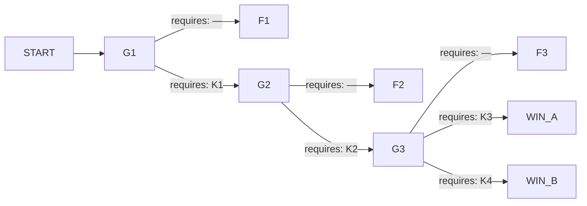

# 한내돔 — 눈이 안으로 쏟아진 밤

## 1. 로그라인

대설주의보가 내린 밤, 한내시립스포츠돔에서 천장이 처진다는 신고 한 통이 들어온다. 공기로 서 있는 지붕이라 안에 있는 사람들은 두 사람씩만 도는 회전문으로 나와야 하고, 야간 당직자는 안에 아무도 없다고 말한다. 지붕은 어차피 내려앉는다 — 남은 물음은 그때 몇 명이 아직 회전문 앞에 서 있는가다.

---

## 2. 그래프

### 노드

| id | 시각 | 장소 | 등장 조건 | yields |
|---|---|---|---|---|
| G1 | 18:41 | 국가재난대응실 상황 회선 — 한내돔 상황실과 연결 | — | — |
| G2 | 19:29 | 상황 회선 — 남측 에어락의 문세라와 상황실의 표기웅이 동시에 물려 있다 | G1에서 인원 확인 요구 결과에 닿은 시행 | — |
| G3 | 19:58 | 상황 회선 — 하도경 회선이 세 번째로 붙어 있다 | G2에서 서측 슬리브 개방 결과에 닿은 시행 | — |
| F1 | 18:41 → 22:47 종단 | 한내돔 일원 | G1의 기본 결과 | K1, K4 |
| F2 | 19:29 → 22:16 종단 | 한내돔 일원 | G2의 기본 결과 | K2, K3 |
| F3 | 19:58 → 21:58 종단 | 한내돔 일원 | G3의 기본 결과 | — (정황만) |
| WIN_A | 21:40 종단 | 한내돔 일원 | G3의 급기 회복 결과 | — |
| WIN_B | 21:44 종단 | 한내돔 일원 | G3의 북측 개방 결과 | — |

### 간선

| 출발 → 도착 | 모이는 스탠스 | requires |
|---|---|---|
| START → G1 | — | — |
| G1 → F1 | S1-1 | — |
| G1 → G2 | S1-2, S1-3 | K1 |
| G2 → F2 | S2-1 | — |
| G2 → G3 | S2-2, S2-3 | K2 |
| G3 → F3 | S3-1 | — |
| G3 → WIN_A | S3-2 | K3 |
| G3 → WIN_B | S3-3, S3-4 | K4 |

---

## 3. 앎

| 코드 | 앎 | 이 앎을 성립시키는 문장 | 성립시키지 못하는 약한 문장 |
|---|---|---|---|
| K1 | 돔 안 행사는 끝나지 않았고, 당직자가 말한 인원은 실제와 다르다 | `표기웅이 혼자라고 말한 시각에 관중석에는 아이들과 인솔자가 남아 있었습니다` | `표기웅의 말이 미심쩍었습니다` |
| K2 | 서쪽 벽 아래 자재 반입 슬리브는 사람이 지나갈 수 있고 바깥 하역장으로 곧장 통한다 | `서쪽 벽 아래 자재 반입 슬리브로 여덟 명이 기어 나왔습니다` | `돔에는 남측 회전문 말고 다른 개구부도 있습니다` |
| K3 | 2호 급기 송풍기는 부서진 것이 아니라 배전반 B 3번 차단기가 내려가 있을 뿐이다 | `배전반 B 3번 차단기를 올리면 2호 송풍기가 대기에서 깨어납니다` | `송풍기 두 대 가운데 한 대가 오래전부터 돌지 않았습니다` |
| K4 | 북측 비상 개방문은 사슬과 자물쇠로 묶여 있고, 자물쇠 열쇠는 표기웅 주머니에 있다 | `북측 비상 개방문 손잡이에 사슬이 감겨 있고, 그 자물쇠 열쇠를 표기웅이 주머니에 넣고 다닙니다` | `북측 비상 개방문이 열리지 않았습니다` |

약한 문장 넷은 전부 미끼로 쓰인다. 넘겨도 요원은 자기가 이미 보고 있는 것을 되풀이해 들었다고 여기고 기본 쪽으로 간다. 왜 안 움직였는지는 그 시행의 보고서에 남는다.

---

## 4. 인물

**표기웅 (58 · 한내돔 시설관리 야간 당직, 신고자)**
이해관계 — 급기 송풍기 두 대 가운데 1호기만 살아 있고, 밤새 그것만 돌리면 베어링에서 소리가 난다. 겨울 내내 저녁에 껐다가 새벽에 켜 왔다. 오늘은 경기가 늘어지는 바람에 다시 켜는 시각을 놓쳤다. 작년 자재 도난 뒤로 북측 비상 개방문 손잡이에 사슬을 감고 자물쇠를 채웠고, 열쇠는 작업복 주머니에 넣고 다닌다.
아는 것 — 급기를 언제 껐는지, 사슬과 열쇠, 오늘 저녁 편성이 두 시간 밀렸다는 것.
모르는 것 — 2호기가 부서진 적이 없다는 것. 준공 때부터 배전반 B 3번 차단기가 내려가 있었다는 것을 표기웅은 한 번도 들어 본 적이 없다.
게이트 — G1과 G3을 진다. 처음에는 감추는 사람이고, 마지막에는 주머니에 열쇠를 넣고 있는 사람이다.

**문세라 (31 · 한내유소년배구클럽 인솔 겸 심판)**
이해관계 — 경기 시작이 늦어진 것을 알고도 마지막 세트를 그대로 치르게 했다. 코트에 남은 아이들이 남아 있는 이유가 자기라는 것을 알고 있다.
아는 것 — 관중석과 코트에 대략 몇이 남았는지, 회전문 앞이 어떻게 밀리는지, 조명이 언제 꺼졌는지.
모르는 것 — 돔이 공기로 서 있다는 것. 천장이 처지는 것과 회전문이 느린 것이 같은 원인이라는 것.
게이트 — G2가 문세라에 관한 것이다. 집계의 얼굴이기도 하다. 요원이 회선으로 이름을 아는 유일한 사람이고, 아무것도 바꾸지 못한 시행에서 잃는 사람이다.

**하도경 (44 · 전 막구조 정비기사, 한내돔 시공 하청, 3년 전 퇴사)**
이해관계 — 준공 검사 때 급기 이중화 시험 확인란에 서명했다. 2호기는 그날 돌아간 적이 없다. 지금 그것을 말하면 서명이 먼저 문제가 된다.
아는 것 — 급기 계통 배선, 2호기 인버터가 배전반 B에 물려 있고 3번 차단기가 내려간 채라는 것, 서쪽 벽 아래 자재 반입 슬리브가 하역장으로 곧장 통한다는 것, 북측 사슬을 감은 사람이 누구인지.
모르는 것 — 오늘 밤 돔 안에 사람이 몇인지. 처음에는 그래서 대수롭지 않게 답한다.
게이트 — G3이 하도경에 관한 것이다.

---

## 5. 게이트

### G1 — 신고를 무엇으로 접수하는가

`18:41 · 국가재난대응실 상황 회선 · 등장 조건 —`

18시 38분에 한내시립스포츠돔에서 걸려 온 신고를 받았습니다. 시설관리 야간 당직이라고 밝힌 표기웅이 천장 가운데가 처졌고 거기서 물이 떨어진다고 했습니다. 얼마나 처졌느냐고 물었더니, 평소에도 눈이 오면 조금씩 내려온다고 답했습니다. 지금 안에 누가 있느냐고 물었고, 행사는 끝났고 자기 혼자라고 했습니다.

시설대장을 조회했습니다. 한내돔은 기둥이 없고 안쪽 공기 압력으로 지붕을 띄우는 막구조이며, 급기 송풍기 두 대와 남측 회전 출입구 한 곳이 등록되어 있습니다. 정기점검 확인란은 두 해째 비어 있습니다.

수화기 너머로 소리가 하나 들렸습니다. 무엇이냐고 물었더니 눈 치우는 장비라고 했습니다. 기상 회선에서는 한내시 적설이 시간당 4센티미터로 올라갔다고 알려 왔고, 시내 제설차 여덟 대가 국도 쪽에 묶여 있다고 했습니다.

**요원에게 던지는 질문** — 이 신고를 무엇으로 접수하겠습니까.

| id | 라벨 | 설명(시행이 끝난 뒤 플레이어가 읽는다) | 간선 |
|---|---|---|---|
| S1-1 | 달리 볼 근거가 없으므로, 신고 내용 그대로 시설 누수로 접수하고 배수반을 보낸다 | 접수 분류가 시설 누수로 확정됐다. 배수반 한 대가 국도에서 회차하며 도착 예정을 두 번 미뤘고, 그동안 한내돔은 어느 출동 목록에도 사람이 있는 시설로 올라가지 않았다 | → F1 |
| S1-2 | 돔 안에 당직자가 말한 것보다 많은 사람이 있다고 보고, 인원 확인을 먼저 요구한다 | 요원이 인원 확인을 요구하면서 회선을 끊지 않고 붙들었다. 표기웅이 대답을 미루는 동안 남측 에어락에 있던 사람이 상황실 번호로 전화를 걸어 왔고, 회선이 둘로 늘었다 | → G2 |
| S1-3 | 당직자가 자기 책임이 되는 것을 감추고 있다고 보고, 오늘 저녁 돔 사용 편성을 시설과에 따로 확인한다 | 시설과 야간 당직이 오늘 편성표를 읽어 주었다. 종료 예정 시각이 이미 지났는데 반납 처리가 되어 있지 않다는 것이 확인됐고, 요원의 접수 분류가 인명 사고 대비로 바뀌었다 | → G2 |

### G2 — 남은 사람들을 어디로 빼내는가

`19:29 · 상황 회선, 남측 에어락과 상황실이 동시에 물려 있다 · 등장 조건: G1에서 인원 확인 요구 결과에 닿은 시행`

18시 55분부터 문세라가 회선에 붙어 있습니다. 유소년 배구 인솔이라고 했고, 남측 회전문 앞에 줄이 섰는데 문이 한 번에 두 사람씩만 돈다고 했습니다. 왜 그러느냐고 물었더니 원래 그렇다고 답했습니다. 19시 09분에 관중석 조명 절반이 꺼졌고 천장 가운데가 눈에 띄게 내려와 있다고 전해 왔습니다.

19시 26분에 표기웅에게 안에 몇 명이냐고 다시 물었습니다. 대답이 한 박자 늦게 돌아왔고, 정리 중이라고만 했습니다. 급기는 돌고 있느냐고 물었더니 한 대는 원래 안 돈다고 했습니다.

19시 33분에 문세라가 다시 걸어 왔습니다. 관중석에서 센 수와 코트에서 센 수가 맞지 않는다고 했습니다. 아까 자기가 말한 수는 자기 팀 아이들만 센 것이었다고 했습니다. 줄이 얼마나 줄었느냐고 물었고, 앞쪽이 줄지 않는다고 답했습니다. 뒤에서 사람들이 밀기 시작했다고 했습니다.

기상 회선은 적설이 계속 올라간다고 알려 왔습니다. 소방 선착대는 국도 제설을 기다리고 있으며 도착까지 40분 이상이라고 했습니다.

**요원에게 던지는 질문** — 안에 남은 사람들을 어디로 내보내겠습니까.

| id | 라벨 | 설명 | 간선 |
|---|---|---|---|
| S2-1 | 달리 지시할 근거가 없으므로, 정규 대피로인 남측 회전 출입구로 전원을 유도한다 | 남측 한 곳으로 인원이 몰렸다. 회전문 한 칸이 도는 시간은 줄지 않았고, 뒤에서 밀린 사람들이 에어락 통로 안에 갇힌 채로 앞쪽 문이 열리기를 기다리는 상태가 굳어졌다 | → F2 |
| S2-2 | 서쪽 벽 아래 자재 반입 슬리브가 사람이 지나갈 수 있다고 보고, 인솔자에게 그쪽으로 아이들을 먼저 보내게 한다 | 문세라가 서쪽 벽 아래를 찾아 적재물을 밀어냈다. 슬리브 덮개가 안쪽에서 열렸고, 아이들이 한 줄로 기어 나가기 시작하면서 남측 줄의 압력이 처음으로 줄었다 | → G3 |
| S2-3 | 슬리브 바깥이 제설된 하역장으로 곧장 통한다고 보고, 반대편에서 덮개를 잡아 줄 사람을 부른다 | 요원의 요청으로 하역장에 있던 제설 인부 두 사람이 바깥쪽 덮개를 잡았다. 안쪽에서만 밀 때보다 통과가 빨라졌고, 나온 사람을 하역장 컨테이너 뒤로 옮기는 자리도 그때 생겼다 | → G3 |

### G3 — 남은 시간을 어디에 쓰는가

`19:58 · 상황 회선, 하도경 회선이 세 번째로 붙어 있다 · 등장 조건: G2에서 서측 슬리브 개방 결과에 닿은 시행`

19시 52분에 하도경과 연결됐습니다. 한내돔 막구조 정비를 맡았던 하청 기사였고 3년 전에 그만뒀다고 했습니다. 지금 천장 가운데가 내려오고 있다고 전했더니, 급기가 도느냐고 되물었습니다. 한 대만 돈다고 답하자 잠깐 아무 말이 없었습니다. 나머지 한 대는 어떻게 된 것이냐고 물었고, 자기가 있을 때부터 안 돌았다고 했습니다. 왜 안 돌았느냐는 물음에는 오래된 일이라고만 답했습니다.

문세라는 서쪽 슬리브 앞에 붙어 있습니다. 한 번에 한 사람씩 나가고 있으며, 관중석에 아직 남은 사람이 있다고 했습니다. 천장 가운데에서 물이 아니라 눈이 떨어지기 시작했다고 전해 왔습니다.

표기웅에게 북측 비상 개방문을 물었습니다. 있다고 답했고, 열 수 있느냐고 묻자 대답이 다시 늦었습니다. 소방 선착대는 아직 국도에 있습니다. 기상 회선은 적설이 줄어들 기미가 없다고 알려 왔습니다.

**요원에게 던지는 질문** — 남은 시간을 어디에 쓰겠습니까.

| id | 라벨 | 설명 | 간선 |
|---|---|---|---|
| S3-1 | 달리 지시할 근거가 없으므로, 서쪽 슬리브로 계속 내보내면서 소방 도착을 기다린다 | 서쪽 한 줄이 끝까지 유지됐다. 한 사람씩 나가는 속도는 바뀌지 않았고, 지붕이 내려앉는 시각까지 관중석 위쪽에 남은 사람은 그 줄의 뒤쪽에 그대로 서 있었다 | → F3 |
| S3-2 | 2호 송풍기가 부서진 것이 아니라 회로가 끊겨 있을 뿐이라고 보고, 배전반 B를 짚어 표기웅을 그리로 보낸다 | 표기웅이 배전반 B로 내려가 3번 차단기를 올렸다. 2호기가 대기에서 깨어나 급기가 두 계통으로 늘었고, 처져 있던 막 중앙이 다시 올라가면서 눈이 가장자리로 흘러내렸다. 지붕이 버틴 시간만큼 서쪽 줄이 끝까지 빠졌다 | → WIN_A |
| S3-3 | 북측 비상 개방문이 사람 힘으로 안 열리는 것은 사슬 때문이라고 보고, 당직자가 열쇠를 내놓게 만든다 | 표기웅이 주머니에서 자물쇠 열쇠를 꺼냈다. 북측이 한꺼번에 열리면서 안쪽 압력이 빠졌고, 막이 주저앉는 동안 열린 폭만큼 사람이 눈밭으로 걸어 나왔다. 돔은 그 밤에 완전히 못 쓰게 됐다 | → WIN_B |
| S3-4 | 사슬 열쇠를 가진 사람이 회선 저쪽에 있다고 보고, 절단기를 든 선착대와 당직자를 북측 같은 자리에 붙인다 | 요원이 두 회선을 북측 한 자리로 모았다. 선착대가 도착했을 때 표기웅이 이미 문 앞에 서 있었고, 절단기를 쓰기 전에 자물쇠가 열렸다. 그 몇 분이 열린 폭에 그대로 실렸다 | → WIN_B |

---

## 6. 결과 꼬리

### F1 — 시설 누수로 접수한 시행 (18:41 → 22:47)

가장 오래 흐르는 꼬리다. 요원의 손이 닿지 않게 된 뒤로 네 시간이 남는다.

요원은 접수를 마치고도 회선을 놓지 않는다. 배수반 도착 예정을 두 번 다시 묻고, 제설차 배치를 조회하고, 한내돔 배수 계통 도면을 요청한다. 아무도 요원에게 무엇을 하겠느냐고 묻지 않지만 요원은 그것을 알지 못한다.

18시 55분, 모르는 번호가 상황실로 들어온다. 문세라다. 회전문이 한 번에 두 사람씩만 돈다고 말하고, 요원은 그 말을 배수 민원 회선 옆에 적는다. 19시 33분에 문세라가 다시 걸어 와 센 수가 맞지 않는다고 말한다 — 표기웅이 혼자라고 한 시각에 안에 있던 사람들이 이때 처음으로 회선에 잡힌다. 요원은 시설과에 인원을 확인해 달라고 요청하지만 야간이라 회신이 없다.

20시 04분, 문세라가 천장 가운데가 함몰됐고 눈이 안으로 쏟아진다고 전한다. 20시 19분, 남측 통제선에서 큰 소리를 보고한다. 그 순간 문세라 회선이 끊긴다. 요원은 같은 번호로 네 번 건다.

20시 41분, 소방 선착대가 남측 회전문에 붙는다. 막이 회전문 상부를 눌러 문이 돌지 않는다고 보고한다. 다른 개구부를 찾았고, 북측 비상 개방문은 손잡이에 사슬이 감겨 열리지 않으며 절단기가 오는 중이라고 전한다. 서쪽 벽 아래에도 개구부가 있으나 안쪽 적재물에 막혀 있다고 덧붙인다.

21시 02분, 현장 지휘가 당직자 주머니에서 자물쇠 열쇠가 나왔다고 전한다. 사슬은 그 전에 이미 절단됐다.

21시 35분, 집결지에서 센 수가 세 번 다르다고 알려 온다. 세 번째 명단이 회선으로 읽히고, 요원은 그 안에서 문세라 이름을 확인한다. 22시 47분에 상황이 종결된다.

**여기서 캘 수 있게 되는 문장**
- K1 성립 — `표기웅이 혼자라고 말한 시각에 관중석에는 아이들과 인솔자가 남아 있었습니다` (근거 행: 18:55, 19:33, 21:35)
- K4 성립 — `북측 비상 개방문 손잡이에 사슬이 감겨 있고, 그 자물쇠 열쇠를 표기웅이 주머니에 넣고 다닙니다` (근거 행: 20:41, 21:02)
- K2 미성립 — `돔에는 남측 회전문 말고 다른 개구부도 있습니다` 수준까지만 나온다. 사람이 통과할 수 있는지는 이 시행에서 아무도 말해 주지 않는다 (근거 행: 20:41)
- K3 미성립 — `송풍기 두 대 가운데 한 대가 오래전부터 돌지 않았습니다` 수준까지만 나온다 (근거 행: 18:47)

### F2 — 남측 한 곳으로 유도한 시행 (19:29 → 22:16)

요원의 손이 닿지 않게 된 뒤에도 문세라 회선은 살아 있다. 회전문 앞 줄이 줄지 않고, 뒤에서 밀린 사람들이 에어락 통로 안에서 앞뒤로 막힌다.

19시 47분, 문세라가 서쪽에서 소리가 났다고 전한다. 벽 아래 자재 반입 슬리브로 여덟 명이 기어 나왔고 바깥이 하역장이라고 말한다. 요원은 그쪽으로 더 보낼 수 있느냐고 묻지만 그때는 남측 줄이 이미 굳어 사람이 돌아 나올 수 없다.

20시 05분, 하도경에게 남겨 둔 부탁이 늦게 회신된다. 2호기는 인버터가 배전반 B에 물려 있고 3번 차단기가 내려가 있으면 대기 상태로 잠들어 있을 뿐이라고 말한다. 요원은 표기웅을 부르지만 상황실 회선이 응답하지 않는다.

20시 19분에 지붕이 내려앉는다. 20시 41분 이후는 F1과 같은 순서로 흐르고, 22시 16분에 종결된다.

**여기서 캘 수 있게 되는 문장**
- K2 성립 — `서쪽 벽 아래 자재 반입 슬리브로 여덟 명이 기어 나왔습니다` (근거 행: 19:47)
- K3 성립 — `배전반 B 3번 차단기를 올리면 2호 송풍기가 대기에서 깨어납니다` (근거 행: 20:05)

### F3 — 서쪽 한 줄로만 버틴 시행 (19:58 → 21:58)

서쪽 슬리브가 계속 열려 있고 한 사람씩 나간다. 요원은 소방 도착 예정을 세 번 묻고, 하역장 조명을 켜 달라고 요청하고, 남은 인원을 세어 달라고 부탁한다. 20시 19분에 지붕이 내려앉을 때 줄 뒤쪽이 아직 관중석 통로에 있다.

20시 41분, 선착대가 북측 사슬을 절단한다. 21시 02분, 표기웅 주머니에서 열쇠가 나왔다는 보고가 다시 올라온다 — 이 시행에서는 그 열쇠가 무엇을 몇 분 앞당길 수 있었는지가 남은 인원 수와 나란히 읽힌다. 21시 58분에 종결된다.

**여기서 캘 수 있게 되는 문장**
- 새로 성립하는 앎은 없다. K4의 강한 문장이 다시 확인되고, 서쪽 한 줄로는 시각을 맞출 수 없다는 정황이 남는다 (근거 행: 20:11, 20:41, 21:02)

---

## 7. 집계

집계 단위는 셋이고 전부 사람이다 — **돔 안에 있던 사람** · **남측 에어락 통로에 갇힌 사람** · **진입한 소방 인원**. 그날 돔 안에 있던 사람은 736명이다.

| 종단 | 돔 안 | 에어락 통로 | 소방 | 결말 문장 |
|---|---|---|---|---|
| F1 | 186 | 21 | 0 | 지붕이 내려앉은 뒤 회전문이 돌지 않았다. 북측 사슬을 끊는 데 걸린 시간이 그날의 수가 됐다. 문세라는 세 번째 명단에서 나왔다 |
| F2 | 44 | 12 | 1 | 남측 한 곳으로 몰린 줄이 끝까지 줄지 않았다. 서쪽으로 나온 여덟 명은 아무도 그리로 보내지 않았는데 나온 사람들이다 |
| F3 | 9 | 3 | 1 | 서쪽 줄은 끝까지 한 사람씩이었다. 마지막 줄의 뒤쪽이 통로에 서 있는 동안 지붕이 내려왔다 |
| WIN_A | 0 | 0 | 0 | 급기가 두 계통으로 돌아온 25분 동안 전원이 나갔다. 지붕은 21시 12분에 내려앉았고 그때 안에는 아무도 없었다. 표기웅은 급기 임의 정지와 비상문 시건으로 입건됐고, 하도경은 준공 검사 확인란 서명을 진술했다. 한내돔은 사용이 정지됐다 |
| WIN_B | 0 | 0 | 0 | 북측이 열린 폭으로 전원이 걸어 나왔다. 압력이 빠지면서 막이 그대로 주저앉아 돔은 다시 세울 수 없게 됐다. 표기웅은 비상문 시건과 급기 임의 정지로 입건됐고, 문세라는 마지막으로 나오다 발목이 부러졌다 |

---

## 8. 고정 타임라인

| 시각 | 표면 | 장소 | 요원의 기록 | 조건 |
|---|---|---|---|---|
| 18:38 | 통화 | 상황 회선 | 한내돔 야간 당직 표기웅이 신고했습니다. 천장 가운데가 처지고 물이 떨어진다고 했고, 행사는 끝났고 자기 혼자라고 했습니다 | — |
| 18:47 | 문서 | 재난망 시설대장 | 한내돔 시설대장을 조회했습니다. 공기 압력으로 지붕을 띄우는 막구조이고 급기 송풍기는 두 대, 출입구는 남측 회전문 한 곳입니다. 정기점검 확인란이 두 해째 비어 있습니다 | — |
| 18:55 | 통화 | 남측 에어락 | 모르는 번호가 들어왔습니다. 문세라라고 했고, 회전문 앞에 줄이 섰는데 한 번에 두 사람씩만 돈다고 했습니다. 방금 관중석 조명 절반이 꺼졌다고 덧붙였습니다 | — |
| 19:26 | 통화 | 상황 회선 | 표기웅에게 안에 몇 명이냐고 다시 물었습니다. 대답이 한 박자 늦게 돌아왔고 정리 중이라고 했습니다. 급기를 묻자 한 대는 원래 안 돈다고 했습니다 | 인원 확인을 요구한 시행에서만 |
| 19:33 | 통화 | 남측 에어락 | 문세라가 다시 걸어 왔습니다. 관중석에서 센 수와 코트에서 센 수가 맞지 않고, 아까 말한 수는 자기 팀만 센 것이었다고 했습니다. 앞쪽 줄이 줄지 않는다고 했습니다 | — |
| 19:47 | 통화 | 돔 서측 | 문세라가 서쪽에서 소리가 났다고 전했습니다. 벽 아래 자재 반입 슬리브로 여덟 명이 기어 나왔고 바깥이 하역장이라고 했습니다 | 남측 한 곳으로만 유도한 시행에서만 |
| 19:52 | 통화 | 하도경 회선 | 전 정비기사 하도경과 연결됐습니다. 급기가 도느냐고 되물었고, 나머지 한 대는 자기가 있을 때부터 안 돌았다고 했습니다. 왜냐고 묻자 오래된 일이라고만 했습니다 | 인원 확인을 요구한 시행에서만 |
| 20:04 | 현장 | 돔 중앙 | 문세라가 천장 가운데가 함몰됐고 눈이 안으로 쏟아진다고 전했습니다 | — |
| 20:05 | 통화 | 하도경 회선 | 하도경이 늦게 회신했습니다. 2호기 인버터는 배전반 B에 물려 있고 3번 차단기가 내려가 있으면 대기 상태로 잠들어 있을 뿐이라고 했습니다 | 남측 한 곳으로만 유도한 시행에서만 |
| 20:11 | 현장 | 돔 서측 | 문세라가 서쪽 슬리브로 한 사람씩 나가고 있으며 관중석 위쪽에 아직 남은 사람이 있다고 전했습니다 | 서측 슬리브를 연 시행에서만 |
| 20:14 | 통화 | 배전반 B | 표기웅이 3번 차단기를 올렸다고 했습니다. 문세라가 천장 가운데가 다시 올라가고 눈이 가장자리로 흘러내린다고 전했습니다 | 2호기를 살린 시행에서만 |
| 20:16 | 현장 | 돔 북측 | 북측 비상 개방문이 열렸다고 전해 왔습니다. 막이 주저앉는 동안 열린 폭으로 사람들이 눈밭으로 걸어 나오고 있다고 했습니다 | 북측을 연 시행에서만 |
| 20:19 | 현장 | 돔 전체 | 남측 통제선에서 큰 소리를 보고했습니다. 지붕이 내려앉았다고 했습니다 | 2호기를 살리지 않은 시행에서만 |
| 20:41 | 통화 | 남측 통제선 | 소방 선착대가 회전문이 막에 눌려 돌지 않는다고 보고했습니다. 북측 비상 개방문은 손잡이에 사슬이 감겨 열리지 않으며 절단기를 기다린다고 했습니다. 서쪽 벽 아래 개구부는 안쪽 적재물에 막혀 있다고 덧붙였습니다 | 북측을 열지 않은 시행에서만 |
| 21:02 | 통화 | 현장 지휘 | 당직자 주머니에서 자물쇠 열쇠가 나왔다고 전해 왔습니다. 사슬은 그 전에 절단됐다고 했습니다 | 북측을 열지 않은 시행에서만 |
| 21:35 | 통화 | 집결지 | 집결지에서 센 수가 세 번 다르다고 알려 왔습니다. 세 번째 명단을 회선으로 읽어 주었고 그 안에서 문세라 이름을 확인했습니다 | 집결지 명단에 이름이 남은 시행에서만 |

총 16행이다.
첫 시행이 보는 행은 9행이다 — 18:38 · 18:47 · 18:55 · 19:33 · 20:04 · 20:19 · 20:41 · 21:02 · 21:35.

---

## 9. 네 시행의 진행

**첫 시행**
- 인수인계 — 비어 있다.
- 어디까지 — START → G1.
- 손이 닿지 않게 된 자리 — G1에서 시설 누수로 접수한 순간. 18시 41분부터 22시 47분까지 요원은 계속 묻고 조회하고 부탁하지만 아무 자리도 열리지 않는다.
- 캔 것 — K1, K4. K2와 K3는 약한 문장으로만 남는다.

**둘째 시행**
- 인수인계 — K1의 강한 문장, K4의 강한 문장. 두 칸이 빈다.
- 어디까지 — START → G1 → G2. K1이 S1-2와 S1-3을 열고, 요원이 인원 확인을 요구한다.
- 손이 닿지 않게 된 자리 — G2에서 남측 한 곳으로 유도한 순간. K2가 없어 서쪽을 지목할 전제가 서지 않는다. K4를 쥐고 있어도 G3이 열리지 않으므로 쓸 자리가 없다.
- 캔 것 — K2, K3.

**셋째 시행**
- 인수인계 — K1 · K2 · K3, 또는 K1 · K2 · K4. 어느 쪽이든 한 칸이 남는다.
- 어디까지 — G3까지 전부 지난다. K3를 실었으면 WIN_A, K4를 실었으면 WIN_B가 열린다. 성공 경로는 여기서 처음 열린다.
- 손이 닿지 않게 되는 자리 — 세 앎을 다 실었는데도 요원이 S3-1로 가면 F3이다. 넷을 다 실어도 요원은 기본을 고를 수 있다.
- 캔 것 — F3에 닿았다면 새 앎은 없고, 어느 쪽이든 시각을 맞출 수 있다는 정황만 남는다.

**넷째 시행**
- 인수인계 — 셋째 시행에서 요원이 왜 기본으로 갔는지를 읽고, 같은 앎을 더 센 문장으로 바꿔 다시 올린다.
- 어디까지 — 여유분이다. 셋째 시행에서 이미 성공이 열려 있으므로, 여기서는 실수 한 번을 물린다.
- 손이 닿지 않게 되는 자리 — 없어야 한다.
- 캔 것 — 없다.

---

## 10. 자기 검사

### §4 — 그래프 (14항목)

1. **노드마다 시각이 다르다** — G1 18:41 · G2 19:29 · G3 19:58 · F3 21:58 · WIN_A 21:40 · WIN_B 21:44 · F2 22:16 · F1 22:47. 여덟 노드가 전부 다르다. 만족.
2. **게이트마다 requires 빈 간선이 정확히 하나이고 그것이 실패 간선** — G1→F1, G2→F2, G3→F3. 각 게이트에 하나씩. 만족.
3. **첫 시행은 게이트 하나만 지나고 실패** — 빈 인수인계로는 S1-2와 S1-3의 전제가 서지 않아 S1-1만 남는다. START → G1 → F1. 만족.
4. **열쇠는 문 뒤에** — K1은 F1에서만, K2와 K3는 F2에서만 나온다. K4도 F1에서 나온다. 넷 다 §1이 준 것이 아니고, 시작에서 해당 게이트까지의 어떤 노드도 yield하지 않는다(게이트 노드의 yields는 전부 —). 만족.
5. **게이트 셋, 성공 경로 둘, 갈림은 한 게이트에서** — 게이트는 G1·G2·G3 셋이다. 갈림은 G3에서만 일어나고 성공 경로는 둘이다. 만족.
6. **경로당 requires 셋 이하 권장, 넷 상한** — WIN_A 경로는 K1·K2·K3로 셋, WIN_B 경로는 K1·K2·K4로 셋. 인수인계 네 칸 가운데 한 칸이 언제나 빈다. 만족.
7. **셋째 시행 안에 성공 경로가 열린다** — 둘째 시행 꼬리에서 K2와 K3가 나오고, K1과 K4는 첫 꼬리에 있다. 셋째 시행에 두 성공 경로가 모두 열린다. 만족.
8. **집계는 마지막으로 밟은 노드가 정한다** — 두 성공 경로가 남기는 값이 다르므로 종단을 WIN_A와 WIN_B로 쪼갰다. 만족.
9. **한 게이트가 두 집계 단위를 반대로 결정하지 않는다** — G3의 두 성공 간선은 셋 단위를 모두 0으로 내린다. 이쪽을 살리면 저쪽이 죽는 갈림은 없다. 만족.
10. **모든 집계 단위가 동시에 최선인 경로가 있다** — WIN_A와 WIN_B 둘 다 0/0/0이다. 만족.
11. **yields를 그 라운드의 행이나 말이 실어 나른다** — K1은 18:55·19:33·21:35 행, K4는 20:41·21:02 행, K2는 19:47 행, K3는 20:05 행이 나른다. 실리지 않은 앎은 없다. 만족.
12. **실패 뒤에는 어떤 자리도 열리지 않는다** — F1 이후 G2의 등장 조건(인원 확인 요구 결과)이 성립하지 않고, G3의 등장 조건(서측 슬리브 개방 결과)도 성립하지 않는다. F2 이후 G3 조건이 성립하지 않는다. F3 뒤에는 노드가 없다. 만족.
13. **첫 꼬리는 둘 이상 내놓되 전부는 아니다** — K1과 K4 둘을 내놓고 K2와 K3는 약한 문장으로만 남긴다. 가장 깊은 앎인 K3는 둘째 시행 꼬리에서만 나온다. 만족.
14. **모든 시각이 자정 전** — 아래 전체 훑기 항목에 적었다. 만족.

### §5 — 스탠스 (10항목)

1. **라벨이 자기를 설명한다** — 열 개 라벨 전부 `~라고 보고, ~한다` 또는 `~근거가 없으므로, ~한다` 꼴로 이유와 행동을 함께 담았다. 맨 명사 라벨은 없다. 만족.
2. **기본 라벨은 근거의 부재만 말한다** — S1-1 `달리 볼 근거가 없으므로`, S2-1과 S3-1 `달리 지시할 근거가 없으므로`. 만족.
3. **기본 라벨에 사실을 싣지 않았다** — S1-1에서 `당직자 말과 어긋나는 것이 없으므로` 꼴을 쓰지 않았다. S2-1의 `정규 대피로인 남측 회전 출입구`는 행동 대상 이름이지 사실 주장이 아니다. 만족.
4. **나머지 라벨은 딛고 선 전제를 말한다** — S1-2 `말한 것보다 많은 사람이 있다고 보고`, S2-2 `사람이 지나갈 수 있다고 보고`, S3-2 `회로가 끊겨 있을 뿐이라고 보고`, S3-3 `사슬 때문이라고 보고`. 만족.
5. **자기 수확을 말하는 라벨이 없다** — 어느 라벨도 무엇을 알게 된다고 약속하지 않는다. S1-3은 시설과에 편성을 확인하는 행동만 적었고, 확인 결과를 라벨이 미리 말하지 않는다. 만족.
6. **비기본 전제가 §1이 준 것이 아니다** — 요원의 권한·처지·현장 부재는 §1에 있고, 여섯 개 비기본 라벨의 전제는 전부 K1~K4에서 온다. 만족.
7. **탈출구 금지** — 세 게이트 어디에도 `일단 확인부터` 계열이 없다. S1-3은 K1의 전제(당직자가 감추고 있다)를 딛고 서 있어 빈 인수인계로는 고를 수 없다. G2의 두 비기본은 슬리브를 이름으로 지목해야 서고, G3의 셋은 차단기 또는 사슬을 지목해야 선다. 만족.
8. **한 간선에 모이는 스탠스가 발화에서 갈린다** — S1-2는 표기웅에게 묻고 S1-3은 시설과에 건다. S2-2는 문세라에게 열게 하고 S2-3은 하역장 인부를 부른다. S3-3은 표기웅에게 열쇠를 요구하고 S3-4는 두 회선을 북측 한 자리로 모은다. 만족.
9. **여유를 닫았다** — 적설이 시간당 4센티미터로 계속 오르고, 소방 선착대가 국도에 40분 이상 묶여 있고, 회전문 통과 속도가 고정이고, 20시 19분이 되돌릴 수 없는 시점이다. 만족.
10. **열쇠 문장이 지목하는 대상이 유일하다** — `사슬`은 북측 비상 개방문에만, `슬리브`는 서쪽 벽 아래에만, `차단기`는 배전반 B 3번에만 쓴다. 남측은 언제나 `회전문`으로만 부르고 `문`이라는 낱말을 홀로 쓰지 않았다. 만족.

### §7 — 금지 (10항목)

1. **글자 입력 장치** — 없다. 플레이어는 문장을 고르기만 한다. 만족.
2. **의심·회수 비트** — 없다. 약한 문장은 되돌리는 장치가 아니라 안 통하는 문장일 뿐이다. 만족.
3. **순서·우선순위 장치** — 없다. 만족.
4. **감정 묘사나 인용에 기대야 열리는 경로** — 네 앎 전부 사물과 회로와 사슬이다. 만족.
5. **요원의 대답을 전제하는 고정 장면** — 요원의 말이 필요한 세 순간이 전부 게이트다. 타임라인의 요원 기록은 묻고 조회한 행위이지 미리 정한 판단이 아니다. 만족.
6. **안의 인물이 밖을 인지하는 장면** — 없다. 셋 다 그날 안에서만 산다. 만족.
7. **§8 왼쪽 칸에 게임 어휘** — 로그라인·인물·게이트 산문·스탠스 라벨과 설명·타임라인 사건 칸·집계 결말 문장을 훑었다. `시행`·`게이트`·`앎` 같은 낱말은 오른쪽 칸(그래프 표·조건 칸·꼬리 서술·자기 검사·인물 절 마지막 줄)에만 있다. 인물 절의 `게이트 —` 줄은 설계도 쪽이므로 남긴다. 만족.
8. **번역투** — 대명사 그/그녀/그것/그들 0건, `~에 의해`·`~되어지다`·`~에도 불구하고` 0건, 세미콜론 0건, 문중 괄호는 장면 산문과 타임라인과 꼬리 본문에 0건 — 남은 괄호는 §9-4가 요구한 이름·나이 표기와 꼬리 끝의 근거 행 표시뿐이고 둘 다 문장 안이 아니다. 소유격 연쇄와 수가 드러난 자리의 `-들`을 훑어 고쳤다. 만족.
9. **요원이 알 수 없는 것** — 아래 전체 훑기 항목에 적었다. 만족.
10. **요원이 구조를 내려다보는 문장** — 꼬리 서술에서 요원은 끝까지 묻고 조회하고 부탁한다. `이 아래는 들은 것만 적습니다` 꼴은 없다. F1 꼬리의 `아무도 요원에게 묻지 않지만 요원은 그것을 알지 못한다`는 요원의 문장이 아니라 워크숍 쪽 서술이고, 실제로 실리는 것은 §9-8의 행과 요원이 그 라운드에 쓰는 보고서다. 만족.

### 전체 훑기 세 항목

- **자정 초과 시각 0건** — 게이트 셋(18:41 · 19:29 · 19:58), 종단 다섯(21:40 · 21:44 · 21:58 · 22:16 · 22:47), 타임라인 16행(18:38~21:35), 꼬리 안에 서술된 모든 시각(18:55 · 19:33 · 19:47 · 20:04 · 20:05 · 20:11 · 20:19 · 20:41 · 21:02 · 21:12 · 21:35). 가장 늦은 시각이 22:47이다. 0건.
- **게이트 산문이 열쇠 일을 미리 하고 있지 않은가** — G1 산문은 표기웅이 혼자라고 말한 것과 점검란이 비어 있는 것을 나란히 놓지만 어느 쪽이 거짓인지 말하지 않는다. G2 산문은 줄이 줄지 않는다는 것까지만 말하고 서쪽 슬리브를 아예 언급하지 않는다 — K2는 이 산문 어디에도 없다. G3 산문이 가장 위험해서 두 번 짚었다. 하도경이 `자기가 있을 때부터 안 돌았다`고만 말하고 왜인지는 말하지 않으며, 표기웅은 북측을 열 수 있느냐는 물음에 대답이 늦을 뿐 사슬도 열쇠도 말하지 않는다. 차단기라는 낱말과 사슬이라는 낱말이 G3 산문에 한 번도 나오지 않는다. 0건.
- **요원이 알 수 없는 문장 0건** — 타임라인 16행의 표면을 한 줄씩 짚었다. 통화 11행은 회선 상대가 명시돼 있고, 문서 1행은 재난망 조회이며, 현장 4행(20:04 · 20:11 · 20:16 · 20:19)은 각각 문세라와 남측 통제선이 회선으로 전해 준 것이다. 꼬리 서술도 한 줄씩 짚었다 — F1의 붕괴는 남측 통제선 보고, 회전문과 사슬은 선착대 보고, 열쇠는 현장 지휘 전언, 명단은 집결지 회선이다. F2의 서쪽 여덟 명은 문세라 전언, 차단기는 하도경 회신이다. 요원이 어느 통로로도 알 수 없는 문장은 지웠다 — 표기웅이 급기를 언제 껐는지와 하도경이 준공 때 무엇에 서명했는지는 인물 절에만 있고 산문·행·꼬리 어디에도 요원의 문장으로 적지 않았다. 0건.

### 끝내 만족시키지 못한 것

없다. 검사 과정에서 두 곳을 고쳤다 — G1의 기본 라벨에서 신고 내용을 사실로 싣던 문구를 근거의 부재로 바꿨고(§5-3), 20:19 행이 급기를 회복한 시행에서 어긋나 조건 칸을 달았다(§4-11).
