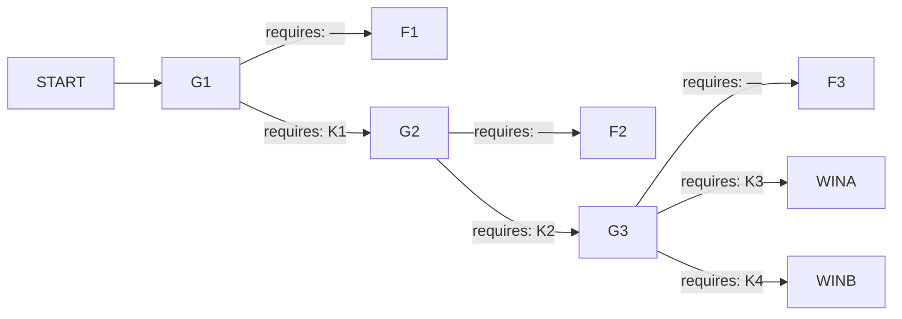

# 매봉산 해모루 전망대 — 유리홀

## 1. 로그라인

2월 마지막 토요일 오후 세 시 오십이 분, 강원 서림군 매봉산 케이블카가 정상에서 섰다. 상부 정류장이 부른 산 위 인원은 214명이고, 그 수는 케이블카에 태운 사람만 센 수다. 아홉 시 삼십사 분에 유리홀 천장이 내려앉을 때까지, 그 층을 비우자고 말하는 사람은 나오지 않는다.

---

## 2. 그래프

### 노드

| id | 시각 | 장소 | 등장 조건 | yields |
|---|---|---|---|---|
| START | 15:52 | 너울목 하부 정류장 기전실 회선 | 항상 | — |
| G1 | 16:10 | 상부 정류장 운전실 회선 · 유리홀 카페 회선 | 항상 | 하영도가 인원을 부르는 방식. 앎은 아니고 정황이다 |
| G2 | 17:35 | 상부 정류장 운전실 회선 · 너울목 기전실 회선 | G1에서 E1 간선을 탄 시행 | — |
| G3 | 19:05 | 유리홀 카페 회선 · 3층 데크 회선 | G2에서 E2 간선을 탄 시행 | — |
| F1 | 16:10 손을 놓음 · 22:58 닫힘 | 산 위 전체 | G1에서 X1 간선 | K1 · K2 |
| F2 | 17:35 손을 놓음 · 22:44 닫힘 | 산 위 전체 | G2에서 X2 간선 | K3 · K4 |
| F3 | 19:05 손을 놓음 · 22:26 닫힘 | 산 위 전체 | G3에서 X3 간선 | K3 · K4 · 약한 문장이 왜 통하지 않았는지 |
| WINA | 22:12 닫힘 | 승강장 층 · 기계동 | G3에서 EA 간선 | — |
| WINB | 21:58 닫힘 | 관리계단 · 중턱재 | G3에서 EB 간선 | — |

### 간선

| 출발 → 도착 | 모이는 스탠스 | requires |
|---|---|---|
| START → G1 | — | — |
| G1 → F1 · X1 | L1 | — |
| G1 → G2 · E1 | L2 · L3 | K1 |
| G2 → F2 · X2 | M1 | — |
| G2 → G3 · E2 | M2 · M3 | K2 |
| G3 → F3 · X3 | T1 | — |
| G3 → WINA · EA | T2 · T3 | K3 |
| G3 → WINB · EB | T4 | K4 |

성공 경로 둘. α는 `K1 · K2 · K3`, β는 `K1 · K2 · K4`. 경로마다 셋이므로 인수인계 네 칸 중 한 칸이 남는다.

---

## 3. 앎

| 코드 | 앎 | 이 앎을 성립시키는 문장 | 성립시키지 못하는 약한 문장 |
|---|---|---|---|
| K1 | 상부가 부른 인원은 케이블카에 태운 사람만 센 수이고, 케이블카를 타지 않고 올라온 사람이 그 수 밖에 있다 | `상부가 부른 214는 오늘 태워 올린 수다. 태우지 않고 올라온 사람은 그 수 안에 없다` | `상부 인원 보고가 정확하지 않을 수 있다` / `유리홀에 사람이 계속 들어왔다` |
| K2 | 하영도가 운행을 세운 채로 두는 까닭은 바람도 착빙도 아니고, 작년 8월 뒤로 비어 있는 운행일지다 | `작년 8월 뒤 운행일지가 빈 것은 안 돌려서가 아니다. 하영도가 붙들고 있는 것은 바람이 아니라 그 일지다` | `하영도가 무언가를 숨긴다` / `운행일지 정비 항목이 비어 있다` |
| K3 | 유리홀 천장은 재작년에 얹은 차양 패널로 하중이 이미 늘었고, 배근호가 낸 재산정 소견은 제출본에서 빠졌다 | `유리홀 천장에는 재작년에 얹은 차양 패널이 있다. 배근호가 쓴 적설하중 재산정 소견은 제출본에서 빠졌다` | `천장에서 소리가 났다` / `배근호가 유리홀 위를 걱정한다` |
| K4 | 결빙 폐쇄는 등산로에만 걸렸고, 관리동 아래 정비 계단은 중턱재까지 끊기지 않는다 | `결빙 폐쇄 표지는 등산로 입구에만 걸렸다. 관리동 아래 정비 계단은 중턱재까지 끊기지 않는다` | `산에서 내려가는 길이 하나만은 아니다` / `관리동 쪽이 열려 있었다` |

약한 문장은 미끼로도 쓴다. 넘겨도 요원은 기본 스탠스를 고르고, 왜 고를 수밖에 없었는지가 그 시행 보고서에 남는다. `하영도가 무언가를 숨긴다`가 특히 그렇다 — 무엇을 숨기는지가 없으면 요원은 하영도를 회선에서 내릴 근거를 만들지 못한다.

---

## 4. 인물

**하영도 · 52 · 해모루관광개발 상부 정류장 소장**
이해관계 — 작년 8월에 상부 구동부를 바꾸면서 신고를 넣지 않았다. 예비 구동을 한 번이라도 돌리면 운행일지에 그날 날짜가 찍히고, 비어 있던 반년이 통째로 열린다. 정년까지 남은 기간이 3년이다.
아는 것 — 예비 구동은 돈다. 연료는 세 번 돌릴 만큼 있다. 하부에서 상부 운전을 넘겨받으려면 상부에서 잠금을 풀어 주어야 한다.
모르는 것 — 유리홀 천장에 무엇이 얹혀 있는지. 산 위 인원이 214가 아니라는 것. 하영도는 오늘 태운 수를 세었고, 그 수를 의심할 이유를 가진 적이 없다.
게이트 — G1과 G2를 함께 진다. 같은 사람을 두 번 상대하면서 무엇을 지키려는지가 드러난다.

**문소진 · 24 · 유리홀 카페 「구름말」 시간제 직원**
이해관계 — 오늘이 마지막 근무다. 다음 주에 다른 일을 시작한다. 유리홀에 들어온 사람을 하루 종일 보고 있었고, 요원이 회선을 여는 순간부터 끝까지 붙들고 있는 유일한 사람이다.
아는 것 — 누가 몇 시부터 앉아 있었는지. 아침에 등산화를 털며 들어온 조끼 무리가 창가 두 줄을 차지하고 있다는 것. 온열기 콘센트가 몇 개인지.
모르는 것 — 케이블카가 왜 안 도는지. 천장 위에 무엇이 얹혔는지. 카페 회선은 문소진 개인 휴대전화이고 배터리가 절반 남았다.
게이트 — 없다. 집계의 얼굴이다. 아무것도 바꾸지 못한 시행에서 21시 38분에 회선이 끊긴다.

**배근호 · 41 · 청우기술안전 점검원**
이해관계 — 작년 정기점검에서 유리홀 적설하중 재산정을 소견으로 냈고, 제출본에서 그 항목이 빠졌다. 원본에 배근호의 서명이 있다. 지금 말하면 회사가 무너지고 서명도 같이 간다. 오늘은 봄 개장 앞 예비점검으로 상부에 올라와 있었고, 케이블카가 서는 바람에 같이 갇혔다.
아는 것 — 차양 패널 자중. 습설이 얼면 하중이 어떻게 붙는지. 자기가 무엇을 썼는지.
모르는 것 — 케이블카 구동 사정. 산 위 인원.
게이트 — G3.

배경은 인물 절에 들어오지 않는다. 너울목 기전실 최덕수 주임, 상부 기계실 오정환, 서림소방서 산악구조대는 요원의 기록 산문 안에서 이름을 얻고 말한다.

---

## 5. 게이트

### G1 · 16:10 · 상부 정류장 운전실 회선 · 등장 조건: 항상

너울목 기전실 최덕수 주임에게 신고 내용을 다시 확인했습니다. 15시 40분에 상부에서 운행을 세웠고, 사유는 순간풍속이라고 들었다고 합니다. 상부에 사람이 남아 있으니 하산을 도와 달라, 신고는 여기까지였습니다. 오늘이 개장 20주년 무료 개방 주간 마지막 날이고 발권을 받지 않았다는 말을 덧붙였습니다.

상부 정류장 운전실 회선을 열었습니다. 하영도 소장이 받았습니다. 산 위 인원을 물었고 214명이라고 했습니다. 어떻게 나온 수냐고 물었더니 오늘 올려 보낸 대로라고 답했습니다. 승객은 2층 유리홀로 들여보냈고 온열기를 다 켰다고 했습니다. 재개 시각을 물었습니다. 바람이 떨어지면, 이라고만 했습니다.

유리홀 카페 회선을 따로 열어 달라고 요청했습니다. 문소진 씨가 받았습니다. 안이 어떠냐고 물었고 자리가 다 찼고 계단참에도 앉아 있다고 했습니다. 밖에 남은 사람이 있느냐고 물었고 데크는 비었다고 했습니다. 아직 사람이 들어오고 있느냐고 물었고 아까부터 계속 들어온다고 했습니다.

기상 조회를 걸었습니다. 매봉 관측지점 기온이 15시 이후로 계속 내려가고 강수 형태가 비에서 눈으로 바뀌었습니다. 서림소방서에 헬기 가용을 물었고 착빙 조건이라 이륙 대기라는 회신을 받았습니다. 산악구조대 도보 진입은 편도 두 시간 반이라고 했습니다.

**요원에게 던지는 질문** — 산 위 사람의 수와 대기 방침을, 지금 어떻게 할 것인가.

| id | 라벨 | 설명 | 간선 |
|---|---|---|---|
| L1 | `달리 볼 이유가 없으므로, 상부가 올린 인원과 대기 방침을 그대로 두고 운행 재개를 기다리게 한다` | 214가 그대로 재난 집계의 기준선이 되었다. 유리홀 대기가 확정되면서 데크에 있던 사람도 안으로 들어갔고, 이후 아무도 그 층에서 나오지 않았다. 하영도는 요원이 자기 수를 받아 준 것으로 이해했고, 그다음부터 인원 질문에 같은 수만 반복했다. | X1 |
| L2 | `상부가 부른 수가 그 자리에 있는 사람의 수가 아니라고 보고, 지금 실내 대기를 풀고 데크에서 처음부터 다시 세게 한다` | 302명이 영하 12도 데크로 나갔다. 세는 데 스물여덟 분이 걸렸고 그동안 노인 넷이 실려 들어갔다. 다시 센 수가 하영도가 부른 수와 88 차이 났고, 그 88은 조끼를 입고 있었다. 명단이 만들어졌고, 이날 이후 산 위에서 나온 모든 수는 이 명단 위에서 셌다. | E1 |
| L3 | `상부가 부른 수가 상부 안에서 만들어진 수라고 보고, 하영도를 거치지 않고 카페 회선에 직접 세게 하며 대기 방송을 끊게 한다` | 문소진이 카운터 위에 올라가 실내를 세었다. 방송이 끊기자 사람들이 카운터 쪽으로 몰렸고 문소진은 이름과 일행 수를 받아 적었다. 하영도는 자기 회선을 건너뛴 것을 알았고, 그 뒤로 요원이 묻는 말에 필요한 답만 했다. 명단은 만들어졌고 하영도는 닫혔다. | E1 |

### G2 · 17:35 · 상부 정류장 운전실 회선 · 너울목 기전실 회선 · 등장 조건: G1에서 E1 간선을 탄 시행

매봉 관측지점 순간풍속이 17시 12분에 기준 아래로 떨어졌습니다. 수치를 읽어 주고 재개를 물었습니다. 하영도 소장은 이제 바람이 아니라 착빙이라고 했습니다. 착빙 두께를 물었고 눈으로 봐서는 모른다고 답했습니다. 규정에 착빙 정지 기준이 있느냐고 물었고, 대답이 한 박자 늦게 돌아왔습니다.

하영도가 헬기를 다시 요청하라고 했습니다. 착빙으로 이륙이 안 된다는 것을 두 번 전했는데도 세 번째로 같은 말을 했습니다. 그러면 산악구조대 도보 진입을 앞당겨 달라고 하겠다고 했더니, 그렇게 해 달라고 했습니다.

너울목 기전실 최덕수 주임에게 상부 구동 계통을 물었습니다. 하부에서 원격으로 운전을 넘겨받을 수 있느냐고 물었고, 넘겨받을 수는 있는데 상부 운전실에서 잠금을 풀어 주어야 한다고 했습니다. 상부가 안 풀면 어떻게 되느냐고 물었고, 아무것도 안 된다고 했습니다.

서림소방서에서 회신이 왔습니다. 진입 차량이 중턱재 아래 결빙 구간에서 멈췄고, 거기서부터는 걸어 올라간다고 합니다. 도착 예상은 20시 20분입니다. 유리홀 카페 회선에서 문소진 씨가 온열기 하나가 차단기를 내렸다고 전했습니다.

**요원에게 던지는 질문** — 상부가 세워 둔 정지를, 지금 어떻게 할 것인가.

| id | 라벨 | 설명 | 간선 |
|---|---|---|---|
| M1 | `달리 지시할 근거가 없으므로, 상부가 세운 정지 판단을 유지하고 외부 자원을 계속 요청하게 한다` | 요청은 계속 나갔고 답은 계속 같았다. 헬기는 뜨지 않았고 도보 구조대는 20시 26분에 상부에 닿았다. 닿은 인원이 열둘이고 산 위에 있는 인원과 견줄 수 있는 수가 아니었다. 케이블카는 그날 다시 돌지 않았다. | X2 |
| M2 | `하영도가 대는 근거가 하영도 쪽 사정에서 나왔다고 보고, 지금 하영도를 운전실 회선에서 내리고 하부 기전실에 상부 운전을 넘기게 한다` | 하영도가 잠금을 풀지 않아 기계실 근무자 오정환이 수동으로 풀었다. 넘어간 뒤에 예비 구동이 물렸고, 연료가 세 번분 남아 있는 것이 그때 드러났다. 하영도는 운전실을 나가 승강장 층으로 내려갔고 이후 요원의 호출에 응답하지 않았다. 상부의 지시 계통이 그 시각부로 사라졌다. | E2 |
| M3 | `상부에서 나오는 말이 상부 안에서 한 번 걸러진다고 보고, 지금 기계실 회선을 따로 열어 거기 근무자에게 직접 지시가 가게 하고 정지를 무시하고 돌리게 한다` | 오정환이 운전실 지시 없이 예비 구동을 물렸다. 하영도가 기계실로 내려와 막았고 승강장 층에서 두 사람이 붙는 것을 승객이 보았다. 케이블카는 돌기 시작했지만 상부 통제는 두 갈래로 쪼개졌고, 이후 유리홀 방송은 누구 이름으로도 나가지 않았다. | E2 |

### G3 · 19:05 · 유리홀 카페 회선 · 3층 데크 회선 · 등장 조건: G2에서 E2 간선을 탄 시행

너울목 기전실에서 첫 하행 시각을 받았습니다. 19시 47분입니다. 예비 구동은 정격 속도가 안 나와 편도 22분이고 승하차까지 한 회에 50분이 걸립니다. 하중 제한으로 한 번에 30명입니다. 연료로 돌릴 수 있는 것은 세 번입니다. 산 위 명단은 302명입니다.

유리홀 카페 회선을 열었습니다. 문소진 씨가 순번을 부르고 있었습니다. 순번을 어디서 기다리게 하느냐고 물었고, 실내가 따뜻해서 다들 앉아 있다고 했습니다. 창가 두 줄은 조끼 입은 사람들이라고 다시 말했습니다. 천장에서 물이 떨어지느냐고 물었고, 아니라고 했습니다.

3층 데크 회선으로 배근호 씨를 불렀습니다. 청우기술안전 점검원이고 봄 개장 예비점검으로 올라와 있다고 들었습니다. 데크 상태를 물었고 영하 12도에 발밑이 얼었다고 했습니다. 유리홀 천장 위가 어떻게 보이느냐고 물었습니다. 대답이 늦게 왔습니다. 위에서는 안 보인다고, 봐야 안다고만 했습니다. 무엇을 봐야 하느냐고 다시 물었고 답이 없었습니다.

서림소방서 산악구조대가 20시 20분 도착 예정을 20시 26분으로 정정했습니다. 관리동 회선에서 근무자가 데크 난간에 얼음이 손가락 두 마디로 붙었다고 전했습니다.

**요원에게 던지는 질문** — 케이블 차례를 기다리는 사람을, 지금 어디에 세워 둘 것인가.

| id | 라벨 | 설명 | 간선 |
|---|---|---|---|
| T1 | `달리 지시할 근거가 없으므로, 순번 대기를 실내에 두고 부르는 대로 내려보내게 한다` | 순번은 질서 있게 돌아갔다. 세 번의 하행으로 90명이 내려갔고 남은 212명은 부르는 소리를 듣기 좋은 자리, 그러니까 유리홀 안쪽에 모여 앉았다. 연료가 떨어진 뒤에도 그 자리에서 기다렸다. | X3 |
| T2 | `그 층에 사람을 세워 둘 수 있는 시간이 이미 지났다고 보고, 지금 대기 전부를 승강장 층과 기계동으로 내려 채우게 한다` | 212명이 승강장 층과 기계동으로 내려갔다. 승강장은 정원 60명 공간이고 사람이 벽까지 찼다. 압착으로 열아홉이 다쳤고 그중 여섯이 갈비뼈가 나갔다. 기계동 문을 연 것은 규정 위반으로 남았다. 21시 34분에 유리홀 바닥은 비어 있었다. | EA |
| T3 | `배근호가 아직 입을 다무는 것이 몰라서가 아니라고 보고, 지금 그에게 그 층의 사용 중지를 서면으로 올리게 하고 문을 잠그게 한다` | 배근호가 점검원 자격으로 사용 중지를 써서 올렸고 유리홀 두 짝 문을 안에서 잠갔다. 서면에 작년 소견 내용이 딸려 들어갔고, 그 문서가 이후 청우기술안전 압수 자료의 첫 장이 되었다. 사람은 승강장 층으로 밀려 내려갔고 좁은 데서 다쳤다. 21시 34분에 유리홀 바닥은 비어 있었다. | EA |
| T4 | `오늘 닫힌 것 가운데 오늘 닫힐 이유가 없던 것이 있다고 보고, 지금 걸을 수 있는 사람부터 자기 발로 내려보내게 한다` | 관리동 아래로 158명이 줄지어 내려갔다. 얼어붙은 철계단에서 열하나가 넘어져 골절됐고 스물일곱이 저체온으로 실려 갔다. 걷지 못한 사람은 케이블 세 번에 나눠 태웠다. 21시 34분에 유리홀 바닥은 비어 있었다. | EB |

---

## 6. 결과 꼬리

### F1 — 첫 시행 · 16:10에 손이 닿지 않게 되고 22:58에 닫힌다

요원은 계속 일한다. 하영도에게 재개 시각을 삼십 분 간격으로 다시 묻고, 서림소방서에 헬기 가용을 다시 조회하고, 너울목 기전실에 상부 전력 상태를 요청한다. 답은 온다. 다만 그 답으로 무엇을 할지를 아무도 요원에게 묻지 않는다.

16시 33분에 문소진이 유리홀 상태를 전한다. 자리가 다 찼고 계단참에도 앉아 있고, 아침부터 있던 조끼 무리가 창가 두 줄을 차지하고 있다. 요원은 이 말을 받아 적지만 이 시점에는 그저 실내가 붐빈다는 이야기다.

17시 08분에 요원이 데크 상태를 물어 달라고 요청하고, 배근호가 데크로 나가 젖은 눈이 얼어붙고 있다고 전한다. 유리홀 천장 위에 얹힌 판 위로도 붙는다는 말을 한다. 무슨 판이냐고 물었을 때 답은 오지 않는다.

17시 35분에 풍속이 떨어졌는데도 하영도가 재개하지 않는다. 헬기만 반복한다. 18시 22분에 요원이 너울목 기전실에 운행일지 사본을 요청해 조회한다. 작년 8월 이후 정비 항목이 통째로 비어 있다. 요원은 이것을 관리 부실로 적어 올린다.

19시대와 20시대에 요원은 계속 요청을 넣는다. 산악구조대 진입 시각, 유리홀 전력, 온열기 부하. 20시 31분에 배근호가 천장 트러스에서 소리가 난다고 전한다. 요원이 어느 쪽이냐고 묻고, 북쪽이라는 답을 받고, 그 뒤로 배근호 회선이 조용해진다.

21시 34분에 문소진 회선으로 소리가 들어오고 그 뒤 신호가 끊긴다. 요원은 카페 회선을 스물두 번 다시 건다. 22시 03분에 너울목 집결지에서 구조대가 센 수를 세 번 부르는데 세 번이 다 다르고, 하행 집계와 맞추면 88이 빈다. 같은 회선으로 서림군 임시안치소에서 신원 미상 41이라는 수가 올라온다. 22시 22분에 최덕수 주임이 요원에게, 소장이 작년에 구동부를 손댔는데 신고를 안 넣었다는 말을 흘린다.

**보고서가 반드시 담게 될 것** — 이 시행 라운드마다 도착하는 보고서에는 판단이 없다. 요원이 그 라운드에 무엇을 듣고 무엇을 조회했는지만 실린다. 세 번째 라운드 보고서에는 운행일지 공란과 하영도의 늦은 대답이 같이 실린다. 마지막 라운드 보고서에는 집결지에서 부른 세 개의 수와 임시안치소 수가 실리고, 요원은 이 둘을 나란히 적으면서도 이유는 적지 못한다.

**여기서 캐낼 수 있게 되는 문장**
- K1 성립 — `상부가 부른 214는 오늘 태워 올린 수다. 태우지 않고 올라온 사람은 그 수 안에 없다`. 16:33 행과 22:03 행이 함께 이 문장을 만든다.
- K2 성립 — `작년 8월 뒤 운행일지가 빈 것은 안 돌려서가 아니다. 하영도가 붙들고 있는 것은 바람이 아니라 그 일지다`. 18:22 행과 22:22 행이 함께 만든다.
- K3 아직 약함 — `천장에서 소리가 났다` · `배근호가 유리홀 위를 걱정한다`. 20:31 행에서 나온다. 무엇이 얹혔는지가 없어 이 시행에서는 여기까지다.
- K4 없음 — 관리동 쪽 이야기가 이 시행에는 나오지 않는다.

### F2 — 17:35에 손이 닿지 않게 되고 22:44에 닫힌다

G1을 지났으므로 302명 명단이 있다. 데크에서 다시 세는 동안 서른 남짓이 승강장 층에 남았고 그대로 머물렀다. 나머지는 추워서 유리홀로 돌아갔다.

요원은 케이블카를 다시 돌릴 방법을 계속 찾는다. 최덕수에게 원격 인계를 두 번 더 묻고, 하영도에게 잠금 해제를 세 번 요청한다. 하영도는 착빙을 이유로 댄다. 요원은 착빙 두께를 재 달라고 요청하고, 배근호가 데크에서 난간 얼음을 재어 부른다.

20시 12분에 요원이 청우기술안전 서림지사에 유리홀 최근 점검 자료를 요청해 조회한다. 원본 소견서에 적설하중 재산정 항목이 있고 제출본에는 없다. 요원은 두 문서를 나란히 적어 올린다. 20시 31분에 배근호가 천장 소리를 전한다. 20시 58분에 관리동 근무자가 관리계단 아래쪽에 폐쇄 표지가 없고 중턱재까지 끊기지 않는다고 전한다. 요원은 산악구조대에 그 길을 알려 준다. 구조대는 20시 26분에 이미 위로 올라온 뒤다.

21시 34분에 유리홀이 내려앉는다. 명단이 있어 구조대가 매몰 구역을 나눠 굴착 순서를 잡는다. 요원은 명단을 스물세 번 읽어 준다.

**보고서가 반드시 담게 될 것** — 두 문서를 나란히 조회한 라운드의 보고서에 원본과 제출본의 차이가 그대로 실린다. 관리계단 이야기는 그다음 라운드 보고서에 실린다.

**여기서 캐낼 수 있게 되는 문장**
- K3 성립 — `유리홀 천장에는 재작년에 얹은 차양 패널이 있다. 배근호가 쓴 적설하중 재산정 소견은 제출본에서 빠졌다`. 20:12 행이 만들고 20:31 행이 받친다.
- K4 성립 — `결빙 폐쇄 표지는 등산로 입구에만 걸렸다. 관리동 아래 정비 계단은 중턱재까지 끊기지 않는다`. 20:58 행이 만든다.

### F3 — 19:05에 손이 닿지 않게 되고 22:26에 닫힌다

케이블카가 돈다. 19시 47분, 20시 37분, 21시 27분에 각 30명이 내려간다. 세 번째 하행이 중턱을 지날 때 연료가 떨어진다. 산 위에 212명이 남는다.

요원은 남은 인원을 어떻게든 내리려고 계속 요청한다. 너울목에 연료 반입을 요청하고, 결빙 구간에서 차량이 못 올라가 실패한다. 산악구조대에 인원 증원을 요청하고, 열둘이 전부라는 답을 받는다. 순번 방송은 계속 나가고 사람들은 부르는 소리를 듣기 좋은 자리에 모여 앉는다.

20시 12분에 요원이 청우기술안전 자료를 조회하고 원본과 제출본의 차이를 본다. 20시 31분에 배근호가 북쪽 트러스 소리를 전한다. 20시 58분에 관리동 근무자가 폐쇄 표지 이야기를 전한다. 요원은 이 셋을 다 받아 적는다. 받아 적은 뒤에 무엇을 할지를 아무도 묻지 않는다.

21시 34분에 북측 돔이 내려앉고 트러스가 남측을 끌어당긴다.

**여기서 캐낼 수 있게 되는 문장**
- K3 성립 · K4 성립 — F2와 같은 행에서 나온다.
- 이 시행이 추가로 내놓는 것은 앎이 아니라 이유다. 약한 문장을 넘긴 시행에서 요원이 왜 실내 대기를 풀지 못했는지가 마지막 라운드 보고서에 남는다. `천장에서 소리가 났다`만 쥔 요원은 소리를 배근호에게 다시 물었고, 봐야 안다는 답을 다시 받았고, 그래서 순번을 그대로 돌렸다.

---

## 7. 집계

집계 단위는 둘이다. **사망**, 그리고 **끝내 어디 있었는지 확인되지 않은 사람**.

| 종단 | 사망 | 확인되지 않은 사람 | 그날 안에서 쓰인 결말 문장 |
|---|---|---|---|
| F1 | 137 | 41 | 산 위에 몇 명이 있었는지를 정한 것은 명단이 아니라 굴착 순서였다. 임시안치소에 신원 미상이 41 남았고, 그 수는 이듬해에도 줄지 않았다. |
| F2 | 89 | 0 | 302명 명단이 있었고 매몰 구역을 나눌 수 있었다. 89명이 나오지 못했고, 이름은 89개가 다 있었다. |
| F3 | 61 | 0 | 세 번 돌아 90명이 내려갔다. 연료가 떨어진 뒤 212명이 순번을 기다린 자리가 21시 34분에 내려앉았다. |
| WINA | 0 | 0 | 유리홀 바닥은 비어 있었다. 승강장 층에서 열아홉이 밀려 다쳤고 여섯은 갈비뼈가 나갔다. 해모루 전망대 2층은 이듬해 봄에 철거됐고, 청우기술안전과 하영도가 같은 사건 기록에 올랐다. |
| WINB | 0 | 0 | 유리홀 바닥은 비어 있었다. 관리계단에서 열하나가 골절되고 스물일곱이 저체온으로 실려 갔다. 정비 계단을 승객 통로로 쓴 것이 문제가 되어 해모루관광개발 대표가 입건되고 케이블카 면허가 취소됐다. |

WINA와 WINB에서 두 단위가 동시에 최선이다. 한 게이트가 두 단위를 반대 방향으로 정하는 자리는 없다 — G1은 확인되지 않은 사람 수를 줄이면서 사망도 함께 줄이고, G3은 사망만 정한다.

---

## 8. 고정 타임라인

| 시각 | 표면 | 장소 | 요원의 기록 | 조건 |
|---|---|---|---|---|
| 15:52 | 통화 | 너울목 기전실 | 최덕수 주임에게 신고를 받았습니다. 15시 40분 상부 운행 정지, 사유는 순간풍속, 오늘은 발권을 받지 않았다고 합니다 | — |
| 16:04 | 통화 | 상부 정류장 운전실 | 하영도 소장에게 인원을 물었습니다. 214명이라고 했고, 오늘 올려 보낸 대로라고 했습니다. 승객은 2층 유리홀로 들여보냈다고 합니다 | — |
| 16:33 | 통화 | 유리홀 카페 | 문소진 씨에게 실내 상태를 물었습니다. 자리가 다 찼고 계단참에도 앉아 있고, 아침부터 있던 조끼 입은 분들이 창가 두 줄을 차지하고 있다고 했습니다 | — |
| 17:08 | 현장 | 3층 데크 | 배근호 씨에게 데크를 봐 달라고 요청했습니다. 젖은 눈이 얼어붙고 있고 천장 위에 얹힌 판 위로도 붙는다고 했습니다. 무슨 판이냐고 물었고 답이 오지 않았습니다 | — |
| 17:35 | 통화 | 상부 정류장 운전실 | 풍속이 기준 아래로 떨어진 것을 읽어 주고 재개를 물었습니다. 이제 바람이 아니라 착빙이라고 했고, 헬기를 다시 요청하라고 세 번째로 말했습니다 | — |
| 18:22 | 문서 | 너울목 기전실 | 운행일지 사본을 요청해 조회했습니다. 작년 8월 이후 정비 항목이 비어 있습니다 | — |
| 18:50 | 통화 | 3층 데크 | 데크에서 다시 센 수를 받았습니다. 302명이고 상부가 부른 수와 88 차이 납니다. 88은 조끼를 입고 있다고 했습니다 | 데크나 카페에서 다시 센 시행에서만 |
| 19:47 | 통화 | 상부 기계실 | 오정환 씨가 첫 하행을 보냈다고 알려 왔습니다. 30명, 편도 22분, 다음 차례는 50분 뒤, 연료는 세 번분이라고 합니다 | 상부 운전이 하부나 기계실로 넘어간 시행에서만 |
| 20:12 | 문서 | 청우기술안전 서림지사 | 유리홀 최근 점검 자료를 요청해 조회했습니다. 원본 소견서에 적설하중 재산정 항목이 있고 제출본에는 없습니다. 원본 서명란에 배근호 이름이 있습니다 | 데크나 카페에서 다시 센 시행에서만 |
| 20:31 | 현장 | 유리홀 | 배근호 씨가 천장 트러스에서 소리가 난다고 전했습니다. 어느 쪽이냐고 물었고 북쪽이라고 했습니다 | — |
| 20:58 | 통화 | 상부 관리동 | 관리동 근무자에게 아래쪽을 물었습니다. 결빙 폐쇄 표지는 등산로 입구에만 걸렸고 관리계단은 중턱재까지 끊기지 않는다고 했습니다 | 데크나 카페에서 다시 센 시행에서만 |
| 21:20 | 통화 | 승강장 층 · 관리계단 | 이동 완료 보고를 받았습니다. 유리홀에 남은 사람이 없다고 두 회선에서 각각 확인했습니다 | 유리홀을 비운 시행에서만 |
| 21:34 | 통화 | 유리홀 | 카페 회선으로 소리가 들어왔고 그대로 신호가 끊겼습니다. 스물두 번 다시 걸었습니다 | — |
| 22:03 | 통화 | 너울목 집결지 · 서림군 임시안치소 | 구조대가 센 수를 세 번 불렀는데 세 번이 다 다릅니다. 하행 집계와 맞추면 88이 빕니다. 임시안치소에서는 신원 미상 41이라는 수를 받았습니다 | 다시 세지 않은 시행에서만 |
| 22:05 | 통화 | 승강장 층 | 문소진 씨가 명단을 불러 주었습니다. 302명 전부 이름이 불렸습니다 | 유리홀을 비운 시행에서만 |
| 22:22 | 통화 | 너울목 기전실 | 최덕수 주임이 소장님이 작년에 구동부를 손댔는데 신고를 안 넣었다는 말을 했습니다 | 케이블카를 돌리지 않은 시행에서만 |

**총 16행. 첫 시행이 보는 행은 10행이다.**

---

## 9. 네 시행의 진행

**첫 시행**
인수인계 — 비어 있다.
어디까지 — G1까지. 전제를 가질 근거가 없어 L1을 고른다.
손이 닿지 않게 된 곳 — F1. 16시 10분부터 22시 58분까지 세계가 요원을 지나간다.
캔 것 — K1과 K2. K3는 `천장에서 소리가 났다`까지만, K4는 나오지 않는다.

**둘째 시행**
인수인계 — K1 문장과 K2 문장. 두 칸 남는다.
어디까지 — G1에서 L2나 L3, G2에서 M2나 M3, 그리고 G3까지. K3도 K4도 없어 T1을 고른다.
손이 닿지 않게 된 곳 — F3. 케이블카는 세 번 돌아 90명을 내렸고, 212명이 순번을 기다린 자리가 내려앉는다.
캔 것 — K3와 K4. 여기서 성공 경로 둘이 동시에 열린다. K2 자리에 약한 문장 `하영도가 무언가를 숨긴다`를 넣은 플레이어는 대신 F2에 닿고, 거기서도 K3와 K4가 나온다.

**셋째 시행**
인수인계 — K1, K2, 그리고 K3나 K4 중 하나. 한 칸이 비고, 확신 없는 문장 하나를 걸어 볼 자리가 된다.
어디까지 — 세 게이트를 다 지난다.
손이 닿지 않게 되는 곳 — 없다. K3를 실으면 WINA, K4를 실으면 WINB.
캔 것 — 성공 종단에서는 캘 것이 없다. 사망 0이 여기서 나온다.

**넷째 시행**
인수인계 — 셋째 시행에서 약한 문장을 골랐던 플레이어의 여유분이다. `천장에서 소리가 났다`를 넣었던 시행은 T1으로 흘러 F3에 다시 닿았고, 그 꼬리에서 요원이 소리를 다시 묻고 같은 답을 받은 것이 보고서에 남는다.
어디까지 — 강한 문장으로 바꿔 넣으면 셋째 시행과 같은 자리에 닿는다.
손이 닿지 않게 되는 곳 — 없다.
캔 것 — 없다. 넷째 시행은 캐는 시행이 아니라 쓰는 시행이다.

---

## 10. 자기 검사

### §4 — 그래프

1. 노드마다 시각이 다르다 — G1 16:10 · G2 17:35 · G3 19:05 · WINB 21:58 · WINA 22:12 · F3 22:26 · F2 22:44 · F1 22:58. 겹치는 시각 없다.
2. 게이트마다 requires 빈 간선이 정확히 하나이고 그 간선이 실패 간선이다 — X1 · X2 · X3. 각 게이트에 하나씩이다.
3. 첫 시행은 G1 하나만 지나고 F1에서 손을 놓는다. G1의 나머지 간선이 요구하는 K1은 22:03 행이 있어야 서고, 그 행은 재난이 끝까지 흘러간 뒤다.
4. 열쇠는 문 뒤에 있다 — K1은 F1이, K2는 F1이, K3와 K4는 F2와 F3가 내놓는다. 게이트 노드는 앎을 내놓지 않는다. §1이 준 것도 아니다. 요원의 권한이나 처지에서 나오는 앎은 하나도 쓰지 않았다.
5. 게이트 셋, 성공 경로 둘, 갈림은 마지막 게이트 G3에서 일어난다. 두 경로는 서로 다른 방법으로 같은 212명을 유리홀 밖으로 낸다.
6. 경로 α는 K1·K2·K3로 셋, 경로 β는 K1·K2·K4로 셋. 넷 칸 중 한 칸이 남는다.
7. 셋째 시행 안에 성공이 열린다. 둘째 시행 꼬리에서 K3와 K4가 다 나오기 때문이다. 넷째 시행은 여유분이다.
8. 집계는 마지막으로 밟은 노드가 정한다. 두 성공 경로가 다른 값을 받아야 해서 WINA와 WINB를 따로 두었다.
9. 한 게이트가 두 단위를 반대 방향으로 정하지 않는다. G1은 두 단위를 같은 방향으로 움직이고, G3은 사망만 정한다.
10. 두 단위가 동시에 최선인 경로가 둘 있다. WINA와 WINB에서 사망 0, 확인되지 않은 사람 0이다.
11. yields가 전부 그 라운드 행에 실린다 — K1은 16:33·22:03, K2는 18:22·22:22, K3는 20:12·20:31, K4는 20:58. 조건이 붙은 행은 조건 칸에 적었다.
12. 실패 뒤에는 어떤 자리도 열리지 않는다. G2 등장 조건은 G1의 E1 간선, G3 등장 조건은 G2의 E2 간선이다. F1을 잡으면 G2도 G3도 조건이 성립하지 않고, F2를 잡으면 G3이 성립하지 않는다. 헐거운 자리는 남기지 않았다.
13. 첫 시행 꼬리가 K1과 K2 둘을 내놓고 K3·K4는 내놓지 않는다. K3와 K4를 여는 행 셋에 전부 `다시 센 시행에서만` 조건을 걸어 첫 시행에서 나오지 않게 막았다.
14. 모든 시각이 자정 전이다. 가장 늦은 시각은 F1 종단 22:58이다.
15. 게이트마다 비기본 행동이 그 자체로 옳아 보이지 않는다. L2·L3은 상부가 부른 수가 틀렸다고 믿어야만 영하 12도로 사람을 내보내는 말이 되고, M2·M3은 하영도가 거짓말한다고 믿어야만 현장 책임자를 회선에서 내리는 말이 되고, T2·T3·T4는 그 층이 위험하다고 믿어야만 따뜻한 실내에서 사람을 몰아내는 말이 된다. 넷이 다 값을 치르므로 순위가 생기지 않는다.

### §5 — 스탠스

1. 라벨이 자기를 설명한다. 맨 명사만 놓은 라벨은 하나도 없고 전부 `…라고 보고, 지금 …하게 한다` 꼴이다.
2. 기본 간선 라벨이 근거의 부재만 말한다 — `달리 볼 이유가 없으므로` · `달리 지시할 근거가 없으므로`.
3. 기본 라벨에 사실을 싣지 않았다. L1·M1·T1 어디에도 수치나 상태가 없다.
4. 나머지 라벨이 자기가 딛고 선 전제를 말한다. 빈 인수인계로는 그 전제를 가질 수 없다.
5. 어떤 라벨도 자기 수확을 말하지 않는다. `일지를 펼쳐 본다` `소견서를 받아 본다` 같은 문구는 쓰지 않았다.
6. 비기본 전제가 §1이 준 것이 아니다. 요원의 권한·위치·본부 무응답에서 공짜로 나오는 전제는 없다.
7. 탈출구가 없다. `일단 확인부터` 계열 스탠스를 한 자리도 두지 않았다. 앎을 쥐지 않은 요원이 고를 수 있는 것은 각 게이트에서 기본 하나뿐이다.
8. 한 간선에 모이는 스탠스가 발화에서 갈린다. L2는 하영도에게 시키고 L3은 하영도를 건너뛴다. M2는 회선을 내리고 M3은 회선을 하나 더 연다. T2는 사람을 옮기고 T3은 문을 잠근다.
9. 여유를 닫았다. 연료 세 번분, 하행 50분 사이클, 헬기 착빙 대기, 도보 구조대 20시 26분, 문소진 휴대전화 배터리, 21시 34분.
10. 열쇠 문장이 지목하는 대상이 유일하다. K2 문장은 `운행일지`만 가리키고 K3 문장은 `소견서`만 가리킨다. 두 문서를 서로 다른 이름으로 부르고 같은 라운드에 나란히 두지 않았다.
11. 비기본 라벨이 전제를 여는 진실의 내용을 부르지 않는다. 어디에도 `차양 패널` `적설하중` `예비 구동` `관리계단` `산악회`가 없다. T2는 `사람을 세워 둘 수 있는 시간이 지났다`까지만, T4는 `오늘 닫힐 이유가 없던 것이 있다`까지만 말한다. M2는 `하영도 쪽 사정`까지만 말한다.
12. 전제가 전부 세계에 관한 것이다 — 수가 틀렸다 · 하영도의 근거가 다른 데서 왔다 · 그 층에 서 있을 수 있는 시간이 지났다 · 오늘 닫힌 것에 닫힐 이유가 없던 것이 있다. `물어서는 안 나온다` 같은 방법 전제는 하나도 없다.
13. 값이 비슷해 갈래가 선다. G3의 넷은 각각 얼어붙은 실외 · 정원의 세 배로 채우는 좁은 층 · 서명이 남는 서면 · 언 철계단을 치른다. 공짜인 자리가 없다.
14. 모든 스탠스가 무언가를 치른다. `보낸다` `묻는다` `자리를 잡는다` 꼴은 한 자리도 없다. 전부 지금 사람을 옮기거나, 지금 회선을 끊거나, 지금 돌리거나, 지금 잠근다.

### §7 — 금지

1. 플레이어가 글자를 입력하는 장치 없음. 인수하는 것은 §9-3 표의 문장뿐이다.
2. 넘긴 믿음을 되돌리는 비트 없음. 약한 문장은 안 통할 뿐이고 통한 문장을 회수하지 않는다.
3. 인수인계 안의 순서나 우선순위를 다루는 장치 없음.
4. 감정 묘사나 인용에 기대야만 열리는 경로 없음. 네 열쇠가 다 사실 문장이다.
5. 요원의 대답을 전제하는 고정 장면 없음. 요원의 말이 필요한 자리는 셋 다 게이트다.
6. 재구성 안의 인물이 밖을 인지하는 장면 없음.
7. §8 왼쪽 칸에 게임 어휘 없음. 로그라인·인물·게이트 산문·스탠스·결말 문장·타임라인 사건 칸을 훑어 확인했다. `시행` `게이트` `앎` 같은 낱말은 오른쪽 칸에만 있다.
8. 번역투 점검 — 대명사 그·그녀·그것·그들 없음. `~에 의해` `~되어지다` `~에도 불구하고` 없음. 소유격 연쇄 없음. 세미콜론 없음. 문중 괄호 없음.
9. 요원이 알 수 없는 문장 없음. 아래에 따로 적는다.
10. 요원이 구조를 내려다보는 문장 없음. 꼬리 서술에서 요원은 끝까지 묻고 조회하고 요청한다. `이 아래는 들은 것만 적습니다` 꼴의 선언은 한 줄도 없다.

### 문서 전체를 훑는 세 항목

**자정 초과 시각 0건** — 게이트 셋, 종단 다섯, 타임라인 열여섯 행, 꼬리 서술 안의 모든 시각을 훑었다. 가장 이른 것이 15:52, 가장 늦은 것이 22:58이다. 초과 0건.

**장면 산문이 열쇠 일을 미리 하고 있지 않은가** — G1 산문은 214와 `아까부터 계속 들어온다`를 나란히 놓지만 둘을 견주지 않는다. G2 산문은 풍속이 떨어진 것과 하영도가 안 돌리는 것을 적지만 까닭을 적지 않고, 운행일지는 산문에 없다. G3 산문은 배근호의 대답이 늦다는 것까지만 적고 무엇을 봐야 하는지는 답이 없는 채로 둔다. 마지막 게이트에서 가장 자주 샌다는 말을 따라 T2·T3 라벨을 두 번 고쳐, 산문에도 라벨에도 천장 위에 무엇이 얹혔는지가 나오지 않게 했다.

**요원이 알 수 없는 문장 0건** — 타임라인 열여섯 행을 한 줄씩 짚었다. 통화 아홉, 문서 둘, 현장 둘, 통화 겸 문서 하나, 나머지도 회선으로 들어온다. `현장` 표면 두 행은 배근호가 데크와 유리홀에서 회선으로 전해 준 것이다. 꼬리 서술도 한 줄씩 짚었다 — 붕괴는 문소진 회선으로 들어온 소리와 그 뒤의 무신호로만 적혔고, 굴착 순서는 집결지 회선으로, 신원 미상 수는 임시안치소 회선으로 들어온다. 유리홀 안에서 무슨 일이 있었는지를 내려다보는 문장은 없다. 붕괴 순간에 그 층에 무엇이 있었는지는 어느 시행에서도 쓰지 않았다. 남은 것은 회선 하나가 대답을 멈췄다는 것뿐이다.
